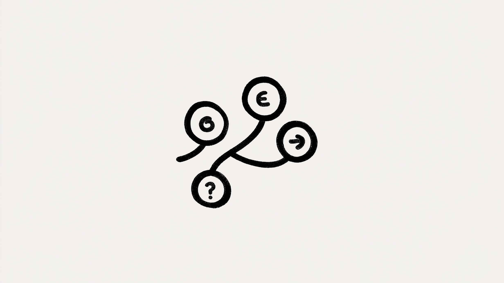

# Building a brain: my journey into expert systems with Python

I've always been fascinated by how we reason. How do we connect the dots, follow a trail of logic, and piece together a puzzle? As it turns out, we can teach computers to do something remarkably similar. That's where **expert systems** come in.

They're essentially small AI brains we can build to crack complex problems, from diagnosing diseases to managing finances. They are the hidden workhorses behind countless AI applications, quietly doing their thing.

In this post, I'll pull back the curtain and walk you through how I built one from scratch using Python. No magic, just logic. By the end, you'll have what you need to build your own. 🧠💻

## So, what exactly is an expert system?

Think of it as a digital Sherlock Holmes. It takes a collection of **facts and rules** and uses them to deduce answers. It's a deduction machine, perfect for when you need to prove a hypothesis or make a tough call. For me, it's a foundational piece of the entire AI puzzle.


## The building blocks of my system

### Rules: the logical Lego bricks


The core of this whole thing is a set of **rules**. I like to think of them as logical Lego bricks. We can snap them together to build some pretty complex lines of reasoning. These rules are just simple equations that link `facts` (which we'll represent with capital letters) using a few key `connectors`:

- `&`: **AND**–The no-nonsense connector. All connected facts must be `True`. No exceptions.
- `|`: **OR**–Super chill. Just one of the facts needs to be `True`.
- `^`: **XOR**–The picky one. One fact must be `True`, but not both.
- `=>`: **IMPLY**–The classic "if-then." If the left side is `True`, the right side has to be `True` too.

### The inference truth table: our logic cheat sheet


To make sense of it all, we need a cheat sheet. This truth table is our compass for logic. It shows how the connectors work. Look at `p => q`. If `p` is `false`, `q` can be anything—a real wild card. But if `p` is `true`, `q` *must* also be `true`. This simple principle is the engine of our deduction.

### Facts and queries: the inputs and outputs


Now for the inputs and outputs.

**Facts** are our starting truths, represented by uppercase letters. By default, I set everything to `false`—the system starts out knowing nothing. A fact becomes `true` only if we declare it as an initial fact (`=ABC`) or if the system proves it using the rules.

**Queries** (`?XYZ`) are simply the questions we want our system to answer.

## How to build the resolver

### Forward vs. backward chaining: choose your path

Okay, so how do we actually *solve* something? There are two main ways to go about it:

1. **Forward chaining**: Start with what you know (the facts) and see where the rules take you. It's like starting a maze at the beginning.
2. **Backward chaining**: Start with what you want to prove (the query) and work backward to see if the facts support it. It's like starting a maze from the end and finding your way back.

For this project, I went with backward chaining. It feels more intuitive to me—like solving a mystery by starting with the suspect and looking for clues.

## The data structure: assembling the Lego set

### The node class: the universal component

To build this, I needed a solid data structure. I started with a generic `Node` class.

```python
class Node:
  def __init__(self):
    self.children = [] # In A => B, => is child of B 
    self.visited = False # When recursively parsing the Graph, it avoids infinite loop
    self.state = False # Saves if the result is True
```

Think of it as the universal building block. It holds a state (`true`/`false`), tracks if we've visited it (to avoid getting stuck in infinite loops), and connects to other nodes. In a rule like `A => B`, for instance, `A` becomes a child of the `=>` node, which itself is a child of the `B` node. It's a simple but effective way to map out a logical chain.

### AtomNode and ConnectorNode: specialized tools

From there, I created two specialized nodes that inherit from the base class.

```python
class AtomNode(Node):
  def __init__(self, name):
    super(AtomNode, self).__init__()
    self.name = name
```

```python
class ConnectorNode(Node):
  def __init__(self, connector_type):
    super(ConnectorNode, self).__init__(tree)
    self.type = connector_type
    self.operands = [] # For example, in A + B, A and B are operands of +
    self.state = None
```

`AtomNode` handles our facts (A, B, C), and `ConnectorNode` handles our logical operators (AND, XOR, OR, IMPLY). This approach keeps the code clean and organized.

## The resolver: making it think

### Step 1: create a unique list of atoms

First things first, I parse the input and create a single list of all the unique atoms. This is key. It ensures that every time the system sees the letter 'A' in the rules, it's pointing to the *exact same* `AtomNode` object. It's our single source of truth for each fact.

### Step 2: the magic of RPN


Next up, Reverse Polish Notation (RPN). If you've ever used an old HP calculator, you'll know what this is. Instead of writing `A + B`, you write `A B +`. It sounds weird, but for a computer, it's a game-changer. It makes the order of operations crystal clear and simplifies parsing a ton. We just read from left to right, and as we use operands, they get consumed and replaced by the result. Super efficient.

### Step 3: connecting the dots

With our RPN rules ready, it's time to build the network. I loop through the RPN expression and connect the nodes.

```python
stack = []

for x in npi_rule:
  if x not in OPERATORS:
    stack.append(self.atoms[x])
  else:
    pop0 = stack.pop()
    pop1 = stack.pop()
    # If one of the popped element is the same connector that we will create (AND, OR, XOR)
    if isinstance(pop0, ConnectorNode) and pop0.type is LST_OP[x]:
      pop0.add_operand(pop1)
      new_connector = pop0
      self.connectors.pop()
    elif isinstance(pop1, ConnectorNode) and pop1.type is LST_OP[x]:
      pop1.add_operand(pop0)
      new_connector = pop1
      self.connectors.pop()
    else:
      connector_x = self.create_connector(LST_OP[x])
      connector_x.add_operands([pop0, pop1])
      new_connector = connector_x
    self.connectors.append(new_connector)
    stack.append(new_connector)

return stack.pop()
```

When I hit an atom, I push it onto a stack. When I hit an operator, I pop the atoms it needs, link them as operands to the new connector node, and push the whole new structure back onto the stack. This is how the logical Lego castle gets built, piece by piece.

### Step 4: the grand finale—resolving the queries

And now, the moment of truth. To solve a query, I built a recursive function that dives down the logic graph.

```python
# Pseudocode

def resolve(nodeX):
  if nodeX is True:
    return True
  
  for child in nodeX.children:
    res = resolve(child)
    if res is True:
      # Only need one of the children to be True for deducing the current is True
      return True
    
  if Node is Connector: # AND OR XOR IMPLY
    op_results = []
    for op in nodeX.operands:
      op_results.append(resolve(op))
    self.set_state_from_operands(op_results)
    # Example: for an AND node, all elements in op_results must be True
```

It starts at the query node and works backward through its children. If a child can be proven `True`, it reports back up. For a connector node like `AND`, it checks if all its operands can be resolved to `True`. For `OR`, it just needs one. The function uses the truth table logic we saw earlier to bubble a final answer up to the top. It's truly satisfying to see it work.

## Final thoughts: your turn to build

And that's pretty much it! We've walked through the core logic of building a backward-chaining expert system. From simple rules, we created a system that can actually *reason*.

It's a potent concept, and we've only just scratched the surface. What we've built is a foundation. If you want to take it further, you could try implementing forward chaining or adding support for more complex logic. The possibilities are huge.

For anyone who wants to get their hands dirty with the code, I've put the full Python project up on [my GitHub](https://github.com/jterrazz/42-expert-system). Go check it out, play with it, break it, and build on it.

Happy coding! 🚀🧠
