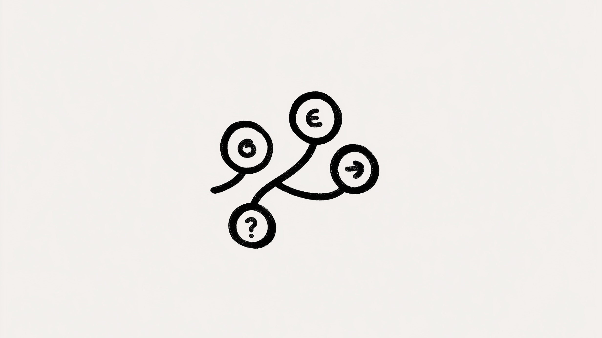

# Construire un système expert en Python (chaînage arrière)

Comment raisonne-t-on ? Comment suit-on une piste logique pour assembler un puzzle ? On peut apprendre aux ordinateurs à faire quelque chose de très similaire. C'est le principe des **systèmes experts**.

Ce sont des petits cerveaux IA qu'on construit pour résoudre des problèmes complexes — diagnostic médical, gestion financière, etc. Des briques fondamentales de l'IA qui bossent en silence derrière beaucoup d'applications.

Je vous montre comment j'en ai construit un from scratch en Python. Pas de magie, juste de la logique. À la fin, vous aurez les clés pour créer le vôtre. 🧠💻

## C'est quoi un système expert ?

Un Sherlock Holmes numérique. Il prend des **faits et des règles** pour déduire des réponses. Une machine à raisonnement, parfaite pour prouver des hypothèses ou prendre des décisions complexes.


## Les briques du système

### Les règles : des Lego logiques


Le cœur du système : un ensemble de **règles**. Des briques Lego qu'on assemble pour construire des raisonnements complexes. Chaque règle lie des `faits` (lettres majuscules) via des `connecteurs` :

- `&` : **ET** — Tous les faits doivent être `Vrai`.
- `|` : **OU** — Un seul suffit.
- `^` : **XOR** — Un seul, mais pas les deux.
- `=>` : **IMPLIQUE** — Si gauche est `Vrai`, droite l'est aussi.

### La table de vérité


Notre antisèche logique. Pour `p => q` : si `p` est faux, `q` peut être n'importe quoi. Mais si `p` est vrai, `q` *doit* l'être aussi. C'est le moteur de la déduction.

### Faits et requêtes


Les **faits** sont nos vérités de départ (lettres majuscules). Par défaut, tout est à `faux`. Un fait devient `vrai` soit par déclaration initiale (`=ABC`), soit par déduction.

Les **requêtes** (`?XYZ`) sont les questions auxquelles le système doit répondre.

## Le résolveur

### Chaînage avant vs arrière

Deux approches pour résoudre :

1. **Chaînage avant** : partir des faits, voir où les règles mènent. Entrée du labyrinthe.
2. **Chaînage arrière** : partir de la requête, remonter vers les faits. Sortie du labyrinthe.

J'ai choisi le chaînage arrière. Plus intuitif : on commence par le suspect et on cherche les indices.

## La structure de données

### La classe Node

Brique de base du système :

```python
class Node:
    def __init__(self):
        self.children = []     # A => B : => est enfant de B
        self.visited = False   # Évite les boucles infinies
        self.state = False     # Résultat Vrai/Faux
```

Chaque nœud a un état, trace s'il a été visité, et se connecte à d'autres. Pour `A => B` : `A` est enfant de `=>`, qui est enfant de `B`.

### AtomNode et ConnectorNode

Deux spécialisations :

```python
class AtomNode(Node):
    def __init__(self, name):
        super(AtomNode, self).__init__()
        self.name = name
```

```python
class ConnectorNode(Node):
    def __init__(self, connector_type):
        super(ConnectorNode, self).__init__(tree)
        self.type = connector_type
        self.operands = []     # A + B : A et B sont opérandes de +
        self.state = None
```

`AtomNode` = faits (A, B, C). `ConnectorNode` = opérateurs (ET, OU, XOR, IMPLIQUE).

## Implémentation

### Étape 1 : liste unique d'atomes

Parser l'entrée, créer une liste de tous les atomes distincts. Crucial : chaque fois que le système voit 'A', il pointe vers le *même* objet `AtomNode`. Source unique de vérité.

### Étape 2 : Notation Polonaise Inverse (NPI)


Au lieu de `A + B`, on écrit `A B +`. Bizarre en apparence, mais révolutionnaire pour un ordinateur. L'ordre des opérations devient explicite, le parsing est trivial. On lit de gauche à droite, les opérandes sont consommés et remplacés par le résultat.

### Étape 3 : connecter les nœuds

Avec les règles en NPI, on construit le réseau :

```python
stack = []

for x in npi_rule:
    if x not in OPERATORS:
        stack.append(self.atoms[x])
    else:
        pop0 = stack.pop()
        pop1 = stack.pop()
        # Si un des éléments dépilés est le même connecteur qu'on va créer (AND, OR, XOR)
        if isinstance(pop0, ConnectorNode) and pop0.type is LST_OP[x]:
            pop0.add_operand(pop1)
            new_connector = pop0
            self.connectors.pop()
        elif isinstance(pop1, ConnectorNode) and pop1.type is LST_OP[x]:
            pop1.add_operand(pop0)
            new_connector = pop1
            self.connectors.pop()
        else:
            connector_x = self.create_connector(LST_OP[x])
            connector_x.add_operands([pop0, pop1])
            new_connector = connector_x
        self.connectors.append(new_connector)
        stack.append(new_connector)

return stack.pop()
```

Atome → on push sur la pile. Opérateur → on pop les opérandes, on les lie au nouveau connecteur, on push le résultat. Le graphe se construit pièce par pièce.

### Étape 4 : résoudre les requêtes

Le moment de vérité. Une fonction récursive qui parcourt le graphe :

```python
# Pseudocode

def resolve(nodeX):
    if nodeX is True:
        return True

    for child in nodeX.children:
        res = resolve(child)
        if res is True:
            # Un seul des enfants doit être Vrai pour déduire que le courant est Vrai
            return True

    if Node is Connector:  # AND OR XOR IMPLY
        op_results = []
        for op in nodeX.operands:
            op_results.append(resolve(op))
        self.set_state_from_operands(op_results)
        # Exemple : pour un nœud AND, tous les éléments de op_results doivent être Vrai
```

On part du nœud requête, on remonte via les enfants. Si un enfant est prouvé `Vrai`, ça remonte. Pour `AND` : tous les opérandes doivent être vrais. Pour `OR` : un seul suffit. La table de vérité guide chaque évaluation.

## En résumé

Voilà la logique d'un système expert à chaînage arrière. À partir de règles simples, on crée un système qui *raisonne*.

C'est une fondation. Pour aller plus loin : chaînage avant, logique floue, etc. Le potentiel est immense.

Le code complet est sur [GitHub](https://github.com/jterrazz/42-expert-system). Forkez, cassez, améliorez.

Bon code ! 🚀🧠
