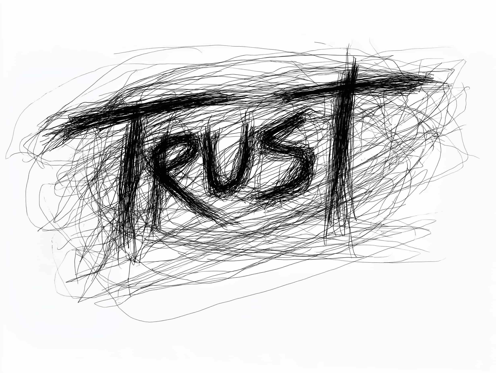

# Et si nous avions tout faux sur le e-commerce?

Le shopping en ligne est une formidable invention. En quelques clics sur un smartphone, presque tout ce dont on peut rêver arrive sur le pas de notre porte. La commodité est absolue. Des plateformes comme Amazon ont porté ce modèle à la perfection, rendant la comparaison, l'évaluation et l'achat d'une simplicité désarmante. Un véritable marché mondial à portée de main, 24/7.

Mais une question a fini par s'imposer à moi: quel est le véritable coût, à long terme, de cette facilité apparente? Avons-nous pris le temps de réfléchir à la direction que nous prenons?

Avec le basculement massif de nos achats vers le web, j'ai vu les commerces de proximité, véritables cœurs battants de nos communautés, commencer à vaciller. Ce lien humain, comme la conversation avec le libraire qui devine vos goûts ou le primeur qui vous met de côté ses meilleurs produits, devient une denrée rare.

Et ce n'est pas une simple affaire de nostalgie. Les conséquences économiques sont concrètes et douloureuses. Face à la baisse de fréquentation, les entreprises locales sont moins incitées à innover, et beaucoup sont contraintes de mettre la clé sous la porte. Sans vraiment nous en rendre compte, nous bâtissons un monde dominé par une poignée de géants centralisés.

> " Amazon nous entraîne vers un futur où l'achat et la vente de biens ne se dérouleront plus sur un marché public et ouvert, mais sur une plateforme privée contrôlée par Amazon. ", [Amazon is becoming more powerful than you realize](https://medium.com/s/2069/amazon-is-becoming-more-powerful-than-you-realize-2093d6860886)

Un tel niveau de centralisation est périlleux. Il soulève de graves questions sur l'équité de la concurrence, la censure et la vitalité de nos économies locales. C'est comme si nous avions mis tous nos œufs dans le même panier numérique. C'est pratique, mais éminemment fragile.

Alors, est-ce le seul avenir qui s'offre à nous? Ou pourrions-nous concilier le meilleur des deux mondes?

Et si nous pouvions allier la puissance du shopping en ligne à l'élan vital et aux bienfaits économiques du soutien aux créateurs locaux et indépendants? Voilà une idée qui mérite d'être creusée. 🌱

## Tout se résume à une question: qui a la parole?

Prenons un peu de recul et observons Internet lui-même. Vous souvenez-vous de l'époque où l'information provenait d'une poignée de chaînes de télévision et de journaux? Ils étaient les gardiens du temple. Ils maîtrisaient le récit.

Internet et les réseaux sociaux ont complètement rebattu les cartes. **Désormais, n'importe qui disposant d'une connexion peut lancer un blog, un fil d'actualité ou une chaîne YouTube** et potentiellement toucher autant de monde qu'un journaliste professionnel. Ce fut un transfert de pouvoir massif. La parole s'est libérée.

Et c'est là que m'est venue l'idée qui ne m'a plus quitté: **et si nous appliquions ce même principe de démocratisation au commerce?** Et si nous pouvions offrir à chaque petit commerçant, chaque artiste, chaque créateur indépendant, la même chance de participer à l'économie mondiale que les géants de la tech?

Telle est la vision. Et voici comment elle pourrait prendre forme.

## Une nouvelle mission: émanciper les créateurs

Imaginons un écosystème e-commerce d'un genre nouveau. Loin d'être une énième boutique, cet écosystème ne vendrait rien lui-même. Ce serait plutôt un socle technologique donnant aux commerçants de toutes tailles les outils pour:

1. **Créer leur boutique** sans la moindre friction.
2. **Présenter leurs produits** de manière claire et simple.
3. **Vendre et interagir** sur un pied d'égalité absolu.

Le seul rôle de la plateforme serait d'agir comme un intermédiaire neutre. Elle serait la grande artère commerçante du numérique où n'importe quelle entreprise pourrait ouvrir ses portes et où les clients pourraient flâner en toute confiance.

Mais nous pourrions aller encore plus loin. Nous pourrions bâtir cette infrastructure sur des technologies émergentes garantissant sa nature **decentralized**. Cela donnerait aux commerçants une propriété et un contrôle réels. La plateforme fournirait le terrain et les fondations, mais c'est vous qui concevriez votre boutique et la piloteriez exactement comme bon vous semble.

> Imaginez une plateforme sociale, propulsée par des technologies ouvertes, où l'on pourrait à la fois faire ses achats et tisser de vrais liens.

Pour que ce projet devienne réalité, il devrait reposer sur trois valeurs fondamentales:

### 1. Laisser l'innovation émerger par la base

Cette place de marché numérique serait ouverte à tous. Une marque internationale, un artisan de talent, la petite boutique d'un village, tous seraient les bienvenus. En s'abstenant de toute curation ou de la création de ses propres magasins, la plateforme laisserait le champ entièrement libre à l'incroyable diversité et à la créativité de ses utilisateurs.

Les meilleures idées pourraient ainsi germer de partout. C'est comme un grand repas partagé: quand chacun apporte son plat fétiche, on obtient un festin bien plus riche et exaltant que tout ce qu'un chef solitaire pourrait composer.

### 2. Placer le lien social au cœur de l'expérience

Le shopping n'a jamais été une simple transaction; il a toujours été une affaire de connexion. Cette plateforme serait conçue dès le départ pour rendre le commerce **facile, personnel et social**. Elle reposerait sur la conviction du pouvoir de la communauté, un principe inscrit dans son code même.

Pensez à cette boutique où le propriétaire vous salue par votre nom et sait vous recommander des pépites que vous allez adorer. L'objectif serait de recréer cette sensation en ligne, mais à grande échelle. Une expérience d'achat aussi personnelle que celle de votre commerce de quartier préféré, mais avec la portée d'Internet.

### 3. Bâtir la confiance sur des technologies ouvertes

Alors, comment accomplir tout cela sans devenir un énième intermédiaire? La réponse pourrait bien résider dans les protocoles ouverts et la blockchain. Ces technologies nous permettraient de **rationaliser et d'automatiser** des interactions qui requièrent d'ordinaire une autorité centrale, comme le suivi des livraisons, les garanties ou les assurances. Nombre de ces processus pourraient être gérés par des contrats transparents et décentralisés.

En nous appuyant sur du code open-source, nous pourrions créer une plateforme **transparente et sur laquelle n'importe qui pourrait bâtir sans permission**. Pensez à un jeu de Legos numériques. Développeurs et entrepreneurs pourraient se servir de ces briques fondamentales pour créer des solutions inédites. Vous pensez pouvoir utiliser du code pour bâtir un service postal plus efficace? Lancez-vous. Le système serait conçu pour accueillir tous les protocoles ouverts qui partagent cette vision d'un avenir décentralisé et transparent.

## En résumé

Cette nouvelle vision du commerce repose sur trois piliers:

1. **Rétablir l'équité:** donner aux individus et aux petites entreprises les outils pour rivaliser avec les géants.
2. **Recréer du lien:** réintroduire la dimension sociale au cœur de l'acte d'achat.
3. **Faire de l'ouverture le principe par défaut:** utiliser des protocoles décentralisés pour supprimer les gardiens du temple, et ainsi encourager la transparence et l'innovation.

En tissant ces piliers les uns avec les autres, nous ne ferions pas que bâtir une plateforme de plus. Nous favoriserions l'émergence d'un écosystème où les entreprises de toutes tailles peuvent prospérer, où les clients peuvent acheter en pleine conscience, et où l'innovation véritable peut fleurir depuis la base.

Voilà le futur du commerce dans lequel je veux vivre. Si cette vision vous parle, alors rêvons ensemble à ce que nous pourrions construire.

Réinventons l'avenir du commerce, ensemble. 🚀🛍️
