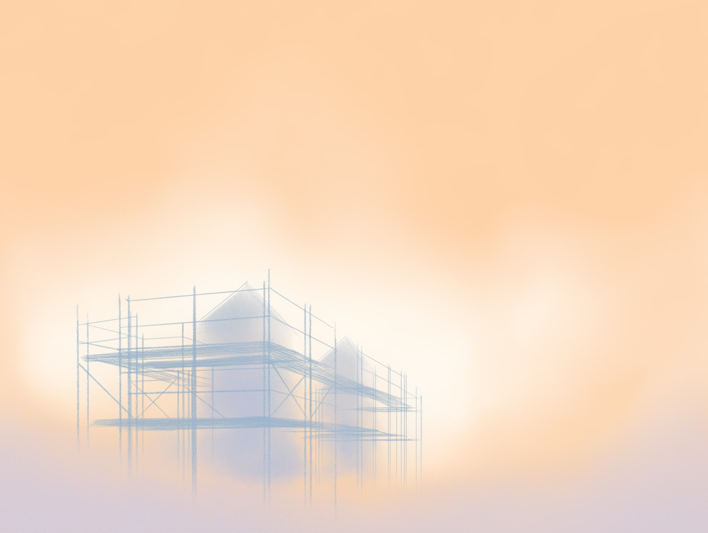
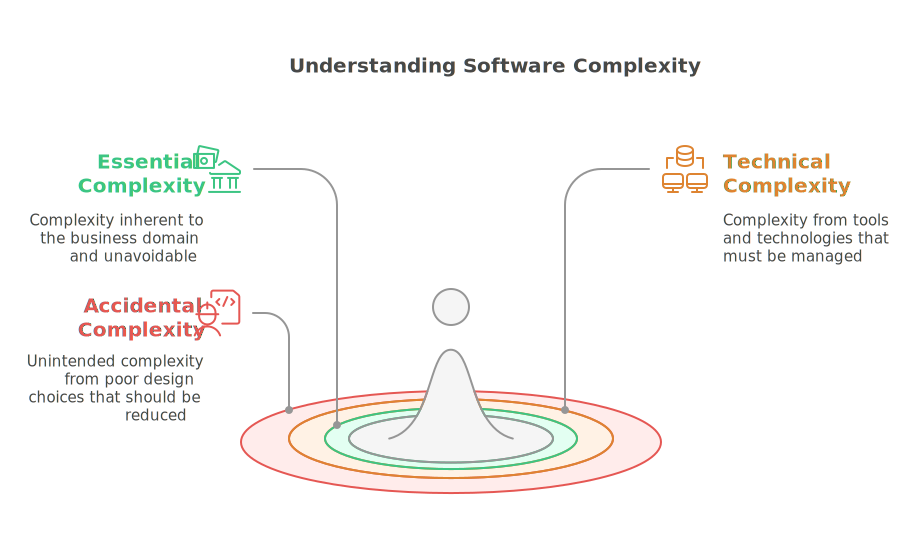

# Building software that lasts

## About software architecture

I've been on projects where every step feels like a struggle. Simple changes take weeks, and fixing one bug creates three more. The root cause is almost never a single bad line of code. It's deeper. It's the foundation, the architecture.

For me, software architecture isn't just a technical diagram. It's the set of critical decisions that determines a project's future. It's not about asking, "Where does this file go?" The real question is, "How do we structure this system so it doesn't collapse under its own weight in a year?"

These choices are the invisible scaffolding of your software. Get them right, and you create something that can grow, adapt, and stay healthy for years. Get them wrong, and you're just building technical debt. This is what **application design** is all about: the pragmatic art of building software that's meant to last.

This article breaks down what application design truly means, why it's so critical, and how we arrived at today's best practices. We'll explore the principles that empower you to build software that is both **maintainable** and **scalable**.

---

# So, what exactly is application design?

## A solution to a problem we all face

Picture a dev team, you've probably been there. Someone asks, "Where should I put this new feature's code?" or "Is this the right way to build this? Will it still work in six months when we need to change it?"

These aren't just everyday questions; they strike at the core challenge of software development. How do you build something that works now without creating a nightmare for your future self?

**Application design** is the answer. It's the discipline of making **deliberate decisions** about:

- How your code is structured.
- How the different parts are organized.
- How these parts talk to each other.

The goal is simple: to create applications that are **maintainable** (easy to understand, fix, and evolve) and **scalable** (ready to handle growth and new demands).

---

# The enemy we must tame: complexity

Building software is a battle against complexity. The first step to winning is knowing your enemy. I see it in three main forms:

1. **Essential complexity**
   This is the complexity you can't avoid, the inherent difficulty of the problem you're solving. If you're building a banking app, you have to deal with interest calculations and transaction rules. That's the job. It's essential.

2. **Technical complexity**
   This comes from your tools: the databases, frameworks, and servers required to make your software run. It's a necessary part of the equation, but it must be managed so it doesn't hijack the project.

3. **Accidental complexity**
   This is the self-inflicted wound, the mess we create through poor design choices. Think spaghetti code, reaching for a framework for everything just because you can, or leaving behind zero documentation. Unlike the others, this complexity is entirely optional. We can, and must, eliminate it.

Good application design is all about minimizing accidental complexity, keeping technical complexity in check, and focusing your energy on mastering the essential complexity.

---

# How we got here: a quick history

To understand application design today, it helps to see how we got here. The journey has been a rapid one.

- **Before 2000: The wild west.**
  Software was often built on gut instinct. Architectures were messy, and most testing, if it happened at all, was done by hand. It was chaotic.
- **The 2000s: Structure emerges.**
  Frameworks, layered designs, and Agile methodologies began to bring order. The automated testing pyramid emerged, emphasizing unit tests. Teams started recognizing the value of a more disciplined approach.
- **Post-2015: The modern era.**
  This is where things truly clicked. Practices like **Test-Driven Development (TDD)** and **Domain-Driven Design (DDD)** went mainstream. Architectures like **hexagonal** and **clean architecture** taught us how to genuinely separate concerns. **Continuous deployment** became the norm, baking quality into the development process itself.

---

# The guiding principles

Application design didn't appear out of thin air. It stands on the shoulders of two foundational manifestos that shifted how we think about building software.

1. **The Agile Manifesto (2001)**
   This was a revolution. It reminded us to value:
   - **Working software** over piles of documentation.
   - **Responding to change** over blindly following a plan.
   - **People and collaboration** over rigid processes.
   - **Customer partnership** over fighting about contracts.

2. **The Software Craftsmanship Manifesto**
   This took Agile a step further. It's about professional pride and quality, emphasizing:
   - **Well-crafted software**, not just functioning software.
   - **Steadily adding value** for users.
   - A **community of professionals** who help each other grow.
   - **Productive partnerships**, not just contractual obligations.

---

At its core, **application design** isn't an academic theory. It's a collection of battle-tested principles and strategic choices. By understanding complexity, learning from the past, and committing to quality, we can build software that doesn't just work today but thrives tomorrow.

---

## Read more in this series

1. **Application design: building software that lasts**
2. [Application design: mastering the flow of dependencies](https://www.jterrazz.com/articles/10-software-design-1-mastering-dependencies)
3. [Application design: separating business from technology](https://www.jterrazz.com/articles/11-software-design-2-hexagonal-architecture)
4. [Application design: a journey into clean architecture](https://www.jterrazz.com/articles/12-software-design-3-clean-architecture-in-practice)
