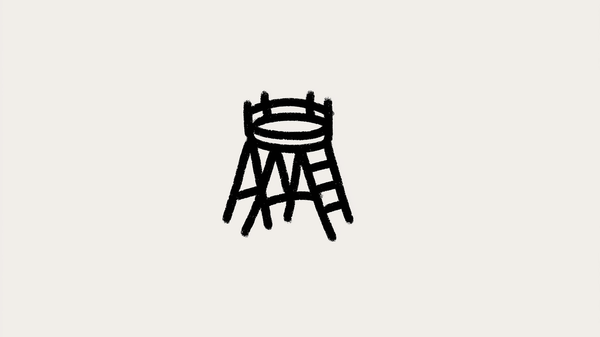

# Construire des logiciels qui durent

## L'architecture, ce n'est pas un diagramme

J'ai bossé sur des projets où chaque modif ressemblait à un combat. Des changements simples prenaient des semaines. Corriger un bug en créait trois autres. Le problème n'est jamais une ligne de code. C'est plus profond : l'architecture.

L'architecture logicielle, c'est l'ensemble des décisions critiques qui déterminent l'avenir d'un projet. Pas "où ranger ce fichier ?" mais "comment structurer ce système pour qu'il ne s'effondre pas sous son poids dans un an ?"

Ces choix sont l'échafaudage invisible. Faites-les bien : un logiciel qui grandit, s'adapte, reste sain. Faites-les mal : de la dette technique qui s'accumule. C'est ça la **conception applicative** — l'art de construire des logiciels faits pour durer.

Cet article décortique ce que ça signifie vraiment, pourquoi c'est crucial, et comment on en est arrivés aux bonnes pratiques actuelles.

---

# C'est quoi la conception applicative ?

## Un problème universel

Vous y avez été. Quelqu'un demande : "Où je mets ce code ?" ou "C'est la bonne façon de faire ? Ça marchera encore dans six mois ?"

Ce sont les questions centrales du développement. Comment construire quelque chose qui marche maintenant sans créer un cauchemar pour plus tard ?

La **conception applicative**, c'est ça. Des **décisions délibérées** sur :

- Comment structurer le code.
- Comment organiser les parties.
- Comment elles communiquent.

L'objectif : des apps **maintenables** (faciles à comprendre, corriger, faire évoluer) et **évolutives** (prêtes pour la croissance).

---

# L'ennemi : la complexité

Construire un logiciel = bataille contre la complexité. Première étape : connaître l'ennemi. Trois formes :

1. **Complexité essentielle**
   Inévitable — la difficulté inhérente au problème. App bancaire = calculs d'intérêts, règles de transaction. C'est le travail.

2. **Complexité technique**
   Vos outils : bases de données, frameworks, serveurs. Incontournable, mais à maîtriser.

3. **Complexité accidentelle**
   Auto-infligée. Code spaghetti, frameworks utilisés "parce qu'on peut", pas de docs. Entièrement optionnelle. À éliminer.

Bonne conception = minimiser l'accidentelle, contrôler la technique, maîtriser l'essentielle.

---

# Un peu d'histoire

Comment on en est arrivés là :

- **Avant 2000 : Far West.** Code à l'instinct, architectures chaotiques, tests manuels. Chaos.
- **Années 2000 : Structure.** Frameworks, couches, Agile. Pyramide de tests. Discipline.
- **Après 2015 : Ère moderne.** TDD, DDD, architectures hexagonale et clean. Déploiement continu. Qualité intégrée.

---

# Les principes directeurs

La conception applicative n'est pas apparue de nulle part. Elle repose sur deux manifestes fondateurs qui ont transformé notre façon de penser la construction logicielle.

1. **Le Manifeste Agile (2001)**
   Ce fut une révolution. Il nous a rappelé de valoriser :
   - **Un logiciel fonctionnel** plutôt que des piles de documentation.
   - **La réponse au changement** plutôt que le suivi aveugle d'un plan.
   - **Les individus et la collaboration** plutôt que des processus rigides.
   - **Le partenariat client** plutôt que les négociations contractuelles.

2. **Le Manifeste du Software Craftsmanship**
   Celui-ci a poussé l'Agile plus loin. Il s'agit de fierté professionnelle et de qualité, en mettant l'accent sur :
   - **Un logiciel bien conçu**, pas seulement fonctionnel.
   - **L'ajout constant de valeur** pour les utilisateurs.
   - Une **communauté de professionnels** qui s'entraident pour progresser.
   - Des **partenariats productifs**, pas seulement des obligations contractuelles.

---

Au fond, la **conception applicative** n'est pas une théorie académique. C'est une collection de principes éprouvés au combat et de choix stratégiques. En comprenant la complexité, en apprenant du passé et en s'engageant pour la qualité, nous pouvons construire des logiciels qui ne se contentent pas de fonctionner aujourd'hui, mais qui prospèrent demain.
