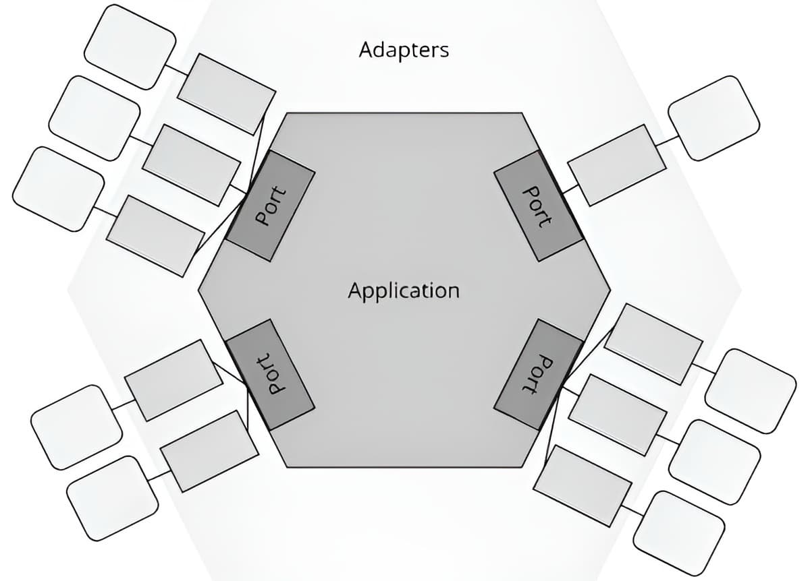

# Application Design: Separating Business Logic from the Tech

## Let's Get Real About Structuring Your Code

So, how do you actually organize a project? This is one of the biggest questions we face. Get it right, and your application can grow and adapt for years. Get it wrong, and you're signing up for a world of pain.

In this chapter, I want to walk you through the evolution of how we structure code. We'll start with the classic approaches, see where they fall short, and then dive into a much better way of thinking: **hexagonal architecture**. It's a game-changer for isolating what your application *does* from the technology it *uses*.

**Navigation 📚**

1. [**Introduction: Application Design, The Art of Building Sustainable and Scalable Software**](https://www.jterrazz.com/articles/9-software-design-0-why-architecture-matters)
		*The basics to understand the stakes and objectives of good architecture.*

2. [**Chapter 1: The Concept of Dependencies**](https://www.jterrazz.com/articles/10-software-design-1-mastering-dependencies)
		*Exploring relationships between components, the importance of dependencies, and principles like SOLID.*

3. [**Chapter 2: Understanding Business and Technical Architectures**](https://www.jterrazz.com/articles/11-software-design-2-hexagonal-architecture)
		*How to isolate business logic from technical concerns using ports and adapters.*

4. [**Chapter 3: Clean Architecture**](https://www.jterrazz.com/articles/12-software-design-3-clean-architecture-in-practice)
		*Discovering an approach focused on business with a clear layered structure.*

---

# The Starting Point: Common Architectures

## Spaghetti Architecture: The "No Architecture" Architecture

We've all seen it. Some of us have even written it. Spaghetti architecture is what happens when there are no rules. Business logic, database calls, UI code—everything is thrown into a single, tangled mess.

**The result?**

* The code is impossible to read.
* Testing is a nightmare.
* Every change risks breaking the entire system.

It's the natural result of moving fast without a plan. It's chaos.

---

## Layered Architecture: A Step in the Right Direction

To fight the chaos, we came up with **layered architecture**. It's probably the most common pattern out there because it's simple and makes intuitive sense. You divide your app into distinct layers, each with a clear job.

### The Usual Layers

1. **Presentation Layer**: The UI or API that the user interacts with.
2. **Application Layer**: Orchestrates the workflows. It doesn't contain business logic itself but tells the domain layer what to do.
3. **Domain Layer**: The heart of the application. This is where all the core business rules live.
4. **Persistence Layer**: Handles all the database stuff.

### The Golden Rule: Only Talk to the Layer Below You

The Presentation layer talks to the Application layer, which talks to the Domain, which talks to Persistence. Simple. This enforces the Single Responsibility Principle (the **S** in **SOLID**), as each layer has one clear purpose.

---

## The Big Problem with Layered Architecture

On the surface, it looks clean. But there's a fatal flaw.

* **The Dependency Rule Is a Trap**: The layers depend directly on the layers below them. This means your business logic (Domain) ends up depending on technical details (Persistence). Your core rules are now tied to your database.
* **Technical, Not Business, Focus**: The code is grouped by *what it is* (UI, database code) rather than *what it does* for the business.

This coupling between the business logic and the database is where everything starts to go wrong. It makes testing harder, and it makes changing your database a massive, painful project.

---

# The Real Goal: Set Your Business Logic Free

For me, this is the number one goal of any good architecture: **isolate your business logic from everything else.** Your business rules are the reason the software exists. They should be independent of the UI, the database, the frameworks—all of it.

**Why is this so important?**

1. **Things Change**: Your business rules evolve slowly. But technology? That changes all the time. You might switch from a REST API to GraphQL, or from Postgres to a NoSQL database. Your core logic shouldn't have to change when your tech stack does.
2. **Easy Testing**: When your business logic is pure and has no ties to a database or a web server, you can test it with simple, fast unit tests.
3. **Flexibility**: By keeping the core clean, you can swap out technical components on the edges without breaking the heart of your application.

The strategy is simple: **Put your business logic in the center, and push all the technical stuff to the outside.**

---

# The Solution: Hexagonal Architecture (Ports & Adapters)

This is where **Hexagonal Architecture** comes in. Alistair Cockburn came up with this idea back in 2005, and it's brilliant. It's a design that puts your **business logic** right at the core and builds a protective barrier around it.

## What It Aims to Do

1. **Isolate the Core**: Your domain is completely independent. It doesn't know about your web framework or your database.
2. **Make Testing a Breeze**: Since the core is isolated, testing your business rules becomes trivial.
3. **Future-Proof Your App**: Want to add a new way to interact with your app, like a command-line interface? Just add a new "adapter." The core logic doesn't change.
4. **Clear Entry and Exit Points**: All communication with the outside world happens through well-defined "ports" and "adapters."

> ℹ️ **Why a hexagon?** Alistair Cockburn just picked the shape because it had enough sides to represent different types of connections (UI, database, other APIs, etc.). Don't get hung up on the shape. The name **"Ports & Adapters"** is actually more descriptive.



The hexagon visually shows your business logic at the center, protected from the messy outside world by a layer of ports and adapters. It's all about **modularity** and **technological neutrality**.

> **ℹ️ What's in a Name?**
> People use different terms for the two sides of the hexagon:
> 1. Left/Right
> 2. Driving/Driven
> 3. Primary/Secondary
> 4. User Side/Server Side
>
> Honestly, the names don't matter as much as the concept. Just pick one and be consistent. I personally like **Driving/Driven** because it clearly separates what *initiates an action* from what *fulfills a request*.

---

# Your Application's Core Is Its "Rule Engine"

Here's a critical point: **hexagonal architecture is only useful if you actually have business logic to protect.**

If your app is just a simple CRUD service that moves data from a database to a JSON response without any real rules or transformations, then this is massive overkill. A simple layered model is probably fine.

But if your application contains real business rules—the logic that makes your company money or enforces critical constraints—then those rules are precious. They need to be at the center. **Without business rules, the hexagon is empty.**

---

# A Full Example: Driving vs. Driven

Let's make this concrete. Imagine we're building an order processing system.

* **Driving Side (Left)**: This is what kicks off an action. A user submitting an order through a web form is a driving actor.
* **Driven Side (Right)**: This is the infrastructure the application uses. The database where the order is saved is a driven actor.

---

## **1. The Domain (The Pure Business Logic)**

At the center, we have our business rules, completely independent of any technology. The domain defines "ports," which are interfaces that describe what it needs to do.

```ts
// This is an interface for something that will *drive* our application.
export interface OrderInputPort {
   processOrder(order: Order): void; // A left-side "driving" port
}

// This is an interface for a service our application will *be driven by*.
export interface OrderOutputPort {
   saveOrder(order: Order): void; // A right-side "driven" port
}

// This is our core business logic.
export class OrderService implements OrderInputPort {
   // It depends on an *abstraction* (the port), not a concrete database.
   constructor(private outputPort: OrderOutputPort) {}

   processOrder(order: Order): void {
      if (!order.isValid()) {
         throw new Error("Order is invalid");
      }

      console.log("Processing order:", order);
      // It calls the output port to get the job done.
      this.outputPort.saveOrder(order);
   }
}
```

**What's happening here?**

* `OrderInputPort` is the entry point for commands.
* `OrderOutputPort` is the exit point for things the app needs from the outside world (like saving data).
* `OrderService` is pure business logic. It doesn't know about databases or APIs. It just knows it needs to save an order through a port.

---

## **2. The Driving Adapter (The API Controller)**

This is the code that translates an incoming request (from the web, a CLI, etc.) into a call on our application's input port.

```ts
import express from "express";

// This is an "adapter" that connects the outside world (HTTP) to our application.
export class OrderController {
   constructor(private orderInputPort: OrderInputPort) {}

   handleRequest(req: express.Request, res: express.Response): void {
      const order = req.body;

      try {
         // The controller's only job is to translate and delegate.
         this.orderInputPort.processOrder(order); // It calls the domain via the port.
         res.status(200).send("Order processed successfully!");
      } catch (err) {
         res.status(400).send(err.message);
      }
   }
}
```

This controller is dumb. It knows about HTTP, but it knows nothing about business rules. It just passes the request along.

---

## **3. The Driven Adapter (The Database)**

This is the concrete implementation of our output port. This is where the technical details live.

```ts
// This adapter implements our output port with a specific technology (e.g., a database).
export class DatabaseAdapter implements OrderOutputPort {
   saveOrder(order: Order): void {
      // Here you would have your actual database logic.
      console.log("Saving order to database:", order);
   }
}
```

This class is all about the database. It knows nothing about the business rules that led to the order being saved.

---

## **4. Tying It All Together**

Finally, somewhere at the very edge of our application (like `index.ts`), we wire everything up.

```ts
import express from "express";

// 1. Create the concrete adapters.
const databaseAdapter = new DatabaseAdapter(); // Driven Side

// 2. Create the domain service, injecting the adapter.
const orderService = new OrderService(databaseAdapter);

// 3. Create the driving adapter, injecting the domain service.
const orderController = new OrderController(orderService); // Driving Side

// 4. Set up the web server.
const app = express();
app.use(express.json());

app.post("/orders", (req, res) => orderController.handleRequest(req, res));

app.listen(3000, () => console.log("Server running on http://localhost:3000"));
```

This is the only place where the domain logic and the technical details meet. The dependencies are "injected" from the outside in, protecting the core.

---

## The Impact on Testing Is Huge

This structure makes testing a dream:

* **Test the Controller**: Give it a mock `OrderInputPort` and check if it calls `processOrder` correctly. No web server needed.
* **Test the Business Logic**: Give it a mock `OrderOutputPort` and test all your business rules in complete isolation. These tests are super fast.
* **Test the Database Adapter**: Test it on its own to make sure it can actually save to the database.

Each piece can be tested independently. No more fragile, end-to-end tests that fail for random reasons.

---

> **Alistair Cockburn's Advice from 2023: Name with Intent**
> Alistair recently gave some great advice on how to name your ports to make their purpose obvious. He suggests the format: **"For + Verb-ing + Goal"**.
>
> **Example:**
>
> * **Driving Port:** `ForProcessingOrders`
> * **Driven Port:** `ForSavingOrders`
>
> I love this because it makes the code self-documenting. You immediately know what each interface is for. It's a small change, but it adds a ton of clarity.

---

Hexagonal architecture is a massive step up from simple layering. It forces you to put your business logic first and treat technology as a detail.

But it's not the final destination. **Clean Architecture**, which was popularized by Robert C. Martin (Uncle Bob), takes these ideas even further. It provides a more structured set of rules for layering and dependencies, creating an even stronger separation of concerns.

In the next chapter, we'll dive into Clean Architecture. You'll see how it builds on the foundation of Hexagonal to give you a powerful and scalable way to structure any application. Let's go
