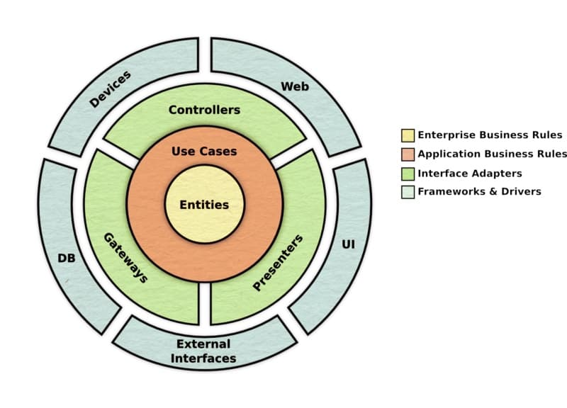

# Conception applicative: un voyage au cœur de la clean architecture

## Pour aller à l'essentiel

Voici la grande idée qui a transformé ma façon de concevoir des logiciels: votre architecture n'a que faire de votre base de données. Elle se moque de votre framework web. Elle ignore votre interface utilisateur. Sa seule et unique préoccupation doit être ce que votre application *fait réellement*.

Telle est la philosophie qui sous-tend la **Clean Architecture**. C'est une manière de construire des logiciels qui place vos **cas d'utilisation** (*use cases*), la véritable valeur métier, au centre absolu de tout. Le reste n'est qu'un détail, menant à un système testable, maintenable, et indépendant de ses aspects techniques.

---

# La Clean Architecture en théorie

La Clean Architecture repose sur la création de couches indépendantes, régies par un ensemble de règles strictes sur la manière dont elles peuvent interagir. Imaginez-la comme une série de cercles concentriques.

1. **Entités (*Entities*)**: Au cœur même du système. Ce sont vos règles métier qui s'appliquent à toute l'entreprise. La logique pure et fondamentale qui définit votre activité.
2. **Cas d'utilisation (*Use Cases*)**: Cette couche entoure les entités. Elle contient les règles métier spécifiques à l'application. Elle orchestre le flux de données depuis et vers les entités pour atteindre un objectif précis (par exemple, " Inscrire un utilisateur " ou " Traiter un paiement ").
3. **Adaptateurs d'interface (*Interface Adapters*)**: C'est la couche qui fait office de traducteur. Elle prend les données dans le format le plus pratique pour les cas d'utilisation et les entités, et les convertit dans le format le plus adapté au monde extérieur (comme une base de données ou le web).
4. **Frameworks et pilotes (*Frameworks and Drivers*)**: La couche la plus externe. C'est ici que vivent tous les détails: le framework web, la base de données, l'interface utilisateur, etc. Ce sont les éléments les plus susceptibles de changer.

La règle d'or est la **règle de dépendance** (*Dependency Rule*): toutes les dépendances doivent pointer vers l'intérieur. Votre interface utilisateur peut dépendre de vos cas d'utilisation, mais vos cas d'utilisation ne savent *rien* de l'interface utilisateur. Votre logique métier est reine, et elle n'est jamais, au grand jamais, détrônée par un détail technique.



---

# Clean Architecture contre Architecture Hexagonale

Alors, comment cette approche se compare-t-elle à l'Architecture Hexagonale que nous venons d'aborder?

Elles reposent sur la même philosophie fondamentale: **protéger la logique métier**. Je considère la Clean Architecture comme une version plus spécifique, et plus dogmatique, de l'Architecture Hexagonale.

- L'Architecture Hexagonale vous donne le " quoi ": séparer votre application en un " intérieur " (le domaine) et un " extérieur " (l'infrastructure) à l'aide de ports et d'adaptateurs.
- La Clean Architecture vous offre un " comment " plus détaillé: elle définit explicitement les couches au sein de la partie " intérieure " (Entités et Cas d'utilisation) et fournit des règles plus strictes sur leurs interactions.

Imaginez que l'Architecture Hexagonale a dessiné la carte. La Clean Architecture, elle, y a ajouté les autoroutes et les panneaux de signalisation. Le chemin devient alors plus évident.

---

# Mise en pratique: un exemple de A à Z

La théorie, c'est bien. Le code, c'est mieux. Construisons ensemble une petite partie d'une application de gestion hôtelière. L'objectif est de mettre à jour le prix des chambres en fonction d'un nouveau prix de base et d'un ensemble de règles métier (par exemple, des étages différents ont des multiplicateurs de prix différents).

## La structure de nos fichiers

D'abord, examinons la structure du projet. C'est ce que Robert C. Martin appelle une " Screaming Architecture " (une architecture qui crie ce qu'elle fait). La structure de vos dossiers doit crier ce que l'application *fait*, et non les frameworks qu'elle utilise. Vous y voyez `business`, `use-cases`, et `entity`. Vous ne voyez pas de `models`, `views`, et `controllers` au plus haut niveau.

```sh
src/
├── business/
│ ├── entity/
│ │ └── floor.ts
│ │ └── room.ts
│ ├── gateway/
│ │ └── room.gateway.ts
│ ├── use-cases/
│ │ └── update-room-price.ts
├── container/
│ └── container.ts
├── controller/
│ ├── gateway/
│ │ └── room.repository.ts
│ ├── presenter/
│ │ └── room-presenter.json.ts
│ └── room.controller.ts
└── tests/
		└── update-price.test.ts
```

- `business/`: C'est le cœur de notre application. Toute la logique métier pure réside ici. Elle n'a aucune dépendance avec le monde extérieur.
- `controller/`: C'est notre couche d'adaptateurs d'interface. Elle gère les détails de la communication avec le monde extérieur (comme l'implémentation des *gateways* et des *presenters*).
- `container/`: C'est notre usine d'assemblage. C'est ici que nous connectons tous les composants via l'injection de dépendances.
- `tests/`: Les tests qui prouvent que notre logique métier fonctionne.

---

## 1. Les entités: `Floor` & `Room`

Les entités ne sont pas de simples conteneurs de données inertes. Elles renferment les règles métier les plus fondamentales. Il s'agit d'une logique qui est vraie pour toute l'entreprise, quelle que soit l'application qui l'utilise.

```ts
// business/entity/floor.ts
export class Floor {
		constructor(public floor: number) {}

    // Ceci est une règle métier fondamentale.
    getFactor() {
        if (this.floor === 1) return 1.07;
        if (this.floor === 2) return 1.22;
        if (this.floor === 3) return 1.33;
        return 1;
    }
}
```

```ts
// business/entity/room.ts
import { Floor } from "./floor";

export class Room {
		public floor: Floor;
		constructor(
				floorNumber: number,
				public number: number,
				public price: number,
		) {
				this.floor = new Floor(floorNumber);
		}

    // Une autre règle métier fondamentale.
    setPrice(basePrice: number) {
        const calculatedPrice = basePrice * this.floor.getFactor();
        this.price = Math.min(Number(calculatedPrice.toFixed(2)), 200);
    }
}
```

**Pourquoi placer la logique ici?** Parce que la règle selon laquelle " le prix d'une chambre dépend de son étage " est une vérité fondamentale de notre activité hôtelière. En la plaçant dans l'entité, nous nous assurons que cette règle est toujours appliquée, partout. Elle est encapsulée, réutilisable et respecte le principe de responsabilité unique.

---

## 2. La *gateway*: `RoomGateway`

La *gateway* (ou passerelle) est une interface. C'est un contrat, défini par la couche métier, qui stipule: " J'ai besoin d'effectuer ces opérations sur les chambres, mais je me fiche de *comment* vous le faites. " C'est une promesse que les couches externes devront tenir.

```ts
// business/gateway/room.gateway.ts
export interface RoomDTO {
		floor: number;
		number: number;
		price: number;
}

// Voici le contrat.
export interface RoomGateway {
		updateRoomPrice(roomNumber: number, newPrice: number): Promise<void>;
		getRooms(): Promise<Array<RoomDTO>>;
}
```

Cette interface réside dans la couche `business`, garantissant que la dépendance pointe vers l'intérieur. Les cas d'utilisation dépendront de cette abstraction, et non d'une classe de base de données concrète.

---

## 3. Le cas d'utilisation: `UpdateRoomPrice`

Le cas d'utilisation est la vedette du spectacle. Il représente une action unique que l'application peut effectuer. Il orchestre les entités et utilise les *gateways* pour interagir avec le monde extérieur.

```ts
// business/use-cases/update-room-price.ts
import { Room } from "../entity/room";
import { RoomGateway } from "../gateway/room.gateway";

// Un autre contrat : comment le cas d'utilisation communique ses résultats.
export interface Presenter {
    set: (rooms: Array<Room>) => void;
}

// Le cas d'utilisation lui-même.
export type UpdateRoomPrice = (basePrice: number, presenter: Presenter) => Promise<void>;

// Une factory pour créer le cas d'utilisation et injecter ses dépendances.
export const updateRoomPriceFactory = (repository: RoomGateway) => {
    return async (basePrice: number, presenter: Presenter) => {
        if (basePrice < 0) {
            throw new Error("Amount cannot be negative");
        }
        const roomsDto = await repository.getRooms();
        const rooms = roomsDto.map((r) => new Room(r.floor, r.number, r.price));

        for (const room of rooms) {
            room.setPrice(basePrice); // Utilise la logique métier de l'entité.
            await repository.updateRoomPrice(room.number, room.price);
        }

        const updatedRooms = (await repository.getRooms()).map(
            (r) => new Room(r.floor, r.number, r.price)
        );
        
        // Transmet les résultats au presenter.
        presenter.set(updatedRooms);
    };
};
```

Ce code est de la pure logique métier. Il récupère les chambres, les parcourt, demande à chaque chambre de mettre à jour son prix (en utilisant la méthode `setPrice` de l'entité), puis les sauvegarde. Il ne sait rien des bases de données, de HTTP ou du JSON. Il ne dialogue qu'avec des abstractions (`RoomGateway`, `Presenter`).

---

## 4. L'implémentation de la *gateway*: `RoomRepository`

Nous voici maintenant dans les couches externes. Le `RoomRepository` est l'implémentation concrète de l'interface `RoomGateway`. C'est ici que nous écrivons le code qui interagit réellement avec la base de données. Pour cet exemple, j'utilise un simple tableau en mémoire, mais c'est là que votre code `Prisma`, `TypeORM` ou `node-postgres` prendrait place.

```ts
// controller/gateway/room.repository.ts
import { RoomDTO, RoomGateway } from "../../business/gateway/room.gateway";

export class RoomRepository implements RoomGateway {
    constructor(private rooms: Array<RoomDTO>) {}

    async updateRoomPrice(roomNumber: number, newPrice: number): Promise<void> {
        const room = this.rooms.find((room) => room.number === roomNumber);
        if (!room) {
            throw new Error(`Failed to find room ${roomNumber}`);
        }
        room.price = newPrice;
        return Promise.resolve();
    }

    async getRooms(): Promise<Array<RoomDTO>> {
        return Promise.resolve(this.rooms);
    }
}
```

Cette classe tient la promesse faite par l'interface `RoomGateway`.

---

## 5. L'implémentation du *presenter*: `RoomPresenterJson`

Le rôle du *presenter* est de prendre les objets entités purs fournis par le cas d'utilisation et de les formater pour le monde extérieur. Ici, nous les formatons en objets JSON simples.

```ts
// controller/presenter/room-presenter.json.ts
import { Room } from "../../business/entity/room";

export class RoomPresenterJson {
    private r: Array<Room> = [];

    // Le cas d'utilisation appelle cette méthode.
    set(rooms: Array<Room>) {
        this.r = rooms;
    }

    // Le contrôleur appelle cette méthode pour obtenir le résultat final.
    format() {
        return this.r.map((r) => ({
            floor: r.floor.floor,
            price: r.price,
            number: r.number,
        }));
    }
}
```

Cela crée une séparation d'une grande élégance. Le cas d'utilisation ne connaît pas le JSON. Le contrôleur ne connaît pas les entités `Room`. Le *presenter* sert de pont entre les deux.

---

## 6. Le contrôleur: `RoomController`

Le contrôleur est le point d'entrée depuis le web. Son unique travail consiste à analyser la requête, à appeler le cas d'utilisation approprié et à envoyer la réponse formatée. C'est une couche fine, volontairement dépourvue de logique métier.

```ts
// controller/room.controller.ts
import { Request, Response } from "express";
import { createContainer } from "../container/container";
import { RoomPresenterJson } from "./presenter/room-presenter.json";

const express = require("express");
const app = express();

const container = createContainer();

app.put("/rooms", async (req: Request, res: Response) => {
    // 1. Créer un nouveau presenter pour cette requête.
    const roomPresenterJson = new RoomPresenterJson();
    // 2. Obtenir le cas d'utilisation de notre conteneur et l'exécuter.
    await container.UpdateRoomPrice(200, roomPresenterJson);
    // 3. Envoyer le résultat formaté par le presenter.
    res.send(roomPresenterJson.format());
});

app.listen(3000, () => console.log("Server running on http://localhost:3000"));
```

Admirez la limpidité de ce code. Le contrôleur orchestre le flux mais ne contient aucune logique métier.

---

## 7. Le conteneur de dépendances

C'est ici que la magie opère. Le conteneur est l'endroit unique où nous construisons nos objets et injectons leurs dépendances. C'est l'inversion de contrôle en action.

```ts
// container/container.ts
import { UpdateRoomPrice, updateRoomPriceFactory } from "../business/use-cases/update-room-price";
import { RoomRepository } from "../controller/gateway/room.repository";

interface Container {
    UpdateRoomPrice: UpdateRoomPrice;
}

export const createContainer = (): Container => {
    return {
        // Crée le cas d'utilisation en lui injectant le repository concret.
        UpdateRoomPrice: updateRoomPriceFactory(
            new RoomRepository([
                // Données initiales pour notre repository en mémoire.
                { floor: 0, number: 1, price: 0 },
                { floor: 1, number: 2, price: 0 },
                { floor: 2, number: 3, price: 0 },
                { floor: 3, number: 4, price: 0 },
            ])
        ),
    };
};
```

---

## 8. Le test: là où tout prend son sens

Et maintenant, le meilleur pour la fin. Regardez avec quelle facilité nous pouvons tester notre logique métier fondamentale.

```ts
// tests/update-price.test.ts
import assert from "assert";
import { describe, test } from "mocha";
import { createContainer } from "../container/container";
import { RoomPresenterJson } from "../controller/presenter/room-presenter.json";

describe("Update Room Price", () => {
    test("Update all room prices based on a base price of 100", async () => {
        // Étant donné
        const container = createContainer();
        const presenter = new RoomPresenterJson();

        // Quand nous exécutons le cas d'utilisation
        await container.UpdateRoomPrice(100, presenter);

        // Alors nous vérifions le résultat fourni par le presenter
        const value = presenter.format();
        assert.deepStrictEqual(value, [
            { number: 1, price: 100, floor: 0 }, // 100 * 1
            { number: 2, price: 107, floor: 1 }, // 100 * 1.07
            { number: 3, price: 122, floor: 2 }, // 100 * 1.22
            { number: 4, price: 133, floor: 3 }, // 100 * 1.33
        ]);
    });
});
```

Ce test est d'une rapidité fulgurante. Il s'exécute en mémoire. Il n'a besoin ni de base de données, ni de serveur web. Il teste l'intégralité de notre processus métier de bout en bout, prouvant que notre logique est correcte, et tout cela parce que nous avons si soigneusement séparé nos préoccupations. Voilà la récompense.

---

# Conclusion: construire pour le métier, pas pour la technologie

La leçon de la Clean Architecture est simple mais profonde: **donnez la priorité à votre logique métier.**

Les frameworks changeront. Les bases de données seront remplacées. Les interfaces utilisateur seront redessinées. Mais ce sont vos règles métier fondamentales qui constituent sa valeur durable. La Clean Architecture n'est pas seulement un patron de conception; c'est une philosophie qui vous contraint à protéger cette valeur.

Elle exige de la discipline et un peu plus de réflexion en amont, mais la récompense est un système testable, maintenable, flexible et compréhensible. Vous bâtissez un système capable d'évoluer avec le métier, et non un système qui le freine.

À vous de jouer maintenant, et de construire quelque chose d'exceptionnel. 🚀

---

### Lire la suite dans cette série

1.  [Conception applicative: bâtir des logiciels conçus pour durer](https://www.jterrazz.com/articles/9-software-design-0-why-architecture-matters/fr)
2.  [Conception applicative: maîtriser le flux des dépendances](https://www.jterrazz.com/articles/10-software-design-1-mastering-dependencies/fr)
3.  [Conception applicative: séparer le métier de la technique](https://www.jterrazz.com/articles/11-software-design-2-hexagonal-architecture/fr)
4.  **Conception applicative: un voyage au cœur de la clean architecture**
