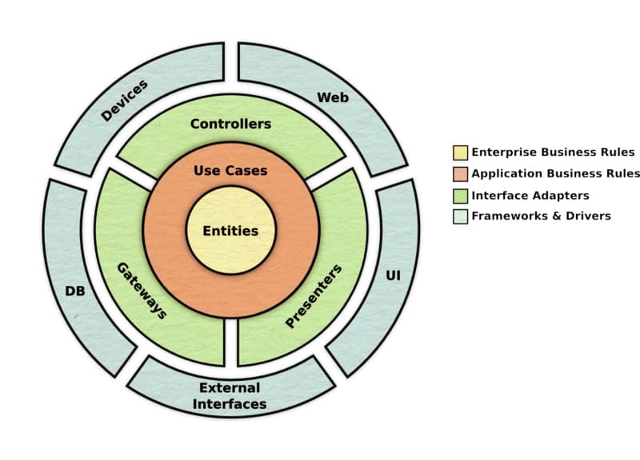

# La Clean Architecture en pratique : entités, cas d'usage et couches

## L'idée centrale

L'idée qui a changé ma façon de construire : votre architecture ne devrait pas se soucier de la base de données. Ni du framework web. Ni de l'UI. Seulement de ce que l'app *fait réellement*.

C'est la **Clean Architecture**. Les **cas d'utilisation** — la vraie valeur métier — au cœur du système. Le reste n'est qu'un détail. Résultat : testable, maintenable, indépendant de la plomberie technique.

---

# À quoi ressemble la Clean Architecture en théorie

La Clean Architecture repose entièrement sur la création de couches indépendantes gouvernées par un ensemble strict de règles sur la façon dont elles peuvent interagir. Imaginez une série de cercles concentriques.

1. **Entités** : Au cœur même. Ce sont vos règles métier à l'échelle de l'entreprise. La logique pure et intacte qui définit votre business.
2. **Cas d'utilisation** : Cette couche entoure les entités. Elle contient les règles métier spécifiques à l'application. Elle orchestre le flux de données vers et depuis les entités pour atteindre un objectif précis (par exemple, "Inscrire un Utilisateur" ou "Traiter un Paiement").
3. **Adaptateurs d'interface** : C'est la couche de traduction. Elle prend les données du format le plus pratique pour les cas d'utilisation et les entités et les convertit dans le format le plus pratique pour le monde extérieur (comme une base de données ou le web).
4. **Frameworks et Pilotes** : La couche la plus externe. C'est là que vivent tous les détails : le framework web, la base de données, l'UI, etc. Ce sont les éléments les plus susceptibles de changer.

La règle d'or est la **Règle de Dépendance** : toutes les dépendances doivent pointer vers l'intérieur. Votre UI peut dépendre de vos cas d'utilisation, mais vos cas d'utilisation ne savent *rien* de l'UI. Votre logique métier est la reine, et elle n'est jamais, jamais détrônée par un détail technique.



---

# Clean Architecture vs Architecture Hexagonale

Alors, comment cela se compare-t-il à l'Architecture Hexagonale dont nous venons de parler ?

Elles sont construites sur exactement la même philosophie : **protéger la logique métier**. Je vois la Clean Architecture comme une version plus spécifique et opiniâtre de l'Architecture Hexagonale.

- L'Architecture Hexagonale vous donne le "quoi" : séparer votre app en un "intérieur" (domaine) et un "extérieur" (infrastructure) via des ports et des adapters.
- La Clean Architecture vous donne un "comment" plus détaillé : elle définit explicitement des couches *à l'intérieur* de la partie "intérieur" (Entités et Cas d'utilisation) et fournit des règles plus strictes régissant leurs interactions.

Voyez-le ainsi : l'Architecture Hexagonale a dessiné la carte. La Clean Architecture a ajouté les autoroutes et les panneaux de signalisation. Elle rend le chemin plus clair.

---

# Construisons-le : un exemple complet

La théorie c'est bien, mais le code c'est mieux. Construisons une petite partie d'une application de gestion hôtelière. L'objectif est de mettre à jour les prix des chambres en fonction d'un prix de base et d'un ensemble de règles métier (par exemple, différents étages ont différents multiplicateurs de prix).

## Notre structure de fichiers

D'abord, regardons la structure du projet. C'est ce que Robert C. Martin appelle une "Screaming Architecture" (architecture qui crie), une structure où vos dossiers crient ce que l'application *fait*, pas quels frameworks elle utilise. Vous voyez `business`, `use-cases` et `entity`. Vous ne voyez pas `models`, `views` et `controllers` au premier niveau.

```sh
src/
├── business/
│   ├── entity/
│   │   └── floor.ts
│   │   └── room.ts
│   ├── gateway/
│   │   └── room.gateway.ts
│   ├── use-cases/
│   │   └── update-room-price.ts
├── container/
│   └── container.ts
├── controller/
│   ├── gateway/
│   │   └── room.repository.ts
│   ├── presenter/
│   │   └── room-presenter.json.ts
│   └── room.controller.ts
└── tests/
    └── update-price.test.ts
```

- `business/` : C'est le cœur de notre application. Toute la logique métier pure vit ici. Elle n'a aucune dépendance vers le monde extérieur.
- `controller/` : C'est notre couche d'adaptateurs d'interface. Elle gère les détails compliqués de la communication avec le monde extérieur (comme l'implémentation des gateways et des presenters).
- `container/` : C'est notre usine d'assemblage. C'est là que nous câblons tout ensemble grâce à l'injection de dépendances.
- `tests/` : Les tests qui prouvent que notre logique métier fonctionne.

---

## 1. Les entités : `Floor` & `Room`

Les entités ne sont pas de simples conteneurs de données stupides. Elles incarnent les règles métier les plus fondamentales — la logique qui reste vraie pour toute l'entreprise, quel que soit l'application spécifique qui l'utilise.

```ts
// business/entity/floor.ts
export class Floor {
    constructor(public floor: number) {}

    // Ceci est une règle métier centrale.
    getFactor() {
        if (this.floor === 1) return 1.07;
        if (this.floor === 2) return 1.22;
        if (this.floor === 3) return 1.33;
        return 1;
    }
}
```

```ts
// business/entity/room.ts
import { Floor } from "./floor";

export class Room {
    public floor: Floor;
    constructor(
        floorNumber: number,
        public number: number,
        public price: number,
    ) {
        this.floor = new Floor(floorNumber);
    }

    // Une autre règle métier centrale.
    setPrice(basePrice: number) {
        const calculatedPrice = basePrice * this.floor.getFactor();
        this.price = Math.min(Number(calculatedPrice.toFixed(2)), 200);
    }
}
```

**Pourquoi mettre la logique ici ?** Parce que la règle selon laquelle "le prix d'une chambre dépend de son étage" est une vérité fondamentale de notre activité hôtelière. En la plaçant dans l'entité, nous garantissons que cette règle est toujours appliquée, partout. Elle est encapsulée, réutilisable, et suit le principe de responsabilité unique.

---

## 2. La gateway : `RoomGateway`

La gateway est une interface, un contrat défini par la couche métier qui dit : "J'ai besoin d'effectuer ces actions avec les chambres, mais je me fiche de *comment* vous les faites." C'est une promesse que les couches externes doivent tenir.

```ts
// business/gateway/room.gateway.ts
export interface RoomDTO {
    floor: number;
    number: number;
    price: number;
}

// Ceci est le contrat.
export interface RoomGateway {
    updateRoomPrice(roomNumber: number, newPrice: number): Promise<void>;
    getRooms(): Promise<Array<RoomDTO>>;
}
```

Cette interface vit dans la couche `business`, garantissant que la dépendance pointe vers l'intérieur. Les cas d'utilisation dépendront de cette abstraction, pas d'une classe de base de données concrète.

---

## 3. Le cas d'utilisation : `UpdateRoomPrice`

Le cas d'utilisation est la star du spectacle. Il représente une action unique et spécifique que l'application peut effectuer. Il orchestre les entités et utilise les gateways pour communiquer avec le monde extérieur.

```ts
// business/use-cases/update-room-price.ts
import { Room } from "../entity/room";
import { RoomGateway } from "../gateway/room.gateway";

// Un autre contrat : comment le cas d'utilisation rapporte ses résultats.
export interface Presenter {
    set: (rooms: Array<Room>) => void;
}

// Le cas d'utilisation lui-même.
export type UpdateRoomPrice = (basePrice: number, presenter: Presenter) => Promise<void>;

// Une factory pour créer le cas d'utilisation et injecter ses dépendances.
export const updateRoomPriceFactory = (repository: RoomGateway) => {
    return async (basePrice: number, presenter: Presenter) => {
        if (basePrice < 0) {
            throw new Error("Le montant ne peut pas être négatif");
        }
        const roomsDto = await repository.getRooms();
        const rooms = roomsDto.map((r) => new Room(r.floor, r.number, r.price));

        for (const room of rooms) {
            room.setPrice(basePrice); // Utiliser la logique métier de l'entité.
            await repository.updateRoomPrice(room.number, room.price);
        }

        const updatedRooms = (await repository.getRooms()).map(
            (r) => new Room(r.floor, r.number, r.price)
        );
        
        // Transmettre les résultats au presenter.
        presenter.set(updatedRooms);
    };
};
```

Ce code est de la logique métier pure. Il récupère les chambres, les parcourt, demande à chaque chambre de mettre à jour son prix (en utilisant la méthode `setPrice` de l'entité), puis les sauvegarde. Il ne sait rien des bases de données, de HTTP, ou du JSON. Il ne parle qu'à des abstractions (`RoomGateway`, `Presenter`).

---

## 4. L'implémentation de la gateway : `RoomRepository`

Nous passons maintenant aux couches externes. Le `RoomRepository` est notre implémentation concrète de l'interface `RoomGateway`. C'est là que vit le code de base de données réel. Pour cet exemple, j'utilise juste un tableau en mémoire, mais c'est là que votre code `Prisma`, `TypeORM`, ou `node-postgres` irait.

```ts
// controller/gateway/room.repository.ts
import { RoomDTO, RoomGateway } from "../../business/gateway/room.gateway";

export class RoomRepository implements RoomGateway {
    constructor(private rooms: Array<RoomDTO>) {}

    async updateRoomPrice(roomNumber: number, newPrice: number): Promise<void> {
        const room = this.rooms.find((room) => room.number === roomNumber);
        if (!room) {
            throw new Error(`Impossible de trouver la chambre ${roomNumber}`);
        }
        room.price = newPrice;
        return Promise.resolve();
    }

    async getRooms(): Promise<Array<RoomDTO>> {
        return Promise.resolve(this.rooms);
    }
}
```

Cette classe tient la promesse faite par l'interface `RoomGateway`.

---

## 5. L'implémentation du presenter : `RoomPresenterJson`

Le travail du presenter est de prendre les objets entités purs du cas d'utilisation et de les traduire dans un format pour le monde extérieur. Ici, nous les formatons en simples objets JSON.

```ts
// controller/presenter/room-presenter.json.ts
import { Room } from "../../business/entity/room";

export class RoomPresenterJson {
    private r: Array<Room> = [];

    // Le cas d'utilisation appelle cette méthode.
    set(rooms: Array<Room>) {
        this.r = rooms;
    }

    // Le contrôleur appelle cette méthode pour obtenir la sortie finale.
    format() {
        return this.r.map((r) => ({
            floor: r.floor.floor,
            price: r.price,
            number: r.number,
        }));
    }
}
```

Cela crée une belle séparation. Le cas d'utilisation ne connaît pas le JSON. Le contrôleur ne connaît pas les entités `Room`. Le presenter est le pont.

---

## 6. Le contrôleur : `RoomController`

Le contrôleur est le point d'entrée depuis le web. Son seul travail est de parser les requêtes entrantes, d'appeler le bon cas d'utilisation, et de retourner la réponse formatée. C'est une couche fine et simple.

```ts
// controller/room.controller.ts
import { Request, Response } from "express";
import { createContainer } from "../container/container";
import { RoomPresenterJson } from "./presenter/room-presenter.json";

const express = require("express");
const app = express();

const container = createContainer();

app.put("/rooms", async (req: Request, res: Response) => {
    // 1. Créer un nouveau presenter pour cette requête.
    const roomPresenterJson = new RoomPresenterJson();
    // 2. Récupérer le cas d'utilisation depuis notre container et l'exécuter.
    await container.UpdateRoomPrice(200, roomPresenterJson);
    // 3. Envoyer le résultat formaté depuis le presenter.
    res.send(roomPresenterJson.format());
});

app.listen(3000, () => console.log("Serveur démarré sur http://localhost:3000"));
```

Regardez comme c'est propre. Le contrôleur orchestre le flux mais ne contient aucune logique métier.

---

## 7. Le container de dépendances

C'est là que tout se rejoint. Le container est l'unique endroit où nous construisons nos objets et injectons leurs dépendances. C'est l'Inversion de Contrôle en action.

```ts
// container/container.ts
import { UpdateRoomPrice, updateRoomPriceFactory } from "../business/use-cases/update-room-price";
import { RoomRepository } from "../controller/gateway/room.repository";

interface Container {
    UpdateRoomPrice: UpdateRoomPrice;
}

export const createContainer = (): Container => {
    return {
        // Créer le cas d'utilisation, en injectant le repository concret.
        UpdateRoomPrice: updateRoomPriceFactory(
            new RoomRepository([
                // Données initiales pour notre repo en mémoire.
                { floor: 0, number: 1, price: 0 },
                { floor: 1, number: 2, price: 0 },
                { floor: 2, number: 3, price: 0 },
                { floor: 3, number: 4, price: 0 },
            ])
        ),
    };
};
```

---

## 8. Le test : là où tout se rentabilise

Et maintenant, la meilleure partie : regardez comme il est facile de tester notre logique métier centrale.

```ts
// tests/update-price.test.ts
import assert from "assert";
import { describe, test } from "mocha";
import { createContainer } from "../container/container";
import { RoomPresenterJson } from "../controller/presenter/room-presenter.json";

describe("Mise à jour du prix des chambres", () => {
    test("Met à jour tous les prix des chambres avec un prix de base de 100", async () => {
        // Étant donné
        const container = createContainer();
        const presenter = new RoomPresenterJson();

        // Quand nous exécutons le cas d'utilisation
        await container.UpdateRoomPrice(100, presenter);

        // Alors nous vérifions la sortie du presenter
        const value = presenter.format();
        assert.deepStrictEqual(value, [
            { number: 1, price: 100, floor: 0 }, // 100 * 1
            { number: 2, price: 107, floor: 1 }, // 100 * 1.07
            { number: 3, price: 122, floor: 2 }, // 100 * 1.22
            { number: 4, price: 133, floor: 3 }, // 100 * 1.33
        ]);
    });
});
```

Ce test est ultra-rapide. Il s'exécute en mémoire. Il n'a besoin ni de base de données ni de serveur web. Il teste notre processus métier de bout en bout, prouvant que notre logique est correcte, tout cela parce que nous avons si soigneusement séparé nos préoccupations. C'est la récompense.

---

# Conclusion : construire pour le métier, pas pour la tech

La leçon derrière la Clean Architecture est simple mais profonde : **mettez votre logique métier en premier.**

Les frameworks changeront. Les bases de données seront remplacées. Les interfaces utilisateur seront redessinées. Mais vos règles métier centrales sont ce qui apporte une valeur durable. La Clean Architecture n'est pas qu'un pattern ; c'est une philosophie qui vous force à protéger cette valeur.

Elle demande de la discipline et un peu plus de réflexion en amont, mais la récompense est un système testable, maintenable, flexible et compréhensible — un système qui peut évoluer *avec* le métier, pas le freiner.

Maintenant, allez construire quelque chose de génial. 🚀
