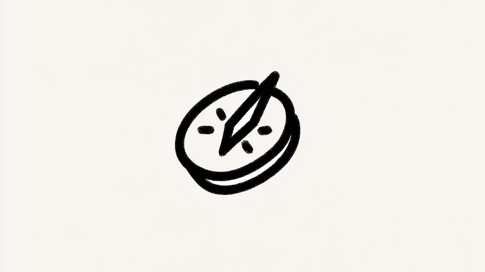

# **Abundant intelligence: a guide to the revolution**

Artificial intelligence is reshaping our lives, from our jobs to our daily routines. As someone who works with this technology every day, I've witnessed its explosive growth and transformative power. This article offers a **clear message** about what's unfolding and a **practical guide** to help you prepare.

---

### **Explore the series**

1. [**Abundant intelligence: a guide to the revolution**](https://medium.com/a-42-journey/navigating-the-ai-revolution-b6694c373ede)
   _Understanding the exponential shift and what it means for your future._

2. [**Abundant intelligence: a practical playbook**](https://medium.com/a-42-journey/applied-intelligence-in-your-life-d904924b8c99)
   _A practical guide to using AI tools, adapting your mindset, and thriving in the age of automation._

3. [**Abundant intelligence: when execution collapses**](https://medium.com/a-42-journey/ai-architects-of-inversion-the-collapse-of-execution-5edb32e81920)
   _Exploring how AI is reshaping value, collapsing execution costs, and shifting human worth to ideas and direction._

4. [**Abundant intelligence: life after the collapse**](https://medium.com/a-42-journey/ai-architects-of-inversion-the-world-that-follows-94f05eb9df14)
   _A deep dive into how abundant intelligence transforms work, society, space, and the shape of civilization._

---

## A radical truth

Here's a straightforward truth: AI will impact your job. Whether you're a programmer, designer, product manager, lawyer, or salesperson, no profession is immune. **Any job done at a desk is set for deep and rapid change.**

What was once simple may fade away, what is now challenging will become manageable, and what seems impossible today will soon be within reach. To stay relevant, you'll need more than existing skills; you'll need a commitment to constant improvement and fundamental adaptability. Excellence will be the new baseline.

This isn't meant to alarm you. It's a reminder that **your professional future depends on how well you adapt** and grow in a world where intelligence itself is rapidly becoming a commodity.

## Exponential growth

Humans think in straight lines, but technology advances exponentially. Consider the arc of innovation:

- Early human progress was extremely slow. Breakthroughs like the wheel, agriculture, and writing took centuries to take hold and refine.
- The Industrial Revolution dramatically quickened the pace with the steam engine and electricity, a momentum that accelerated further with the internet and smartphones.
- Now, with AI, we're witnessing evolution at an unheard-of speed. Decades of incremental progress are being compressed into months. AI capabilities in tools like ChatGPT evolve meaningfully on a monthly, sometimes weekly, basis.

Soon, we will see this acceleration everywhere: scientific discoveries breaking through in waves, useful tools launching daily, and entire businesses spinning up in weeks. This is the nature of exponential growth, not just change, but an ever-increasing rate of change that touches every corner of our lives.

In such a world, **adaptability is your new superpower**. Your deep skills still provide leverage, but now _everyone_ has access to genius-level AI assistance. The edge goes to those who use it better, who ask sharper questions and swiftly turn answers into action.

## Where AI stands today

AI models from OpenAI, Google, and others have already achieved remarkable expertise in several areas. Think of these advances as a stack of _layers_, strengthening any lower layer instantly boosts everything above it, making each breakthrough cascade upward.

**What AI already does well:**

- **Learning**: Modern AIs synthesize vast amounts of information in all domains: history, science, culture, and technology, continually refining their understanding.
- **Speaking**: AI-generated content now matches the quality of skilled human writers, producing articles, emails, and reports that consistently approach professional standards.
- **Reasoning**: Advanced models reason logically, solve complex problems, and reflect critically on their own responses.

The flaws we see today, limited context, forgetfulness, lack of cultural nuance, are the worst AI will ever be. These aren't signs of failure; they're early signals of massive change ahead. Early iPhone developers built simple, rough apps but learned the platform early. When it exploded, they were ready. Do the same with AI.

**Start now. Learn as the technology evolves. Position yourself to benefit as it improves.**

**What AI still struggles with:**

- **Planning**: AI handles well-defined problems but struggles with long-term, multi-step strategies requiring foresight and flexibility, adapting to new information, prioritizing competing goals, and anticipating obstacles.
- **Physical interaction**: Limited mostly to text, AI interfaces can't read body language, sense emotional tone, or grasp **unspoken context** the way humans do.
- **Real-world learning**: AI remains confined to virtual environments, lacking the physical experience needed for true autonomous improvement.

These limitations explain why billions of dollars are flowing into richer interfaces, voice companions that feel natural, wearables that see what you see, robots that bridge digital and physical worlds. The rollout will arrive in waves. Use this window to experiment and help shape what comes next.

**Your value now lies in communicating and collaborating effectively with AI**, guiding these tools with clarity and combining your intuition with their computational strengths.

## New opportunities

AI brings immense opportunities for growth, innovation, and new kinds of work. Technological revolutions have always replaced mundane labor with more sophisticated roles.

Where hundreds of farmers once worked by hand, a few operators now manage vast fields with advanced machinery. AI follows the same pattern, enabling small teams to achieve tremendous results while pushing human work up the value chain: away from repetitive execution, toward creative thinking, strategic oversight, and problem-solving.

We will increasingly **oversee**, **strategize**, and **innovate** rather than simply execute. Success belongs to those who embrace AI as a lever to elevate their work.

Consider a software development team: instead of developers spending days fixing bugs, updating dependencies, or writing boilerplate code, AI tools automatically scan codebases, suggest precise fixes, generate unit tests, and even draft entire modules based on specifications. This enables developers to focus on what matters most, solving novel problems, designing creative solutions, and architecting robust systems. Work that truly draws on human **ingenuity**, **collaboration**, and **vision**.

## Investing in yourself

Successfully navigating this landscape requires investment, primarily in yourself. You must break old habits, shift your mindset, and redefine your value. Writing impeccable code or memorizing documentation no longer sets you apart. Your worth now lies in strategic insight, vision, and the **ability to orchestrate solutions**.

At first, adopting new tools will feel disruptive, even counterproductive. This short-term discomfort is the price of long-term relevance.

But this transition is a powerful opportunity. Embracing it will amplify your skills, open new doors, and give you a decisive advantage.

## Redefining work

We are entering an era where technical proficiency alone is no longer enough. The critical question is shifting from "How well can you operate a tool?" to **"What can you create, solve, or strategically envision with it?"**

As AI handles more cognitive tasks, human fulfillment may increasingly flow from **tangible, hands-on, and deeply creative work**. This change is not just professional realignment, it's an opportunity to rediscover what makes work meaningful.

---

We are at a pivotal moment. The AI revolution is unfolding now, at exponential pace. Embracing it requires a shift in mindset, from viewing AI as a threat to seeing it as a powerful collaborator.

By investing in adaptability, focusing on uniquely human skills like strategy and creativity, and learning to work alongside these systems, we can not only navigate this landscape but shape it.

The future of work is not about replacement. It's about redefinition.

**The journey starts now.**

---

### **Explore the series**

1. [**Abundant intelligence: a guide to the revolution**](https://medium.com/a-42-journey/navigating-the-ai-revolution-b6694c373ede)
   _Understanding the exponential shift and what it means for your future._

2. [**Abundant intelligence: a practical playbook**](https://medium.com/a-42-journey/applied-intelligence-in-your-life-d904924b8c99)
   _A practical guide to using AI tools, adapting your mindset, and thriving in the age of automation._

3. [**Abundant intelligence: when execution collapses**](https://medium.com/a-42-journey/ai-architects-of-inversion-the-collapse-of-execution-5edb32e81920)
   _Exploring how AI is reshaping value, collapsing execution costs, and shifting human worth to ideas and direction._

4. [**Abundant intelligence: life after the collapse**](https://medium.com/a-42-journey/ai-architects-of-inversion-the-world-that-follows-94f05eb9df14)
   _A deep dive into how abundant intelligence transforms work, society, space, and the shape of civilization._
