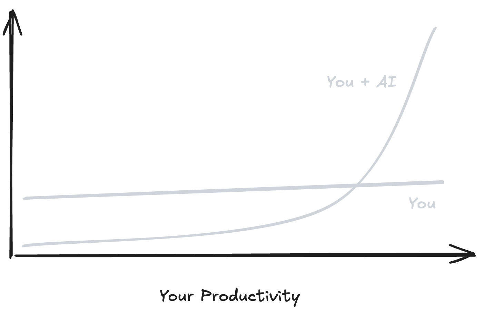

# **A guide to the AI revolution**

_You grew up in a world where being smart and capable was an edge. That edge is disappearing faster than most people realize._

**Your moat is melting.**

For your entire life, the professional game was simple and stable: learn hard things, become the person who can do the work, trade that capability for money, status, and security. Intelligence was scarce. Competence was leverage. Expertise was your defensive position.

AI just changed the rules.

Writing, analysis, research, coding, design, planning—anything that looks like "take information in, process it, produce output" is being eaten by software that costs almost nothing to run. The baseline work can be done by anyone now.

So the question shifts from "Can you do the work?" to **"What's worth doing at all?"**

If you don't have a good answer to that, you're in trouble.

---

# **Look at what you actually do for money**

Stop reading for a second. Look at your calendar. Your job description. The tasks you completed this week.

How much of what you do is turning messy information into clean documents? Summarizing research into slides? Writing emails, specs, code? Analyzing data and recommending next steps? Drafting designs, content, strategies?

That entire layer of work is being industrialized right now, while you're reading this.

AI is becoming the cheapest, fastest way to do knowledge work—what once required years of education and commanded high salaries now costs less than your morning coffee. You don't hire experts for most execution anymore. You rent capability on demand.

This isn't about AI being impressively "smart" or passing some benchmark test. **This is about intelligence itself becoming infrastructure**, like electricity or cloud storage. Abundant, cheap, always available, assumed in every system.

The pace is what makes this different. Printing presses took centuries to transform society, electricity took about a century—AI delivers meaningful capability jumps every few months, sometimes every few weeks.

Your degree, your experience, your specialized skills were all built for a world where intelligence was scarce and changed slowly. That world is gone. It ended while you were busy getting good at your job.

**If your primary value proposition is "I know things" or "I can execute these tasks well," you are standing on ground that's melting under your feet.**

So what do you build your career on instead?

---

# **The bottleneck moved and you didn't notice**

For most of human history, the hard part was doing.

Ideas? Cheap. Everyone has ideas. But execution was expensive, difficult, scarce. The bottleneck in any ambitious project was always the same: finding people who could actually ship. Build the bridge. Write the code. Draft the contract. Get it done.

AI is collapsing that bottleneck so fast it's hard to track.

Today, you can ship a simple functioning product without deep coding expertise. You can generate brand concepts without mastering professional design software. You can produce first-pass analysis on complex topics without being a domain expert. The gap between "I have this idea" and "I have a working prototype" is shrinking fast—not to zero, but far enough to change who can build things.

Execution is still necessary. Things still need to get made. But execution isn't scarce anymore, and scarcity is what creates value in markets.

**The new bottleneck, the new scarcity, is deciding what to execute and why.**

Think of professional work as three layers.

**Execution** at the bottom—writing the code, drafting the document, running the analysis. The hands-on work of producing output.

**Direction** in the middle—guiding execution toward useful outcomes. Reviewing, refining, coordinating.

**Judgment** at the top—deciding which problems are worth solving. Choosing what matters.

AI is devouring the bottom layer and flooding into the middle. What remains genuinely scarce is the top: judgment about what's worth doing in the first place.

This is the inversion that's reshaping every knowledge-based career:

From "Can you do this work?" to **"Should we do this work at all?"**

From "How fast can you ship?" to **"Are you shipping the right thing?"**

From "How much do you know?" to **"What do you notice that others miss?"**

If you don't deliberately move up this stack, you'll find yourself competing directly with systems that work for almost nothing. That's not a competition you can win by working harder.

---

# **What becomes valuable when intelligence is cheap**

When anyone can execute at high quality on demand, three things rise sharply in value.

## **What you notice**

AI analyzes what you ask it to analyze. It doesn't wonder. It doesn't get curious about the thing no one thought to check. It won't spot the problem you didn't know to ask about.

Your ability to notice what matters—before it's obvious—is your edge. The question no one else is asking. The pattern hiding in plain sight. The opportunity everyone walked past.

## **What you choose**

When execution is free, every choice about what to build becomes a statement about what you believe matters.

This is judgment and taste combined: knowing what's worth doing *and* recognizing quality when you see it. AI can generate a hundred options. Your value is picking the one that actually works—and knowing why.

## **Who trusts you**

AI can do the work. People hire you because they trust you'll make good calls with it.

Trust is built slowly, through consistent action over time. It can't be automated, can't be faked, can't be rented on demand. Your reputation—the track record of decisions you've made and promises you've kept—becomes your only real moat.

These aren't soft skills. These are the new hard skills—the only defensible sources of value when execution is a commodity.

---

# **The old game is over. Stop playing it.**

When people first encounter this shift, they tend to respond in one of two ways.

**Denial.** "My field is different. My work is special. AI can't handle what I do—it requires real understanding, creativity, human judgment."

Some of this is true. Some domains still need humans. But the boundaries of what AI can do expand faster than most people expect, and the risk is waking up to find your job description automated while you were busy defending why it couldn't happen.

**Grinding harder.** "I'll work harder than everyone else. Learn more. Be the absolute best executor. Out-hustle the change."

These people are racing against exponential curves—systems that don't sleep, don't tire, don't ask for raises, and improve every month. It's a losing strategy dressed up as work ethic.

You can't outwork a system that gets cheaper every month. You can't out-execute infinite supply. What you can do is start playing the new game before the old one ends completely.

The old game: memorize more than your peers, specialize deeper, prove you can handle every step without help, build your moat around being the one who knows how.

That game is over.

The new game: orchestrate rather than execute. Design workflows where AI handles the heavy lifting. Save yourself for insight, direction, relationships—the decisions that actually require you.

This isn't about becoming "an AI person." It's about not anchoring your identity to typing every word or writing every line of code yourself. It's about letting go of execution so you can focus on the work that still matters.

---

# **How to actually work with abundant intelligence**

This stops being abstract philosophy the moment you put AI directly into the loop of your real work.

Here's the simplest starting rule, the one that changes everything if you actually follow it:

**If a task can be expressed in words, try delegating it to AI first.**

Research. Drafting. Summarizing. Brainstorming. Outlining. Rewriting. Translating. Refactoring code. Testing scenarios. Almost everything knowledge-based has an AI-shaped entry point now.

The workflow that's emerging, the one that actually works in practice, has four clear steps.

**Frame the problem clearly.** The outcome you want, the constraints, the audience, the context. AI needs framing—your job is to provide it.

**Let AI generate the first messy version.** Don't judge on whether the first output is perfect. Judge on how fast you move from blank page to rough draft.

**Use your judgment to refine.** Keep what works. Cut what doesn't. Ask for variations. This is where you add value—your taste, your context.

**Decide what still needs you.** Difficult conversations. Critical decisions in gray areas. Emotional nuance. Ethics. These stay with you. Everything else? Delegate.

Over time, something shifts in how you think about work. You stop seeing AI as an occasional gadget you pull out when you're stuck. You start seeing it as **ambient capability**, like electricity or internet access. Always on. Always there. Assumed in every workflow, every decision, every project.

When you reach that point, when AI becomes infrastructure in your working life, the leverage becomes real and visible.

A solo creator producing like a small studio, a tiny team out-executing companies with hundreds of employees, ten ideas tested in the time it used to take to overthink one. The playing field isn't perfectly level, but it tilts hard toward people who figure out the leverage.

The only barrier is whether you build the habit now or wait until you're forced to scramble.

---

# **Redesign your value proposition**

If execution is no longer your primary edge, what becomes your edge?

You need to articulate your value in a way that fits this new world. Not "I can do X" but "I help people get results by combining my judgment with AI in ways they can't easily copy."

That reframe forces clarity. It pushes you to pick a domain you care about, develop real taste, and use AI for execution so you can focus on relationships and the decisions that actually matter.

Your reputation becomes about your judgment and taste, not your raw output volume.

You already know enough right now to start. Put AI into your daily work this week. Stop optimizing for being "the one who can do all the tasks personally." Start deliberately shifting your time toward the work that actually requires you.

The information isn't the bottleneck. Action is.

---

# **This is already your present, not your future**

This isn't a thought experiment about what might happen someday.

Right now, people in your field are learning to work with abundant intelligence. They're discovering new leverage and new ways of creating value. They're moving faster—not because they're smarter, but because they've accepted the new rules while others are still debating whether the game has changed.

You have a choice, and the window for making it thoughtfully is narrowing.

You can see AI as a threat to your expertise and spend the next decade defending shrinking territory.

Or you can see it as infrastructure—the foundation that finally lets you focus on judgment, direction, and taste. The work that can't be rented on demand.

**We're living through the shift from intelligence as rare resource to intelligence as cheap utility.** Everything built on scarcity will reorganize. Careers. Companies. Institutions. Your own idea of what makes a meaningful career.

You don't control whether this shift happens. What you control is whether you drift through it passively or use it deliberately to build a life that fits who you want to become.

The revolution isn't coming. You're already living in it.
