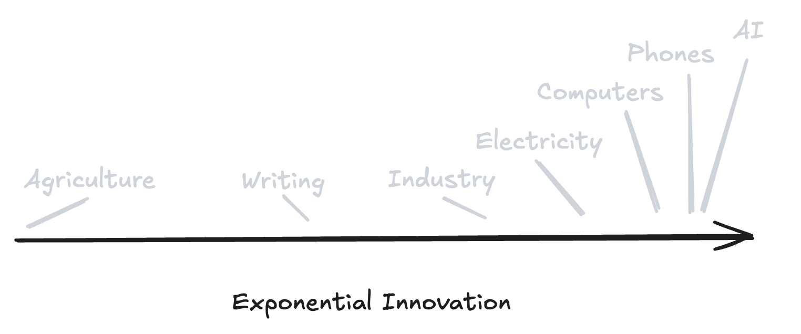
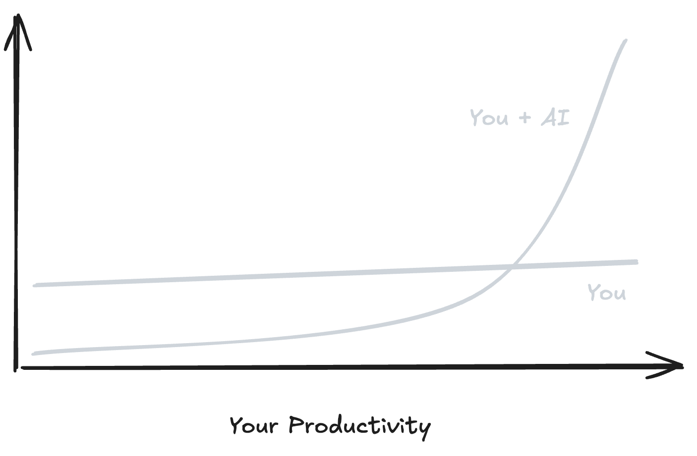

# **Un guide pour la révolution IA**

_Vous avez grandi dans un monde où être intelligent et capable était un avantage. Cet avantage disparaît plus vite que la plupart des gens ne le réalisent._

**Votre fossé protecteur fond.**

Toute votre vie, le jeu professionnel était simple et stable : apprenez des choses difficiles, devenez la personne qui peut faire le travail, échangez cette capacité contre de l'argent, du statut et de la sécurité. L'intelligence était rare. La compétence était un levier. L'expertise était votre position défensive.

L'IA vient de changer les règles complètement.

Tout ce qui ressemble à "prendre de l'information, la transformer, produire un résultat" est en train d'être dévoré par du logiciel tournant à un coût marginal proche de zéro. Écriture, analyse, recherche, code, design, planification stratégique, coordination, la plupart de ce que vous appelez actuellement "travail" passe d'une expertise humaine rare à une capacité numérique abondante.

La question n'est plus "Pouvez-vous faire le travail ?". Tout le monde peut faire le travail maintenant. L'IA peut faire le travail.

**La question est "Qu'est-ce qui vaut la peine d'être fait ?"**

Et si vous n'avez pas une bonne réponse à cela, vous avez des ennuis.

---

## **Explorez la série**

1. [**Intelligence abondante : un guide pour la révolution**](https://medium.com/a-42-journey/navigating-the-ai-revolution-b6694c373ede)
   _Comprendre le changement exponentiel et ce qu'il signifie pour votre futur._

2. [**Intelligence abondante : un manuel pratique**](https://medium.com/a-42-journey/applied-intelligence-in-your-life-d904924b8c99)
   _Un guide pratique pour utiliser les outils d'IA, adapter votre état d'esprit et prospérer à l'ère de l'automatisation._

3. [**Intelligence abondante : quand l'exécution s'effondre**](https://medium.com/a-42-journey/ai-architects-of-inversion-the-collapse-of-execution-5edb32e81920)
   _Explorer comment l'IA redéfinit la valeur, effondre les coûts d'exécution et déplace la valeur humaine vers les idées et la direction._

4. [**Intelligence abondante : la vie après l'effondrement**](https://medium.com/a-42-journey/ai-architects-of-inversion-the-world-that-follows-94f05eb9df14)
   _Une plongée profonde dans la façon dont l'intelligence abondante transforme le travail, la société, l'espace et la forme de la civilisation._

---

# **Regardez ce que vous faites réellement pour de l'argent**

Arrêtez de lire une seconde. Regardez votre calendrier. Votre description de poste. Les tâches que vous avez complétées cette semaine.

Combien de votre création de valeur consiste à transformer de l'information désordonnée en documents propres ? Synthétiser de la recherche en slides ou rapports ? Écrire des emails, spécifications, du code ? Analyser des données et recommander les prochaines étapes ? Rédiger des designs, du contenu, des stratégies, des plans ?

Toute cette couche de travail est en train d'être industrialisée en ce moment même, en temps réel, pendant que vous lisez ceci.

Les systèmes d'IA deviennent rapidement le moyen le moins cher, le plus rapide et le plus scalable d'effectuer du travail cognitif. Ce qui nécessitait autrefois des années d'éducation coûteuse et commandait de hauts salaires s'effondre en logiciel par abonnement et appels API qui coûtent moins que votre café du matin. Vous n'avez plus besoin de trouver et d'embaucher des experts rares pour la plupart des types d'exécution. Vous louez cette capacité à la demande, instantanément, à des prix de commodité.

Il ne s'agit pas de savoir si l'IA est impressionnamment "intelligente" ou si elle passe un test de référence. **Il s'agit de l'intelligence elle-même devenant une infrastructure**, comme l'électricité ou le stockage cloud. Abondante, bon marché, toujours disponible, supposée dans chaque système.

Le rythme est ce qui rend cela différent de tous les changements précédents.

L'imprimerie a mis des siècles à transformer fondamentalement la société. L'électricité a eu besoin d'environ un siècle pour remodeler complètement l'industrie et les villes. L'IA livre des sauts de capacité significatifs tous les quelques mois, parfois toutes les quelques semaines.

Votre diplôme, votre expérience professionnelle, votre pile de compétences spécialisées soigneusement construite, tout cela a été conçu pour un monde où l'intelligence était rare et changeait assez lentement pour que vous puissiez construire une carrière sur une expertise stable. Ce monde a disparu. Il s'est terminé pendant que vous étiez occupé à devenir bon à votre travail.

**Si votre proposition de valeur principale est "Je sais des choses" ou "Je peux bien exécuter ces tâches", vous vous tenez sur un sol qui fond sous vos pieds.**

Alors sur quoi construisez-vous votre carrière à la place ?

---

# **Le goulot d'étranglement a bougé et vous n'avez rien remarqué**

Pour la majeure partie de l'histoire humaine, à travers chaque domaine, la partie difficile était de faire.

Les idées étaient abondantes et bon marché. Tout le monde a des idées. L'exécution était chère, difficile et rare. Le goulot d'étranglement dans tout projet ambitieux était toujours le même : trouver des gens qui pouvaient réellement livrer la chose. Construire le pont. Écrire le code. Rédiger le contrat. Designer le produit. Faire le travail.

L'IA effondre ce goulot d'étranglement si vite qu'il est difficile de suivre.

Aujourd'hui, tout de suite, vous pouvez livrer un produit fonctionnel sans savoir coder. Vous pouvez designer une identité de marque complète sans jamais ouvrir un logiciel de design professionnel. Vous pouvez produire une analyse de niveau recherche sur des sujets complexes sans être un expert du domaine. L'écart entre "J'ai cette idée" et "J'ai cette chose" rétrécit vers zéro.

L'exécution est toujours nécessaire. Les choses doivent toujours être faites. Mais l'exécution n'est plus rare, et la rareté est ce qui crée de la valeur sur les marchés.

**Le nouveau goulot d'étranglement, la nouvelle rareté, est de décider quoi exécuter et pourquoi.**

Pensez au travail professionnel comme trois couches empilées les unes sur les autres.

En bas siège l'exécution brute. Écrire le code. Rédiger le document. Faire tourner l'analyse. Designer l'interface. Le travail cognitif mécanique de produire un résultat.

Au milieu siège la direction et le façonnage. Guider cette exécution vers des résultats utiles. Réviser, affiner, coordonner, gérer le travail.

Au sommet siège le jugement et le choix. Décider quels problèmes valent la peine d'être résolus. Définir la direction. Choisir ce qui compte et ce qui ne compte pas.

L'IA dévore la couche du bas complètement et inonde le milieu. Ce qui reste véritablement rare, ce qui nécessite encore des humains, est la couche du haut. Le jugement. La prise de décision sur ce qui vaut la peine d'être fait en premier lieu.

C'est l'inversion qui remodèle chaque carrière basée sur la connaissance :

De "Pouvez-vous faire ce travail ?" à **"Devrions-nous faire ce travail tout court ?"**

De "À quelle vitesse pouvez-vous livrer ?" à **"Choisissez-vous la bonne chose à livrer ?"**

De "Combien en savez-vous ?" à **"Que remarquez-vous que les autres manquent, et de quoi vous souciez-vous assez pour le poursuivre ?"**

Si vous ne bougez pas consciemment, délibérément vers le haut de cette pile, vous vous retrouverez en compétition directe avec des systèmes dont le coût marginal approche zéro. Ce n'est pas une compétition que vous pouvez gagner en travaillant plus dur ou en apprenant plus de compétences d'exécution.

---

# **Quatre choses qui deviennent précieuses quand l'intelligence est bon marché**

Quand l'intelligence devient abondante et bon marché, quand n'importe qui peut exécuter à haute qualité sur demande, quatre capacités spécifiques montent en flèche en valeur. Ce ne sont pas des soft skills. Ce sont les nouvelles hard skills.

## **Jugement**

Savoir ce qui vaut la peine d'être fait quand tout est techniquement possible.

Vous êtes celui qui décide quels projets comptent vraiment et lesquels sont juste du bruit. Quand "assez bon" est suffisant et quand l'excellence est requise. Où appliquer l'IA agressivement et où vous avez besoin de nuance humaine et de contexte. Quels compromis sont acceptables et lesquels ne le sont pas.

L'IA peut générer des options, proposer des approches, analyser des scénarios. Elle ne peut pas vous dire ce qui s'aligne avec vos objectifs réels, votre éthique, vos contraintes, votre vision. Seul vous pouvez prendre cette décision, et la prendre bien devient la chose la plus précieuse que vous faites.

## **Goût**

La capacité de reconnaître la qualité, l'adéquation et la résonance avant que ce soit évident pour tout le monde.

Dans un monde où l'IA peut générer une centaine de designs décents, cinquante stratégies plausibles, vingt brouillons lisibles en secondes, votre avantage est de choisir celui qui atterrit vraiment, qui résonne, qui marche dans votre contexte spécifique. Le goût n'est pas de la décoration ou du luxe. **C'est votre filtre sur l'abondance.** C'est ce qui vous permet de trouver le signal dans le bruit.

## **Direction**

Le courage et la clarté de dire "Nous allons là-bas, pour cette raison" et de s'y tenir.

L'IA peut vous aider à cartographier le terrain, analyser les options, simuler les résultats. Elle ne peut pas choisir votre destination. Elle ne peut pas vous dire ce que vous devriez vouloir ou ce qui vaut la peine d'être construit. Stratégie, vision, narration, but, cela reste du travail humain. Plus vos outils d'exécution deviennent capables, plus il devient dangereux d'aller vite sans un "pourquoi" clair.

## **Relations**

Confiance, réputation, et la capacité de faire bouger les gens vers des buts partagés.

Vos clients, collaborateurs et communautés ne vous choisiront pas parce que vous pouvez "faire le travail". L'IA peut faire le travail, et elle devient meilleure à ça chaque mois. Ils vous choisissent parce qu'ils **font confiance à votre jugement sur comment utiliser ces nouvelles capacités.** Parce qu'ils croient que vous prendrez de bonnes décisions avec le levier que vous avez. Parce que vous avez construit un capital social par une action cohérente dans le temps.

Ce ne sont pas des ajouts optionnels pour compléter vos compétences techniques. Ce sont les compétences centrales maintenant, les seules sources de valeur défendables dans un environnement où l'exécution elle-même devient une commodité.

Si votre plan de carrière, votre feuille de route d'apprentissage, votre développement professionnel n'inclut pas un investissement explicite et sérieux dans la construction de ces capacités, vous optimisez pour un monde qui n'existe plus.

---

# **Le vieux jeu est terminé. Arrêtez d'y jouer.**

Quand les gens rencontrent ce changement pour la première fois, ils ont tendance à répondre de l'une de deux manières.

**Déni.** "Mon domaine est différent. Mon travail est spécial. L'IA ne sera jamais capable de gérer ce que je fais car cela requiert une vraie compréhension, de la créativité, un jugement humain."

Ces gens vont au-devant d'un choc brutal. Ils se réveilleront un jour pour trouver leur description de poste, la chose qu'ils ont passé une décennie à maîtriser, dans une note de version de produit.

**Cravacher plus dur.** "Je vais juste travailler plus dur que tout le monde. Apprendre plus. Être le meilleur exécuteur absolu dans mon domaine. Dépasser le changement par l'effort."

Ces gens choisissent de faire la course contre des courbes exponentielles. Contre des systèmes qui ne dorment pas, ne fatiguent pas, ne demandent pas d'augmentations, et s'améliorent chaque mois. C'est une stratégie perdante déguisée en éthique de travail.

Vous ne pouvez pas surpasser par le travail l'effondrement exponentiel des coûts. Vous ne pouvez pas surpasser en exécution l'abondance de commodité. Ce que vous pouvez faire est de décider à quel point vous commencez tôt à jouer au nouveau jeu au lieu d'optimiser pour l'ancien.

L'ancien jeu était de mémoriser plus d'informations que vos pairs. Se spécialiser plus profondément dans un domaine technique étroit. Prouver que vous pouvez gérer personnellement chaque étape du travail sans aide. Construire votre forteresse autour du fait d'être celui qui sait comment faire la chose.

Ce jeu est terminé. Les compétences qu'il récompensait sont en train d'être commoditisées.

Le nouveau jeu est d'orchestrer plutôt que d'exécuter manuellement. Designer des systèmes et des workflows où l'IA gère le gros du travail cognitif. Réserver votre temps et votre énergie limités pour l'intuition, la direction, le travail relationnel, et les décisions de jugement qui requièrent vraiment votre présence.

Il ne s'agit pas de devenir "une personne IA" ou de changer radicalement votre identité professionnelle. Il s'agit de refuser d'ancrer cette identité au fait d'être celui qui tape personnellement chaque mot, écrit chaque ligne de code, crée chaque atout vous-même. Il s'agit de lâcher la couche d'exécution pour pouvoir vous concentrer sur les couches qui comptent encore.

---

# **Comment travailler réellement avec l'intelligence abondante**

Cela cesse d'être de la philosophie abstraite au moment où vous mettez l'IA directement dans la boucle de votre vrai travail.

Voici la règle de départ la plus simple, celle qui change tout si vous la suivez réellement :

**Si une tâche peut être exprimée en mots, essayez de la déléguer à l'IA d'abord.**

Recherche. Rédaction. Résumé. Brainstorming. Planification. Réécriture. Traduction. Refactoring de code. Test de scénarios. Presque tout ce qui est basé sur la connaissance a un point d'entrée en forme d'IA maintenant.

Le workflow qui émerge, celui qui marche vraiment en pratique, a quatre étapes claires.

**Cadrez le problème clairement.** Décrivez le résultat que vous voulez, les contraintes avec lesquelles vous travaillez, l'audience, le ton, le contexte qui compte. L'IA a besoin de cadrage. Votre job est de le fournir.

**Laissez l'IA générer la première version brouillonne.** Ne jugez pas l'outil sur la perfection de sa première sortie. Jugez-le sur la vitesse à laquelle il vous déplace de la page blanche au brouillon. La vitesse d'itération est l'avantage, pas la perfection au premier passage.

**Utilisez votre jugement et votre goût pour affiner.** Gardez ce qui marche. Coupez ce qui ne marche pas. Demandez des variations. Poussez vers la clarté et la qualité. C'est là que vous ajoutez de la valeur, là où votre goût spécifique et votre connaissance du contexte comptent.

**Décidez ce qui a encore besoin de vous personnellement.** Certaines choses requièrent encore une implication humaine directe. Conversations difficiles. Appels de jugement critiques dans des situations ambiguës. Nuance émotionnelle. Décisions éthiques. Cela reste humain. Tout le reste, envisagez de le déléguer.

Avec le temps, quelque chose change dans votre façon de penser le travail. Vous arrêtez de voir l'IA comme un gadget occasionnel que vous sortez quand vous êtes coincé. Vous commencez à la voir comme une **capacité ambiante**, comme l'électricité ou l'accès internet. Toujours allumée. Toujours là. Supposée dans chaque workflow, chaque décision, chaque projet.

Quand vous atteignez ce point, quand l'IA devient une infrastructure dans votre vie professionnelle, le levier devient réel et visible.

Un créateur solo peut livrer une production comme un petit studio. Une minuscule équipe peut surpasser en exécution des entreprises historiques avec des centaines d'employés. Vous pouvez tester dix idées différentes dans le temps qu'il vous fallait pour trop réfléchir à une seule. Le terrain de jeu ne devient pas parfaitement égal, mais il penche dramatiquement vers les gens qui comprennent comment bien utiliser le levier.

La seule barrière réelle est de savoir si vous construisez l'habitude maintenant, pendant qu'il est encore temps de s'adapter graduellement, ou si vous attendez jusqu'à ce que vous soyez forcé de vous adapter réactivement quand votre approche actuelle arrêtera de fonctionner.

---

# **Redesignez votre proposition de valeur**

Si l'exécution n'est plus votre avantage principal, si la chose pour laquelle vous avez été formé peut maintenant être faite instantanément par quiconque avec le bon prompt, quel devient votre avantage ?

Vous devez être capable d'articuler votre valeur d'une manière qui fait sens dans ce nouvel environnement. Quelque chose qui ressemble à ceci :

**"Ma valeur est d'aider [ce type spécifique de personne] à atteindre [ce résultat spécifique] en combinant [jugement et goût] avec [capacité IA] d'une manière qu'ils ne peuvent pas facilement répliquer."**

Cette formule force la clarté. Elle vous fait choisir.

Ce qui signifie choisir un domaine où vous vous souciez assez pour développer un contexte profond, un vrai jugement, un goût qui vient de l'attention portée sur la durée. Utiliser l'IA pour compresser et accélérer la couche d'exécution pour pouvoir passer plus de temps à voir les motifs, comprendre ce qui compte vraiment, construire des relations. Créer une réputation autour de votre jugement et de votre goût, pas juste votre volume de production brut.

Les prochains articles de cette série vont plus profond dans chaque couche de cette transformation. Comment construire réellement l'IA dans votre workflow pour que cela devienne une seconde nature. Comment la valeur, le statut et des institutions entières se réorganisent quand l'exécution s'effondre. Comment le travail, les villes, l'apprentissage et le sens lui-même changent quand l'intelligence devient infrastructure.

Mais vous n'avez pas à attendre ces articles pour commencer à agir.

Vous en savez déjà assez maintenant pour mettre l'IA dans votre travail quotidien cette semaine. Pour arrêter d'optimiser purement pour être "celui qui peut faire toutes les tâches personnellement". Pour commencer à déplacer délibérément votre temps et votre énergie vers le jugement, le goût, la direction et le travail relationnel.

L'information n'est pas le goulot d'étranglement. L'action l'est.

---

# **Ceci est déjà votre présent, pas votre futur**

Ce n'est pas une expérience de pensée sur ce qui pourrait arriver un jour.

En ce moment même, aujourd'hui, des gens dans votre domaine apprennent à travailler avec l'intelligence abondante. Ils découvrent de nouveaux leviers, de nouveaux modèles économiques, de nouvelles façons de créer de la valeur qui ne dépendent pas du labeur manuel à travers chaque pièce de travail d'exécution.

Ils bougent plus vite que vous. Apprennent plus vite. Construisent plus vite. Pas parce qu'ils sont plus intelligents, mais parce qu'ils ont accepté les nouvelles règles et commencé à jouer au nouveau jeu pendant que d'autres débattent encore si le jeu a vraiment changé.

Vous avez un choix à faire, et la fenêtre pour le faire de manière réfléchie se rétrécit.

Vous pouvez voir l'IA comme une compétition, comme une menace pour votre expertise et votre gagne-pain, et passer la prochaine décennie à défendre un territoire qui rétrécit pendant que votre proposition de valeur s'érode.

Ou vous pouvez la voir comme une infrastructure, comme la fondation qui vous laisse enfin vous concentrer sur le travail que seul vous pouvez faire, le jugement et la direction et le goût qui ne peuvent pas être loués à la demande.

**Nous vivons la transition de l'intelligence comme ressource rare à l'intelligence comme utilité bon marché et abondante.** Tout ce qui est construit sur la supposition de l'intelligence rare, tout ce qui est optimisé pour cette vieille réalité, va se réorganiser. Doit se réorganiser.

Carrières. Entreprises. Villes. Institutions. Systèmes éducatifs. Votre propre définition de ce qui fait une bonne vie et une carrière pleine de sens.

Vous ne contrôlez pas si ce changement arrive. Il arrive avec ou sans votre consentement. Ce que vous contrôlez est si vous dérivez à travers passivement, réagissant seulement quand vous y êtes forcé, ou si vous l'utilisez délibérément pour construire une vie et une carrière qui correspondent vraiment à qui vous voulez devenir.

La révolution n'arrive pas. Vous vivez déjà dedans. Vous vivez dedans depuis des mois, peut-être des années, sans pleinement reconnaître ce qui se passe.

La seule vraie question qui reste est ce que vous décidez de faire avec le levier qui est maintenant entre vos mains.

Commencez cette semaine. Pas un jour. Cette semaine.

---

## **Explorez la série**

1. [**Intelligence abondante : un guide pour la révolution**](https://medium.com/a-42-journey/navigating-the-ai-revolution-b6694c373ede)
   _Comprendre le changement exponentiel et ce qu'il signifie pour votre futur._

2. [**Intelligence abondante : un manuel pratique**](https://medium.com/a-42-journey/applied-intelligence-in-your-life-d904924b8c99)
   _Un guide pratique pour utiliser les outils d'IA, adapter votre état d'esprit et prospérer à l'ère de l'automatisation._

3. [**Intelligence abondante : quand l'exécution s'effondre**](https://medium.com/a-42-journey/ai-architects-of-inversion-the-collapse-of-execution-5edb32e81920)
   _Explorer comment l'IA redéfinit la valeur, effondre les coûts d'exécution et déplace la valeur humaine vers les idées et la direction._

4. [**Intelligence abondante : la vie après l'effondrement**](https://medium.com/a-42-journey/ai-architects-of-inversion-the-world-that-follows-94f05eb9df14)
   _Une plongée profonde dans la façon dont l'intelligence abondante transforme le travail, la société, l'espace et la forme de la civilisation._

