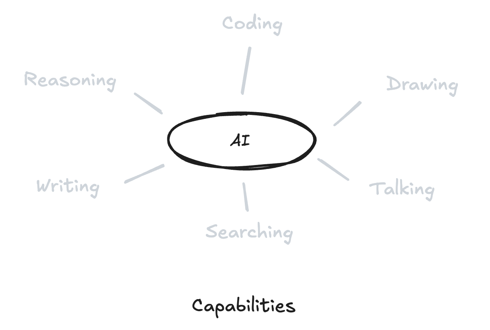

# **Abundant intelligence: a practical playbook**

_You already have more cognitive leverage than most executives commanded a decade ago. The gap between you and the people thriving in this shift isn't capability. It's whether you've made AI your default._

Most people are still treating AI like a novelty. A party trick. An interesting tool they'll "try out" when they have time.

That's not a strategy. That's denial with extra steps.

**If you're not building AI into your daily workflow right now, you're training for a sport that's already been canceled.** The game shifted from "Can you do this work?" to "How much can you accomplish with the leverage you now have?" and most people haven't noticed yet.

This is your playbook for making that shift before the gap becomes unbridgeable.

---

### **Explore the series**

1. [**Abundant intelligence: a guide to the revolution**](https://medium.com/a-42-journey/navigating-the-ai-revolution-b6694c373ede)
   _Understanding the exponential shift and what it means for your future._

2. [**Abundant intelligence: a practical playbook**](https://medium.com/a-42-journey/applied-intelligence-in-your-life-d904924b8c99)
   _A practical guide to using AI tools, adapting your mindset, and thriving in the age of automation._

3. [**Abundant intelligence: when execution collapses**](https://medium.com/a-42-journey/ai-architects-of-inversion-the-collapse-of-execution-5edb32e81920)
   _Exploring how AI is reshaping value, collapsing execution costs, and shifting human worth to ideas and direction._

4. [**Abundant intelligence: life after the collapse**](https://medium.com/a-42-journey/ai-architects-of-inversion-the-world-that-follows-94f05eb9df14)
   _A deep dive into how abundant intelligence transforms work, society, space, and the shape of civilization._

---

## **Stop thinking tool. Start thinking team.**

The fastest way to fall behind isn't refusing to use AI. It's using it wrong, treating it like a chatbot you consult occasionally when you're stuck rather than a permanent extension of your capabilities.

AI isn't a single tool you pick up and put down. **It's a full stack of on-demand capabilities** that used to require hiring multiple specialists.

Text generation that can write, edit, translate, rewrite, and summarize in any voice or style you need. Which means you should never be staring at a blank page wondering how to start. The first draft, however rough, arrives in seconds instead of hours.

Analysis that digests complex information, extracts patterns you'd miss, surfaces implications, proposes next steps. Which means you can get first-pass analysis on any problem in minutes, not the hours or days it would take to do manually, freeing you to focus on evaluating options rather than generating them.

Knowledge synthesis that connects ideas across domains, summarizes research, compares approaches, explains concepts at whatever depth you need. Which means you can learn faster than you ever could by reading alone, without drowning in open tabs and scattered notes.

Creative generation for images, audio, video, branding concepts, interface flows, iterating faster than any human team could. Quality still varies, but it's improving monthly, and even now it lets you explore dozens of creative directions before committing resources to one.

Here's the reframe that changes everything: stop thinking of yourself as a person who does all these things. Start thinking of yourself as someone who **directs a team** that includes a researcher, an analyst, a writer, an editor, a designer, and a strategic thinking partner.

They're not perfect. They make mistakes. They need clear direction. But they're fast, cheap, always available, and they never get tired or bored. Your job isn't to be all these roles anymore. Your job is to direct them effectively and use your judgment to choose what actually matters from what they produce.

---

## **Learn where it breaks or you'll break yourself**

If you don't understand AI's hard limits, you'll make one of two expensive mistakes: over-trusting it and shipping garbage, or underusing it and getting left behind by people who figured out the balance.

AI is powerful, but it has structural limitations that aren't going away anytime soon.

**No genuine strategy.** It doesn't own goals or feel consequences. It can't decide what game you're actually playing or whether the game itself is worth playing. It optimizes for whatever you tell it to optimize for, but it can't tell you if you're optimizing for the wrong thing.

**No embodied experience.** It has never walked through a space, felt the weight of an object, smelled smoke, navigated a chaotic job site, or experienced the thousand tiny physical inputs that inform human judgment about the real world. This matters more than you'd expect. Much of practical wisdom is embodied, and AI has no body.

**Thin communication bandwidth.** Most interaction is still text, maybe some images and audio. It can't read a room the way you can. It can't sense tension in a meeting, pick up on subtext in how someone's tone changed, or navigate office politics. The human context you absorb constantly through presence is invisible to it.

**Pattern matching without genuine understanding.** It can sound supremely confident while being completely, catastrophically wrong. It doesn't know what it doesn't know, and it won't tell you when it's guessing versus when it's certain.

**So what does this mean for how you actually use it?**

Your edge, your irreplaceable value, lives precisely in these gaps.

You own strategy. You decide what actually matters, what the real constraints are, which trade-offs you're willing to make and why. AI can help you think through options, but it can't tell you what you should want or what's worth pursuing.

You own judgment. You can feel when something's off, when an answer sounds too good to be true, when a recommendation doesn't match the messy reality you're working in. That intuition, built from experience AI doesn't have, is your filter on its output.

You own relationships. Trust, reputation, emotional nuance, long-term context with specific people and situations. AI can help you communicate better, but it can't build the social capital that makes people actually want to work with you.

The practical rule that makes all of this work: **use AI to massively expand your options, then use your judgment to choose.** Let it generate possibilities faster than you could alone. Then be the human who decides what's actually worth doing.

---

## **Make it the first stop, not the last resort**

The shift that separates people who are thriving from people who are falling behind isn't using AI occasionally. It's making AI **the default starting point** for anything that can be described in language.

Most people still default to doing everything themselves, then maybe asking AI for help if they get stuck. That's backward. You need to flip the default, and you need to do it now.

### **Delegation as reflex**

Train yourself to catch the moment you're about to start doing cognitive work manually and ask: "Is there any part of this I can hand to AI first?"

Not "Should I use AI for this entire task?" That's too high a bar and you'll default to no. But "Can AI handle the first pass, the rough draft, the initial analysis, the outline, the data gathering?" The answer is almost always yes.

Draft the first version of this email in a concise, direct tone that gets straight to the point. Turn this messy meeting transcript into a clean decision log with action items separated by owner. Given this code snippet, propose a refactor that improves clarity without changing behavior.

You're not outsourcing responsibility. You're outsourcing the blank page, the first draft, the mechanical work that takes time but doesn't require your specific judgment. You're still the one who reviews, refines, decides, and ships. You've just eliminated the part that wastes your time.

### **Context is everything**

AI is only as good as the frame you give it, and most people give it almost nothing to work with, then wonder why the output is generic and useless.

Flood it with context. Share who the work is for and what they care about. Explain the constraints and what's actually at stake. Paste examples of what "good" looks like in your specific situation. Clarify what you're optimizing for: speed, quality, originality, safety, something else entirely.

Think of yourself as a director working with actors. The more clearly you set up the scene, the constraints, the tone, the desired outcome, the better the performance you'll get. Vague prompts get vague results. Detailed context gets work you can actually use.

### **Iteration over perfection**

Don't judge AI on the first thing it produces. Judge it on how fast you can iterate toward something great.

The first output is rarely perfect, but it's fast and it's cheap, which means you can ask for three completely different approaches, test variations, request alternatives, all in the time it would have taken you to produce one mediocre draft manually.

This is too formal, make it warmer but keep it sharp. Give me three completely different directions for this section. Highlight anything that feels risky or ambiguous and suggest safer alternatives. Make this more concrete with specific examples.

Each iteration loop is cheap in time and money. Use that advantage. Explore paths in parallel instead of committing to one direction early because you're tired and just want to be done.

The moment you catch yourself grinding through busywork, pause and ask: **"What part of this can I turn into a prompt?"** That's the question that changes everything. Most of the friction in knowledge work can be described in language, which means AI can handle it, which means you shouldn't be.

---

## **Your identity needs to shift or you'll resist this**

If your self-worth is tied to "I personally wrote every word of this" or "I coded every line myself without help," this transition is going to feel threatening and wrong.

It doesn't have to.

You're not being replaced. Your role is being upgraded from executor to director, from doer to decider, and that upgrade makes you more valuable, not less.

### **From knowing to choosing**

For your entire career so far, being knowledgeable meant being valuable. Memorize information, recall it accurately, apply established procedures. That's what school rewarded. That's what many jobs still reward, even though the game has already changed underneath them.

That model is obsolete now and getting more obsolete every month.

AI can recall, cross-reference, and synthesize more information than you could memorize in ten lifetimes. When anyone can instantly access what you know, knowing things stops being the edge. **What becomes valuable is judgment about what to do with knowledge.**

Your value moves from having answers to framing better questions. From reciting information to spotting which answers are actually useful in your specific context. From following procedures to seeing second-order effects and unintended consequences the model can't anticipate because it doesn't understand your full situation.

### **From hours logged to outcomes created**

Hours worked is becoming a terrible, actively misleading signal of value, but most organizations and most people haven't internalized this yet.

What actually matters in a world of abundant execution capability is whether you chose the right problem to work on, whether you leveraged the available tools fully, and whether you produced an outcome that actually moved the needle.

You may find that your highest-impact days feel quiet. More thinking. More framing. More reviewing and deciding. Less frantic typing and visible busyness. That's not a bug. That's the point. The work has shifted from mechanical execution to strategic direction, and strategic direction often looks like less activity from the outside even though it creates more value.

### **From replication to creation**

AI is a master of patterns. It excels at producing more of what's been done before, at applying templates, at following established approaches. That's its strength and its limitation.

Your work shifts to the things AI struggles with. Combining ideas in ways the training data hasn't seen before. Bringing your specific taste, values, and lived experience to decisions. Creating things that should exist in the world rather than just copying what already does.

If you can let go of the need to be the sole executor, to personally do every step, you can finally focus on what only you can do: **decide what's worth making, curate what actually works, and create with clear intention rather than just producing output.**

---

## **Try a 30-day sprint to make this real**

Thinking about this abstractly, reading articles, nodding along, none of that changes your actual work or career. Using it changes everything.

For the next 30 days, make AI mandatory, not optional. Treat it as infrastructure you assume in every task, not a tool you consider using if you remember.

### **Week one: forced exposure**

The goal this week isn't efficiency or perfect results. It's exposure, breaking your default patterns.

List ten things you do regularly in your work. For each one, force yourself to run it through AI at least once this week, even if you don't end up using the output. Research. Drafting. Analysis. Brainstorming. Summarizing. Editing. Planning.

You're training your brain to see delegation opportunities it currently misses because you default to doing everything yourself.

### **Week two: reduce friction**

Pick the three to five workflows where AI provided real value last week. Research. Drafting. Analysis. Coding. Whatever actually helped.

Standardize your prompts for these tasks. Write them down. Turn them into reusable templates. Make using AI for these tasks the path of least resistance.

Start each day asking yourself: "Which parts of today's work am I handing to AI first?" Make it a planning habit, not an afterthought.

The goal is to make AI the default, the thing you have to consciously choose not to use rather than something you have to remember to use.

### **Week three: climb the stack**

Now that you've freed up time and attention by delegating execution, use it to zoom out and operate at a higher level.

What patterns are you noticing across projects? What are you learning about your work that you couldn't see when you were buried in execution details?

Ask AI to critique your own thinking. What blind spots might I have in this approach? What am I not considering? What could go wrong that I'm not seeing?

Start deliberately shifting your calendar. Fewer blocks for pure execution. More time for design, decision-making, relationship work, the things that actually require you.

The goal is to consciously move up the value stack, spending less time on work AI can handle and more time on work only you can do.

### **Week four: lock it in**

Decide which AI tools and workflows become permanent parts of your toolkit. Document your new processes so you can refine them over time, not reinvent them every week.

Set a personal rule and stick to it: "If I'm doing this manually twice and it could be delegated, I automate or delegate it the third time." No exceptions.

The goal is permanence. This stops being an experiment or a trial and becomes your new normal, the way you work from now on.

---

## **Your future self is already doing this**

Five years from now, some version of you treats AI the way you currently treat the internet. Obvious. Invisible. Assumed in everything.

That version of you moves faster with less effort. Says no to more noise and distraction because they can quickly test whether something's worth pursuing before committing. Spends more time on judgment, relationships, and meaning because the execution layer is handled.

The only difference between you now and that future version is how soon you start building these habits.

**Abundant intelligence isn't coming. It's here.** Not in theory. Not in some future roadmap. Right now, available to you today if you choose to use it.

You can treat it as a curiosity, an interesting development you'll pay attention to eventually, and hope your current skills stay valuable long enough.

Or you can treat it as infrastructure, the new foundation everything else is built on, and deliberately rebuild your working life around the massive leverage it gives you.

The tools are ready. The capability exists. The only open question is whether you'll use it to build a career that thrives in a world where execution is cheap and judgment is everything, or whether you'll keep optimizing for a game that's already over.

Start this week. Not someday. This week.

---

### **Explore the series**

1. [**Abundant intelligence: a guide to the revolution**](https://medium.com/a-42-journey/navigating-the-ai-revolution-b6694c373ede)
   _Understanding the exponential shift and what it means for your future._

2. [**Abundant intelligence: a practical playbook**](https://medium.com/a-42-journey/applied-intelligence-in-your-life-d904924b8c99)
   _A practical guide to using AI tools, adapting your mindset, and thriving in the age of automation._

3. [**Abundant intelligence: when execution collapses**](https://medium.com/a-42-journey/ai-architects-of-inversion-the-collapse-of-execution-5edb32e81920)
   _Exploring how AI is reshaping value, collapsing execution costs, and shifting human worth to ideas and direction._

4. [**Abundant intelligence: life after the collapse**](https://medium.com/a-42-journey/ai-architects-of-inversion-the-world-that-follows-94f05eb9df14)
   _A deep dive into how abundant intelligence transforms work, society, space, and the shape of civilization._
