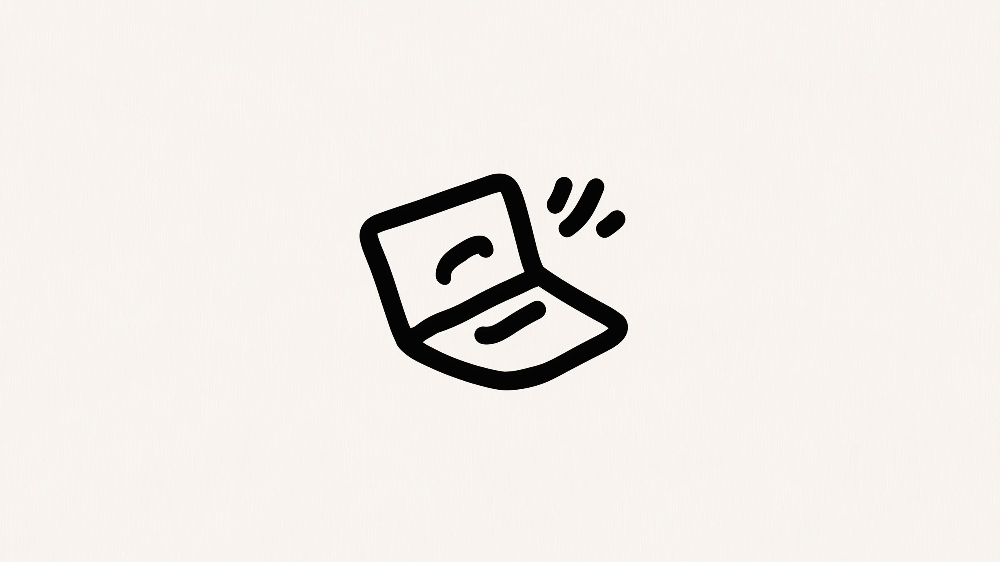
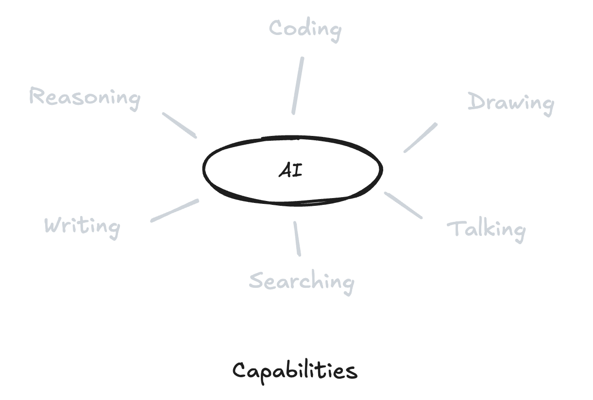
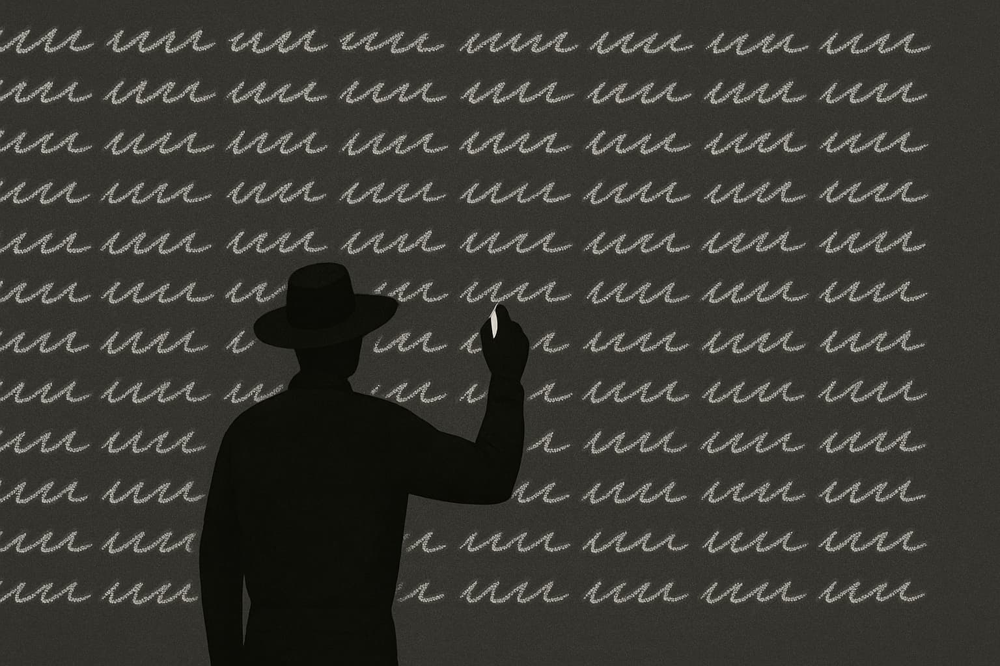
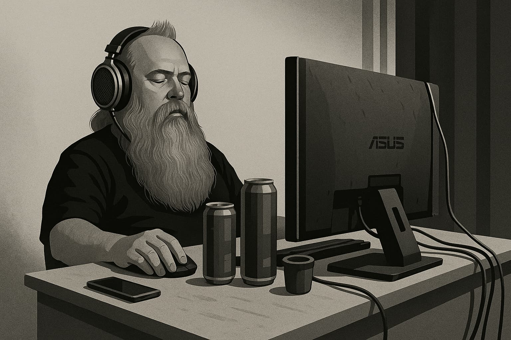

# **Intelligence abondante: un manuel pratique**

L'intelligence artificielle a quitté les pages de la science-fiction pour s'ancrer dans notre manière de vivre, de travailler et de penser. En tant que développeur, l'adaptation rapide aux avancées technologiques fait partie intégrante de mon métier. Des outils considérés à la pointe il y a cinq ans sont parfois déjà obsolètes. **Pourtant, une nouvelle réalité s'impose: cette mutation fulgurante ne se cantonne plus au monde des experts de la tech. Elle nous concerne tous.**

Chaque jour, de nouveaux outils dopés à l'IA voient le jour, révolutionnant le travail, la créativité et la productivité. Avec le bon état d'esprit et les bonnes stratégies, **chacun peut apprendre à maîtriser cette formidable vague d'innovation.**

Cet article explore **les implications concrètes de l'IA**: ce qu'elle peut accomplir, ses limites actuelles, comment en tirer parti et, plus important encore, **comment adopter un nouvel état d'esprit pour prospérer à l'ère de l'intelligence artificielle.**

Plongeons dans le vif du sujet.

## Déléguer le travail intellectuel

L'IA, dans son essence, a été conçue pour un objectif fondamental: automatiser le travail intellectuel. Historiquement, l'humanité a automatisé le labeur physique, l'agriculture, la production en usine, pour économiser son temps et ses efforts. Aujourd'hui, **nous entrons dans l'ère de l'automatisation intellectuelle: la délégation de tâches mentales à des logiciels intelligents.**

Quelle que soit votre profession, rédaction, recherche, design ou planification, l'IA peut désormais accomplir en quelques minutes ce qui vous prenait autrefois des heures.

La question clé est d'une simplicité désarmante: **" Quelles tâches puis-je déléguer? "**

De l'analyse d'une multitude de documents, d'images et de données à la rédaction de rapports d'activité détaillés, en passant par la synthèse de réunions ou même la création d'art numérique, les outils émergents transforment déjà le travail intellectuel. Vous gardez la supervision des décisions importantes et l'apport de votre vision humaine, mais les tâches simples, répétitives, analytiques ou créatives peuvent désormais être efficacement confiées à de puissants assistants IA.

**L'équation est gagnante: l'IA absorbe les tâches rébarbatives, vous libérant pour vous consacrer pleinement à la créativité et à la vision stratégique.**

## L'intelligence, une ressource à portée de main

Un changement fondamental sous-tend cette transformation: **l'intelligence elle-même est devenue une ressource que l'on peut littéralement acheter** (une bonne nouvelle pour certains d'entre nous, n'est-ce pas? 😂).

Des services comme OpenAI, DeepMind de Google, Eleven Labs et un nombre croissant de fournisseurs open-source offrent des capacités avancées via des plateformes en ligne. Que vous cherchiez de l'aide pour rédiger un article, analyser des données commerciales, générer de l'audio, des images, ou même pour un brainstorming, il existe probablement un outil d'IA taillé pour la mission. **Ces plateformes varient en coût, en vitesse et en spécialisation, si bien que choisir la bonne s'apparente à sélectionner l'instrument adéquat dans une boîte à outils.**

Ce nouvel écosystème est comme une place de marché pour talents numériques à portée de main, sauf qu'au lieu d'embaucher une personne, vous vous abonnez à des services cognitifs. **Et tout comme les humains, chaque IA a ses propres forces.** Certaines excellent dans la conversation et la synthèse, d'autres dans la création d'images ou l'analyse stratégique.

Apprendre quels modèles utiliser, et à quel moment, fait partie de la maîtrise de votre nouvelle équipe numérique. Mais rassurez-vous: pour commencer, il suffit d'essayer quelques outils, de comparer leurs résultats et de voir lesquels répondent le mieux à vos besoins.

## Une boîte à outils

Pour tirer le meilleur parti de l'IA, il est utile de voir ses capacités comme une boîte à outils, avec différents instruments pour différentes tâches. Que vous écriviez, analysiez, créiez ou exploriez, il existe sans doute un modèle conçu pour cela.

- **Texte**, L'IA excelle dans le maniement des mots. Elle peut rédiger des e-mails, des articles de blog et des récits, résumer de longs rapports, traduire des textes et même peaufiner votre écriture avec style et clarté.
- **Raisonnement**, Besoin d'une analyse rapide ou de suggestions stratégiques? L'IA peut vous aider à démêler des informations complexes et à proposer des pistes intelligentes. C'est comme avoir un analyste ultra-réactif toujours à disposition.
- **Un savoir quasi infini**, L'IA a lu plus que n'importe quel humain ne le pourra jamais: des livres, du code, des articles et des contenus culturels du monde entier. En quelques secondes, elle tisse des liens entre la science, l'art et l'histoire, offrant des réponses et une inspiration qui semblent presque surhumaines. Ce n'est pas seulement une question de vitesse, c'est l'accès à une profondeur de connaissance vertigineuse.
- **Créativité**, De la musique à l'art, en passant par le design et le brainstorming, l'IA est une véritable machine à idées neuves. Elle connecte des concepts issus de cultures et de disciplines variées pour inspirer des œuvres originales.

Points forts actuels: le **texte** est quasi parfait, les **images** et l'**audio** sont de très bonne qualité, et la **vidéo** est en pleine évolution.

N'oubliez pas: chaque outil est différent. Certains sont d'excellents généralistes, d'autres des spécialistes de niche. Le meilleur moyen d'apprendre est de les essayer: expérimentez, comparez les résultats et découvrez ce qui fonctionne le mieux pour vous.

Mais sachez une chose: si l'IA peut techniquement faire quelque chose aujourd'hui, il y a de fortes chances que les outils pour le rendre pratique et simple soient déjà en développement, ou le seront bientôt. **Nous sommes dans une phase où les capacités existent, mais les produits conviviaux peinent encore à suivre.** Ce qui semble aujourd'hui rudimentaire ou frustrant pourrait bien devenir la fonctionnalité révolutionnaire de demain.

## Idées reçues

On imagine souvent l'IA **froide et robotique**, mais la vérité est qu'elle se révèle souvent étonnamment chaleureuse et éloquente. Des études montrent même que des patients jugent les réponses générées par l'IA plus empathiques que celles de vrais médecins. Pourquoi? Parce que l'IA n'est jamais fatiguée, agacée ou impatiente. Elle répond toujours avec une attention calme et concentrée.

D'autres pensent que l'IA ne peut être **créative**, mais quiconque a utilisé un outil moderne sait qu'il peut générer des centaines d'idées, de titres ou de concepts visuels en quelques secondes. Demandez-lui d'écrire un poème ou de redécorer votre salon, et il vous proposera instantanément une douzaine d'approches inédites. Ce n'est pas seulement utile, c'est comme avoir un générateur d'idées à votre disposition, à la demande.

Beaucoup supposent que la créativité humaine est mystérieuse et nous est propre, mais est-ce vraiment le cas? Nous sommes façonnés par la génétique, la culture, l'éducation et le contexte. D'une certaine manière, nous sommes aussi des modèles: nous absorbons, remixons et itérons sur ce que nous avons vu. Comme le disait James Cameron: _"You're a model already."_ La question n'est donc pas de savoir si l'IA peut être créative, elle l'est déjà. La question plus profonde est: **qu'est-ce qui rend notre créativité si fondamentalement différente?** Et sommes-nous prêts à collaborer avec quelque chose qui en est le miroir?

Cela ne signifie pas pour autant qu'elle possède une compréhension profonde ou une conscience de ses actions. Les véritables limites se situent ailleurs: dans la manière dont elle interagit avec nous, dans la superficialité de son raisonnement logique et dans son manque de planification. Elle devine souvent juste, mais ne pense pas en profondeur. Elle répond vite, mais ne planifie pas. Impressionnante, certes, mais elle demeure un outil dont il faut connaître les frontières.

## Limites

Malgré toutes leurs forces, les modèles d'IA peinent encore dans des domaines clés:

- **Interfaces limitées**, La plupart des outils d'IA reposent encore sur l'échange de texte brut. C'est un goulot d'étranglement majeur. Imaginez devoir expliquer une idée de design, un ton de voix ou un processus complexe uniquement avec des mots: ce n'est pas naturel. Des interfaces plus intuitives, voix, gestes, images, entrées multimodales, commencent à peine à émerger. Tant qu'elles ne seront pas généralisées, notre capacité à collaborer fluidement avec l'IA restera restreinte. Et c'est précisément là que réside votre avantage: votre capacité à apporter une compréhension du monde réel, une nuance humaine et une flexibilité créative à cette collaboration. Pendant que l'IA attend des instructions plus claires, c'est vous qui apportez l'adaptabilité, l'empathie et le contexte qui confèrent aux résultats leur véritable signification.
- **Déduction logique**, Les modèles utilisent un raisonnement statistique basé sur des schémas linguistiques. Ils peuvent donc faillir sur des calculs mathématiques précis, des analyses logiques ou des chaînes de raisonnement complexes. Leur demander des calculs ou des pourcentages peut conduire à des réponses erronées.
- **Planification et vision**, L'IA manque généralement de pensée stratégique à long terme, d'adaptabilité aux imprévus et d'anticipation des incertitudes.
- **Compréhension du monde réel**, Ancrée dans le virtuel, elle est privée d'expériences physiques, ce qui lui ôte un contexte pratique essentiel. C'est comme un assistant intelligent confiné dans un ordinateur, limité par son absence d'interaction avec le monde physique.

Connaître ces lacunes est la clé pour utiliser l'IA à bon escient, en capitalisant sur ses forces tout en ajustant ses attentes.

## De la réplication à la création

Aujourd'hui, l'école récompense encore principalement la mémorisation et la capacité à restituer un contenu structuré. Le problème? **On vous demande souvent de satisfaire le professeur, pas de vraiment comprendre le monde ou de résoudre des problèmes réels.** Et cet état d'esprit perdure bien au-delà de l'école: il se retrouve dans de nombreuses entreprises où le succès se mesure au respect des règles ou à la satisfaction du système, plutôt qu'à l'impact réel. Cette " culture de la récitation " est dépassée. Dans un monde piloté par l'IA, elle a encore moins de sens. Votre véritable force ne réside plus dans la répétition de ce qui est connu, mais dans votre capacité à poser des questions pertinentes, à penser différemment et à utiliser votre créativité pour défier le statu quo et construire l'avenir.

**L'avenir n'est pas à l'échafaudage de théories brillantes pour impressionner les institutions, mais à la création de choses concrètes qui fonctionnent, résolvent de vrais problèmes et améliorent de vraies vies.**

Ce changement implique de repenser notre préparation pour le futur, que vous soyez étudiant, professionnel, ou simplement curieux. Il s'agit désormais de cultiver les compétences là où l'IA peine, comme:

- Proposer de nouvelles idées et explorer de grandes questions.
- Avoir une vision d'ensemble et penser avec plusieurs coups d'avance.
- Comprendre les autres et travailler en harmonie avec eux.
- Être flexible et prêt à apprendre en continu.

Ces compétences, profondément humaines, acquièrent une valeur unique lorsque l'IA prend en charge le travail intellectuel routinier, nous ouvrant la voie vers un épanouissement et un sens plus profonds.

## Le travail en mode " Vibe "

Vous avez peut-être croisé les termes " vibe coding " ou " vibe designing ". Pensez à un producteur de musique en studio, qui hoche la tête au rythme tout en ajustant quelques potentiomètres. Il n'écrit pas chaque note; il donne le ton, façonne la direction et laisse l'IA improviser autour de sa ligne directrice. Vous n'avez pas les mains dans le cambouis, vous êtes en régie, aux commandes, à orchestrer le flow.

N'oubliez pas: votre assistant IA est confiné dans une boîte. Chaque dialogue ne fait que le réveiller pour quelques secondes. Il n'a aucune mémoire de ce qui a précédé, ne sait pas tout ce que vous savez et ne peut voir la situation dans son ensemble que si vous la lui montrez. C'est vous qui apportez le contexte, la stratégie et la continuité. **C'est pourquoi la véritable superpuissance réside dans la complémentarité: l'alliance de votre jugement et de sa rapidité.**

## Externalisez votre travail intellectuel

Le moment est venu d'intégrer l'IA dans votre flux de travail de manière proactive. Identifiez les tâches mentales que vous effectuez régulièrement, recherche, rédaction d'ébauches, synthèse d'informations, brainstorming, et explorez comment les outils d'IA peuvent les prendre en charge. Au début, l'expérience pourra sembler déroutante et votre rythme pourrait même ralentir le temps de l'adaptation. C'est le creux inévitable de toute nouvelle courbe d'apprentissage. Persévérez, et vous deviendrez bientôt expert dans la délégation de votre charge cognitive de routine.

Au final, cette approche ne transforme pas seulement votre façon de travailler: elle vous donne le pouvoir de vous concentrer sur les décisions importantes, la pensée profonde et la créativité authentique. Au lieu de vous laisser piéger dans des cycles de productivité superficielle, utilisez l'IA pour alléger vos journées et laisser vos forces humaines briller. **L'objectif n'est pas de paraître occupé, mais de se consacrer au travail qui a une réelle importance.**

## Vers un meilleur équilibre

Au-delà de la productivité, l'IA porte en elle la promesse d'un meilleur équilibre. L'automatisation des tâches intellectuelles répétitives est en passe de redéfinir notre conception même de la productivité. Si le nombre d'heures travaillées peut diminuer, la qualité, la créativité et la profondeur stratégique de votre travail, elles, peuvent croître de manière substantielle avec le soutien de l'intelligence artificielle.

Ce changement peut déclencher une transformation culturelle plus large, nous invitant à nous éloigner du culte de l'effort pour l'effort, au profit d'objectifs plus riches de sens, atteints avec concentration et clarté. Avec une IA gérant les tâches standardisées, vous pouvez vous consacrer plus librement à la pensée stratégique, cultiver des perspectives plus profondes et obtenir des résultats qui comptent bien au-delà des simples mesures de production. **À long terme, l'IA ne nous fera pas simplement moins travailler; elle nous permettra d'accomplir davantage, pour créer des vies plus riches, plus équilibrées et plus épanouissantes.**

## Conclusion: Prenez la vague

Les outils d'IA actuels peuvent sembler maladroits ou incomplets, tout comme les premiers smartphones en leur temps. Mais, comme à cette époque, les progrès fulgurants qui s'opèrent chaque jour, de petites améliorations incrémentales, s'additionnent vite pour remodeler des secteurs entiers. Les pionniers ont tâtonné, certes, mais ils sont devenus les leaders une fois la technologie parvenue à maturité.

Commencez dès maintenant à construire votre flux de travail assisté par l'IA. Créez de nouvelles habitudes, expérimentez généreusement, adoptez rapidement. Vous vous préparez, en ce moment même, à une vague technologique qui va fondamentalement changer notre façon de travailler et de vivre.

Avec un nouvel état d'esprit, de l'expérimentation et une délégation réfléchie, **l'intelligence artificielle ne menacera pas votre réussite: elle deviendra votre plus grande alliée.**

---

### **Explorer la série**

- [**Intelligence abondante: un guide pour la révolution**](https://www.jterrazz.com/articles/14-ai-series-0-navigating-the-ai-revolution/fr)
  _Comprendre comment l'IA transforme le travail, la créativité et l'avenir de chaque profession._

- [**Intelligence abondante: quand l'exécution s'effondre**](https://www.jterrazz.com/articles/16-ai-series-2-the-collapse-of-execution/fr)
  _Explorer comment l'IA redéfinit la valeur, effondre les coûts d'exécution et déplace la valeur humaine vers les idées et la direction._

- [**Intelligence abondante: la vie après l'effondrement**](https://www.jterrazz.com/articles/17-ai-series-3-life-after-the-execution-collapse/fr)
  _Une immersion profonde dans la manière dont l'intelligence abondante transforme le travail, la société, l'espace et la forme de la civilisation._
