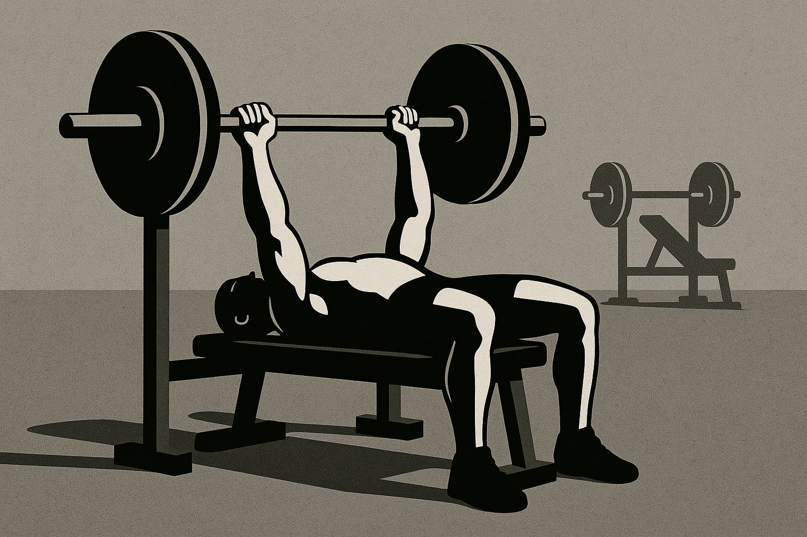

# **Architects of Inversion, the collapse of execution**

---

**📚 Table of contents—AI series**

1. [**Navigating the AI revolution:**](https://www.jterrazz.com/articles/14-ai-series-0-navigating-the-ai-revolution) _Understanding how AI is transforming work, creativity, and the future of every profession._
2. [**Applied intelligence:**](https://www.jterrazz.com/articles/15-ai-series-1-applied-intelligence-for-everyday-work) _A practical guide to using AI tools, adapting your mindset, and thriving in the age of automation._
3. [**Architects of inversion – The collapse of execution:**](https://www.jterrazz.com/articles/16-ai-series-2-the-collapse-of-execution) _Exploring how AI is reshaping value, collapsing execution costs, and shifting human worth to ideas and direction._
4. [**Architects of inversion – The world that follows:**](https://www.jterrazz.com/articles/17-ai-series-3-life-after-the-execution-collapse) _A deep dive into how abundant intelligence transforms work, society, space, and the shape of civilization._

---

_Imagining a future built on abundant intelligence_

> _Most people imagine the future as a linear extension of the present. But we've just left that timeline. The curve has bent. We are riding the exponential._

---

## **An invitation to an inverted world**

This isn't a prophecy or a technical manual. Think of it as a speculative map, sketched from years working alongside AI, feeling its currents ripple through finance, business, and creativity. It springs from a gut feeling that something immense is unfolding—an exploration guided by a single, powerful lens:

**Intelligence is becoming abundant. And that simple fact changes everything.**

We're entering a world where the primary hurdles are no longer a lack of tools or talent, but rather **imagination, will, and the clarity to steer.** The age of knowledge scarcity is giving way to a reality where intelligence is cheap, fast, and woven into the fabric of our days. This piece explores what happens as this shift solidifies—across culture, work, cities, values, and even governance. It's about a grand inversion: when the rare becomes common, and the overlooked becomes essential.

### **Why "architects of inversion"?**

The term arose because AI isn't just automating tasks; it's flipping value hierarchies. Prestigious activities like elite knowledge and complex digital execution are becoming democratized, their costs plummeting. Conversely, undervalued skills like manual work, care, and emotional intelligence are gaining new appreciation. Execution is becoming a commodity; the premium now lies in **ideas, values, and the context** that shapes them. We once optimized for performance; now, we optimize for **meaning.** Resonant creators and companies connect deeply, investing less in production mechanics and more in **conceptual exploration.** With iteration costs near zero, the new economy values **directionality** over mere output.

### **An essay, not a roadmap**

This is a work of speculation and synthesis, weaving today's examples with projections for tomorrow. Some ideas may feel like science fiction, others uncannily familiar. Exponential change means the journey from "impossible" to "mainstream" can happen in years, not decades. We'll start with the current shifts—the inversion of digital work, the crumbling of execution barriers, the democratization of intelligence—then look further, to the transformations in community, creativity, and more that await in a world of near-infinite intelligence. Faced with such change, we can retreat or lean in. This series embraces possibility with **techno-optimism rooted in observable reality.** Welcome to the inverted world.

---

## **The great flip: from scarcity to abundance**

For most of history, intelligence was a precious, limited resource, residing in individual minds and painstakingly passed down. Expertise was rare, execution costly, and knowledge a gatekeeper. That world is fading. We're crossing into an age of **intellectual abundance**, where intelligent action is on-demand, often at a near-zero marginal cost. What electricity did for physical labor, AI is doing for mental labor. This is the inflection point.

You can already sense it: designers generating brand concepts before their coffee cools, writers drafting a week's worth of content in minutes. Human creativity hasn't vanished; the cost of manifesting ideas has simply collapsed.

### **The creative landscape, reimagined**

The old challenge was execution. Ideas were plentiful, but few possessed the means to realize them. Now, with tools like GPT-4o, **execution is becoming increasingly trivial.** The new challenge? Discernment. Not "How do I build this?" but "What is genuinely worth building?" This creates a divergence: an explosion of "good enough" competence (generic logos, boilerplate code) handled by AI, and, at the high end, a premium on true taste, originality, and the irreplaceable human touch—the delightful weirdness and emotional resonance that AI struggles to replicate.

### **The human element ascends to strategy**

Companies are shifting their focus from technical mastery to conceptual thinking. Value no longer lies in the skillful manipulation of pixels or code, but in knowing **which pixels to move, which code to write, and why.** The human contribution moves up the stack from rote execution to strategic direction. In a sense, we're all idea people now. This is both exhilarating and unsettling. As the power to build is democratized, the **responsibility to decide** what to build, and for what purpose, grows. What matters to you? What problems ignite your passion? This is the new work: ideas grounded in values, driven by vision. Welcome to the era of architectural thinking.

---

## **Our place in a world of smart machines: redefining human worth**

As AI shoulders more of our mental heavy lifting, a core question emerges: **What gives human work its meaning now?** For centuries, intellectual labor was prized above physical toil. Engineers, lawyers, and developers sat atop this hierarchy, while hands-on professions were often undervalued. This pecking order is being reshuffled.

AI, ironically, excels at mimicking those "prestigious" roles—the pattern-based, data-intensive, language-centric tasks like drafting reports, essays, and code. Meanwhile, fields like plumbing, caregiving, and construction prove far more resistant to replacement. While the tangible world—with its nuance, risk, and messy human interactions—has long been considered safer from automation, this distinction is blurring with alarming speed. AI-driven robotics are not a distant prospect; they are developing so rapidly that even these "future-proof" career paths now face profound disruption.

We're entering a phase where **will and intent** may overshadow traditional credentials. When an AI can match your technical performance, what differentiates you? Perhaps it's caring deeply or perceiving an overlooked need. This signals a massive shift in how we define value. Degrees may wane in significance. Institutions that train for exams face an existential challenge when AI can teach and test with greater personalization.

> When anyone can wield sophisticated intelligence like an app, what sets you apart isn't merely what you know—it's what you aspire to build with that knowledge.

Curiously, this inversion seems to lead us back to earth—to our communities, families, and embodied experiences. When AI manages your inbox, perhaps you gain the space to fix a roof, help a neighbor, or start that local project. This could be a deeply humanizing force, a rediscovery of what enriches life: presence, purpose, contribution, and affection. Our metrics for fulfillment are evolving. The question is no longer just "What do you do?" It's becoming: **"What do you make better?"**

---

## **Beyond repetition: the dawn of conceptual work**

Repetition in professional work is fading. Tasks that are predictable or template-driven are increasingly becoming food for AI. Pushing pixels, crunching numbers, reformatting content—this work is vanishing into algorithms. What's emerging in its place isn't more task-work; it's **thinking.**

Conceptual labor is rising—work where your role isn't to replicate but to reimagine. **You're not just painting the wall; you're envisioning the building. You're not just filling the spreadsheet; you're deciding what truly needs measuring, and why.**

For decades, much of white-collar work occupied a middle zone, performing connective functions like creating slide decks, reports, and ad copy. AI excels here, compressing this entire layer. What grows in importance are the activities at the top and bottom: **top-level thinking** (strategy, profound questions, shaping futures) and **ground-level doing** (physical presence, emotional intelligence, local action). The tasks between these poles are being absorbed by software.

In this landscape, the most valuable professionals aren't those who know everything, but those who can **connect** disparate things. **It's not the encyclopedic mind that gains an advantage—it's the architectural one:** capable of holding ambiguity, mapping complex systems, and simplifying without losing nuance. AI follows paths; we invent new roads.

A new kind of worker emerges: the **framework architect**, who creates mental models, asks first-principles questions, and defines problems with rigor. This isn't a role for an elite few; it's the new baseline for meaningful work. AI is nudging us up the intellectual stack, replacing the need to operate at a shallow level. For those who embrace this shift, the payoff is immense. In a world of superhumanly efficient AI for average tasks, the only space left is to be distinctly above average. The new imperative is **conceptual courage.**

---

## **Your personal AI: the new constant in our lives**

Imagine waking to a super-intelligent partner that knows your calendar, preferences, projects, and aspirations. This isn't a metaphor; it's the literal promise of personal AI. We're moving towards **personal AI as the standard interface for knowledge, systems, and decisions.** These are evolving collaborative minds, anticipating our needs, summarizing complexities, and amplifying our capabilities. From GPT-based email agents to embedded AI copilots, intelligence is becoming ambient, contextual, and constant.

Until recently, only the wealthy could afford true personal assistants. AI democratizes this leverage. Now, everyone can have a coach, a strategist, a tireless partner. The _knowledge class_, once defined by access to information, is becoming universally accessible. What once signified privilege is becoming a utility. This doesn't erase disparity, but it flattens traditional barriers. A motivated individual with a good prompt can rival Ivy League output. A solo freelancer with AI agents can operate like a micro-conglomerate.

If everyone has access to top-tier execution, what retains unique value? **Trust** (the belief others have in you), **Taste** (your ability to discern what is valuable), and **Vision** (the clarity to articulate a compelling direction). No AI can truly simulate these. Your AI might draft the proposal, but only you can decide **what you stand for.** Your _brand_ becomes the sum of your choices, your consistency, and your purpose.

We're exiting an age where accumulating knowledge was power. If everyone can instantly Google, memorize, and summarize, **knowledge itself becomes a baseline, not a differentiator.** The new edge lies in applying knowledge wisely, combining ideas creatively, and acting with judgment informed by human wisdom. The integration of AI will seep in, much like smartphones did. Soon, we'll find we are rarely making decisions alone. The twist is this: the more intelligent our surroundings become, the more **crucial it is to be grounded in who we are.** When everyone has a smart assistant, the real question is: **What do _you_ truly want?**

---

## **When knowledge is commonplace, what truly matters?**

"Knowledge is power" once held undeniable truth. Civilizations were shaped by access to literacy, books, and eventually the internet. The gatekeepers of information—academies, publishers, broadcasters—held the keys to progress. That dynamic is crumbling. Knowledge is no longer scarce; it's instantly searchable, compressible, and universally available. Crucially, **it's becoming executable by machines.**

When anyone can summon legal advice, debug code, or emulate any style with a few words, the competitive edge shifts away from "knowing things." Imagine replicating not just text, but entire competencies: a novelist's prose, an agency's branding strategy, a startup's operational model. AI can **replicate the styles, strategies, and knowledge systems** that were once the exclusive domain of experts. You can duplicate an entity's tone, logic, and even its business model in minutes.

When talent becomes a replicable asset, **the raw content of expertise becomes less defensible.** Its value now depends critically on **how uniquely you express, apply, and imbue it with your perspective.** Owning a formula or an idea is only defensible if people **trust _you_** to deliver it. Just as Beethoven's sheet music entered the public domain, making his compositions freely available, AI is now making creative _styles_—vocal patterns, brand aesthetics, coding methodologies—just as replicable. The "secret sauce" is becoming an open recipe. What remains? **Brand** (a hard-earned reputation) and **Loyalty** (a community that chooses you).

AI enables mass personalization of content, education, and entertainment. The same data can become a podcast, an essay, or a chatbot simulation, **packaged into different cognitive experiences.** This means two things: first, there is **no single, monolithic experience of "truth,"** and second, your ability to **tailor and contextualize information** becomes paramount.

For centuries, moats were built around knowledge. That moat is drying up. American software, French culture, university accreditation—all are being atomized by AI. Not invalidated, but **commoditized.** If AI can deliver comparable quality teaching, writing, or design globally at a fraction of the cost, what's left? Knowledge isn't dead, nor is expertise. But they are no longer the bottlenecks.

---

## **The unseen curve: riding the exponential wave**

You likely feel it: something is accelerating. It's not just your inbox, but science, business, creativity, and daily life. What most people miss isn't just the pace of change, but its **shape**. Humans think linearly; we expect tomorrow to resemble today. That model is now broken. We are not on a straight path. **We are on a curve, bending sharply upwards.**

Previously, exponential progress was often confined to a single domain: first the physical with the Industrial Revolution, then the digital with the internet. Today, we are witnessing accelerations in **all three simultaneously**: the **realm of intelligence** (AI evolution), the **physical world** (factory automation, robotics, energy, materials science), and the **digital realm** (language models, image generators). This multi-domain, simultaneous, exponential progress is unprecedented. We are building a civilization that can **code biology like software, design novel materials, and optimize global grids in real-time.**

AI is a **general-purpose amplifier**, a tool for inventing better tools, faster, across every field. This creates a cycle of **compounding progress**: AI improvements accelerate research and development in other areas, which in turn advances AI. The future is arriving faster than we anticipate. There's a half-joking saying in tech: _"Don't die."_ The sentiment behind it is that what's coming isn't just better phones, but a potential upgrade to the human condition itself. Curing diseases, automating all manufacturing, providing near-infinite knowledge access—all are moving from science fiction to plausible reality. The next ten years may feel like a **century** of change compressed into a decade.

Every generation believes it stands at a unique turning point. Most are mistaken. But when you look at the grand shifts of history, some moments genuinely **bend the arc** of the human story. This feels undeniably like one of them. The only question is: **How aware, engaged, and intentional do you want to be while it's all happening?**

---

## **Conclusion: from the curve to the canvas—we are all architects now**

We've crossed a threshold. What began as a subtle evolution in digital tools has escalated into a wholesale inversion of how we create, work, and think. Intelligence, once a competitive edge, is now the ubiquitous canvas. Execution, formerly the bottleneck, is becoming the baseline. In this emerging world, **meaning becomes the new scarcity.**

The old questions—"How do I do this? Who can help me?"—are being superseded by more personal, more profound inquiries: In a world of infinite possibility, what is truly worth doing? What kind of world do we genuinely want to build? What does a meaningful contribution look like when creation is cheap and creativity is boundless?

We are all architects now. Not just of buildings, but of understanding, of values, of the futures we dare to imagine.

**The second half of this journey, "The World That Follows," begins where many AI narratives stop**: delving into the tangible physical world, our social fabric, and the very shape of our civilization. What happens when AI integrates deeply into our cities, our governance, our rituals, and our relationships? That is what we explore next.

The intelligence is here. Now comes the architecture.

[**Read the next article**](https://www.jterrazz.com/articles/17-ai-series-3-life-after-the-execution-collapse)
