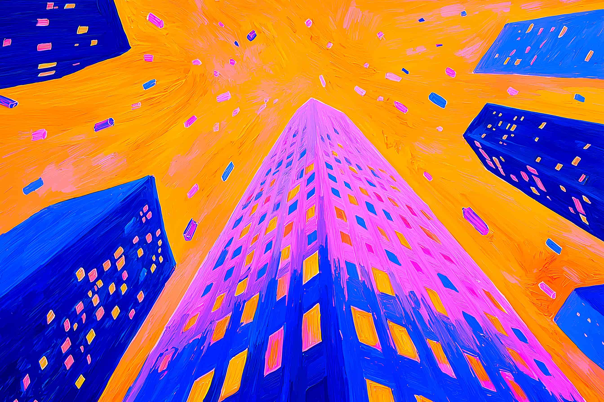
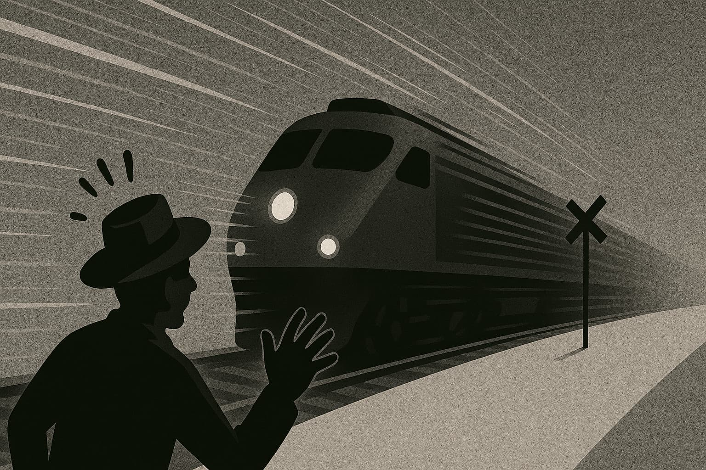
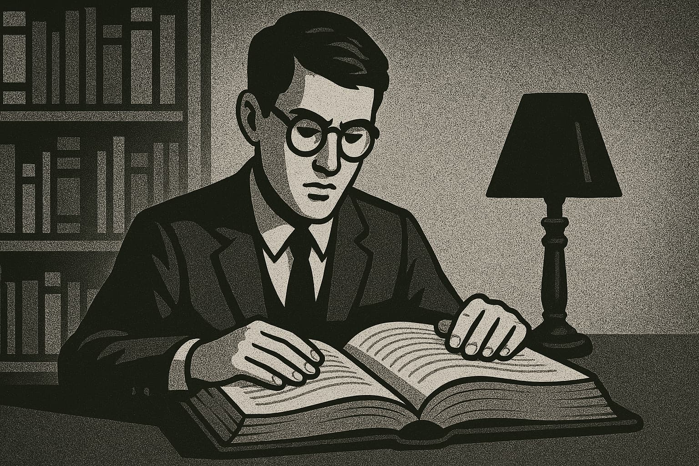
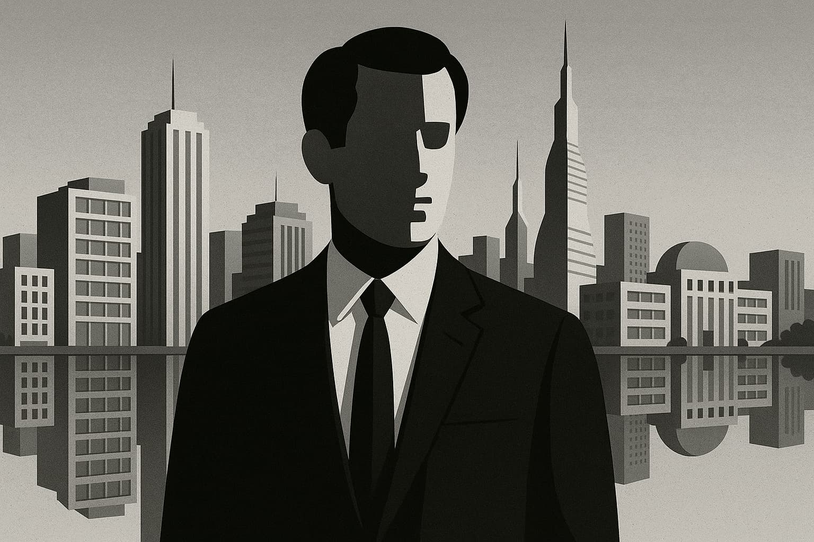
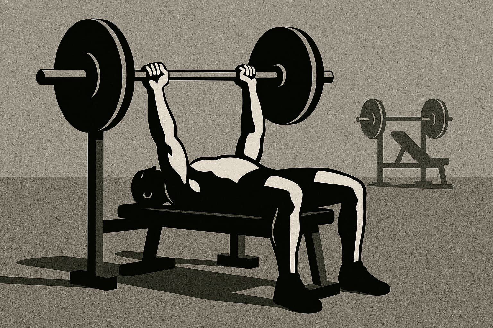
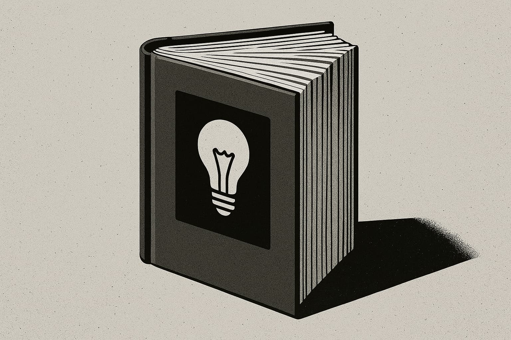
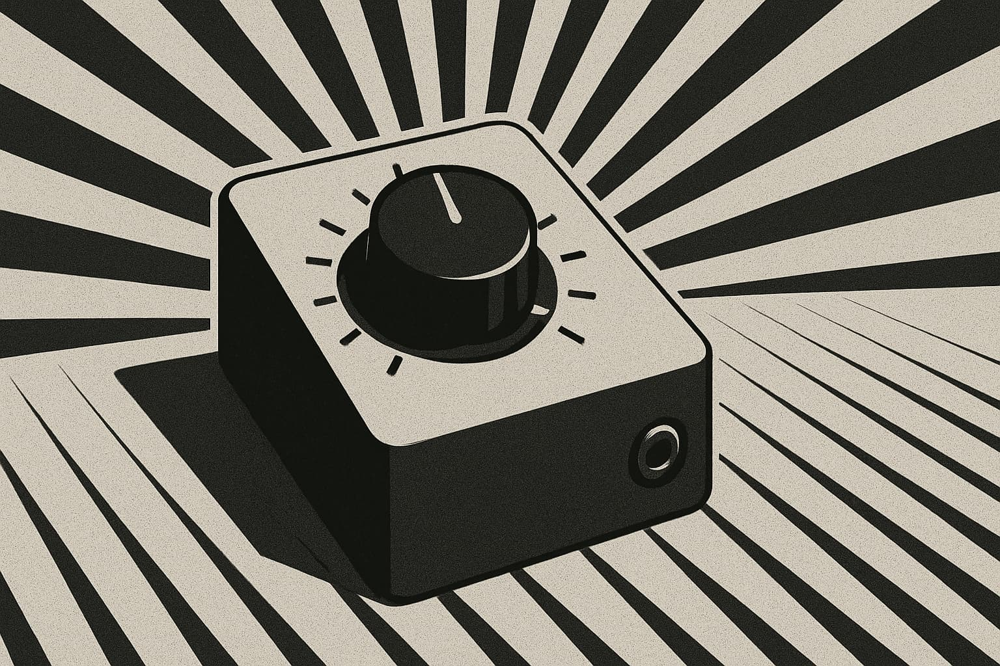

# **Architectes de l'Inversion, l'effondrement de l'exécution**

---

**📚 Sommaire–Série sur l'IA**

1. [**Naviguer la révolution de l'IA :**](https://www.jterrazz.com/articles/14-ai-series-0-navigating-the-ai-revolution/fr) _Comprendre comment l'IA transforme le travail, la créativité et l'avenir de chaque profession._
2. [**Intelligence appliquée :**](https://www.jterrazz.com/articles/15-ai-series-1-applied-intelligence-for-everyday-work/fr) _Guide pratique pour utiliser les outils d'IA, adapter son état d'esprit et prospérer à l'ère de l'automatisation._
3. [**Architectes de l'inversion – L'effondrement de l'exécution :**](https://www.jterrazz.com/articles/16-ai-series-2-the-collapse-of-execution/fr) _Explorer comment l'IA redéfinit la valeur, fait s'effondrer les coûts d'exécution et déplace la valeur humaine vers les idées et la vision stratégique._
4. [**Architectes de l'inversion – Le monde d'après :**](https://www.jterrazz.com/articles/17-ai-series-3-life-after-the-execution-collapse/fr) _Une exploration en profondeur de la manière dont l'intelligence abondante transforme le travail, la société, l'espace et la forme même de la civilisation._

---

_Imaginer un avenir bâti sur l'intelligence abondante_

> _La plupart des gens imaginent l'avenir comme une simple extension linéaire du présent. Mais nous venons de quitter cette trajectoire. La courbe s'est infléchie. Nous surfons désormais sur l'exponentielle._

---

## **Invitation à un monde inversé**

Ceci n'est ni une prophétie, ni un manuel technique. Voyez-le plutôt comme une carte spéculative, esquissée au fil d'années passées à travailler aux côtés de l'IA, à sentir ses ondes de choc se propager à travers la finance, les affaires et la créativité. Elle naît de l'intuition profonde que quelque chose d'immense se joue, une exploration guidée par un prisme unique et puissant:

**L'intelligence devient une ressource abondante. Et ce simple fait change absolument tout.**

Nous entrons dans un monde où les principaux obstacles ne sont plus le manque d'outils ou de talents, mais bien **l'imagination, la volonté et la clarté de la direction à prendre.** L'ère de la rareté du savoir s'achève, remplacée par une réalité où l'intelligence est bon marché, rapide et intimement tissée dans le tissu même de nos vies. Cet article explore les conséquences de cette transition à mesure qu'elle se consolide–à travers la culture, le travail, les villes, les valeurs et même la gouvernance. Il s'agit d'une grande inversion: celle où ce qui était rare devient commun, et où ce qui était négligé devient essentiel.

### Pourquoi " architectes de l'inversion "?

Ce terme s'est imposé parce que l'IA ne se contente pas d'automatiser des tâches; elle bouleverse les hiérarchies de valeur. Des activités prestigieuses, comme le savoir d'élite ou l'exécution numérique complexe, se démocratisent, voyant leurs coûts s'effondrer. Inversement, des compétences autrefois sous-évaluées, telles que le travail manuel, le soin à la personne ou l'intelligence émotionnelle, retrouvent une valeur nouvelle. L'exécution devient une commodité; la vraie valeur réside désormais dans **les idées, les valeurs et le contexte** qui leur donnent forme. Hier, nous optimisions pour la performance; aujourd'hui, nous optimisons pour **le sens.** Les créateurs et les entreprises qui résonnent sont ceux qui créent des liens profonds, investissant moins dans la mécanique de production que dans **l'exploration conceptuelle.** Avec des coûts d'itération proches de zéro, la nouvelle économie valorise la **direction** bien plus que le simple volume.

### Un essai, pas une feuille de route

Attendez-vous à de la spéculation et de la synthèse, mêlant des exemples d'aujourd'hui à des projections pour demain. Certaines idées pourront sembler relever de la science-fiction, d'autres vous paraîtront étrangement familières. La nature du changement exponentiel veut que le passage de l'" impossible " au " courant " puisse se faire en quelques années, et non plus en décennies. Nous commencerons par les mutations actuelles–l'inversion de la valeur du travail numérique, la chute des barrières à l'exécution, la démocratisation de l'intelligence–avant de nous projeter plus loin, vers les transformations de la communauté, de la créativité et plus encore, dans un monde à l'intelligence quasi infinie. Face à une telle transformation, on peut reculer ou s'y engager pleinement. Cette série choisit l'optimisme, un techno-optimisme ancré dans une réalité observable. Bienvenue dans le monde inversé.

---

## **Le grand basculement: de la rareté à l'abondance**

Durant la majeure partie de l'histoire, l'intelligence fut une ressource précieuse et limitée, confinée dans des esprits individuels, transmise avec un soin infini. L'expertise était rare, l'exécution coûteuse, et le savoir un privilège. Ce monde s'efface. Nous entrons dans une ère d'**abondance intellectuelle**, où l'action intelligente est disponible à la demande, souvent pour un coût marginal proche de zéro. Ce que l'électricité a été au travail physique, l'IA l'est au travail mental. Nous sommes à ce point d'inflexion.

Vous pouvez déjà le sentir: des designers génèrent des concepts de marque avant même que leur café ne refroidisse, des rédacteurs ébauchent le contenu d'une semaine en quelques minutes. La créativité humaine n'a pas disparu; c'est le coût pour donner corps aux idées qui s'est effondré.

### Le paysage créatif, réimaginé

Hier, le défi était l'exécution. Les idées abondaient, mais peu pouvaient les concrétiser. Aujourd'hui, avec des outils comme GPT-4o, **l'exécution devient une formalité.** Le nouveau défi? Le discernement. La question n'est plus " Comment puis-je construire cela? " mais " Qu'est-ce qui mérite vraiment d'être construit? ". Cela crée une divergence: d'une part, une explosion de compétences " suffisantes " (logos génériques, code passe-partout) gérées par l'IA, et d'autre part, au sommet, une prime accordée au goût véritable, à l'originalité et à l'irremplaçable touche humaine–cette singularité délicieuse et cette résonance émotionnelle que l'IA peine à reproduire.

### L'humain s'élève au rang de stratège

Les entreprises déplacent leur attention de la maîtrise technique vers la pensée conceptuelle. La valeur ne réside plus seulement dans la manipulation habile de pixels ou de code, mais dans le fait de savoir **quels pixels déplacer, quel code écrire, et pourquoi.** La contribution humaine monte d'un cran, passant de l'exécution routinière à la direction stratégique. D'une certaine manière, nous sommes tous devenus des créateurs d'idées. C'est à la fois exaltant et déstabilisant. À mesure que le pouvoir de construire se démocratise, la **responsabilité de décider** quoi construire, et dans quel but, s'accroît. Qu'est-ce qui compte pour vous? Quels problèmes vous animent? Voilà le nouveau travail: des idées ancrées dans des valeurs, portées par une vision. Bienvenue à l'ère de la pensée architecturale.

---

## **Notre place dans un monde de machines intelligentes: redéfinir la valeur humaine**

Alors que l'IA prend en charge une part croissante de notre charge mentale, une question fondamentale émerge: **qu'est-ce qui donne désormais son sens au travail humain?** Pendant des siècles, le labeur intellectuel a souvent été plus valorisé que l'effort physique. Ingénieurs, avocats, développeurs siégeaient au sommet de cette hiérarchie; les métiers manuels étaient parfois dépréciés. Cet ordre établi est aujourd'hui rebattu.

Ironiquement, l'IA excelle à imiter ces rôles " prestigieux ": les tâches basées sur des modèles, gourmandes en données et centrées sur le langage, comme la rédaction de rapports, d'essais et de code. Pendant ce temps, des domaines comme la plomberie, les soins à la personne ou le bâtiment s'avèrent bien plus rétifs à l'automatisation. Sam Altman a noté que les métiers exigeant une présence physique sont souvent plus complexes à automatiser. Le logiciel est natif des mondes numériques; le monde tangible, avec ses nuances, ses risques et ses interactions humaines désordonnées, est un terrain plus ardu pour l'IA–bien que cette distinction s'estompe à une vitesse alarmante. La robotique pilotée par l'IA n'est pas une perspective lointaine; elle se développe à une vitesse fulgurante, promettant d'automatiser les tâches physiques bien plus tôt que beaucoup ne l'anticipent. Ainsi, des carrières autrefois considérées comme " à l'épreuve du futur " font face à une profonde remise en question.

Nous entrons dans une phase où **la volonté et l'intention** pourraient l'emporter sur les diplômes traditionnels. Lorsque l'IA égale vos performances techniques, qu'est-ce qui vous différencie? Peut-être votre capacité à vous soucier profondément des choses, à percevoir des besoins que d'autres ignorent. C'est une mutation massive dans notre définition de la valeur. Les diplômes pourraient perdre de leur importance. Les institutions qui ne forment qu'à passer des examens sont mises au défi par une IA capable d'enseigner et de tester avec une personnalisation accrue.

> Lorsque n'importe qui peut manier une intelligence sophistiquée comme une application, ce qui vous distingue n'est plus seulement ce que vous savez, mais ce que vous aspirez à construire avec ce savoir.

Curieusement, cette inversion semble nous ramener sur terre–vers nos communautés, nos familles, nos expériences incarnées. Lorsque l'IA gère votre boîte de réception, peut-être gagnez-vous l'espace nécessaire pour réparer un toit, aider un voisin ou lancer ce projet local qui vous tient à cœur. Cela pourrait être profondément humanisant, une redécouverte de ce qui donne sa saveur à la vie: la présence, le but, la contribution, l'affection. Nos critères d'épanouissement évoluent. La nouvelle question n'est plus seulement " Que faites-vous? ". Elle devient: **" Qu'apportez-vous de meilleur au monde? "**

---

## **Au-delà de la répétition: l'aube du travail conceptuel**

La répétition dans le travail professionnel est en voie de disparition. Les tâches prévisibles ou basées sur des modèles sont de plus en plus la proie de l'IA. Déplacer des pixels, aligner des chiffres, reformater du contenu–ce labeur s'évapore dans les algorithmes. Ce qui émerge n'est pas un surcroît de tâches, mais un surcroît de **pensée.**

Le travail conceptuel prend son essor–un travail où votre rôle n'est pas de reproduire, mais de réimaginer. **Vous ne peignez plus seulement le mur; vous imaginez le bâtiment. Vous ne remplissez plus seulement le tableur; vous décidez de ce qui doit vraiment être mesuré, et pourquoi.**

Pendant des décennies, une grande partie du travail de bureau occupait une zone intermédiaire: des fonctions de liaison comme la création de présentations, de rapports ou de textes publicitaires. L'IA excelle dans ce domaine, comprimant cette strate intermédiaire. Ce qui gagne en importance, ce sont les activités aux deux extrémités du spectre: **la pensée de haut niveau** (stratégie, questions fondamentales, élaboration de futurs) et **l'action de terrain** (présence physique, intelligence émotionnelle, action locale). Les tâches situées entre ces deux pôles sont absorbées par le logiciel.

Dans ce paysage, les professionnels de valeur ne sont pas ceux qui savent tout, mais ceux qui peuvent **connecter** des choses disparates. **Ce n'est pas l'esprit encyclopédique qui prend l'avantage, c'est l'esprit architectural:** celui qui sait composer avec l'ambiguïté, cartographier des systèmes complexes et simplifier sans perdre la nuance. L'IA suit des chemins; nous inventons de nouvelles routes.

Un nouveau type de travailleur émerge: **l'architecte de cadres de pensée**, celui qui crée des modèles mentaux, pose les questions premières et définit les problèmes avec rigueur. Ce n'est pas réservé à une élite; c'est le nouveau standard. L'IA nous pousse à monter dans la hiérarchie intellectuelle, nous déchargeant de la nécessité d'opérer à un niveau superficiel. Pour ceux qui acceptent ce changement, le gain est immense. Dans un monde où l'IA est surhumainement efficace pour les tâches moyennes, le seul terrain de jeu qui nous reste est celui du dépassement: **le courage conceptuel.**

---

## **Votre IA personnelle: la nouvelle constante de nos vies**

Imaginez-vous vous réveiller aux côtés d'un partenaire super-intelligent qui connaît votre agenda, vos préférences, vos projets et vos aspirations. Ce n'est pas une métaphore: c'est, littéralement, ce que deviendra votre IA personnelle. Nous nous dirigeons vers **l'IA personnelle comme interface par défaut pour accéder au savoir, aux systèmes et aux décisions.** Ce sont des esprits collaboratifs en constante évolution, qui anticipent nos besoins, synthétisent les complexités et amplifient nos capacités. Des agents e-mail basés sur GPT aux copilotes IA intégrés, l'intelligence devient ambiante, contextuelle et constante.

Jusqu'à récemment, seuls les plus fortunés pouvaient s'offrir de véritables assistants personnels. L'IA démocratise cet effet de levier. Chacun peut avoir un coach, un stratège, un partenaire infatigable. La _classe du savoir_, autrefois définie par son accès privilégié, devient universellement accessible. Ce qui était un signe de privilège devient une commodité. Cela n'efface pas les disparités, mais aplanit les barrières traditionnelles. Un individu motivé avec un bon prompt peut rivaliser avec les productions d'une université de l'Ivy League. Un freelance en solo, épaulé par des agents IA, peut fonctionner comme un micro-conglomérat.

Si tout le monde dispose d'une exécution de premier ordre, qu'est-ce qui conserve une valeur unique? _La confiance_ (la foi des autres en vous), _le goût_ (votre discernement pour identifier ce qui a de la valeur), et _la vision_ (votre capacité à articuler une direction convaincante). Aucune IA ne peut véritablement simuler ces qualités. Votre IA peut rédiger une proposition, mais vous seul décidez de **ce que vous incarnez.** Votre _marque_ devient la somme de vos choix, de votre cohérence et de votre raison d'être.

Nous quittons une ère où accumuler des connaissances était synonyme de pouvoir. Si tout le monde peut instantanément chercher sur Google, mémoriser et résumer, **le savoir lui-même devient une base, et non plus un différenciateur.** Le nouvel avantage? Appliquer ce savoir avec sagesse, combiner les idées de manière créative, agir avec un jugement éclairé par la sagesse humaine. L'intégration de l'IA s'infiltrera dans nos vies, comme l'ont fait les smartphones. Bientôt, nous nous rendrons compte que nous ne prenons que rarement des décisions seuls. Le paradoxe: plus notre environnement devient intelligent, plus il est **crucial d'être ancré dans ce que nous sommes.** Quand tout le monde aura un assistant intelligent, la vraie question sera: **Que voulez-vous, _vous_, vraiment?**

---

## **Quand le savoir devient banal, qu'est-ce qui compte vraiment?**

L'adage " Savoir, c'est pouvoir " était autrefois une vérité incontestable. Les civilisations se sont construites sur l'accès à l'alphabétisation, aux livres, à Internet. Les gardiens de l'information–académies, maisons d'édition, médias–détenaient les clés du progrès. Cette dynamique vole en éclats. Le savoir n'est plus rare; il est instantanément accessible, compressible, disponible. Fait crucial: **il devient exécutable par les machines.**

Quand n'importe qui peut obtenir un conseil juridique, déboguer du code ou imiter n'importe quel style en quelques mots, l'avantage concurrentiel ne vient plus de la simple détention du savoir. Imaginez pouvoir répliquer non seulement du texte, mais des compétences: le style d'un romancier, l'approche de branding d'une agence, les opérations d'une startup. Les modèles d'IA peuvent **reproduire des styles, des stratégies et des systèmes de connaissances** autrefois exclusifs aux experts. Vous pouvez dupliquer le ton, la logique, et même le modèle économique d'une entité en quelques minutes.

Lorsque le talent devient un actif reproductible, **le contenu brut de l'expertise devient moins défendable.** Sa valeur dépend désormais de manière critique de **la singularité avec laquelle vous l'exprimez, l'appliquez et l'imprégnez de votre perspective.** Posséder une formule ou une idée n'est défendable que si les gens vous font **_confiance à vous_** pour la mettre en œuvre. La musique de Beethoven est tombée dans le domaine public; aujourd'hui, les discographies, les styles vocaux, les marques et les styles de codage deviennent à leur tour reproductibles. Leur " recette secrète " perd son mystère. Que reste-t-il? _La marque_, cette réputation forgée dans la durée, et _la loyauté_, celle d'une communauté qui vous choisit, vous.

L'IA permet une personnalisation de masse du contenu, de l'éducation, du divertissement. Les mêmes données peuvent devenir un podcast, un essai ou une simulation de chatbot, **articulés autour d'expériences cognitives différentes.** Cela signifie deux choses: 1. Il n'y a **pas une seule expérience monolithique de la " vérité ".** 2. Votre capacité à **adapter et à contextualiser l'information** devient primordiale.

Pendant des siècles, des douves ont été creusées autour du savoir. Ces douves s'assèchent. Le logiciel américain, la culture française, l'accréditation universitaire–tout cela est atomisé par l'IA. Non pas invalidé, mais **banalisé.** Si une IA peut offrir un enseignement, une écriture ou un design de qualité comparable à l'échelle mondiale pour une fraction du coût, que reste-t-il? Le savoir n'est pas mort, l'expertise non plus. Mais ils ne sont plus les goulots d'étranglement.

---

## **La courbe invisible: surfer sur la vague exponentielle**

Vous le sentez probablement: quelque chose s'accélère. Pas seulement votre boîte de réception, mais la science, les affaires, la créativité, la vie quotidienne. Ce que la plupart des gens ne saisissent pas, ce n'est pas seulement le rythme, mais sa **forme**. Les humains pensent de manière linéaire: demain ressemblera à aujourd'hui. Ce modèle est désormais caduc. Nous ne suivons pas une trajectoire rectiligne. **Nous sommes sur une courbe qui s'infléchit brutalement vers le haut.**

Auparavant, le progrès exponentiel se manifestait souvent dans un seul domaine: physique (Révolution industrielle), puis numérique (Internet). Aujourd'hui, nous assistons à des accélérations dans **les trois domaines simultanément**: l'**intelligence** (évolution de l'IA), le **monde physique** (automatisation des usines, robotique, énergie, matériaux) et le **domaine numérique** (modèles de langage, générateurs d'images). Ce progrès exponentiel, simultané et multidimensionnel, est sans précédent. Nous construisons une civilisation capable de **coder la biologie comme un logiciel, de concevoir des matériaux inédits, d'optimiser des réseaux mondiaux en temps réel.**

L'IA est un **amplificateur universel**, un outil pour inventer de meilleurs outils, toujours plus vite, dans tous les domaines. Cela crée un effet boule de neige: un **progrès qui s'auto-alimente**, où les améliorations de l'IA accélèrent d'autres recherches, qui à leur tour font progresser l'IA. L'avenir arrive plus vite que prévu. Un dicton teinté d'humour noir circule dans la tech: _" Don't die. "_ Le sentiment sous-jacent: ce qui s'annonce, ce ne sont pas seulement de meilleurs téléphones, mais potentiellement une mise à niveau de la condition humaine. Guérir des maladies, automatiser la production, un accès quasi infini au savoir–tout cela passe de la science-fiction à une réalité plausible. Les dix prochaines années pourraient ressembler à un **siècle** de changements condensé en une décennie.

Chaque génération pense vivre un tournant unique. La plupart se trompent. Mais en observant les grandes transitions historiques, certains moments, rares et décisifs, **infléchissent véritablement l'arc** de l'histoire humaine. Celui-ci en a indéniablement l'allure. La seule question est: **à quel point souhaitez-vous être conscient, engagé et intentionnel pendant que tout cela se produit?**

---

## **Conclusion: de la courbe à la toile–nous sommes tous des architectes**

Nous avons franchi un seuil. Une évolution subtile des outils numériques s'est transformée en une inversion complète de notre manière de créer, de travailler et de penser. L'intelligence, autrefois un avantage concurrentiel, est devenue notre toile de fond. L'exécution, jadis le goulot d'étranglement, devient le point de départ. Dans ce monde émergent, **le sens devient la nouvelle rareté.**

Les anciennes questions–" Comment faire ceci? Qui peut m'aider? "–sont supplantées par des interrogations plus personnelles et profondes: qu'est-ce qui mérite vraiment d'être fait dans un monde aux possibilités infinies? Quel genre de monde voulons-nous sincèrement construire? Que signifie apporter une contribution pleine de sens lorsque la création est bon marché et la créativité sans limites?

Nous sommes tous devenus des architectes. Non pas de bâtiments, mais d'architectures de pensée, de cadres de valeurs, de futurs à dessiner.

**La seconde moitié de ce voyage, " Le monde d'après ", commence là où de nombreux récits sur l'IA s'arrêtent**: en explorant le monde physique tangible, notre tissu social et la forme même de notre civilisation. Que se passe-t-il lorsque l'IA s'intègre profondément dans nos villes, notre gouvernance, nos rituels et nos relations? C'est ce que nous explorerons ensuite.

L'intelligence est là. Place, maintenant, à l'architecture.

[**Lire l'article suivant**](https://www.jterrazz.com/articles/17-ai-series-3-life-after-the-execution-collapse/fr)
