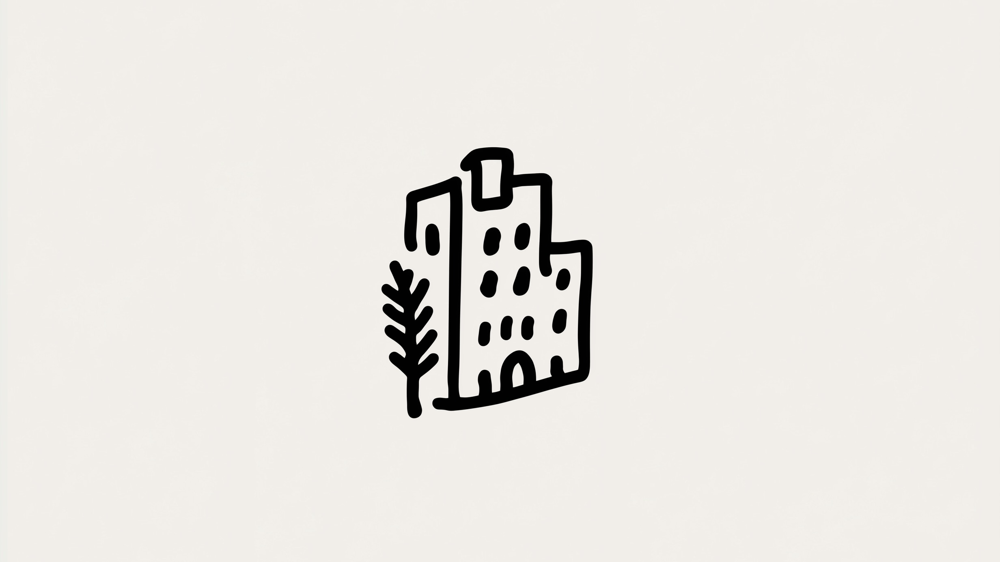

# **Quand l'exécution s'effondre**

_Toute votre carrière s'est construite sur une rareté qui vient de prendre fin._

Un designer vient de générer cinquante concepts de logo avant le petit-déjeuner. Un développeur solo a livré une suite produit complète en un week-end. Un stratège de contenu a produit un mois de travail soigné en trois heures.

Ce ne sont pas des cas isolés. C'est la nouvelle normalité.

**L'exécution, cette chose pour laquelle vous avez été formé, cette compétence que vous avez passé des années à construire, n'est plus rare.**

Et quand une ressource fondamentale passe de rare à abondante, tout ce qui était construit sur cette rareté s'effondre et se réorganise. Nous le regardons se produire en temps réel.

---

## **Ce pour quoi vous étiez payé devient gratuit**

Pendant toute votre carrière, l'équation était simple : apprendre à exécuter un travail difficile, échanger cette capacité contre de l'argent et du statut, recommencer.

La contrainte était toujours la capacité humaine. Vous aviez besoin de personnes qualifiées pour écrire le code, rédiger le rapport, analyser les données, concevoir l'interface, coordonner le projet. L'exécution était le goulot d'étranglement. Les idées étaient abondantes. Faire était cher.

L'IA vient d'inverser cette équation.

L'intelligence, la ressource la plus rare dans toute entreprise basée sur la connaissance, devient bon marché et universellement accessible. Ce que l'électricité a fait pour le travail physique — le rendre instantané, abondant et disponible partout — l'IA le fait maintenant pour le travail cognitif.

Rédaction, analyse, design, code, recherche, planification stratégique. Le travail qui a défini les carrières de cols blancs pendant un siècle s'effondre en abonnements logiciels et appels API. Vous n'avez plus besoin d'une expertise rare pour faire la plupart des exécutions. Vous louez cette capacité à la demande.

Ce n'est pas incrémental. **C'est une inversion de toute la chaîne de valeur.**

---

## **Quand la rareté devient abondance, tout s'inverse**

Ce schéma s'est déjà produit. Les forgerons ont perdu leur valeur quand la production industrielle a rendu le travail du métal abondant, et les éditeurs ont perdu leur pouvoir quand internet a rendu la distribution gratuite. Dans les deux cas, la compétence technique est devenue une commodité tandis que le jugement sur quoi produire est devenu premium.

Maintenant, ça arrive à **l'intelligence elle-même.**

L'exécution technique — coder, concevoir, analyser, écrire — devient bon marché et universellement accessible. La valeur ne disparaît pas, elle remonte dans la hiérarchie. Le goulot d'étranglement est passé de "comment exécutons-nous ceci ?" à "que devrions-nous exécuter et pourquoi ?"

Cela crée trois inversions simultanées :

**Ce qui était prestigieux devient commun.** Le travail de connaissance qui commandait des salaires à six chiffres — rédiger des rapports, analyser des données, construire des applications — peut maintenant être fait par l'IA à un coût marginal quasi nul, comprimant des compétences dans lesquelles vous avez investi une décennie en commodités.

**Ce qui était négligé devient essentiel.** Le travail nécessitant une présence physique, un jugement incarné et une connexion humaine compte soudainement plus, car le plombier, l'infirmière, l'électricien deviennent plus précieux précisément parce que leur travail ne peut pas être fait à distance par un algorithme.

**Ce qui était exécution devient jugement.** Quand n'importe qui peut manifester une idée instantanément et avec compétence, le goulot d'étranglement se déplace entièrement vers décider quelles idées valent la peine d'être manifestées en premier lieu, faisant de la vision, du goût et de la direction les seules sources de différenciation restantes.

Il ne s'agit pas seulement d'emplois ou de salaires. Nous inversons toute la hiérarchie de ce qui rend une personne précieuse dans l'économie.

---

## **L'excellence ou l'insignifiance : le milieu a disparu**

L'effondrement de l'exécution crée une fracture brutale dans chaque domaine créatif.

En bas, il y a une explosion de travail compétent mais générique — des logos générés par IA qui ont l'air professionnels mais oubliables, du code qui tourne mais n'inspire pas, du texte grammaticalement correct mais qui ne laisse aucune impression. Ce travail ne coûte presque rien à produire, ce qui signifie qu'**il ne vaut presque rien.**

En haut, il y a une prime croissante sur l'excellence véritable — sur le travail qui porte un point de vue distinct, une résonance émotionnelle, une perspicacité rare. Le travail qui vous fait vous arrêter et penser "Je n'aurais pas pu faire ça, et un algorithme non plus" commande une valeur croissante précisément parce qu'il est irremplaçable.

Le milieu disparaît. Quand "assez bien" est maintenant gratuit et instantané, tout ce qui n'est pas exceptionnel peine à justifier son coût. Soit vous faites un travail qui compte profondément et que vous seul pouvez faire, soit vous êtes en compétition avec des algorithmes sur le prix — et il n'y a plus de terrain sûr au milieu.

Cette fracture force une question que la plupart des professionnels ont passé leur carrière à éviter : **Faites-vous un travail que vous seul pouvez faire ?**

Si votre valeur vient purement de l'exécution technique, vous êtes debout sur un sol qui fond rapidement. Si elle vient du goût, du jugement, des relations, ou de la capacité à voir ce que les autres manquent, vous devenez plus précieux chaque jour. **Ce que vous savez compte bien moins que ce que vous choisissez de faire avec ce que tout le monde sait maintenant.**

---

## **La hiérarchie s'inverse**

Pendant deux siècles, nous avons organisé la société autour d'une hiérarchie simple : le travail intellectuel en haut, le travail physique en bas. Les ingénieurs et les avocats gagnaient plus que les plombiers et les infirmières, et les travailleurs de la connaissance commandaient respect et statut.

Cette hiérarchie s'effondre, et l'inversion est brutale.

L'IA excelle précisément dans ce que nous considérions comme le plus prestigieux — la reconnaissance de patterns, l'analyse de données, la rédaction de documents, la génération de code, tout le travail qui nécessitait des années d'éducation formelle et commandait des salaires élevés. Ce sont les tâches les plus faciles à automatiser parce qu'elles sont structurées, basées sur des règles, et ne nécessitent pas de présence physique.

Pendant ce temps, le travail que nous avons systématiquement sous-évalué reste obstinément humain. Réparer un tuyau cassé nécessite une résolution de problèmes pratique dans des conditions imprévisibles, s'occuper d'un patient demande une attention émotionnelle et une présence physique, et réparer un moteur nécessite un jugement sur les matériaux, les conditions et la physique qui ne peut pas être fait à distance.

L'inversion est brutale et complète : **le travail "qualifié" devient automatisé, tandis que le travail "non qualifié" devient irremplaçable.**

Cela force un bilan inconfortable : si l'intelligence n'est plus rare, si n'importe qui peut accéder à une capacité cognitive de classe mondiale à la demande, qu'est-ce qui rend une personne précieuse ? Trois choses émergent des décombres de l'ancien modèle :

**Ce que vous remarquez.** L'IA peut analyser des données infinies mais elle ne se soucie de rien. Elle ne repérera pas le problème que personne ne lui a demandé de résoudre ni ne remarquera l'opportunité cachée en pleine vue. La curiosité humaine — la capacité de remarquer ce qui compte sans qu'on vous dise de regarder — devient précieuse dans un monde d'intelligence abondante mais indifférente.

**Ce que vous choisissez.** Quand l'exécution est bon marché et instantanée, chaque choix sur quoi construire devient une déclaration de valeurs. Votre goût, votre jugement, votre sens de ce qui vaut la peine d'être fait ne peuvent pas être automatisés parce qu'ils sont des expressions de qui vous êtes, pas de ce que vous savez. La direction devient le travail.

**Qui vous fait confiance.** Les relations, la réputation, la fiabilité se construisent lentement par des actions cohérentes et un caractère démontré. L'IA peut simuler l'expertise instantanément mais elle ne peut pas construire une confiance véritable. Le capital social que vous avez accumulé au fil des années en vous montrant et en livrant devient votre seul vrai avantage compétitif dans un monde où la capacité elle-même est abondante.

La question change fondamentalement : **quand n'importe qui peut accéder aux mêmes capacités, la différenciation vient d'un endroit bien plus profond que la compétence technique.**

---

## **La couche intermédiaire disparaît**

Le travail professionnel, pendant la majeure partie du 20e siècle, avait trois couches stables : les dirigeants et stratèges au sommet prenant des décisions sur la direction et la vision, une vaste couche intermédiaire de travailleurs de la connaissance traduisant la stratégie en action — analystes, designers, rédacteurs, coordinateurs — et les travailleurs physiques en bas construisant et maintenant le monde tangible.

**L'IA effondre le milieu.**

Le tissu conjonctif, toutes ces tâches qui traduisent une vision abstraite en exécution concrète, est exactement ce dans quoi l'IA excelle. Formater des documents, analyser des jeux de données, générer des designs, rédiger des rapports, coordonner des agendas — du travail qui employait des millions et justifiait des salaires à six chiffres est comprimé en logiciels qui fonctionnent plus vite, moins cher, et plus régulièrement que les humains ne le pourraient jamais.

Ce qui reste précieux se situe aux extrêmes, et seulement aux extrêmes.

**La pensée de haut niveau.** Stratégie, goût, vision, sagesse — se demander quels problèmes valent la peine d'être résolus en premier lieu, décider quel type de futur vaut la peine d'être construit, voir les conséquences de deuxième et troisième ordre. Cela nécessite un jugement profond, une intuition cultivée, et le courage de trancher quand les données ne donnent pas de réponses claires.

**L'action de terrain.** Présence physique, jugement contextuel, intelligence émotionnelle, compétence incarnée — réparer des choses dans des conditions chaotiques du monde réel, s'occuper de personnes qui ont besoin de contact humain. Cela nécessite l'humanité au sens le plus complet : corps, émotion, présence, adaptabilité.

Tout ce qui est entre ces pôles — le travail de tableur, la rédaction de rapports, les présentations, les emails de coordination — est automatisé à un rythme accéléré. **Le milieu ne se réduit pas simplement. Il disparaît.**

Cela crée une nouvelle réalité inconfortable : la barre pour un travail significatif fait un bond, elle ne monte pas progressivement. Soit vous développez une véritable perspicacité stratégique qui façonne la direction, soit vous maîtrisez un métier humain irremplaçable qui nécessite présence et contexte. Il n'y a plus de milieu confortable où vous pouvez être "assez bon dans les tâches" et construire une carrière stable.

### **De la mémoire au jugement**

L'ancienne économie, celle qui prend fin, récompensait les gens qui savaient des choses — l'expert qui avait mémorisé de vastes corpus de connaissances, le spécialiste avec des années de frameworks accumulés. La connaissance était le pouvoir parce que l'accès était rare, et l'information elle-même était l'avantage.

Ce modèle est mort, et l'IA l'a tué.

L'IA peut accéder, synthétiser et expliquer plus de connaissances en quelques secondes que n'importe quel humain ne pourrait en apprendre dans une vie. Quand n'importe qui peut instantanément tout savoir en posant une question, savoir des choses cesse d'être précieux. Ce qui devient précieux à la place, c'est le **jugement sur quoi faire de la connaissance.**

C'est un changement profondément déstabilisant pour quiconque a construit sa carrière sur le fait d'être "la personne qui sait".

Le changement vous fait passer de connaître la réponse à poser de meilleures questions, de mémoriser de l'information à reconnaître les patterns qui comptent, d'exécuter des playbooks établis à en concevoir de nouveaux qui correspondent aux nouvelles réalités, d'être bon dans votre travail tel que défini à réimaginer ce que le travail devrait devenir.

Nous sommes tous forcés de devenir des travailleurs conceptuels maintenant, qu'on le veuille ou non. Le travail purement tactique, la couche d'exécution, est parti ou part vite. Ce qui reste est la pensée stratégique : le travail de décider ce qui vaut la peine d'être fait, et pourquoi.

---

## **Quand tout le monde a du levier, le plancher s'élève**

Pendant la majeure partie de l'histoire, seuls les riches et les puissants avaient accès à un vrai levier — des assistants personnels pour démultiplier leur temps, des équipes de recherche pour rassembler et synthétiser l'information, des conseillers pour fournir des conseils stratégiques. C'étaient des privilèges réservés aux dirigeants, aux institutions et aux élites, nécessitant des ressources substantielles pour multiplier vos capacités personnelles.

L'IA démocratise ce levier à une vitesse et une échelle difficiles à saisir.

Aujourd'hui, maintenant, n'importe qui avec dix euros par mois peut accéder à ce qui équivaut fonctionnellement à un assistant de recherche infatigable, un partenaire de réflexion stratégique, un rédacteur qualifié, un designer talentueux et un analyste compétent, le tout dans un système toujours disponible. Ce qui coûtait autrefois six chiffres en salaires annuels est maintenant une erreur d'arrondi sur un budget mensuel.

Les conséquences sont immédiates et visibles : un créateur solo peut opérer comme une entreprise média, un individu motivé peut produire des recherches qui rivalisent avec la production institutionnelle, et une startup de deux personnes peut livrer des produits qui auraient nécessité une équipe de vingt il y a seulement cinq ans. D'énormes barrières structurelles se sont effondrées pratiquement du jour au lendemain.

Cela crée un paradoxe que la plupart des gens n'ont pas encore pleinement intériorisé : **quand tout le monde a accès à une exécution de classe mondiale, l'excellence elle-même devient le plancher, pas l'objectif.**

Si n'importe qui peut générer un travail de qualité professionnelle instantanément et à bas prix, être simplement professionnel n'est plus précieux. La barre ne monte pas graduellement, vous permettant de vous adapter à un rythme confortable. Elle fait un bond, soudainement et dramatiquement, laissant derrière tous ceux qui optimisaient pour "assez bien".

---

## **La connaissance n'est plus un avantage défensif**

Pendant des siècles, contrôler l'information signifiait contrôler le pouvoir. Bibliothèques, universités, éditeurs, guildes professionnelles, réseaux d'experts — c'étaient les gardiens. La connaissance était rare, l'accès était cher et restreint, et l'information elle-même était l'avantage. Si vous l'aviez et les autres non, vous aviez du levier.

Cet avantage est parti, et il ne reviendra pas.

L'IA ne fait pas qu'accéder à la connaissance — elle l'applique, la synthétise, l'adapte au contexte. Vous pouvez lui demander d'écrire comme Hemingway, de coder comme un ingénieur senior, de concevoir comme une agence de premier plan, d'analyser comme un consultant McKinsey. Les styles, frameworks, modèles mentaux et expertises qui nécessitaient autrefois des décennies à développer par l'apprentissage et la pratique peuvent maintenant être approximés, répliqués et déployés instantanément par n'importe qui avec accès au bon prompt.

Cela ne signifie pas que l'expertise est sans valeur. Cela signifie que **l'expertise seule n'est plus suffisante** pour vous différencier, construire une carrière défendable, créer une valeur durable.

Pensez aux partitions de Beethoven. Elles sont librement accessibles à quiconque. Vous pouvez accéder à chaque note de chaque symphonie qu'il a jamais écrite. Mais tout le monde n'est pas un grand pianiste, et toutes les interprétations de Beethoven ne vous émeuvent pas. La valeur n'est pas dans les notes elles-mêmes — elle est dans l'interprétation, l'expression, l'humanité, les choix faits dans la performance.

L'IA fait la même chose à l'expertise professionnelle en ce moment. Les "notes" — la connaissance, les frameworks, le savoir-faire technique — deviennent gratuits et abondants. Ce qui compte de plus en plus, c'est **comment vous les jouez.** Comment vous interprétez, comment vous appliquez le jugement, comment vous apportez votre propre perspective, goût et valeurs à l'exécution.

### **Ce qui survit quand la connaissance devient abondante**

Quand la connaissance cesse d'être rare, deux choses conservent et même augmentent leur valeur, et les deux sont relationnelles plutôt qu'informationnelles.

**La réputation.** Les gens ne vous embauchent pas, ne vous suivent pas, ne vous font pas confiance parce que vous savez des choses. Ils le font parce qu'ils font confiance à votre **jugement sur quoi faire de la connaissance** — votre historique de bons choix, votre fiabilité à tenir vos promesses, votre sagesse démontrée à naviguer la complexité et l'ambiguïté. Ceux-ci ne peuvent pas être répliqués par un modèle, aussi capable soit-il.

**La communauté.** Les gens qui choisissent de vous suivre, travailler avec vous, apprendre de vous — pas parce que vous êtes la seule option ou la moins chère, mais parce qu'ils croient en votre perspective, résonnent avec vos valeurs, et font confiance à votre approche. Quand tout le monde a accès aux mêmes capacités brutes, la loyauté, la connexion et le sens partagé deviennent les seuls avantages durables.

Voici le twist que la plupart des gens ne voient pas encore : l'IA va se répandre et devenir ambiante comme les smartphones l'ont fait. D'ici quelques années, prendre des décisions sans assistance IA semblera aussi étrange et inefficace que naviguer dans une ville sans GPS ou rechercher un sujet sans moteurs de recherche. L'intelligence deviendra une infrastructure, invisible et présupposée.

La question n'est plus de savoir si utiliser l'IA. La question devient **ce que vous choisissez d'en faire.** Quand tout le monde a des outils de niveau génie à portée de main, ce qui différencie n'est pas l'outil. C'est de savoir ce que vous voulez, ce que vous valorisez, et ce que vous êtes prêt à construire.

---

## **Cette fois, c'est vraiment différent**

Chaque génération croit vivre un changement sans précédent. Habituellement, ils exagèrent, pris dans le moment, incapables de voir que l'histoire a des rythmes et des patterns qui se répètent.

Mais certains moments refaçonnent vraiment tout.

L'imprimerie. L'électricité. Internet. Ce n'étaient pas juste des innovations impressionnantes ou des outils utiles — c'étaient des transitions de phase qui ont changé ce que signifiait être humain, comment la civilisation s'organisait, et ce qui était possible pour les individus et les sociétés.

Ce moment, maintenant, ressemble à l'un de ceux-là. Et la raison n'est pas que l'IA est impressionnante, même si elle l'est. C'est que l'IA change **l'économie fondamentale de l'intelligence elle-même.**

Quand le coût de la pensée capable, du travail créatif et de l'exécution qualifiée s'effondre vers zéro, chaque hypothèse sur comment la valeur est créée, comment les carrières sont construites, comment les entreprises rivalisent, et comment les sociétés s'organisent doit être repensée à partir des premiers principes.

### **Pourquoi l'IA est différente de toutes les révolutions précédentes**

Les révolutions technologiques précédentes, aussi profondes soient-elles, ont transformé un domaine à la fois. La Révolution Industrielle a mécanisé le travail physique. La révolution internet a démocratisé l'accès à l'information et la communication. Chacune était délimitée, affectant des secteurs ou capacités spécifiques tout en laissant les autres relativement intacts.

L'IA est différente parce qu'elle est un **amplificateur généraliste de l'intelligence elle-même.**

Elle ne fait pas juste une chose plus vite ou moins cher — elle accélère l'amélioration dans chaque domaine cognitif simultanément, créant des boucles de rétroaction composées qui défient la prédiction linéaire. La recherche avance plus vite parce que l'IA aide les scientifiques à explorer les possibilités, générer des hypothèses et analyser les résultats. Le développement avance plus vite parce que l'IA écrit du code, conçoit des systèmes et débogue les erreurs. Cela crée une IA meilleure et plus capable, qui accélère la recherche et le développement encore plus, ce qui crée une meilleure IA à nouveau.

C'est une boucle composée et récursive. Chaque amélioration s'appuie sur toutes les améliorations précédentes, accélérant le cycle suivant. C'est pourquoi les prédictions des experts sous-estiment systématiquement ce qui arrive. Nous pensons linéairement parce que c'est ainsi que nos cerveaux sont câblés. Mais la courbe de progrès n'est pas linéaire. Elle est exponentielle, et nous sommes terribles à intuiter ce que signifie exponentiel jusqu'à ce que ça nous ait déjà dépassés.

### **Ce que ça fait de vivre un changement exponentiel**

Voici la vérité inconfortable : la plupart des gens ne remarqueront pas le changement avant qu'il soit déjà complet et irréversible.

Le changement exponentiel a une qualité trompeuse. Il a l'air graduel, gérable, même ennuyeux pendant longtemps. Puis soudainement, apparemment du jour au lendemain, il est partout et tout a changé. Vous voyez de nouveaux outils se lancer, des industries changer, de vieilles certitudes devenir incertaines, mais ça ressemble à des incidents isolés, des événements déconnectés, pas un pattern cohérent qui remodèle la réalité.

Puis un jour, peut-être plus tôt que vous ne l'attendez, vous levez les yeux et réalisez que le monde a complètement changé de forme. Les compétences qui comptaient et semblaient sûres il y a cinq ans sont commoditisées. Les chemins de carrière qui semblaient stables et sûrs ont disparu ou se sont transformés au-delà de toute reconnaissance. Les hypothèses sur lesquelles vous avez construit toute votre vie professionnelle — votre éducation, votre expertise, votre plan — ne tiennent plus.

La question à ce moment n'est pas de savoir si ça se passe. C'est comment vous répondez.

Vous pouvez attendre et vous adapter réactivement, ne vous ajustant que quand vous y êtes forcé, quand le sol s'est déjà déplacé sous vous et que vous vous débattez pour trouver prise. Ou vous pouvez voir la forme de ce qui arrive maintenant, pendant qu'il est encore temps, et vous positionner intentionnellement. Ce dernier choix nécessite de lâcher les anciens modèles sur comment la valeur fonctionne, même quand ces modèles vous ont bien servi dans le passé, même quand lâcher prise semble risqué et inconfortable.

**L'inversion est déjà en cours.** Le seul vrai choix est de savoir si vous en êtes conscient.

---

## **Vous êtes maintenant un architecte de l'inversion**

Nous vivons une inversion fondamentale de la valeur. Pas un changement graduel auquel vous pouvez vous adapter lentement — un renversement complet de ce qui compte, ce qui est rare, ce qui est précieux.

Pendant des siècles, la contrainte dans toute entreprise ambitieuse était la capacité. Les idées étaient abondantes et bon marché. L'exécution était rare et chère. Si vous pouviez construire, coder, concevoir, analyser, écrire, coordonner — si vous pouviez exécuter un travail difficile de manière fiable — vous aviez de la valeur. Le monde récompensait ceux qui pouvaient faire des choses.

Ce monde prend fin, et il prend fin plus vite que la plupart des institutions, systèmes éducatifs ou individus n'y sont préparés.

L'exécution devient abondante. N'importe qui avec les bons outils peut générer un travail de niveau professionnel instantanément et à bas prix. Le goulot d'étranglement s'est déplacé entièrement, complètement, de la capacité au jugement. La partie difficile n'est plus de construire. **La partie difficile est de décider ce qui vaut la peine d'être construit et pourquoi.**

Cela crée de nouvelles questions que la plupart d'entre nous n'avons pas été formés à répondre :

Quand tout le monde peut exécuter au même niveau, qu'est-ce qui vous rend précieux ? Quand la connaissance est universellement accessible, qu'est-ce qui devient votre avantage ? Quand l'IA gère tout le travail tactique, que reste-t-il aux humains ?

Les réponses ne sont pas celles que nous attendions, et ce n'est pas ce pour quoi l'ancien système nous a préparés :

**La valeur vient du goût et du jugement.** Quand n'importe qui peut produire mille options plausibles en quelques minutes, quelqu'un doit choisir laquelle compte vraiment, laquelle vaut la peine d'être poursuivie, laquelle s'aligne avec la réalité et les valeurs. C'est du travail humain maintenant, et c'est le travail le plus difficile qu'il y ait.

**L'avantage vient de la confiance et de la réputation.** Les gens n'embauchent plus des capacités brutes — ils peuvent les louer. Ils embauchent des gens en qui ils ont confiance pour utiliser ces capacités sagement, éthiquement, stratégiquement. Votre avantage défensif n'est plus ce que vous savez ou ce que vous pouvez faire. C'est qui vous êtes et si les gens croient en votre jugement.

**Le travail humain devient stratégique et relationnel.** Les extrêmes comptent maintenant : la pensée de haut niveau qui façonne la direction, et la connexion humaine de terrain qui nécessite présence, empathie et compréhension incarnée. Tout ce qui est au milieu, la zone confortable d'exécution compétente, est automatisé.

Cette inversion est désorientante et déstabilisante parce qu'elle invalide beaucoup des hypothèses centrales autour desquelles nous avons construit nos vies — que l'éducation formelle serait notre avantage défensif, que les compétences techniques resteraient précieuses tout au long de nos carrières, que le travail de connaissance était le chemin sûr et stable vers la sécurité et le statut. Rien de cela ne tient plus, ou du moins plus de la façon dont ça tenait avant.

Mais l'inversion est aussi, potentiellement, libératrice.

Nous sommes enfin libres de nous concentrer sur ce qui compte vraiment : **décider ce qui vaut la peine d'être fait et qui nous voulons devenir.** Pas ce que nous pouvons faire, parce que la capacité est abondante. Pas ce que nous savons, parce que la connaissance est accessible. Mais ce qui nous tient à cœur, ce que nous remarquons, ce que nous choisissons, et qui nous fait confiance pour faire ces choix sagement.

### **Ce que cela signifie pour vous, maintenant**

Si vous lisez ceci, vous êtes en avance. La plupart des gens ne verront pas cette inversion clairement avant qu'elle soit déjà complète, avant que la nouvelle réalité soit si évidente et inévitable que l'adaptation soit réactive et désespérée plutôt qu'intentionnelle et stratégique.

Vous avez encore du temps. Pas un temps illimité, mais assez pour poser des questions difficiles et faire des choix délibérés.

Demandez-vous, honnêtement : Ma valeur est-elle basée sur l'exécution ou le jugement ? Suis-je en train de construire des compétences qui peuvent être commoditisées par la prochaine génération d'IA, ou suis-je en train de développer du goût, de la perspective et des relations qui ne peuvent pas être répliquées ? Les gens choisissent-ils de travailler avec moi à cause de ce que je sais, ou à cause de qui je suis et ce qui me tient à cœur ?

Le milieu confortable, l'endroit où vous pouviez être "assez bon dans les tâches" et construire une carrière stable, disparaît. Soit vous faites un travail exceptionnel que vous seul pouvez faire, un travail façonné par votre perspective et jugement uniques, soit vous vous retrouvez en compétition avec des algorithmes sur le prix et la vitesse — une course que vous ne pouvez pas gagner.

La question est quel chemin vous choisirez, et si vous le choisirez consciemment ou y dériverez par défaut.

### **L'invitation**

Nous sommes tous des architectes maintenant. Pas de bâtiments ou de systèmes logiciels, mais de futurs, de nouveaux modèles pour comment la valeur est créée et ce que signifie faire un travail significatif dans un monde où l'exécution est bon marché et le jugement est tout.

L'intelligence est abondante. L'exécution est presque gratuite. Ce qui reste rare, ce qui restera toujours rare, c'est de savoir quoi construire et pourquoi ça compte. C'est le travail devant nous : **architecturer l'inversion elle-même,** décider individuellement et collectivement quel type de monde nous voulons créer avec cette nouvelle abondance sans précédent de capacité cognitive.

La question n'est pas de savoir si cette transformation se produit. C'est si vous la façonnerez intentionnellement ou serez façonné par elle passivement. Si vous verrez l'inversion comme une menace ou une invitation. Si vous vous accrocherez à l'ancien modèle de valeur jusqu'à ce qu'il s'effondre complètement, ou entrerez dans le nouveau pendant qu'il est encore temps de vous positionner délibérément.

Les outils sont là. Le changement est en cours. Ce qui reste, c'est votre choix.
