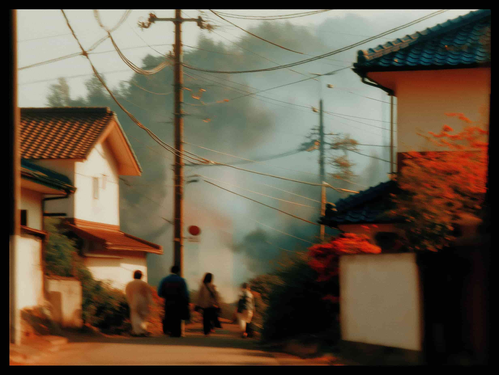

# **Life after the collapse**

_The infrastructure of civilization is being rewritten. Your choices in the next few years will determine which side of that rewrite you're on._

Execution collapsed. That's the story so far.

Intelligence became abundant. The hierarchy of professional value inverted. Knowledge work stopped being scarce. Judgment became everything. The middle class of competent executors began vanishing—leaving only those who can direct and those who do irreplaceable human work.

But the collapse doesn't stop at your career.

**When a fundamental resource shifts from scarce to abundant, everything built on that scarcity reorganizes.** Not just how you work, but how society structures itself, where people live, how governments function, what gets built, how we learn, what we value—even what it means to live a good life.

This isn't distant speculation. These trajectories are already in motion, some emerging in years, others in decades. But the direction is set, and you're living through the pivot point right now.

---

# **When work stops being necessary**

For all of human history, work meant survival. You worked to eat, to have shelter, to provide for others. The logic was simple: labor produces value, value produces income, income keeps you alive. Work and survival were inseparable.

That link is beginning to loosen.

Not overnight. Not evenly. And not inevitably—this depends on choices societies make. But as AI handles more knowledge work and automation handles more physical labor, the link between effort and survival starts to weaken. The question is: **what happens to work when it becomes less necessary?**

This has happened before. For centuries, painters were valued for technical skill—the ability to represent reality accurately. Then cameras arrived and made perfect representation trivial. Did painting die? No. It was liberated. Painters could stop competing with reality and explore what cameras couldn't capture: emotion, interpretation, meaning. Art stopped being about accuracy and became about expression.

AI is doing the same thing to work itself, to all cognitive and eventually physical labor.

When execution becomes cheap, **why you make something matters more than how well you make it.** The economy starts rewarding intention over technique, contribution over credentials.

## **Work becomes signal, not necessity**

In a world where survival is decoupled from employment, where you don't have to work to live, work transforms into something fundamentally different: **a signal of what you actually care about.**

Today, when someone says "I'm a lawyer" or "I'm in finance," it tells you nothing about their values. Are they passionate about justice or markets? Or just paying rent? You can't tell. Work is mixed up with economic necessity.

When basic needs are met without trading time for money, work becomes a clearer expression of who you are. If someone chooses to help people navigate legal complexity, it's because they care about that work, not because they'll starve otherwise. The choice becomes the signal.

This doesn't mean people stop working. It means motivation shifts from external pressure to internal drive. You work because something matters enough that you'd pursue it even without the threat of poverty.

## **What this requires from systems**

If this shift continues, it will eventually demand economic restructuring at a significant scale. Several models are being explored and debated:

**Universal basic systems** that provide foundational security. Politically contested and far from inevitable, but increasingly discussed.

**Reputation economies** where value comes from demonstrated track record and trust built over time, not hours logged or widgets produced.

**Contribution-based recognition** that rewards what's uniquely human: care, nuanced judgment, relationship-building, creativity.

None of this is guaranteed. These are possibilities, not predictions. But the pressure is building: as machines handle more of what's necessary for survival, societies will have to answer questions about work and meaning that previous generations could avoid.

## **The question you're not ready to answer**

This shift surfaces an uncomfortable question most people have spent their entire lives avoiding:

**If you didn't need money to survive, what would you actually do with your time?**

Many people don't know—they've never had to think about it. Work has always been necessity, not choice, and the idea of freely choosing what to do based purely on what matters to you feels foreign, even frightening. It raises identity questions that are easier to avoid.

But this is precisely the question the emerging future poses. When survival is secured through systems rather than hustle, purpose becomes the real work—not what you have to do, but what you want to do.

That's the profound shift at the heart of this transformation: from work as obligation to work as expression. Not the absence of work, but the complete transformation of what work means and why we do it.

---

# **The collapse of geographic necessity**

For two centuries, humanity has been concentrating in cities. The logic was clear: cities had the jobs, the infrastructure, the talent, the opportunities. If you wanted to build anything significant, you needed to be where the action was.

AI weakens that logic significantly.

When intelligence is accessible everywhere and more work becomes untethered from location, the economic reasons for cities start to soften. Not disappear—cities offer real benefits. But for more people, location becomes a choice rather than a necessity.

Cities served three essential functions, and AI is weakening all of them.

First, **concentration of talent.** You had to be where smart people were because collaboration required proximity. AI makes talent accessible from anywhere. Your team can be global. Intelligence is no longer geographically bound.

Second, **access to resources.** Physical goods, services, infrastructure were concentrated in cities. You went to where the resources were. Now autonomous logistics, drone delivery, and distributed manufacturing are making location less relevant. Resources become deliverable.

Third, **economic opportunity.** Jobs, customers, capital existed in cities. Remote work, digital platforms, and AI tools that let individuals compete with institutions are making opportunity location-independent. You can create value globally from a village as effectively as from a metro hub.

When the practical necessities disappear, what's left is preference, values, and the question of what kind of life you actually want to live.

## **What humans actually need, versus what cities provided**

Strip away economic necessity and you discover what humans actually crave.

Relationships at human scale—communities where you know your neighbors. Space to think without constant noise. Clean air. Visible stars. Access to nature. Time with family without long commutes.

These aren't luxuries. They're needs that got traded away because city opportunities were too significant to refuse. When opportunity becomes location-independent, the trade-off changes.

## **Global capability compressed to local scale**

Here's the inversion that's already beginning to emerge: **you no longer have to choose between global reach and local rootedness.**

A solo creator in a small town can serve thousands of customers worldwide. AI handles logistics, customer service, marketing. The human provides vision, craft, judgment—the things that can't be automated.

A local government with AI can deliver services as effectively as a large bureaucracy—perhaps more effectively because it's smaller and more responsive. AI handles coordination and analysis while humans focus on relationships.

A tiny team can compete with large corporations because AI democratizes capabilities that once required scale. Distribution, marketing, operations, analytics—these compress into tools anyone can use.

You get global capability with local life. Not isolated villages, but global reach compressed to human scale—communities where relationships matter.

This isn't speculation. Remote work proved location flexibility is viable. Satellite internet is bringing connectivity to rural areas. The infrastructure exists. The shift has begun—it just hasn't scaled yet.

Cities will remain—perhaps even more attractive as places optimized for what AI can't provide: serendipitous encounters, cultural density, human connection at scale. But they'll stop being the only path to opportunity. The choice becomes real in a way it hasn't been before.

---

# **The growing gap between technology and permission**

AI capabilities are doubling every few months. Traditional institutions move at the speed of committee meetings and political negotiation.

The gap between what's technically possible and what's legally permitted is widening fast.

**The constraint on transformation is no longer capability. It's permission.**

Medical AI systems can match or exceed human doctors in specific diagnostic tasks—reading certain scans, identifying certain patterns. But integrating them into healthcare involves more than regulatory approval: questions of liability, edge cases, and how AI fits into complex care decisions.

Self-driving vehicles have made enormous progress but still struggle with edge cases that human drivers handle intuitively. The regulatory frameworks are catching up, but the technology itself isn't yet ready for all conditions.

AI tutoring systems show real promise for personalized education. The constraints aren't purely regulatory—questions remain about effectiveness, equity of access, and what's lost when learning becomes purely algorithmic.

In some domains, the technology is ahead of institutions. In others, both are still catching up. But the gap between technological possibility and institutional adaptation is widening across the board.

## **Innovation is routing around permission**

This widening gap creates pressure that has to go somewhere.

When traditional banking moved too slowly, cryptocurrency emerged as an alternative. When universities couldn't adapt fast enough, online education platforms filled the gap. When healthcare systems were too rigid, telemedicine exploded.

The pattern is consistent: when institutions can't keep pace, technology builds around them, and parallel systems emerge that are often more effective for specific use cases.

This isn't always clean—some parallel systems fail spectacularly, some create new problems worse than what they solved, and moving fast without institutional checks can cause real harm. But the pressure is real: when the cost of waiting becomes too high, people stop waiting.

The question isn't whether this is good or bad. It's whether existing institutions can adapt fast enough to remain relevant, or whether they'll be progressively bypassed by systems that can move at the pace technology enables.

## **What institutional adaptation requires**

The solution isn't eliminating oversight—it's upgrading how it works. Shift from rigid rules to outcome-based standards, from 20-year cycles to systems that evolve continuously.

Some governments are adapting, creating test environments for fintech and AI. Those jurisdictions attract talent and capital. Those that cling to old models watch opportunity flow elsewhere.

---

# **When robots enter the physical world**

Intelligence becoming abundant is transformative. But intelligence alone doesn't build houses or deliver packages.

The next wave is teaching machines to act in the messy, unpredictable physical world.

When robots become as capable as AI models for cognitive work, the economics of physical goods collapse the same way.

Current industrial robots are narrow specialists—a robotic arm welds car parts, a warehouse bot moves boxes. Each is designed for one task. Adaptation is slow and costly.

Humanoid robots change that. The world is designed for human bodies—our buildings, tools, cities. If a robot can walk, grasp, and balance like humans, it can work anywhere we work. No need to redesign infrastructure.

Companies like Tesla, Figure, and Boston Dynamics are making rapid progress. The timeline is uncertain—robotics has a history of overpromising—but within the coming decade, general-purpose robots could begin handling warehousing, delivery, cleaning, and other routine tasks at scale.

This enables automation of general-purpose physical work at scale, everywhere.

## **The cost structure collapses**

When robots handle manufacturing, logistics, and delivery, the cost structure transforms.

Labor costs drop toward zero. Manufacturing becomes automated end-to-end. Logistics becomes autonomous.

What remains is raw materials and energy. Both are on trajectories toward abundance.

This doesn't happen instantly—there will be disruption, displacement, and painful transitions. But directionally, over years rather than generations, the cost of making and moving physical goods is collapsing the same way text, images, and analysis already have.

## **Energy as the remaining constraint**

Every transformation runs on energy. AI data centers, manufacturing robots, desalination plants—all require massive power. The constraint on physical abundance isn't technology anymore. It's energy.

But energy isn't fundamentally scarce. Our methods for capturing it have been limited, but that's changing.

Solar costs have dropped 90% in a decade. Battery storage is advancing fast. New nuclear designs are moving toward deployment. Fusion research is progressing, though commercial viability remains uncertain.

Add AI-optimized grids that predict demand and balance loads efficiently. The energy constraint that has limited civilization starts dissolving.

## **What abundant energy and robotics enable together**

When energy becomes cheap and robotics can act on it, possibilities that seemed out of reach become engineering problems: desalinating seawater at scale, growing food in unsuitable climates, large-scale carbon capture, space exploration becoming routine.

Physical goods follow the trajectory digital goods already have—cost of production collapses. Not everything becomes free, since complex goods still need design and scarce materials, but the fundamental constraint drops by orders of magnitude.

The question shifts from "Can we afford to make this?" to "Is this worth making? Does this align with our values?"

---

# **The unbundling of centralized systems**

For a century, the pattern has been concentration—talented people in cities, workers in offices, capital in large banks. The logic: concentration creates efficiency, scale reduces costs.

AI breaks that logic.

When coordination happens through intelligent systems rather than human hierarchies, concentration stops being necessary. What emerges is proliferation: thousands of small systems with capabilities that once required massive scale.

Information monopolies are fragmenting. Universities no longer monopolize education. Broadcasters no longer control distribution. Publishers no longer gatekeep content. Anyone with expertise and AI can create and distribute globally.

The barrier isn't access to tools—it's attention and trust when everyone has the same capabilities.

## **Micro-scale viability**

AI enables operations at micro-scale with capabilities that once required large organizations.

A solo creator can operate like a media company. AI handles editing, design, distribution—the human focuses on vision and connection.

A local government can deliver services more effectively than a large bureaucracy. AI manages coordination while humans focus on relationships.

A tiny business can compete with corporations. AI democratizes marketing, operations, customer service—capabilities that once required teams and enormous budgets.

Competitive advantage shifts from scale to focus. From serving millions adequately to serving hundreds exceptionally. From broad reach to deep connection.

## **What differentiates in a world of abundant tools**

When everyone has access to powerful tools, differentiation comes from somewhere deeper than technical execution.

**Taste over scale.** Better beats bigger. Deep resonance with a smaller audience becomes more valuable than shallow reach across a massive one.

**Identity over uniformity.** When capabilities are universal, what makes your work worth attention is your unique perspective and values.

**Trust over visibility.** The challenge isn't being seen—distribution is abundant. The challenge is being trusted.

Small becomes powerful because of its size, not despite it. The things that don't scale are becoming the things that matter most.

---

# **How we learn when knowledge adapts to us**

AI doesn't just change what's possible to know. It transforms how we learn.

For most of history, knowledge came in fixed formats. Books the same for everyone. Lectures identical for every student. Everyone consumed content the same way.

AI shatters this.

The same information can now be a visual diagram for visual thinkers. A logical argument for analytical minds. A narrative for storytellers. An interactive simulation for hands-on learners.

The knowledge doesn't change. The presentation adapts to how you think.

This isn't minor. A student who struggled with textbooks might thrive when the same content matches their style.

## **The risks of infinite personalization**

This power creates real dangers.

AI could tailor not just presentation but "truth" itself—filtering reality to match what you want to hear. Personalization becomes manipulation, creating echo chambers where uncomfortable facts never surface.

The same system that adapts to your learning style could adapt arguments to your biases. When the interface between you and knowledge is intelligent, whoever designs it shapes what you're capable of thinking.

This is already happening with algorithmic feeds. AI amplifies the risk by orders of magnitude.

**How do you stay open to challenging ideas when your information environment is optimized to never challenge you?** That's a problem we'll have to solve deliberately.

## **When thinking itself becomes optional**

This pattern has played out before with physical labor.

For millennia, physical strength was necessary for survival. Then machines arrived. Tractors replaced muscle. Factories automated manufacturing. Physical strength stopped being necessary.

Did humans stop caring about fitness? No. We built gyms. Invented marathons, CrossFit, obstacle course racing. People pay to exhaust themselves when they don't have to.

**What's no longer necessary for survival often becomes valued for meaning and identity.** Physical fitness went from practical requirement to personal aspiration.

The same shift is coming for mental effort.

You don't have to memorize facts. AI recalls anything. You don't have to write essays. AI drafts fluently. You don't have to solve complex math. AI computes instantly.

But choosing to think deeply when you could delegate becomes meaningful precisely because it's optional—a choice that reveals values.

## **The new question of what's worth doing yourself**

When AI can handle almost any cognitive task you give it, the fundamental question becomes: **What is worth doing yourself, even when AI could do it faster or better?**

Not "What can I do that AI can't?"—that list shrinks constantly. But "What do I want to do myself, because the doing matters?"

Some will write by hand, work through problems without AI, read deeply rather than query shallowly—not because it's efficient, but because the effort has meaning.

Intellectual effort transforms from obligation to expression. From "I have to think to survive" to "I choose to think because it makes me who I am."

---

# **What remains irreducibly human**

As AI approaches human cognitive performance, a question becomes unavoidable: what role do humans play in a world of abundant intelligence?

The standard framing is competitive. Will AI replace us? Make us obsolete?

But this assumes a zero-sum game.

**What if humans and AI are suited to different kinds of work, and the future is about complementarity rather than competition?**

AI excels at processing vast information, recognizing patterns, optimizing systems, executing with perfect consistency.

Humans excel at different things: physical experience, emotional depth, contextual judgment in ambiguous situations, caring about outcomes for reasons that aren't rational.

Which is better? Wrong question. The question is how they complement each other.

AI can manage global logistics, optimize energy grids, coordinate supply chains—tasks requiring computational power humans can't match.

Humans provide meaning and direction. Make judgment calls with incomplete information. Decide what's worth optimizing for. Care about outcomes in ways algorithms can't.

## **Partnership, not replacement**

AI handles optimization at massive scale. Humans handle contextual, emotional work requiring presence, empathy, and lived experience.

AI manages civilization's infrastructure—systems, logistics, coordination. Humans fill it with purpose and direction. The reasons why any of it matters.

Neither replaces the other.

## **What gets cleared away**

AI could handle much of what clutters modern life without adding meaning. The administrative overhead. The bureaucratic navigation. Managing schedules and logistics.

Imagine that cleared away.

What would you do with freed attention? Perhaps deep relationships. Community. Creating things because they express who you are. Experiencing life directly rather than managing complexity.

Not because you're forced to, but because you finally can.

## **What we're actually built for**

Strip away everything AI can handle, and what remains is what machines can't replicate.

Embodied presence. Being there with someone who needs you. Emotional connection from shared vulnerability. Caring about people for reasons that don't optimize anything.

Making art because it feels true. Helping someone because you want to.

These aren't consolation prizes. **These are what make life feel worthwhile.**

The future isn't humans becoming obsolete. It's humans being free to focus on what actually brings meaning, while AI handles the coordination our brains were never designed for.

---

# **The future you're choosing right now**

These transformations aren't separate. They're interconnected and compounding.

Work becomes choice, enabling geographic freedom, enabling human-scale communities. Distributed intelligence undermines centralized institutions. Robotics and abundant energy dissolve material scarcity.

**These trajectories are in motion.** Some will emerge in years. Others in decades. But the direction is set.

## **What's not guaranteed**

None of this is automatic—technology doesn't determine social outcomes, human choices do. Societies that adapt will thrive, while those that cling to structures designed for scarcity will fall behind as talent and capital flow toward environments where they're empowered.

## **Where you fit**

You don't need permission to participate—the tools exist. What's required is vision and action.

Build something you see missing. Question assumptions that no longer hold. The new world won't be built by large institutions waiting for consensus; it will be built by individuals taking action.

The revolution isn't coming. You're already living in it.

