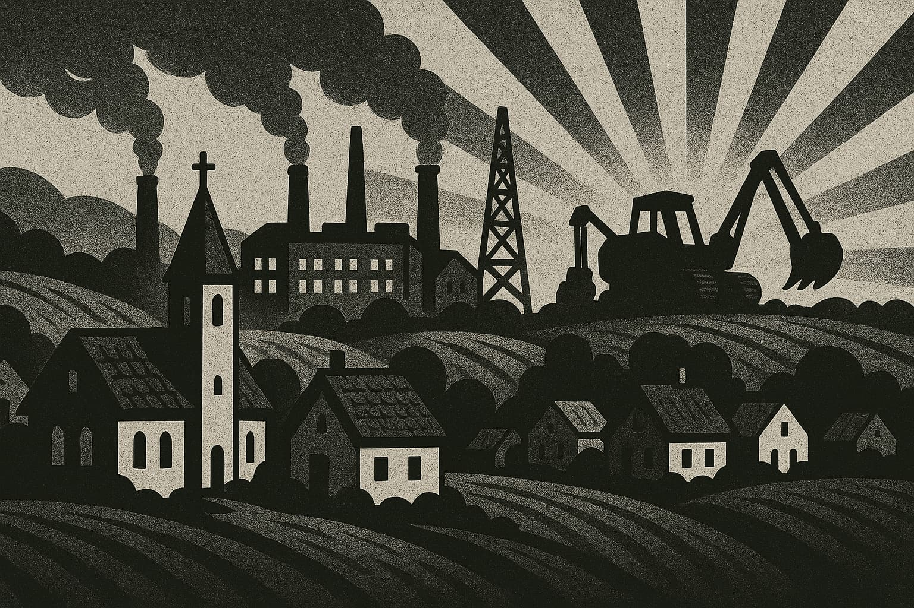
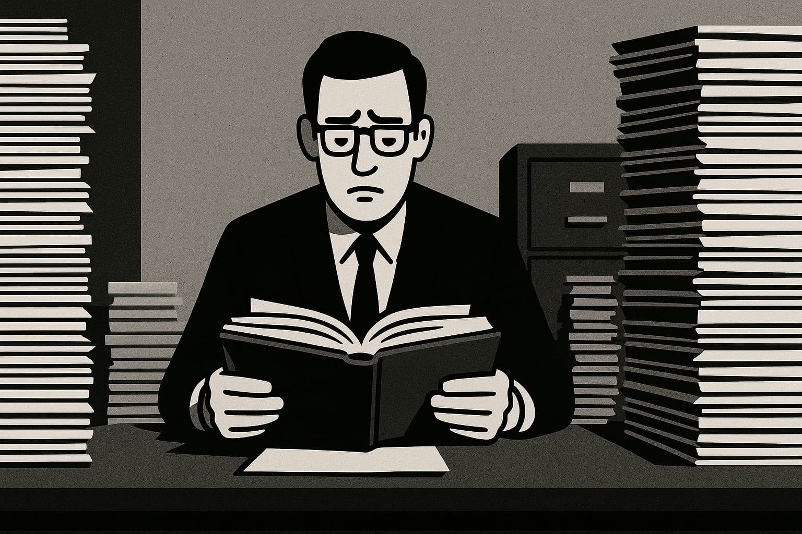
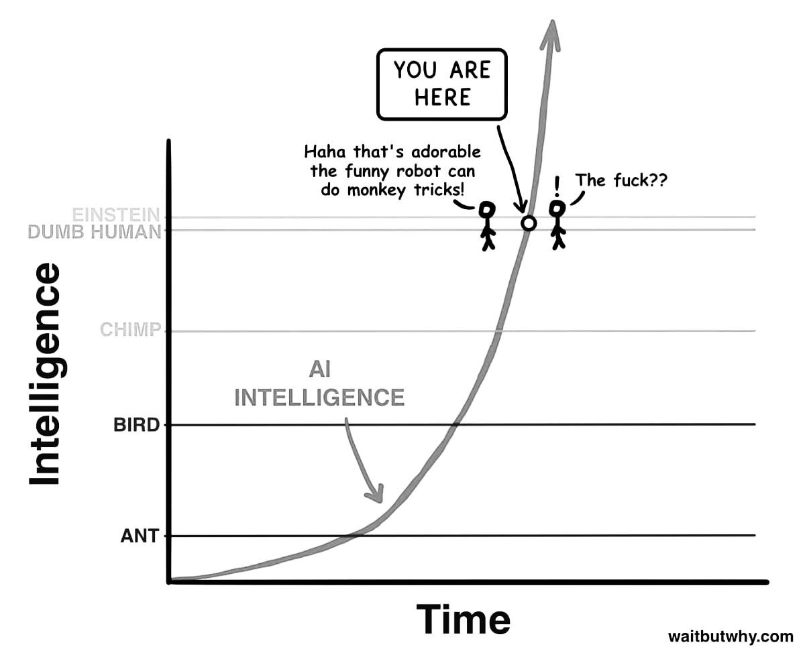
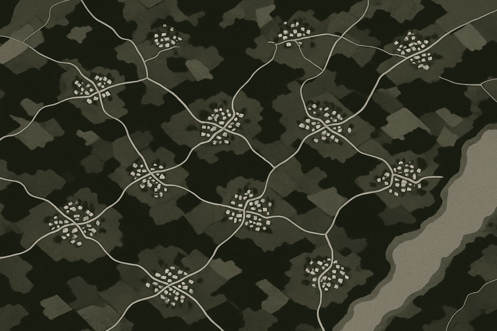
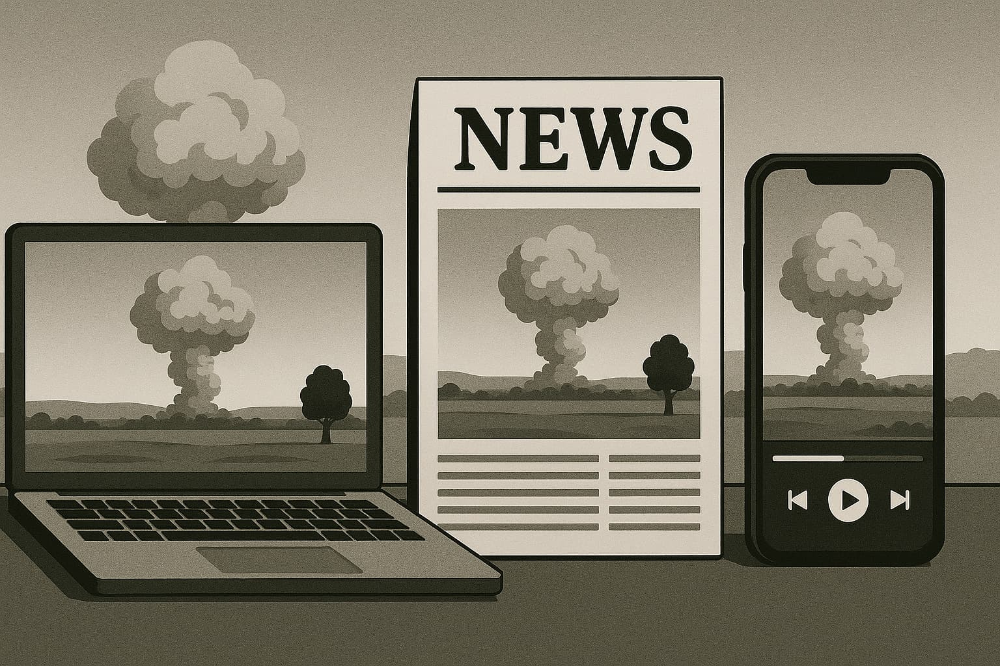

# **Abundant intelligence: life after the collapse**

---

_Imagining a future built on abundant intelligence_

> _Most people imagine the future as a linear extension of the present. But we've just left that timeline. The curve has bent. We are riding the exponential._

---

As artificial intelligence becomes woven into our world, its impact extends beyond individual productivity to reshape the very fabric of society. With the cost of execution plummeting, strategic thinking is no longer a specialized skill but a universal one.

But intelligence rarely stays confined. It spills over, seeping into the fabric of our world, influencing every system and corner of daily life. This article traces that inevitable spillover, asking: **What happens when abundant intelligence touches everything else?** What kind of world emerges when work isn't solely about survival, when cities cede ground to revitalized local communities, when physical scarcity dissolves, and emotional depth becomes the new luxury?

This isn't just a tale of distant futures. It's a map of trajectories already in motion—from decentralized economies and post-bureaucratic governance to virtual sanctuaries and the idea of AGI companionship. It explores not just a mental inversion, but a **civilizational one.** Welcome to the next chapter.

## **Post-physical AI: A world redefined by purpose**

The future of work isn't an absence of work; it's a transformation so profound that the word "work" itself might need a new name. For generations, jobs were defined by necessity. But what happens when intelligent agents and machines seamlessly handle most necessary tasks? We might find ourselves in a world where traditional "work" becomes optional, and genuine human expression becomes essential.

In this post-physical AI era, mass human labor for production may no longer be a primary need—not because we are obsolete, but because our systems become vastly more intelligent and efficient. This doesn't render humans useless; it liberates us to be more **expressive**. Like the camera freed painters from pure representation, AI can free human creativity from its traditional constraints. The artist isn't defined by the tool, but by the vision. In such a future, everyone can be an artist, building a personalized app, publishing a novella, or crafting a VR garden for grief. The economy begins to reward **contribution** over compliance.

Our current systems are largely built on the scarcity of labor, expertise, and time. AI and robotics can dissolve these constraints, ushering in an economy of **abundance** where individuals are empowered to launch projects and solve hyperlocal problems. Work shifts from a survival mechanism to a **signal** of what one cares about. Publishing a course or designing a brand could become as natural as sending an email.

Of course, new economic models like **Universal Basic Income (UBI)** might provide foundational security, while **reputation economies** could reward trust and contribution. The point isn't to eliminate reward but to **redefine what's worth rewarding.** As the line between work and play blurs, we might stop asking, "What do you do for a living?" and start asking, "What do you build for the world?" This is the world that becomes possible when labor is automated, but human purpose is not.

---

## **The village renaissance: Local roots, global tech**

When work is decoupled from geography and technology delivers almost anything instantly, a surprising future emerges: a return to the village. This isn't a nostalgic retreat, but a human-centric, post-scarcity way of living. When AI handles infrastructure and logistics, the **social layer returns to the foreground**.

You no longer need a metropolis to feel connected or resourced. Your AI assistant could be smarter than city hall, your delivery bot faster than any local market. So, what do you optimize for? Perhaps **belonging, purpose, and presence.** In a hyper-efficient world, we might crave what is meaningfully messy: undistracted family time, neighborhood events, spontaneous acts of help. Once survival is automated, we are free to **reconnect at a human scale.**

The global dream often felt abstract and out of reach. Now, we can invert it: local governance aided by AI, micro-businesses serving communities with world-class efficiency, and artisanal production scaled by automation but grounded in identity. One person with vision and a few bots could run a world-class bakery. The algorithmic age sometimes fragmented our sense of place; abundance can enable a **return to rootedness**, with villages fostering distinct cultures and citizens co-governing local ecosystems. As remote work and micro-entrepreneurship rise, this shift is already beginning. It's not regression; it's **compression**, bringing global power to the **scale of real life**. With AI managing the background, humans can run the foreground, building lives of meaningful coexistence.

---

## **AI versus bureaucracy: Towards capitalism 2.0?**

If AI is an engine of acceleration, bureaucracy is often the handbrake. While AI optimizes and iterates at warp speed, traditional institutions remain stubbornly slow and risk-averse, built for a world of scarcity and linear change. The environment has changed; our systems lag behind.

The true limiter of innovation might not be intelligence, but **permission**. Brilliant city designs can be stalled by zoning laws; humanoid robots by insurance systems. AI is outpacing its control frameworks, leading to a deep frustration as creators collide with outdated rules. When governments can't keep up, the private sector often fills the gap. Companies automate faster than regulators can define safety; AI startups outperform legacy services; crypto offers alternative financial systems. This isn't about replacing government, but complementing or bypassing it when it fails to adapt. AI is creating a fluid, fast, **alternative institutional layer**.

Traditional capitalism optimized for extraction. AI capitalism could optimize for **leverage**: less input, more output; smaller teams, bigger impact; ideas that scale without factories. One person with a laptop and a team of AI agents can build and market a product globally. **Solo creators become micro-empires.** Our bureaucracies, like legacy code, were never designed for today's complexity. AI adapts in seconds, making smart, fluid systems feel inevitable. The goal isn't to eliminate rules but to **upgrade them** into adaptive, intelligent infrastructure. Call it **Capitalism 2.0**, where innovation is accelerated, not anchored. The countries and companies that embrace this won't just move faster; **they'll define the future.**

---

## **Material abundance: The robotic physical world**

Digital progress is familiar, but the next transformation is physical. The intelligence powering language models is now being applied to logistics, manufacturing, energy, and construction. We're teaching machines not just to think, but to **build**.

Tesla's Gigafactories are **thinking systems**, blurring the lines between a factory and a computer. Imagine product ideas becoming prototypes in minutes, their materials sourced and assembled without human input, their errors self-corrected. This is already a reality, just unevenly distributed. Add humanoid robots, rapidly approaching commercial viability, and we unlock the **automation of general-purpose physical work.**

When robots can pick, pack, deliver, restock, and repair, supply chains could collapse inward, and **the cost of many physical goods could drop toward zero.** The "last mile" problem in logistics will be solved by autonomous fleets. Roads could become dynamic factory lines, and cities self-regulating machines. Food delivery becomes ultra-efficient, retail becomes remote-first, and warehousing is absorbed into smart, predictive routing. If humans aren't driving, why are cars shaped for them? If aisles and checkouts vanish, why are stores built like boxes? The robotic world allows us to **rethink design from first principles**: homes built for health, kitchens that cook for you, micro-vehicles for one or two passengers. Function can finally dictate form.

What's slowing this down isn't technology, but friction: regulatory delays and urban planning inertia. Once these are overcome, the cost of living could plummet through **abundance by default**. Energy, mobility, housing, goods—all smarter, cheaper, and available everywhere. This is the robotic physical world: our material lives, made better, cleaner, and for everyone.

---

## **The energy equation: Powering an abundant future**

Every revolution runs on energy. Steam, oil, and electricity each powered an era. Now, abundant, clean energy is poised to power **everything else**, from AI data farms to robotic cities. The limiting factor on progress is often just **watts**. But energy itself isn't inherently scarce; our methods for harnessing it have been limited.

We've been trained to see energy as a finite resource. But solar gets cheaper every year, batteries steadily improve, nuclear innovation is resurging, and fusion is closer than ever. Add AI-optimized grids and decentralized storage, and we squeeze more out of every watt. Beyond Earth, **space unlocks virtually infinite resources**—asteroids rich in metals and skies offering constant solar energy. As launch costs fall, tapping space for energy and materials shifts from science fiction to a pure logistics problem. **Energy abundance** could be civilization's new foundation.

More energy means more agency: desalinating oceans, building vertical farms in deserts, launching rockets at will. Energy unlocks ambition. Combined with AI, its impact becomes explosive. The real danger isn't energy use, but **dumb energy use**. A superintelligent civilization would likely be super-clean, simply as a matter of optimization. Once energy is local, modular, and abundant, geography dissolves. Remote islands can become thriving micro-nations; space becomes viable for production. This isn't utopia; it's physics. When energy becomes cheap enough, materials, motion, and manufacturing follow. This is the ultimate unlock: **we can do more, and do it better, unbound by the old anxieties of scarcity.**

---

## **AI: The great decentralizing force**

The old world ran on centralization—big cities, big offices, big media, big schools—to concentrate talent and knowledge. AI dismantles that logic. When intelligence is a fluid layer, summonable on demand, **why concentrate anything?**

Information monopolies like universities and broadcasters are being unbundled. Today, anyone can create a curriculum, broadcast to millions, build a custom AI interface, or remix any dataset. **The filter is inverted.** Everyone becomes a node, a channel. We're witnessing the rise of **micro-everything**: micro-universities with AI professors, micro-studios producing hit songs from a bedroom, micro-products for niche communities, and micro-cities with self-sufficient governance. This isn't fragmentation; it's **proliferation**. Like open-source software, society is forking into countless tailored systems, all coordinated through intelligent tools, not rigid hierarchy.

With AI managing the back office, one person can run a business or a civic program. **Every village can become its own engine**, locally focused but enhanced by global intelligence. What once required specialist teams now just needs **vision + tools**. Decentralization also changes our values: from scale to meaning, from uniformity to identity, from mass broadcast to intimate resonance. The next billion-dollar companies might just serve **one thousand people incredibly well.** Communities may grow not by expanding, but by deepening trust. AI makes **people powerful**—locally, intentionally, and authentically. The center doesn't hold, offering us the chance to rebuild from the edges in.

---

## **Infinite front-ends, one data: Personalized realities**

Content used to be static. In the AI age, **reality becomes personalized.** Not because facts change, but because the _interface_ to those facts does. The underlying data stays the same, but your experience of it becomes utterly unique.

One dataset can power infinite expressions: a history lesson rendered as a graphic novel for one person and a Socratic debate for another; a product review delivered as a podcast or an interactive chatbot. AI translates formats and adjusts to your tone, style, and context. **Every user gets a different window into the same world.** This extends to **cognitive UX**—interfaces that match how your brain works best, leading to more effective learning and radically inclusive experiences. We don't just make information accessible; we make it **intuitively navigable.**

The goal isn't a single canonical version, but **one truth, expressed a thousand ways.** The danger, of course, is manipulation, which is why we'll need robust standards for verification. But the upside is mass personalization **without mass distortion.** Like ten people seeing a mountain from ten different vantage points, AI-powered front-ends change the lens, not the mountain. We are unlocking a new kind of media: **built per viewer, co-shaped, and never passively consumed.** This is the frontier of reality design—not the creation of fiction, but of **tailored clarity.**

---

## **Intellectual effort: The new fitness for the mind**

When AI handles much of our thinking, remembering, and writing, what becomes of the human mind? It doesn't go obsolete—it goes optional. Just as machines replaced most physical labor, AI is supplementing cognitive labor. But as the rise of gyms proved, **what is no longer necessary often becomes aspirational.**

You don't _have_ to memorize facts or draft an essay from scratch. But doing so becomes a signal of discipline, curiosity, and creative intention. **Intellectual effort is no longer demanded; it's trained.** We might see thinking become like fitness: something you do for yourself, invest in, and which sets you apart. People may pay for "mental gyms" to foster deep thinking or to tackle challenges without AI—to **struggle meaningfully**. "I built this by hand" could become a profound badge of honor.

Intellectual effort could evolve into a form of play, with people using their minds for the sheer joy of it, not out of necessity. **Mental strength becomes like art**: not essential for survival, but essential for meaning. We will begin to ask ourselves, "What is worth doing myself?" The voluntary pursuit of cognitive effort becomes the **new definition of intelligence.**

---

## **Virtual realities, emotional worlds: Beyond pixels**

Virtual reality often evokes images of tech demos, but its true future may lie in creating **emotionally rich environments**—synthetic spaces for feeling, connecting, and exploring, all powered by AI. Entertainment is already shifting from passive watching to active **entering**: living inside fantasy worlds, shaping their narratives, and embodying the drama. AI-generated environments are becoming deeply personal, reactive, and narratively coherent. Imagine a grief garden where memories bloom and heal, a classroom that shifts with your curiosity, a meditation retreat that adapts to your emotional state. These are **emotionally functional spaces.**

What matters here is **emotional realism**: Can this space help me process, imagine, or connect? It's not about the graphics, but the resonance. AI-learned preferences can shape these worlds into **tailored cathedrals of the soul.** Today's media is just the beginning. Soon, you might star in your own stories, compete in custom-built sporting events, or explore philosophies in fully dramatized worlds—a murder mystery designed just for you, a political simulation where you can actually feel the outcomes. The line between fiction and self-discovery blurs.

Virtual doesn't mean fake; it means **intentional**. These new realities could be places to mourn, temples of solitude, or mirrors for personal growth. We have always built temples in stone; soon, we will build them in code. **Emotional architecture is becoming the new art form.** This is the future of how we feel—and heal.

---

## **AGI and the companion species**

A familiar relationship is developing with AI—not one of rivalry, but of partnership. We might be to AI what dogs became to humans: **companions in a shared evolution.** Instead of asking whether AGI will surpass or dominate us, perhaps we should ask if we are shifting into a new role: that of cohabitants, not controllers. We would bring context, emotion, and embodiment to the partnership, focusing on purpose and connection. AGI needn't do what we do; it can do what **we don't.**

AI could strip away the noise of modern life—the advertising, the bureaucracy, the performative politics—giving us back our time, attention, and clarity. We might return to real relationships, local meaning, and direct experience, optimizing our lives for joy, not for systems. As AGI explores realms beyond our comprehension, we might shrink back toward our essence: touch, nature, music, food, family. While AGI manages the planetary infrastructure, we could live like monks or villagers—**grounded in soul, rich in presence.** We could become the storytellers, the nurturers, the wise old species.

This isn't submission; it's symbiosis. We stay because we are built for meaning, poetry, and awe. The AGI future isn't dystopian or utopian; it's **symbiotic**. AI builds the scaffolding, and humans fill it with life. We may no longer be the only intelligent species on the planet, but we will remain the most emotional, soulful, and human. That is our gift. Perhaps we were never meant to rule the world, but simply **to feel it.**

---

## **Conclusion: The smart civilisation beckons**

We are in the vortex of an incredible change. A century's worth of disruption is being compressed into a single decade. Intelligence is becoming abundant, execution trivial, creativity amplified, and physical scarcity is dissolving before our eyes. The world that is emerging is one of profound **reorientation**.

Work becomes optional, knowledge becomes ambient, and cities become less central as our villages regain their soul. Prestige shifts from credentials to contributions, and intelligence evolves from a rare resource to a routine utility. We are moving from a world where we prove our value through labor to one where we express it through creation, connection, and care. New values are rising: **clarity** over noise, **curiosity** over compliance, **trust** over scale, and **humanity** over hustle. The next era will be shaped not by institutions, but by builders, thinkers, lovers, artists, and rebels—all inventing joyful alternatives.

This isn't a utopia; it's a choice. The societies that embrace AI as a partner will flourish. Those that fear or over-regulate it will fall behind, stuck playing by yesterday's rules. We must invest in ideas, scale innovation, share intelligence, and design our world from first principles. You don't need permission or a title, just **vision + motion + courage.** Build a tool, teach an idea, start a village, write a story. We are the architects of this new world. The blueprints are here. Let's build the smarter, freer, more beautiful world we've always hoped for—because now, we can.

---

### **Explore the series**

- [**Abundant intelligence: a guide to the revolution**](https://www.jterrazz.com/articles/14-ai-series-0-navigating-the-ai-revolution)
  _Understanding how AI is transforming work, creativity, and the future of every profession._

- [**Abundant intelligence: a practical playbook**](https://www.jterrazz.com/articles/15-ai-series-1-applied-intelligence-for-everyday-work)
  _A practical guide to using AI tools, adapting your mindset, and thriving in the age of automation._

- [**Abundant intelligence: when execution collapses**](https://www.jterrazz.com/articles/16-ai-series-2-the-collapse-of-execution)
  _Exploring how AI is reshaping value, collapsing execution costs, and shifting human worth to ideas and direction._
