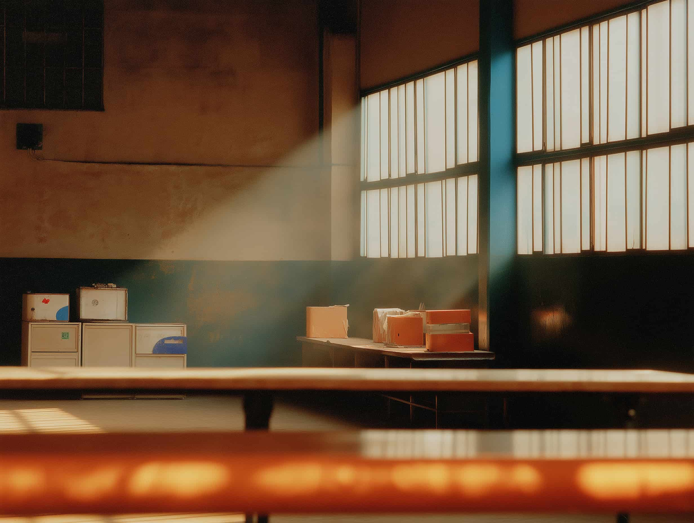
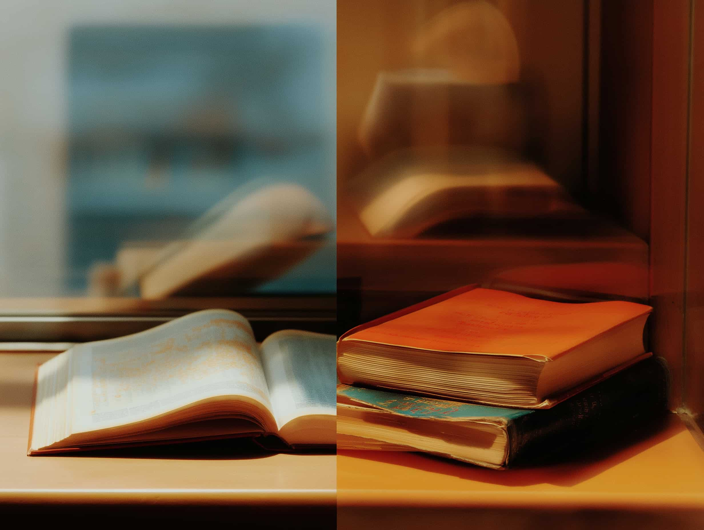
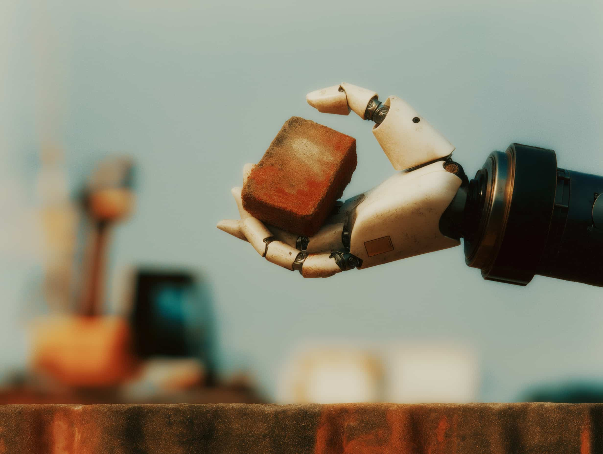

# **Que reste-t-il quand les machines gèrent tout ?**

_La question n'est pas de savoir si l'IA fera votre travail. C'est de savoir ce que vous ferez quand le travail deviendra optionnel._

Durant toute l'histoire humaine, travail signifiait survie. Le labeur produisait de la valeur, la valeur produisait un revenu, et le revenu vous maintenait en vie. Travail et survie étaient fusionnés—le fait central organisant l'existence humaine.

**Ce lien est en train de se rompre.**

Cela n'arrivera pas du jour au lendemain, ni de manière uniforme. Mais à mesure que l'IA absorbe le travail du savoir et que la robotique résout le travail physique, la connexion entre l'effort et la survie s'affaiblit. Finalement, elle cassera.

Cela nous force à affronter une question à laquelle nous n'avons jamais eu à répondre à grande échelle : **Que se passe-t-il quand le travail cesse d'être nécessaire ?**

---

# **Le précédent photographique**

C'est déjà arrivé.

Pendant des siècles, les peintres étaient valorisés pour leur compétence technique—la capacité à représenter la réalité avec précision sur une toile. Les portraits commandaient des prix élevés car capturer une ressemblance exigeait des années de formation rigoureuse. L'exécution technique était le but.

**Puis les appareils photo sont arrivés.**

Soudain, la représentation visuelle parfaite est devenue triviale. Instantanée. Mécanique. N'importe qui pouvait capturer la réalité exactement telle qu'elle apparaissait.

La peinture est-elle morte ? Non. **Elle a été libérée.**

Les peintres ont arrêté de rivaliser avec la réalité et ont commencé à explorer ce que l'appareil photo ne pouvait *pas* capturer : l'émotion, l'interprétation, l'abstraction, le sens. L'art a cessé de porter sur l'exactitude technique pour porter sur l'expression et l'intention. Les Impressionnistes, les Expressionnistes, toute la trajectoire de l'art moderne—tout cela a été rendu possible parce que la reproduction mécanique a libéré les peintres du fardeau de la documentation.

**L'IA fait la même chose au travail lui-même.**

Quand l'exécution devient bon marché—quand n'importe qui peut produire une écriture, une analyse, un design ou du code compétents—la question passe de "à quel point savez-vous faire cela ?" à **"pourquoi faites-vous cela tout court ?"**

L'économie commence à récompenser l'intention plutôt que la technique. Le sens plutôt que les métriques. La contribution authentique plutôt que les diplômes.

---

# **Le travail devient un signal**

Aujourd'hui, quand quelqu'un dit "je suis avocat" ou "je travaille dans la finance", cela ne vous dit presque rien sur qui il est. Est-il passionné par la justice ? Fasciné par les marchés ? Ou rembourse-t-il juste son prêt étudiant ?

Impossible de le savoir. Le travail est confondu avec la nécessité économique. La motivation est obscurcie.

**Quand la survie est découplée de l'emploi, le travail se transforme en signal.**

Si quelqu'un choisit de passer son temps fini à naviguer dans la complexité juridique alors qu'il n'y est pas *obligé*, c'est parce qu'il s'en soucie vraiment. Le choix lui-même devient l'information.

Cela ne signifie pas que les gens arrêtent de travailler. Cela signifie que la motivation passe de la contrainte externe à l'impulsion interne.

*   De "Je dois" à "Je veux".
*   De l'obligation à l'expression.

---

# **Le Paradoxe du Fitness**

Voici un modèle qui prédit ce qui arrive.

Pendant des millénaires, la force physique était nécessaire à la survie. L'agriculture exigeait des muscles. La construction exigeait de la puissance. Si vous étiez faible, vous ne mangiez pas.

Puis les machines sont arrivées. Les tracteurs ont remplacé les muscles. Les usines ont automatisé la fabrication. La force physique a cessé d'être nécessaire à la survie.

**Les humains ont-ils cessé de se soucier de leur forme physique ?**

L'inverse s'est produit. Nous avons construit des salles de sport. Nous avons créé des industries entières autour de l'effort physique volontaire. Nous avons inventé les marathons, le CrossFit et les courses d'obstacles. Les gens paient maintenant pour s'épuiser physiquement—précisément parce qu'ils n'y sont pas obligés.

**Ce qui n'est plus nécessaire à la survie devient valorisé pour le sens et l'identité.**

Le même changement arrive pour l'effort mental.

Vous n'avez pas besoin de mémoriser des faits ; l'IA se souvient de tout. Vous n'avez pas besoin de résoudre des mathématiques complexes ; l'IA calcule parfaitement.

Mais choisir de penser profondément quand vous pourriez déléguer—choisir de lutter avec un problème quand vous pourriez juste demander la réponse—devient signifiant *parce que* c'est optionnel.

L'effort intellectuel se transforme d'une obligation en une identité. De "je pense pour être payé" à "je pense parce que cela fait de moi qui je suis".

---

# **Le Partenariat**

À mesure que les capacités de l'IA s'étendent, le cadrage habituel est compétitif : *L'IA va-t-elle nous remplacer ?*

Cela suppose un jeu à somme nulle. Le futur ne concerne pas le remplacement ; il concerne la **complémentarité**.

*   **L'IA excelle à :** Traiter l'information, reconnaître des modèles, optimiser des systèmes et exécuter avec une cohérence parfaite à grande échelle.
*   **Les humains excellent à :** L'expérience incarnée, la profondeur émotionnelle, le jugement contextuel, et se soucier des résultats pour des raisons qui ne sont pas rationnelles.

L'IA peut gérer la logistique mondiale, optimiser les réseaux énergétiques et coordonner les chaînes d'approvisionnement. Les humains fournissent le sens et la direction. Nous décidons *pourquoi* optimiser. Nous nous soucions des résultats d'une manière impossible pour les algorithmes—car se soucier n'est pas un calcul.

Considérez le partenariat entre les humains et les chiens. Aucune espèce n'est devenue obsolète. Les chiens ont apporté des sens accrus et de la loyauté ; les humains ont apporté des outils et de la planification. Ensemble, les deux sont devenus plus capables.

L'IA et les humains forment une symbiose similaire. L'IA gère l'infrastructure de la civilisation. Les humains la remplissent de but.

---

# **Le grand ménage**

Imaginez si la surcharge administrative de la vie moderne disparaissait simplement.

Les heures passées à naviguer dans la bureaucratie. La planification. La logistique. La gestion des mots de passe. La charge cognitive qui draine l'énergie sans créer de sens.

**Que feriez-vous de cette attention libérée ?**

Peut-être vous concentreriez-vous sur ce qui semble authentiquement humain. Les relations profondes. La communauté. Créer des choses parce qu'elles expriment qui vous êtes. Faire l'expérience de la vie directement plutôt que de gérer sa complexité.

Pas parce que les circonstances économiques vous y forcent. Mais parce que vous le *pouvez* enfin.

---

# **La question à laquelle vous n'êtes pas prêt à répondre**

Ce changement fait remonter quelque chose d'inconfortable.

**Si vous n'aviez pas besoin d'argent pour survivre, que feriez-vous réellement de votre temps ?**

Beaucoup de gens ne savent pas. Ils n'ont jamais eu à y répondre. Le travail a toujours été une nécessité, pas un choix. L'idée de choisir librement son but semble étrangère. Voire effrayante.

Mais c'est précisément la question que le futur pose.

Quand les machines gèrent la nécessité, le but humain devient le vrai travail.

Enlevez tout ce qui peut être automatisé, et que reste-t-il ?
*   La présence incarnée.
*   Être là pour quelqu'un qui a besoin de vous.
*   La connexion émotionnelle.
*   Faire de l'art parce que cela sonne juste.
*   Aider quelqu'un simplement parce que vous en avez envie.

Ce ne sont pas des lots de consolation dont on se contente parce qu'on ne peut pas rivaliser avec l'IA. **Ce sont les choses qui rendent la vie digne d'être vécue.**

---

# **Le Changement**

Les transformations de cette série sont connectées.

1.  Quand l'exécution ne coûte plus rien, le milieu s'effondre. La valeur migre vers les extrêmes : **le discernement pur** ou **l'humanité pure**.
2.  Quand le savoir devient gratuit, l'interprétation devient précieuse. Ce n'est pas ce que vous savez, mais **comment vous jouez les notes**.
3.  Quand le travail cesse d'être une question de survie, il devient une question d'**expression**.

Le monde passe de la récompense de *ce que vous pouvez faire* à la récompense de *qui vous êtes*—votre discernement, votre goût, vos relations, votre capacité à vous soucier des autres.

---

# **À vous de jouer**

Vous n'avez pas besoin de permission pour participer à ce changement. Les outils existent. L'intelligence est disponible.

Ce qui est requis, c'est de répondre aux questions inconfortables :
*   Que feriez-vous si vous n'aviez pas besoin d'argent ?
*   Quel travail choisiriez-vous comme expression plutôt que comme obligation ?
*   De quoi vous souciez-vous assez pour le poursuivre quand personne ne vous y force ?

Le futur ne concerne pas l'obsolescence des humains. Il concerne la liberté retrouvée des humains de se concentrer sur ce pour quoi nous sommes faits—pendant que les machines gèrent ce pour quoi elles sont faites.

**Pas de compétition. Un partenariat.**
**Pas de remplacement. Une libération.**

La révolution n'arrive pas. Vous êtes dedans.

La seule question est de savoir si vous allez la traverser passivement, ou l'utiliser délibérément pour construire une vie autour de ce qui compte vraiment.

**Cette réponse, c'est à vous de l'écrire.**
