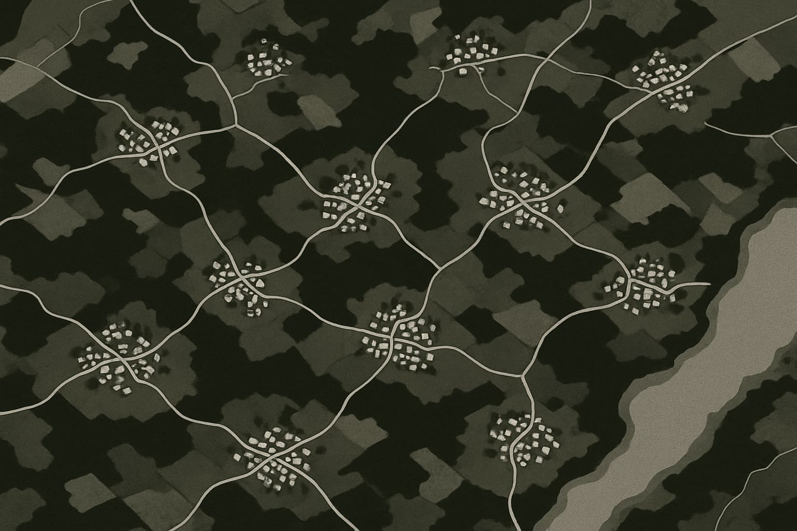

# **Intelligence abondante: la vie après l'effondrement**

---

_Imaginer un avenir fondé sur une intelligence abondante_

> _La plupart des gens imaginent l'avenir comme une simple extension linéaire du présent. Mais nous venons de quitter cette trajectoire. La courbe s'est infléchie. Nous surfons désormais sur la vague de l'exponentielle._

---

Alors que l'intelligence artificielle s'intègre à notre monde, son impact dépasse la simple productivité individuelle pour refaçonner le tissu même de la société. Avec l'effondrement des coûts d'exécution, la pensée stratégique n'est plus une compétence de niche, mais devient universelle.

Mais l'intelligence reste rarement confinée. Elle déborde, s'infiltrant dans le tissu même de notre monde, influençant les systèmes et notre vie quotidienne. Cet article retrace ce débordement. Elle pose une question fondamentale: **Que se passe-t-il lorsque cette intelligence abondante imprègne tout le reste?** Quel genre de monde émerge lorsque le travail n'est plus uniquement une question de survie, lorsque les métropoles cèdent du terrain à des communautés locales revitalisées, lorsque la rareté physique se dissout et que la profondeur émotionnelle devient une nouvelle forme de luxe?

Ce n'est pas un simple récit de futurologie. C'est la cartographie de trajectoires déjà à l'œuvre–des économies décentralisées à la gouvernance post-bureaucratique, des sanctuaires virtuels à l'idée d'une AGI comme compagne. Cet article explore non seulement une inversion mentale, mais aussi une **inversion civilisationnelle**. Bienvenue dans le prochain chapitre de ce profond basculement.

## **Le monde post-physique: l'IA au service du sens**

L'avenir du travail n'est pas son absence, mais une transformation si profonde que le mot " travail " lui-même devra peut-être être réinventé. Pendant des générations, l'emploi fut défini par la nécessité. Mais que se passera-t-il lorsque des agents intelligents et des machines accompliront la plupart des tâches nécessaires avec brio? Nous pourrions voir naître un monde où le travail traditionnel deviendrait optionnel, et où l'expression humaine authentique deviendrait, elle, essentielle.

Dans cette ère post-physique, le labeur humain de masse pour la production pourrait ne plus être un besoin fondamental, non par obsolescence, mais par l'avènement de systèmes infiniment plus capables. Cela ne rend pas les humains inutiles; cela nous libère pour nous consacrer à ce qui est purement **expressif**. Tout comme l'appareil photo a affranchi les peintres de la simple représentation, l'IA peut libérer la création de ses contraintes traditionnelles. L'artiste n'est pas défini par son outil, mais par sa vision. Dans un tel avenir, chacun peut devenir un artiste: créer une application sur mesure, publier une nouvelle ou concevoir un jardin en réalité virtuelle pour accompagner un deuil. L'économie commence à récompenser la **contribution** plutôt que la conformité.

Nos systèmes actuels reposent sur la rareté–de la main-d'œuvre, de l'expertise, du temps. L'IA et la robotique peuvent dissoudre ces contraintes, inaugurant une économie de l'**abondance**, où les individus ont le pouvoir de lancer des projets et de résoudre des problèmes à l'échelle hyperlocale. Le travail cesse d'être un mécanisme de survie pour devenir un **signal** de ce qui nous importe vraiment. Publier un cours en ligne ou concevoir une marque pourrait devenir aussi naturel que d'envoyer un e-mail.

Bien sûr, de nouveaux modèles comme le **Revenu de Base Universel (UBI)** pourraient offrir un socle de sécurité, tandis que des **économies de la réputation** pourraient récompenser la confiance et l'apport de chacun. Le but n'est pas d'abolir la récompense, mais de **redéfinir ce qui a de la valeur**. Alors que la frontière entre travail et loisir s'estompe, nous pourrions cesser de demander " Que faites-vous dans la vie? " pour commencer à interroger: " Qu'apportez-vous au monde? ". Cela devient possible lorsque le labeur est automatisé, mais que la quête de sens, elle, ne l'est pas.

---

## **La renaissance du village: racines locales et technologie globale**

Lorsque le travail se décorrèle de la géographie et que la technologie livre presque tout, instantanément, une direction surprenante se dessine: le retour au village. Non pas une retraite nostalgique, mais un mode de vie post-rareté, profondément humain. Quand l'IA gère les infrastructures et la logistique, **la dimension sociale revient au premier plan**.

Plus besoin d'une métropole pour être connecté ou pourvu de ressources. Votre assistant IA pourrait être plus pertinent que la mairie, votre robot de livraison plus rapide que les commerces locaux. Dans ce cas, que cherchons-nous à optimiser? Peut-être l'**appartenance, le sens et la présence**. Dans un monde hyper-efficace, nous pourrions aspirer à ce qui est précieusement imparfait: le temps passé en famille sans distraction, les fêtes de quartier, l'entraide spontanée. Une fois la survie automatisée, nous sommes libres de **nous reconnecter à l'échelle humaine**.

Le rêve de la mondialisation a souvent semblé abstrait. Nous pouvons désormais inverser la perspective: une gouvernance locale assistée par l'IA, des micro-entreprises servant leur communauté avec une efficacité de classe mondiale, une production artisanale mise à l'échelle par l'automatisation mais ancrée dans une identité. Une seule personne, dotée d'une vision et de robots, pourrait tenir une boulangerie. L'ère algorithmique a parfois fragmenté notre sentiment d'appartenance; l'abondance peut permettre un **retour à l'enracinement**, avec des villages cultivant des cultures distinctes et des citoyens cogérant leurs écosystèmes. Avec l'essor du télétravail et du micro-entrepreneuriat, ce mouvement est déjà enclenché. Ce n'est pas une régression, mais une **compression**: la puissance du global ramenée à l'échelle du quotidien. L'IA gère l'arrière-plan, laissant les humains animer le premier plan pour bâtir une coexistence pleine de sens.

---

## **L'IA contre la bureaucratie: vers un capitalisme 2.0?**

Si l'IA est un moteur d'accélération, la bureaucratie est souvent son frein à main. Tandis que l'IA optimise et itère à la vitesse de la lumière, les institutions traditionnelles restent lentes et averses au risque, conçues pour un monde de rareté et de changement linéaire. L'environnement a changé; nos systèmes sont restés figés.

Le véritable obstacle à l'innovation n'est peut-être pas l'intelligence, mais la **permission**. Des projets urbains parfaits peuvent être paralysés par des réglementations d'urbanisme, le déploiement de robots humanoïdes par des systèmes d'assurance. L'IA dépasse ses cadres de contrôle, créant une immense frustration lorsque les créateurs se heurtent à des règles obsolètes. Quand les gouvernements ne peuvent suivre le rythme, le secteur privé comble souvent le vide. Les entreprises automatisent plus vite que les régulateurs ne définissent la sécurité; les startups d'IA surpassent les services historiques; les cryptomonnaies offrent des systèmes alternatifs. Il ne s'agit pas de remplacer le gouvernement, mais de le compléter ou de le contourner lorsqu'il échoue à s'adapter. L'IA est en train de créer une **couche institutionnelle** fluide et rapide.

Le capitalisme traditionnel optimisait l'extraction. Celui de l'IA pourrait optimiser l'**effet de levier**: moins d'efforts, plus de résultats; des équipes plus petites, un impact plus grand; des idées qui se déploient à l'échelle mondiale sans usines. Une seule personne, armée d'un ordinateur portable et d'agents IA, peut créer et commercialiser un produit à l'échelle planétaire. **Les créateurs solo deviennent des micro-empires.** Nos bureaucraties, tel un code informatique hérité, n'ont pas été conçues pour la complexité d'aujourd'hui. L'IA, elle, s'adapte en quelques secondes, rendant les systèmes intelligents inéluctables. L'objectif n'est pas d'éliminer les règles, mais de **les mettre à niveau** pour en faire des infrastructures adaptatives et intelligentes. Appelons cela le **Capitalism 2.0**, où l'innovation est accélérée, et non plus freinée. Les pays et les entreprises qui l'adopteront n'iront pas seulement plus vite; **ils définiront l'avenir**.

---

## **L'abondance matérielle: le monde physique robotisé**

Le progrès numérique nous est familier, mais la prochaine transformation concerne le monde physique. L'intelligence qui anime les modèles de langage est maintenant appliquée à la logistique, à la fabrication, à l'énergie et à la construction. Nous apprenons aux machines non seulement à penser, mais aussi à **construire**.

Les Gigafactories de Tesla sont des **systèmes pensants**, qui brouillent les frontières entre l'usine et l'ordinateur. Imaginez des idées de produits se transformant en prototypes en quelques minutes, des matériaux sourcés et assemblés sans intervention humaine, des erreurs auto-corrigées. C'est déjà une réalité, bien qu'inégalement répartie. Ajoutez-y les robots humanoïdes, qui approchent de leur viabilité commerciale, et nous débloquons l'**automatisation du travail physique non spécialisé**.

Lorsque les robots pourront cueillir, emballer, livrer, réapprovisionner et réparer, les chaînes d'approvisionnement pourraient s'effondrer sur elles-mêmes, et **le coût de nombreux objets physiques tendre vers zéro**. Le problème du " dernier kilomètre " en logistique sera résolu par des flottes autonomes. Les routes pourraient devenir des chaînes de montage, les villes des machines dynamiques. La livraison de repas deviendra ultra-efficace, le commerce de détail entièrement dématérialisé, l'entreposage absorbé par un routage intelligent. Si les humains ne conduisent plus, pourquoi les voitures ont-elles une forme pensée pour eux? Si les rayons et les caisses disparaissent, pourquoi les magasins sont-ils de simples boîtes? Le monde robotisé permet de **repenser le design à partir des principes premiers**: des maisons conçues pour la santé, des cuisines qui cuisinent toutes seules, des micro-véhicules pour un ou deux passagers. La fonction peut enfin dicter la forme.

Ce qui ralentit ce mouvement, ce n'est pas la technologie, mais les frictions: retards réglementaires, inertie de l'urbanisme. Une fois ces obstacles surmontés, le coût de la vie pourrait chuter drastiquement grâce à l'**abondance par défaut**. Énergie, mobilité, logement, biens–tout deviendra plus intelligent, moins cher et accessible partout. C'est cela, le monde physique robotisé: des choses mieux faites, plus propres, et pour tous.

---

## **L'équation énergétique: alimenter un avenir d'abondance**

Chaque révolution se nourrit d'énergie. La vapeur, le pétrole, l'électricité–chacun a alimenté une ère. Aujourd'hui, une énergie propre et abondante s'apprête à alimenter **tout le reste**, des fermes de serveurs d'IA aux villes robotisées. Le facteur limitant est souvent une question de **watts**. Mais l'énergie elle-même n'est pas intrinsèquement rare; c'est notre capacité à l'exploiter qui l'a été.

On nous a appris à voir l'énergie comme une ressource finie. Pourtant, le solaire devient toujours moins cher, les batteries s'améliorent, l'innovation nucléaire renaît et la fusion est plus proche que jamais. Ajoutez à cela des réseaux électriques optimisés par l'IA et un stockage décentralisé, et vous obtenez une **meilleure utilisation**. Au-delà de la Terre, **l'espace débloque des ressources quasi infinies**–astéroïdes riches en métaux, énergie solaire constante. À mesure que les coûts de lancement chutent, puiser dans l'espace pour l'énergie et les matériaux passe de la science-fiction à un simple enjeu logistique. L'**abondance énergétique** pourrait devenir le nouveau socle de la civilisation.

Plus d'énergie signifie plus de pouvoir d'action: désaliniser les océans, créer des fermes verticales dans les déserts, lancer des fusées. L'énergie libère l'ambition. Combinée à l'IA, son impact est explosif. Le vrai danger n'est pas la consommation d'énergie, mais son **utilisation inefficace**. Une civilisation superintelligente serait probablement super-propre, par pure optimisation. Une fois l'énergie devenue locale, modulaire et abondante, la géographie se dissout. Des îles isolées deviennent des micro-nations prospères; l'espace devient un lieu de production viable. Ce n'est pas une utopie, c'est de la physique. Si l'énergie devient suffisamment bon marché, les matériaux, le mouvement et la production suivront. C'est là que se trouve le véritable déverrouillage: **nous pourrons faire plus, et mieux, sans crainte**.

---

## **L'IA: la grande force de décentralisation**

L'ancien monde fonctionnait sur la centralisation–grandes villes, bureaux, médias, écoles–afin de concentrer les talents et les savoirs. L'IA démantèle cette logique. Lorsque l'intelligence est une couche fluide, invocable à la demande, **pourquoi encore tout concentrer?**

Les monopoles de l'information, comme les universités et les grands médias, sont en pleine mutation. Aujourd'hui, n'importe qui peut créer des programmes d'études, diffuser du contenu à des millions de personnes, construire des interfaces d'IA personnalisées ou remixer des données. **Le filtre est inversé.** Chacun devient un nœud, un canal. Nous assistons à l'émergence du **micro-tout**: micro-universités avec des professeurs IA, micro-studios produisant des tubes depuis une chambre, micro-produits pour des communautés de niche, micro-villes avec une gouvernance autonome. Ce n'est pas de la fragmentation, c'est une **prolifération**, à l'image du logiciel open-source où la société se " forke " en systèmes sur mesure, coordonnés par des outils et non par une hiérarchie.

Avec l'IA gérant le back-office, une seule personne peut diriger une entreprise ou un programme civique. **Chaque village peut devenir son propre moteur**, centré sur le local mais enrichi par l'intelligence mondiale. Ce qui nécessitait autrefois des équipes de spécialistes ne requiert plus qu'une **vision et des outils**. La décentralisation change aussi les valeurs: on passe de l'échelle au sens, de l'uniformité à l'identité, de la diffusion de masse à la résonance intime. Les prochaines entreprises valant des milliards de dollars pourraient se consacrer à servir **mille personnes, mais de manière exceptionnelle**. Les communautés pourraient croître en approfondissant la confiance. L'IA rend les **individus puissants**–localement, intentionnellement, authentiquement. Le centre ne peut plus tenir, ouvrant la voie à une reconstruction depuis les marges.

---

## **Interfaces infinies, donnée unique: des réalités personnalisées**

Le contenu était autrefois statique. À l'ère de l'IA, **la réalité devient personnalisée**. Non pas parce que les faits changent, mais parce que l'**interface** change. Le contenu demeure, mais votre expérience de celui-ci devient unique.

Un même ensemble de données peut alimenter une infinité d'expressions: une leçon d'histoire sous forme de roman graphique ou de débat, la critique d'un produit en podcast ou en chatbot. L'IA traduit les formats, s'ajuste au ton, au style et au contexte. **Chaque utilisateur obtient une fenêtre différente sur le même monde.** Cela s'étend à l'**UX cognitive**–des interfaces qui s'adaptent à la manière dont notre cerveau fonctionne le mieux, pour un apprentissage plus efficace et des expériences plus inclusives. Nous ne nous contentons pas de rendre l'information accessible; nous la rendons **intuitivement navigable**.

L'objectif n'est pas une version canonique unique, mais **une seule vérité, exprimée de mille manières**. Le danger est la manipulation, et nous aurons donc besoin de normes de vérification. Mais l'avantage est une personnalisation de masse **sans distorsion de masse**. Telles dix personnes voyant une montagne sous dix angles différents, les interfaces alimentées par l'IA changent la lentille, pas la montagne. Nous ouvrons la voie à des médias **construits pour chaque spectateur, co-créés, et non plus passivement consommés**. C'est la nouvelle frontière du design de la réalité: non pas la fiction, mais une **clarté sur mesure**.

---

## **L'effort intellectuel: le nouveau fitness de l'esprit**

Lorsque l'IA prend en charge une grande partie de notre réflexion, de notre mémorisation et de notre écriture, qu'advient-il de l'esprit humain? Il ne devient pas obsolète–il devient facultatif. Tout comme les machines ont remplacé le travail physique, l'IA supplante le travail cognitif. Mais, comme pour l'exercice physique, **ce qui n'est plus nécessaire devient une source d'aspiration**.

Vous n'êtes plus _obligé_ de mémoriser des faits ou de rédiger des dissertations. Mais le faire devient un signe de discipline, de curiosité, d'intention créative. **L'effort intellectuel n'est plus exigé; il s'entraîne.** Nous pourrions voir la pensée comme une forme de fitness: quelque chose que l'on fait pour soi, dans lequel on investit, et qui nous distingue. Des gens pourraient payer pour des " salles de sport mentales " afin de cultiver une pensée profonde ou de relever des défis sans l'aide de l'IA, pour un **effort riche de sens**. " J'ai construit cela à la main " pourrait devenir un titre de gloire.

L'effort intellectuel pourrait évoluer vers une forme de jeu, où l'on utiliserait son esprit pour le plaisir, non par nécessité. **La force mentale devient comme l'art**: non pas essentielle à la survie, mais au sens. Nous nous demanderons: " Qu'est-ce qui vaut la peine d'être fait par moi-même? ". La quête volontaire de l'effort devient la **nouvelle définition de l'intelligence**.

---

## **Réalités virtuelles, mondes émotionnels: au-delà des pixels**

La réalité virtuelle évoque souvent des démos technologiques, mais son avenir réside peut-être dans des **environnements émotionnellement riches**–des espaces synthétiques pour ressentir, se connecter et explorer, animés par l'IA. Le divertissement est en train de passer de l'observation à l'**immersion**: vivre dans des mondes fantastiques, façonner des récits, incarner des drames. Les environnements générés par l'IA deviennent personnels, réactifs et narrativement cohérents. Imaginez un jardin du souvenir où les mémoires s'apaisent, une salle de classe qui évolue avec la curiosité, une retraite qui s'adapte à votre état d'âme. Ce sont des **espaces fonctionnels sur le plan émotionnel**.

Ce qui compte, c'est le **réalisme émotionnel**: cet espace peut-il m'aider à avancer, à imaginer, à me connecter? Il ne s'agit pas seulement de graphismes, mais de résonance. Les préférences apprises par l'IA peuvent faire de ces mondes des **cathédrales de l'âme sur mesure**. Les médias d'aujourd'hui ne sont qu'un début. Vous pourriez être la vedette d'histoires, participer à des événements personnalisés, explorer des philosophies dans des mondes dramatisés–un Cluedo conçu pour vous, une simulation politique où vous en ressentez les conséquences. La frontière entre fiction et découverte de soi s'estompe.

Virtuel ne veut pas dire faux; cela veut dire **intentionnel**. Ces réalités pourraient être des lieux de deuil, des temples de solitude, des miroirs pour grandir. Nous bâtissons des temples en pierre; bientôt, nous le ferons en code. L'**architecture émotionnelle** s'impose comme le nouvel art. C'est l'avenir de la manière dont nous ressentons–et guérissons.

---

## **L'AGI et l'espèce compagne**

Une relation familière se dessine avec l'IA–non pas une rivalité, mais un partenariat. Nous pourrions être à l'IA ce que les chiens sont devenus pour les humains: des **compagnons dans une évolution partagée**. Au lieu de nous demander si une AGI nous surpassera ou nous dominera, peut-être devrions-nous endosser un nouveau rôle: celui de cohabitants, et non de contrôleurs, apportant le contexte, l'émotion et l'incarnation, pour nous concentrer sur le sens et la connexion. L'AGI n'a pas besoin de faire ce que nous faisons; elle peut faire ce que **nous ne faisons pas**.

L'IA pourrait éliminer le bruit de fond–la publicité, la bureaucratie, la politique spectacle–pour nous redonner du temps, de l'attention, de la clarté. Nous pourrions revenir aux vraies relations, au sens local, à l'expérience directe, en optimisant pour la joie et non pour les systèmes. Tandis que l'AGI explorera au-delà de nos limites, nous pourrions nous recentrer sur notre essence: le toucher, la nature, la musique, la nourriture, la famille. Pendant que l'AGI gérera les infrastructures planétaires, nous pourrions vivre comme des moines ou des villageois–**ancrés dans notre âme, riches de notre présence**, devenant les conteurs, les gardiens, la vieille espèce sage.

Ce n'est pas une soumission, c'est une coexistence. Nous persistons, car nous sommes faits pour le sens, la poésie, l'émerveillement. L'avenir avec l'AGI n'est ni dystopique ni utopique; il est **symbiotique**: l'IA construit l'échafaudage, les humains le remplissent de vie. Nous ne serons peut-être plus la seule espèce intelligente, mais nous resterons la plus émotionnelle, la plus spirituelle, la plus humaine. C'est notre don. Peut-être n'avons-nous jamais été destinés à dominer le monde, mais à le **ressentir**.

---

## **Conclusion: l'avènement de la civilisation intelligente**

Nous sommes au cœur d'un vortex de changement. Une disruption digne d'un siècle se concentre désormais en une décennie. L'intelligence est abondante, l'exécution triviale, la créativité amplifiée, la rareté physique en voie de dissolution. Le monde qui émerge est celui d'une profonde **réorientation**.

Le travail devient optionnel, le savoir ambiant, les villes moins centrales à mesure que les villages retrouvent leur âme. Le prestige ne vient plus des diplômes mais des contributions; l'intelligence n'est plus rare mais routinière. Nous ne prouvons plus notre valeur par le labeur, mais nous l'exprimons par la création, la connexion et le soin. De nouvelles valeurs émergent: la **clarté** face au bruit, la **curiosité** face à la conformité, la **confiance** face à l'échelle, l'**humanité** face à l'agitation stérile. La prochaine ère sera façonnée par les bâtisseurs, les penseurs, les amants, les artistes, les rebelles–ceux qui inventent des alternatives joyeuses.

Ce n'est pas une utopie, c'est un choix. Les sociétés qui accueilleront l'IA comme partenaire s'épanouiront. Celles qui la craindront ou la sur-réglementeront prendront du retard, jouant avec les règles d'hier. Nous devons investir dans les idées, déployer l'innovation à grande échelle, partager l'intelligence et concevoir à partir des principes premiers. Nul besoin de permission ni de titre, seulement une **vision, du mouvement et du courage**. Créez un outil, enseignez une idée, fondez un village, écrivez une histoire. Nous sommes les architectes de ce nouveau monde. Les plans sont là. À nous de bâtir le monde plus intelligent, plus libre et plus beau que nous avons toujours espéré–car pour la première fois, ce monde est à notre portée.

---

### **Explorer la série**

- [**Intelligence abondante: un guide pour la révolution**](https://www.jterrazz.com/articles/14-ai-series-0-navigating-the-ai-revolution/fr)
  _Comprendre comment l'IA transforme le travail, la créativité et l'avenir de chaque profession._

- [**Intelligence abondante: un manuel pratique**](https://www.jterrazz.com/articles/15-ai-series-1-applied-intelligence-for-everyday-work/fr)
  _Un guide pratique pour utiliser les outils d'IA, adapter votre état d'esprit et prospérer à l'ère de l'automatisation._

- [**Intelligence abondante: quand l'exécution s'effondre**](https://www.jterrazz.com/articles/16-ai-series-2-the-collapse-of-execution/fr)
  _Explorer comment l'IA redéfinit la valeur, effondre les coûts d'exécution et déplace la valeur humaine vers les idées et la direction._
