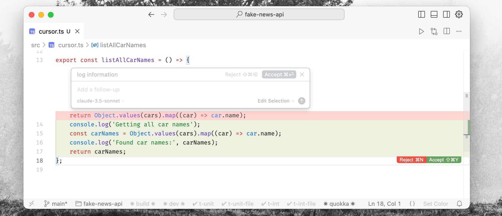

# Cursor: The Compression of Mechanical Work

Adding OAuth support to an authentication system touches everything: the service layer, route handlers, database schema, config files, and tests. The architecture is known. The complexity isn't the challenge—it's the sheer mechanical effort of updating files consistently. It’s a three-hour task.

Or, it’s forty-five minutes if you shift from **typing** to **directing**.

That is the promise of Cursor. It’s not just a smarter autocomplete; it represents a fundamental compression of the gap between architectural decision and working implementation. You define what should exist, the AI helps make it exist, and you review the result.

## Semantic Understanding at Scale

Traditional autocomplete predicts the next token based on the open file. Cursor is different because it indexes your entire codebase. It builds a semantic model of how your system connects—your patterns, your naming conventions, your architectural decisions.

The practical consequence? You can reference anything without copy-pasting context.

> "Refactor the user service to match how we handle organization entities."

This prompt works because the AI has mapped both systems. It’s not keyword searching; it’s reasoning about structure. It runs your tests, invokes your linter, and applies corrections that match your specific coding style. The context isn't just the code—it's the entire development environment.

## The Four Modes of Engagement

Cursor isn't a single feature; it's a workflow that adapts to the granularity of the task.

### 1. The Flow State (Tab)

At the lowest level, "Tab" generates entire function bodies or test cases instantly. But unlike standard copilots, it predicts your _next action_. After you accept a change, it jumps your cursor to the logical next edit point. It recognizes your patterns—if you favor functional composition, it suggests that style. It feels less like a tool and more like momentum.

### 2. Surgical Strikes (Cmd+K)

For specific, localized changes, you don't need a chat window. Select code, hit `Cmd+K`, and describe the change in English.

> "Refactor this to use async/await."
> "Add error handling for network timeouts."

You accept or reject the diff. It turns the editor into a command line for logic.

### 3. Architectural Dialogue (Chat)

For broader questions, the Chat interface provides full codebase awareness. You can ask:

- "How does our caching layer work?"
- "Why would this specific test fail given our setup?"

The `@` reference system makes this precise. You can tag `@filename`, `@folder`, or even `@docs` to pull in framework documentation. The **Apply** button then inserts the generated code directly into your files, handling imports automatically.

### 4. The Agent

This is where the shift happens. **Agent Mode** handles multi-step tasks that require exploration.

> "Add CSV export to the analytics dashboard. Follow our existing PDF export patterns."

The agent explores the codebase, implements the backend logic, updates the frontend, generates tests, runs them, and fixes its own failures. You watch its reasoning in real-time, interrupt if it veers off course, and review a complete, working diff.

## The Reality Check: Where It Fails

It is crucial to understand what this tool is not. It is not a replacement for seniority.

- **Novelty:** It struggles with genuinely new architectures. If you are designing a custom data structure or a novel caching strategy, the results will be mediocre. It mimics patterns; it doesn't invent them.
- **Ambiguity:** "Make this faster" produces garbage. "Reduce response time below 200ms by implementing Redis caching" works.
- **The "Vibe Coding" Trap:** The ease of generation encourages accepting code without reading it. This is dangerous. **Treat every generated line like code from a junior developer.** Does it solve the problem? Is it secure? Is it maintainable?

## Intent-Driven Development

The most profound shift isn't speed; it's **Intent-Driven Development**.

Instead of writing implementation details, you write high-level tests that describe the desired outcome.

> `user_can_purchase_with_saved_card.intent.test.ts`

Then, you direct the AI to make that test pass, following your established patterns. The AI handles the mechanics—the service logic, the API updates, the edge cases. You review the architecture and security.

## The New Developer

This technology compresses mechanical work from 60% of your day to 20%. The question is: what do you do with the freed attention?

The AI handles the "how" exceptionally well. The "what" and the "why" remain yours. A tool that generates flawless code for the wrong feature is worse than useless.

Your value is no longer defined by your typing speed or your memory of syntax. It is defined by your architectural vision, your domain expertise, and your taste. Cursor amplifies these qualities by removing the mechanical barriers between thought and software.

Use it to build better systems, not just to build faster.
