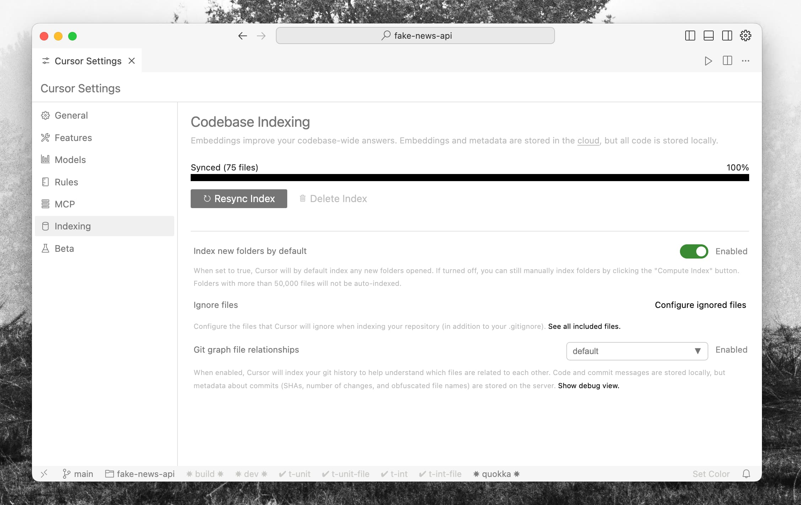
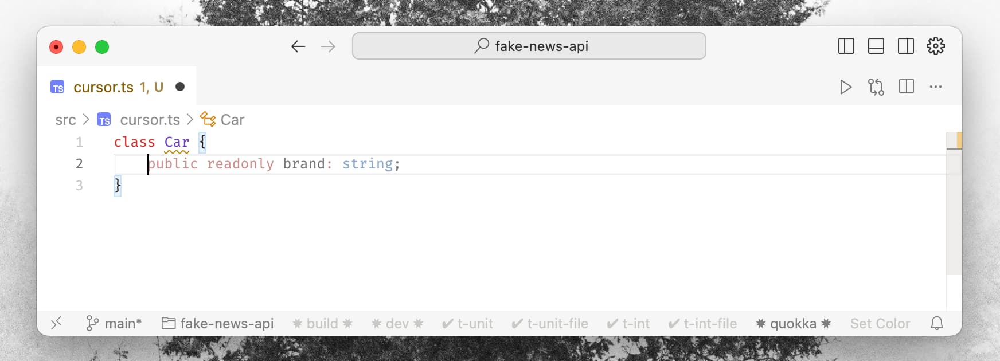
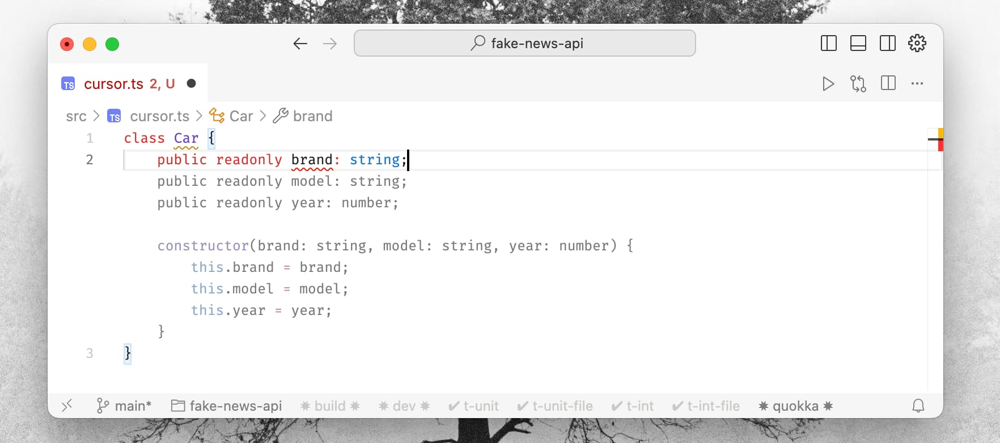
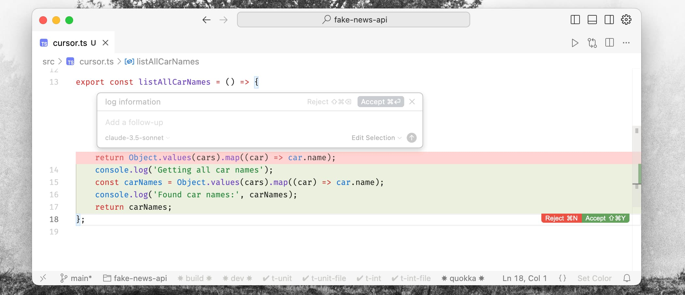
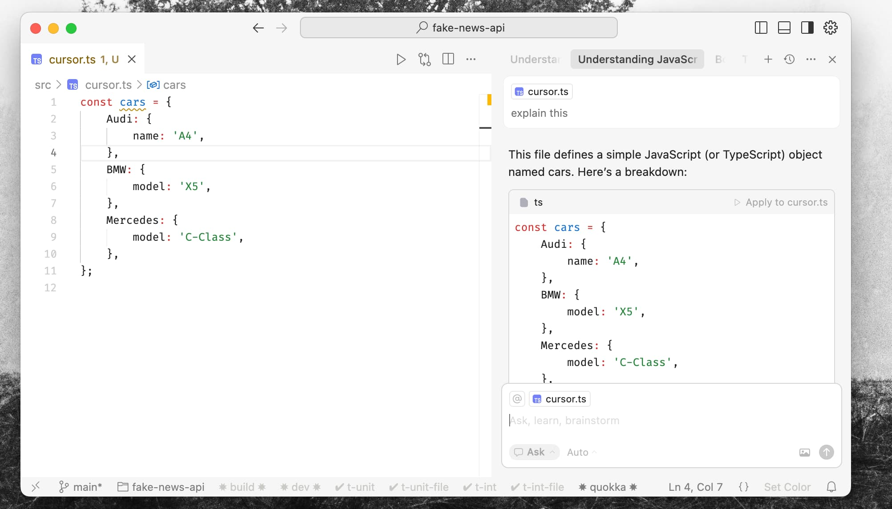
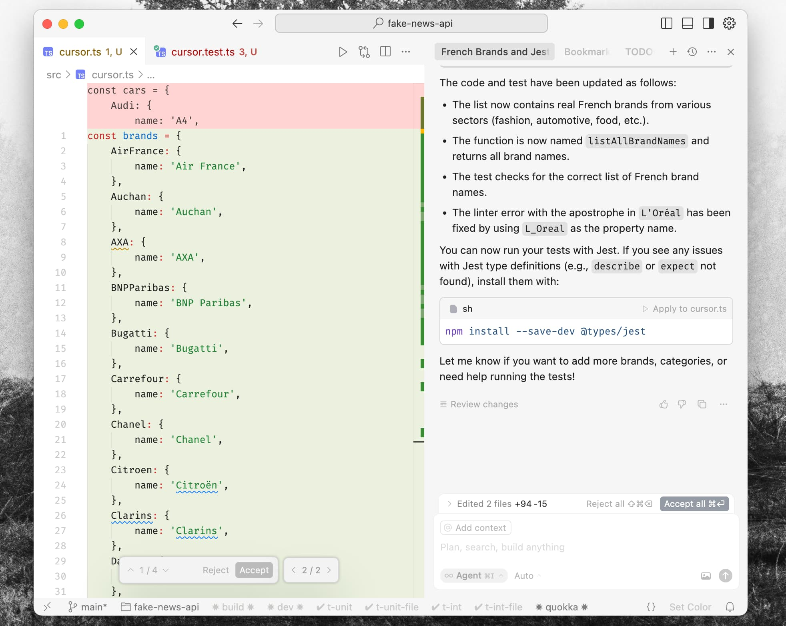

# Cursor : La compression du travail mécanique

La tâche consistait à intégrer OAuth. Ajouter la connexion Google à un système d'authentification existant. Couche service, gestionnaires de routes, schéma de base de données, fichiers de configuration, tests — rien de nouveau sur le plan architectural, mais beaucoup de fichiers à toucher de manière cohérente.

Traditionnellement, c'est un boulot de trois heures. Pas parce que le problème est dur — je savais exactement ce qui devait se passer. L'architecture était claire dans ma tête en quelques minutes. Ce qui prenait une éternité, c'était la partie mécanique : ouvrir les fichiers, taper le boilerplate, connecter les imports, s'assurer que tout restait cohérent entre les couches.

Cursor compresse cette couche mécanique. Vous décrivez ce qui doit exister, l'IA gère la frappe, vous revoyez le résultat. Trois heures sont devenues quarante-cinq minutes.

Mais voici ce qui compte : la réflexion reste vôtre. Vous êtes toujours celui qui décide quoi construire, comment le structurer, quels patterns suivre. Vous commencez toujours par un test, travaillez vers votre intention, découvrez les cas limites en cours de route. Le processus de construction — de conceptualisation de l'application — reste le vôtre. Cursor supprime juste le goulot d'étranglement entre avoir l'idée et la voir exister.

C'est ça le changement. Pas "l'IA écrit le code pour vous." C'est : vous construisez l'application, l'IA gère la transcription.

***

## Compréhension sémantique à l'échelle



L'autocomplétion traditionnelle prédit le prochain token basé sur le fichier ouvert. Cursor est différent — il indexe votre codebase entière. Il construit un modèle sémantique de la façon dont votre système se connecte : vos patterns, vos conventions de nommage, vos décisions architecturales.

La première fois que j'ai réalisé ça, j'ai tapé :

> "Refactor the user service to match how we handle organization entities."

Et ça a *marché*. Il a compris les deux patterns sans que je les lui montre. Il savait ce que "comment nous gérons" voulait dire dans ma codebase.

Ce genre de prompt marche encore mieux aujourd'hui. Des modèles comme Claude Opus 4.5 gèrent le raisonnement inter-codebase presque parfaitement — ils tracent les patterns, identifient les différences et appliquent les changements de manière cohérente à travers les fichiers. Ce qui ressemblait à de la magie il y a un an est maintenant fiable.

Ce n'est pas de la correspondance de mots-clés. C'est un raisonnement sur la structure. Et ça s'étend au-delà du code — Cursor lit votre sortie de test, vos erreurs de linter, votre documentation de framework. Le contexte n'est pas juste ce que vous avez écrit ; c'est votre environnement de développement entier.

***

## Les quatre modes

Cursor n'est pas une fonctionnalité unique. C'est un workflow qui s'adapte à la granularité de la tâche. J'utilise différents modes pour différents moments, et savoir lequel saisir est devenu une compétence en soi.

### 1. État de flow (Tab)





Au niveau le plus bas, la complétion Tab génère des corps de fonction entiers instantanément. Mais voici ce qui la différencie des copilotes standards : elle prédit votre *prochaine action*, pas juste votre prochaine ligne.

Acceptez un changement, et votre curseur saute au prochain point d'édition logique. Ajoutez un paramètre à une signature de fonction, et il surligne les sites d'appel qui ont besoin d'une mise à jour. Cela ressemble moins à de l'autocomplétion qu'à du pair programming avec quelqu'un qui a toujours un coup d'avance.

J'ai remarqué qu'il apprenait mes patterns. Je privilégie les retours anticipés (early returns) aux conditionnelles imbriquées. La composition fonctionnelle aux hiérarchies de classes. Après quelques jours, ses suggestions correspondaient à mon style — pas au style générique des "bonnes pratiques".

Le piège ici est le même qu'avec toute autocomplétion : Tab-Tab-Tab sans lire. Je me surprends à le faire. Les suggestions ont l'air correctes. Mais "avoir l'air correct" n'est pas la même chose qu'"être correct".

### 2. Frappes chirurgicales (Cmd+K)



Pour des changements spécifiques et localisés, je n'ai pas besoin d'une fenêtre de chat. Sélectionnez le code, appuyez sur `Cmd+K`, décrivez le changement en anglais (ou français) :

> "Refactorise ça pour utiliser async/await."
> "Ajoute une limitation de débit à 100 req/min."
> "Gère le cas où l'utilisateur est null."

Un diff apparaît en ligne. Acceptez ou rejetez. L'éditeur devient une ligne de commande pour la logique.

Ce mode brille pour le refactoring. "Extrais ça dans un hook personnalisé." "Convertis ça en TypeScript avec les bons types." "Ajoute une gestion d'erreur pour les échecs réseau." Des changements qui prendraient cinq minutes d'édition minutieuse se font en quelques secondes de *revue* minutieuse.

### 3. Dialogue architectural (Chat)



Pour des questions plus larges, le Chat fournit une conscience complète de la codebase. Je l'utilise quand je m'oriente dans du code inconnu :

- "Comment notre couche de cache invalide-t-elle les entrées ?"
- "Pourquoi ce test échouerait-il étant donné notre config d'auth ?"
- "Quel est le flux de données de la requête API à l'écriture en base ?"

Le système de référence `@` rend cela précis. Taggez `@filename` pour vous concentrer sur des fichiers spécifiques, `@folder` pour inclure un module, `@docs` pour intégrer la documentation du framework. Il répond avec votre codebase comme contexte, pas des connaissances génériques.

Le bouton **Apply** insère ensuite le code généré directement dans les fichiers, gérant les imports automatiquement. Il comble le fossé entre "voici ce que vous pourriez faire" et "voici le code, déjà en place."

### 4. Mode Agent



C'est là que le changement de paradigme opère. Le mode Agent gère les tâches en plusieurs étapes qui nécessitent de l'exploration.

> "Ajoute l'export CSV au tableau de bord analytique. Suis nos patterns d'export PDF existants."

Je l'ai regardé travailler : il a exploré la codebase pour trouver l'export PDF, analysé le pattern, implémenté la logique backend, mis à jour le composant frontend, généré des tests, les a exécutés, a vu un échec, a *corrigé son propre échec*, et présenté un diff complet.

La sensation est étrange. Vous ne codez pas ; vous supervisez. Vous interrompez quand il dévie de sa route. Vous acceptez ou rejetez le résultat final. Mais les heures d'implémentation mécanique ? L'agent les a gérées.

***

## Là où ça échoue

Après des mois d'utilisation quotidienne, j'ai appris où lui faire confiance et où rester sceptique.

**La nouveauté le casse.** Il excelle dans la réplication de patterns — faire ce que votre codebase fait déjà, à un nouvel endroit. Il lutte avec l'architecture véritablement nouvelle. Si elle n'est pas correctement guidée.

**L'ambiguïté produit des déchets.** "Rends ça plus rapide" ne donne rien d'utile. "Réduis le temps de réponse sous 200ms en implémentant un cache Redis pour la recherche utilisateur" donne du code fonctionnel. Précision en entrée, précision en sortie.

**Le piège du "vibe coding".** C'est le vrai danger. Le code apparaît entièrement formé, professionnellement formaté, passant les tests. Votre cerveau le fait correspondre au modèle "bon code" et votre doigt plane sur Accepter.

J'ai expédié un bug comme ça. Le code généré avait l'air correct. Les tests passaient. Mais il y avait une subtile race condition qui n'apparaissait que sous charge. Je n'avais pas *lu* le code ; je l'avais *accepté*.

La leçon n'était pas "scrutez toujours tout." C'était : **décidez à l'avance quel niveau de qualité ce contexte exige.**

Comme pour déléguer à un membre de l'équipe, vous faites des choix sur le risque acceptable :
- **Prototype MVP** : Vibe coding complet. La vitesse compte plus que les cas limites. Vous le réécrirez de toute façon.
- **Tableau de bord interne** : Vibe coding de l'UI, mais exigez une gestion d'erreur et une validation des données propres. Acceptable que ça casse occasionnellement.
- **Flux de paiement** : Revoyez chaque ligne. Testez les cas limites manuellement. Pas de taux d'échec acceptable.

La question n'est pas "devrais-je faire confiance à l'IA ?" C'est "quelles sont mes exigences ici, et quel taux d'échec puis-je accepter ?" Soyez délibéré à ce sujet. Les bugs que j'ai expédiés n'étaient pas parce que l'IA est peu fiable — ils étaient parce que je n'avais pas décidé de ce dont j'avais réellement besoin.

***

## Apprendre à travailler avec votre agent

Voici le truc avec ces limitations : ce ne sont pas des murs fixes. Ce sont des points de départ.

Plus j'ai travaillé avec Cursor, plus j'ai appris à le guider. La nouveauté le casse — à moins que vous ne découpiez la nouveauté en morceaux familiers. L'ambiguïté produit des déchets — à moins que vous n'ayez appris à quoi ressemble la précision pour *cet* agent.

C'est comme travailler avec un nouveau membre d'équipe. Au début, vous ne connaissez pas ses forces ou ses angles morts. Vous donnez des instructions vagues et obtenez des résultats vagues. Mais avec le temps, vous apprenez comment il pense. Vous savez quand lui donner de l'autonomie et quand être prescriptif. Vous savez quelles tâches il réussira et lesquelles nécessitent une supervision plus étroite.

La même chose s'applique ici. J'ai appris :
- **Quand découper** : L'architecture nouvelle fonctionne si je la découpe en étapes que l'agent reconnaît. "Conçois un cache personnalisé" échoue. "Crée un wrapper Map avec expiration TTL, puis ajoute l'éviction LRU, puis ajoute la persistance" réussit.
- **Quand montrer des exemples** : Pour les patterns inhabituels, j'écrirai un cas manuellement, puis demanderai à l'agent de suivre ce pattern pour le reste.
- **Quand contraindre** : Parfois je spécifierai ce qu'il ne faut *pas* faire. "N'utilise pas de bibliothèques externes." "Garde ça sous 50 lignes." Les contraintes focalisent la sortie.
- **Quand itérer** : La première génération est rarement parfaite. Mais la seconde, guidée par "corrige ce cas limite" ou "refactorise ça pour correspondre à notre style", l'est souvent.

L'agent n'est pas une boîte noire à laquelle vous lancez des prompts. C'est un collaborateur que vous apprenez à diriger. Mieux vous le connaissez, plus loin vous pouvez le pousser.

***

## Développement piloté par l'intention (Intent-driven development)

Une fois que vous avez appris à travailler avec votre agent, la question devient : quelle est la meilleure façon d'exprimer l'intention ?

J'ai atterri sur les tests. Pas des tests écrits après coup — des tests écrits *avant* que l'implémentation n'existe :

```
user_can_purchase_with_saved_card.intent.test.ts
```

Le test définit *ce qui* doit se passer : utilisateur avec carte enregistrée, clique sur acheter, la transaction réussit, la carte est débitée. Ensuite je dirige l'agent : "Fais passer ce test, en suivant nos patterns de service de paiement."

L'IA gère la mécanique — la logique de service, les appels API, les états d'erreur. Je revois l'architecture et la sécurité.

C'est du test-driven development (TDD), mais la partie "driven" inclut maintenant une IA qui fait l'implémentation. Vous écrivez la spécification ; la machine écrit le code ; vous vérifiez le résultat.

***

## L'attention libérée

Cursor compresse le travail mécanique de peut-être 60% de ma journée à 20%. La question que je continue de me poser : que faire de l'attention libérée ?

L'IA gère le "comment" exceptionnellement bien. Le "quoi" et le "pourquoi" restent miens. Un outil qui génère un code impeccable pour la mauvaise fonctionnalité est pire qu'inutile.

Ma valeur était partiellement définie par la vitesse de frappe et la mémoire de la syntaxe. Maintenant, elle est définie presque entièrement par :
- **Vision architecturale** — savoir quoi construire
- **Expertise du domaine** — comprendre le problème profondément
- **Goût** — reconnaître les bonnes solutions des simplement fonctionnelles
- **Clarté de la spécification** — décrire l'intention assez précisément pour qu'une machine l'exécute

Cursor amplifie ces qualités en supprimant les barrières mécaniques entre la pensée et le logiciel. Les idées qui prenaient un week-end prennent maintenant un après-midi. Les prototypes qui prenaient une semaine prennent maintenant un jour.

Utilisez-le pour construire de meilleurs systèmes, pas juste pour construire plus vite. Le travail mécanique est compressé. Ce que vous faites des cycles libérés ne dépend que de vous.
