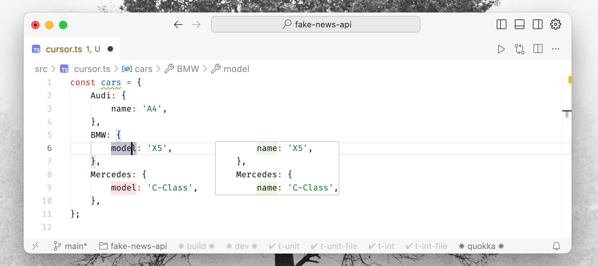
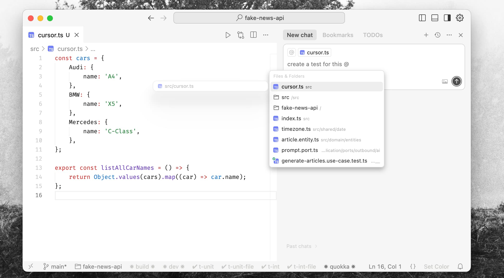
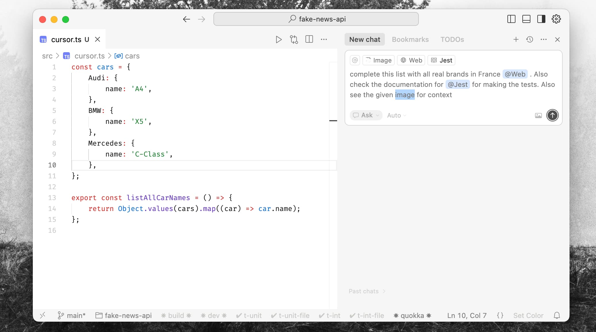
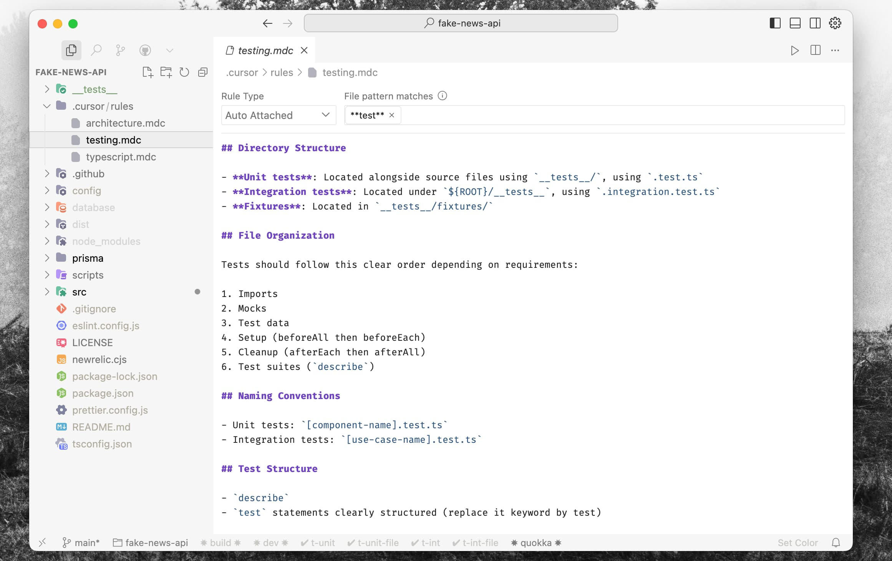

# Cursor, mon guide pratique du développement assisté par l'IA

**Notre manière de concevoir des logiciels connaît une transformation radicale. L'IA n'est plus un simple gadget; c'est un outil sans lequel je ne pourrais plus coder. Je baigne dans l'univers du développement assisté par l'IA depuis un certain temps, et un outil a complètement bouleversé ma façon de travailler: Cursor. C'est bien plus qu'un éditeur de code: c'est l'avenir du développement qui prend forme.**

Pendant des années, le débat s'est résumé à WebStorm contre VS Code, une quête sans fin de la configuration personnelle parfaite. Cursor change complètement la donne. Imaginez un environnement de code idéal, conçu pour vous par une équipe de cent experts mondiaux dotée d'un budget à neuf chiffres. Un environnement si intelligemment pensé qu'une IA est capable de saisir instantanément votre projet, vos objectifs, vos intentions. Voilà la promesse que Cursor tient, clés en main.

La plupart des outils de codage par IA se heurtent aux mêmes écueils:
- **Le contexte:** Comment nourrir l'IA avec les bonnes informations sur votre projet?
- **Le timing:** Quand les lui transmettre?
- **L'interface:** Comment interagir avec ses suggestions sans briser votre concentration?
- **La puissance:** Utilisez-vous les modèles les plus récents et les plus performants?
- **L'efficacité:** Comment gérer l'utilisation et les coûts sans même y penser?

Cursor relève ces défis avec brio, en intégrant le tout dans une expérience unique, intelligente et intuitive. Il ne s'agit pas de taper du code plus vite. **Il s'agit de transformer votre rôle: passer du " dactylo du code " à l'" architecte logiciel ".** **Vous vous concentrez sur la vision et la qualité, pendant que l'IA se charge du gros œuvre.** Résultat des courses? Je suis plus productif, le code est plus propre, les conventions de nommage sont plus cohérentes et ma couverture de test est plus élevée, le tout avec une facilité déconcertante.

C'est comme avoir une équipe de développeurs seniors logée au cœur de votre éditeur. Une équipe qui requiert toujours des directives claires, surtout face à des idées complexes ou inédites, mais qui vous mène à bon port, bien plus vite. Je me surprends à écrire moins de code à la main pour passer plus de temps dans une boucle d'une simplicité désarmante: **" instruire -> valider "**.

## Cas d'usage: comment il a transformé mon quotidien

L'alchimie de Cursor opère dans cette collaboration fluide entre vous, l'IA et votre code. L'expérience utilisateur est si naturelle qu'elle devient le prolongement de vos pensées.

### 1. Il connaît votre code, tout simplement

C'est ce qui m'a immédiatement sidéré. Oubliez les copier-coller de code dans une fenêtre de chat séparée.
- **Aucune configuration:** Ouvrez un projet, et Cursor commence son analyse.
- **Indexation intelligente:** Il cartographie l'ensemble de votre base de code et en comprend toutes les connexions.
- **Contexte autonome:** Il trouve ce dont il a besoin à travers les fichiers, lit n'importe quel document nécessaire et peut même exécuter des commandes (linters, tests) pour évaluer la situation. Vous pouvez littéralement lui dire: " Fais en sorte que `@montest.test.ts` passe ", et le regarder lancer le test, constater l'échec, trouver les bons imports et rédiger une proposition de correctif.

### 2. " Tab Tab Tab " sous stéroïdes

Pensez à GitHub Copilot, mais avec un turbocompresseur.
- **Puissance prédictive:** Il ne se contente pas de compléter la ligne en cours; il anticipe souvent le bloc de code entier que vous aviez en tête.

*Complétion sur une seule ligne*

*Complétions sur plusieurs lignes*

- **Prédiction du curseur:** Il devine même où vous voudrez placer votre curseur ensuite. Une pression sur Tab, et vous y êtes.
- **Magie en un clic:** Les tâches simples deviennent triviales. Cliquez sur un JSON en désordre, et il est instantanément formaté. D'un clic, il reformule un commentaire maladroit ou corrige une petite erreur.

*Modifications en un clic (un exemple simple, mais il gère des mises à jour complexes avec une aisance déconcertante)*

### 3. Le chat intégré: votre partenaire de code

*Demandez-lui n'importe quoi*

Le chat n'est pas un simple bot; c'est un collaborateur qui connaît votre projet sur le bout des doigts.
- **Un chat conscient du code:** Ses suggestions sont d'une pertinence redoutable car il comprend le contexte de votre travail.
- **Références faciles avec `@`:** C'est un atout majeur. Tapez `@nomdefichier` ou `@symbole` pour indiquer à l'IA exactement où regarder. Fini l'ambiguïté.

*Référencez manuellement des fichiers avec @*

- **Modifications ciblées:** Le bouton " Appliquer " est d'une intelligence rare. Il insère ou modifie le code précisément au bon endroit, même si cela concerne plusieurs fichiers ou des sections opposées d'un même document.

*Appliquer le code automatiquement*

- **Pouvoirs supplémentaires:** Vous pouvez lui fournir une image (comme une maquette d'interface) pour générer du code, ou lui donner un lien vers une issue GitHub ou une documentation, qu'il utilisera comme contexte. Il intègre même une connaissance native des frameworks populaires. Taper `@NextJs` importe la documentation officielle de Next.js directement dans votre chat.

*Une multitude de sources de contexte avec @ pour enrichir vos prompts*

### 4. Modifier son code en langage naturel (Cmd+K / Ctrl+K)

Cette fonctionnalité révolutionne le refactoring et les modifications rapides.
- **Commandes en langage naturel:** Appuyez sur `Cmd+K` et dictez vos volontés. " Refactorise ceci en fonction asynchrone. " " Ajoute des commentaires JSDoc. " " Explique-moi cette regex. "
- **Des diffs d'une clarté exemplaire:** Cursor vous montre les changements proposés avec une visualisation "diff" claire et nette. Vous pouvez examiner, accepter ou demander une révision en quelques secondes.
- **Un génie dans le terminal:** `Cmd+K` dans le terminal vous permet d'écrire des commandes shell en langage naturel. " Trouve tous les fichiers de plus de 1 Mo et compresse-les en zip. " Et voilà.

*Prompts et diffs de code, directement dans l'éditeur*

### 5. Mode agent: lâcher la bride à l'IA

Pour les tâches d'envergure, le mode agent donne à l'IA la liberté de réfléchir et d'agir par elle-même.
- **Résolution de problèmes autonome:** L'agent décompose votre demande en un plan, explore la base de code, crée des fichiers, exécute des commandes et se corrige même en cas d'erreur.
- **Correction automatique des erreurs de linter:** Il peut se connecter au linter de votre projet pour corriger automatiquement les avertissements et les erreurs selon vos règles.
- **Il applique automatiquement les changements et vous présente un diff de type " pull request " directement dans votre IDE. Le résultat est bluffant. 😍**

*C'est devenu mon mode de prédilection pour 99 % de mes tâches.*

*À partir d'un seul prompt, il a cherché sur le web, ajouté les nouvelles marques et créé le fichier de test correspondant.*

## Mon expérience: astuces et nouvel état d'esprit

Après plus d'un an d'utilisation quotidienne de Cursor, j'ai tiré quelques leçons qui ont complètement transformé mon approche du développement.

### Faire de l'IA *votre* copilote

- **Les "Cursor Rules":** C'est là que vous pouvez dresser Cursor pour qu'il suive le style de codage de votre projet. Je l'utilise pour imposer un modèle " Given-When-Then " à toutes les descriptions de mes tests. Il suffit d'un simple fichier dans le répertoire `.cursor/rules`.
    - *Exemple:* [Vous pouvez consulter mes règles spécifiques au projet ici](https://github.com/jterrazz/fake-news-api/blob/main/.cursor/rules).

- **Connaître ses modèles:** Il est utile de comprendre la " personnalité " des différents modèles d'IA. Cursor choisit intelligemment le plus adapté, mais y réfléchir aide à rédiger de meilleurs prompts. Voici ma grille de lecture:
    - **Le planificateur:** Un modèle puissant comme `GPT-4` ou `Claude 3 Opus` est excellent pour la stratégie de haut niveau ou pour décomposer une tâche complexe.
    - **Le codeur:** Un modèle spécialisé pour le code, comme un `Gemini Pro` ou `Claude 3.5`, est idéal pour générer le code lui-même.
    - **Le débogueur:** Un mélange de modèles fonctionne bien ici—les plus puissants pour générer des cas de test et les plus rapides pour des corrections itératives.
- **Tirer parti des MCPs (Model-Capable Plugins):** Imaginez-les comme des boîtes à outils spécialisées pour des services externes comme AWS ou Stripe. Ils permettent à l'IA de générer du code en s'appuyant sur une documentation d'API à jour et en temps réel.

### Refactorings et correctifs surhumains

- **Réappliquer un commit:** C'est une astuce d'une puissance déconcertante. " Réapplique les changements du commit `[hash]` à ce fichier, mais adapte-les à la nouvelle structure. "
- **" Fais en sorte que les tests passent au vert ":** Je demande littéralement à Cursor de lancer ma suite de tests et de corriger tout ce qui échoue jusqu'à ce que tout soit validé. Un super-pouvoir, purement et simplement, pour le TDD ou l'intégration d'une nouvelle fonctionnalité.

## Le changement de posture : vous êtes désormais le chef d'orchestre

La plus grande révolution n'est pas la vitesse ; elle est mentale.
- **Endossez votre rôle de chef d'orchestre:** Votre travail consiste à guider l'IA. Donnez-lui des instructions claires et assurez-vous que le produit final correspond à votre vision. L'IA devient le prolongement de votre intention, comme un alter ego technique avec qui vous collaboreriez depuis des années.
- **Déléguez tout ce que vous pouvez:** Plus vous confiez de tâches à l'IA, plus vous libérez d'énergie mentale pour la vue d'ensemble: l'architecture, l'expérience utilisateur et la résolution des *vrais* problèmes.
- **Le piège du "code au feeling" (*vibe coding*):** Le plus grand danger est de faire aveuglément confiance à la machine ou de coder sans objectif clair. Cela mène à du code désordonné et à une perte de temps. **Vous restez le pilote.** Vous devez savoir où vous allez et donner des caps précis, comme si vous étiez seul aux commandes, mais avec la vitesse de la lumière.
- **La qualité, par défaut:** Voici le paradoxe: l'assistance de l'IA vous pousse en réalité à produire un code de *meilleure* qualité. Comme vous passez plus de temps à relire qu'à taper, vous portez naturellement plus d'attention au nommage, à la structure et aux tests. **Vous en venez à faire plus confiance aux tests qu'au code lui-même.**

### Le développement guidé par l'intention (IDD)

Tout cela mène à un flux de travail que j'appelle le **développement guidé par l'intention (IDD)**. De la même manière que le TDD utilise les tests pour piloter la conception du code, l'IDD s'appuie sur une intention claire et de haut niveau pour piloter le développement.
- **Se concentrer sur la valeur:** Puisant dans la pensée par principes premiers, l'IDD vous force à demander: " Quelle valeur cette fonctionnalité apporte-t-elle? " Votre travail consiste à traduire cette valeur en une intention limpide pour l'IA.
- **Des "tests d'intention" de haut niveau:** Parfois, j'écris un test de haut niveau qui capture une *user story* fondamentale (ex: `l_utilisateur_peut_finaliser_sa_commande.intent.test.ts`). Mon objectif est alors simple: ordonner à l'IA de faire passer ce test.

Cela garantit que chaque ligne de code est liée à un résultat clair et à forte valeur ajoutée.

## Pour bien démarrer avec Cursor

Prêt à plonger?
1. **Passez à la version Pro:** La version gratuite est excellente, mais l'abonnement Pro (environ 20 $/mois) vous donne accès aux modèles les plus puissants comme GPT-4 et Claude 3 Opus. C'est là que la magie opère.
2. **Appropriez-vous l'outil:** Ne vous contentez pas des réglages par défaut. Passez 10 minutes dans les paramètres pour configurer vos raccourcis clavier et choisir vos modèles préférés. (Pour vous inspirer, voici mes réglages globaux: [https://github.com/jterrazz/jterrazz-configuration/tree/main/configurations/cursor](https://github.com/jterrazz/jterrazz-configuration/tree/main/configurations/cursor)).
3. **Expérimentez:** Ne vous limitez pas au chat. Utilisez les modifications avec `Cmd+K`. Essayez le mode agent. Apprenez à nourrir l'IA de contexte avec `@`.

## Vous êtes le guide

L'IA peut gérer le " comment ", mais le " quoi " et le " pourquoi " restent votre domaine. Le 'code au feeling' ne construira jamais un produit sécurisé, scalable ou maintenable. L'IA ne connaît pas votre entreprise, vos utilisateurs ou votre vision à long terme. Pas encore.

Vous êtes le **médiateur** indispensable entre un besoin du monde réel et l'incroyable capacité d'exécution de l'IA. Votre jugement, votre goût et votre vision ont plus de valeur que jamais. Voyez l'IA comme le plus brillant des consultants. Votre travail est d'appliquer son expertise à *votre* projet.

L'expérience par défaut de Cursor est stupéfiante. Mais elle devient un super-pouvoir lorsque vous l'adaptez à vos besoins et vous concentrez sur ce qui compte vraiment. Pour moi, cela signifie construire de grandes choses, plus rapidement, en mettant l'accent sur l'exploration, la recherche, les commits, les revues de code et des tests en béton.

Cursor n'est pas un outil de plus. C'est un partenaire. Et lorsque vous le guidez avec soin, il élèvera votre travail à un niveau que vous n'imaginiez pas.
