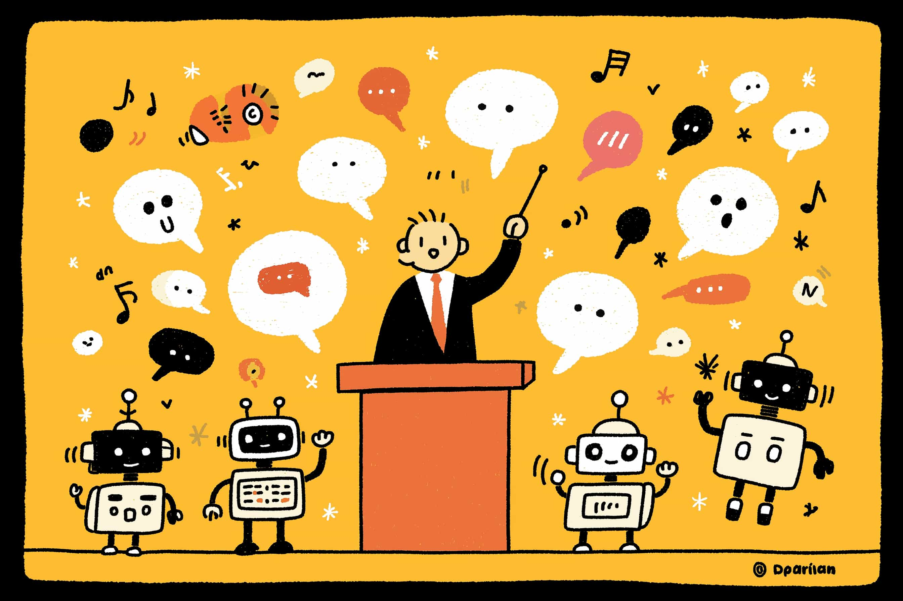
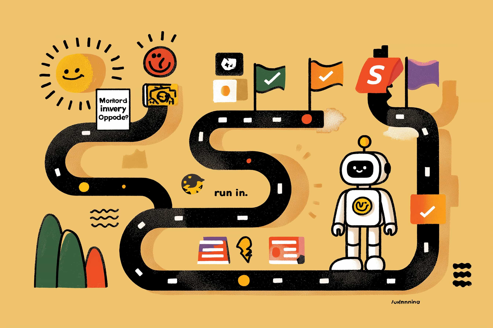

# Les quatre niveaux de l'IA: comment surfer la vague et décupler votre potentiel

Allons droit au but. Une immense vague de changement déferle sur nous, et son nom est intelligence artificielle. Ce n'est plus un lointain concept de science-fiction; l'IA est là, et elle est en train de tout redéfinir.

En tant qu'ingénieur logiciel, je baigne dans cette réalité au quotidien. Mais nul besoin d'être un expert du code pour en sentir les effets. Que vous soyez un entrepreneur qui ébauche un business plan, un artiste en quête d'inspiration, un enseignant qui prépare un cours ou un parent qui essaie simplement de gérer le merveilleux chaos de la vie, **l'IA est discrètement en train de devenir l'outil le plus puissant de notre génération**.

Mais oubliez les gros titres apocalyptiques sur les robots qui prendront le pouvoir. Ce n'est pas comme ça que les choses vont se passer. **Il s'agit d'une évolution progressive, pas d'une révolution soudaine.** Imaginez moins un tsunami qui rase tout sur son passage qu'une marée montante qui soulève toutes les embarcations prêtes à flotter.

Pour vous aider à naviguer dans ces eaux nouvelles, j'ai conçu un cadre simple: **les quatre niveaux d'intégration de l'IA.** Chaque niveau débloque de nouvelles capacités et s'applique à absolument tous les domaines. Mon objectif est de dissiper le bruit ambiant pour vous montrer, en des termes clairs, comment vous pouvez utiliser l'IA pour devenir une version surpuissante de vous-même.

Voici les quatre niveaux que nous allons explorer ensemble:

1. **L'assistant:** L'IA comme copilote invisible, qui rend vos outils actuels plus intelligents.
2. **L'agent guidé:** L'IA comme subordonné direct, qui exécute les projets que vous commandez.
3. **L'agent autonome:** L'IA comme délégué de confiance, qui gère des processus entiers sous votre supervision.
4. **L'intelligence programmable:** L'IA comme partenaire créatif que vous façonnez pour qu'elle pense comme une extension de votre propre esprit.

Cet article ne s'adresse pas qu'aux génies de la tech. Il est pour toute personne curieuse de gagner en efficacité et de libérer sa créativité. Si c'est votre cas, vous êtes au bon endroit. Plongeons dans le vif du sujet.

***

## **Niveau 1: L'assistant–votre copilote invisible**

Commençons par là, car vous l'utilisez probablement déjà. L'IA de niveau 1 est la force invisible qui améliore le fonctionnement de vos applications préférées. C'est l'assistant intelligent qui anticipe votre prochain geste sans jamais prendre le volant. Vous gardez toujours le contrôle absolu.

Pensez au clavier de votre téléphone qui suggère le mot suivant, ou à un correcteur grammatical qui ne se contente pas de corriger une faute de frappe, mais propose une tournure plus percutante. C'est subtil, fluide et incroyablement utile.

**Comment ça marche en pratique:**
À ce niveau, l'IA automatise simplement les petites tâches répétitives qui consument votre bande passante mentale. Elle déblaye le terrain pour que vous puissiez vous concentrer sur le travail à haute valeur ajoutée: la réflexion, la création, la décision.

- **Pour quiconque rédige un e-mail ou un rapport,** des outils comme Grammarly ou Notion AI offrent des suggestions en temps réel pour affiner votre message et correspondre au ton souhaité.
- **Pour une séance de brainstorming,** la fonction Magic Design de Canva peut prendre une simple instruction textuelle et générer instantanément une douzaine de visuels professionnels, vous épargnant une heure de manipulations fastidieuses.
- **Pour les parents comme pour les professionnels,** une application de listes de tâches intelligente comme Todoist apprend de vos habitudes et suggère proactivement des rappels, pour que vous n'oubliiez jamais d'acheter du lait ou de préparer une réunion.

**Le véritable super-pouvoir:**
Vous récupérez votre temps et votre concentration. En déléguant les aspects mécaniques d'une tâche, vous libérez de la bande passante pour la pensée profonde et créative. Pour moi, c'est comme passer de l'écriture de code dans un simple éditeur de texte à un IDE moderne qui anticipe et complète mes pensées. Votre travail devient plus fluide, plus rapide et plus agréable, sans jamais perdre votre touche personnelle.

**Mise en garde:**
- **Le piège de la délégation:** Si vous acceptez aveuglément chaque suggestion, vos propres compétences peuvent s'émousser. Un écrivain qui cesse de réfléchir de manière critique au choix des mots laisse sa voix unique s'estomper.
- **L'illusion de la "baguette magique":** L'IA de niveau 1 a besoin d'un contexte clair. Donnez-lui des instructions floues, et vous obtiendrez une aide tout aussi floue. C'est un copilote, pas un télépathe.

**Exemple concret:** Une cheffe de projet planifie un nouveau lancement dans Notion. Elle liste les tâches principales. L'IA de Notion analyse la liste, la compare à des projets passés et élabore un calendrier réaliste avec des échéances suggérées. La cheffe de projet examine le tout, fait quelques ajustements et valide. Un plan qui nécessitait une heure de conjectures est maintenant prêt en cinq minutes.

***

## **Niveau 2: L'agent guidé, vous, le chef d'orchestre**

Passons maintenant au niveau supérieur. Nous évoluons d'un assistant passif à un collaborateur actif. Au niveau 2, vous n'êtes plus seulement en train d'*utiliser* des outils améliorés par l'IA; vous *dirigez* un agent IA pour qu'il construise quelque chose pour vous. Vous devenez le chef d'orchestre.

Votre rôle passe de celui qui "fait" à celui qui "dirige". Vous donnez à l'IA un brief clair, elle exécute, puis vous affinez le résultat ensemble. C'est un dialogue créatif.

**Comment ça marche en pratique:**
Vous énoncez votre objectif, et l'IA produit une première ébauche solide de ce dont vous avez besoin—du code, un plan marketing, une image. Ensuite, vous la guidez, vous l'affinez et vous la façonnez jusqu'à ce qu'elle corresponde parfaitement à votre vision.

- **Pour un entrepreneur,** vous pourriez demander à ChatGPT: "Rédige un business plan d'une page pour une marque de jouets durables pour animaux, vendus en direct au consommateur." L'IA vous fournit une structure. Vous poursuivez: "Parfait. Maintenant, rends la mission de l'entreprise plus inspirante et ajoute trois angles marketing potentiels pour Instagram."
- **Pour un enseignant,** vous pourriez dire à un outil d'IA: "Génère un quiz de 15 questions pour ma classe de seconde sur la respiration cellulaire. Inclus 5 questions à choix multiples, 5 vrai/faux et 5 questions à réponse courte."
- **Pour un cuisinier amateur,** une application peut générer une recette à partir des ingrédients qui se trouvent dans votre réfrigérateur. Vous la guidez ensuite: "OK, maintenant donne-moi une version sans gluten qui prend moins de 20 minutes."

**Le véritable super-pouvoir:**
Vous devenez un **architecte de résultats**. Le fossé entre une idée et sa concrétisation se comble quasi instantanément. Vous pouvez prototyper, tester et générer du contenu à la vitesse de la pensée, en consacrant toute votre énergie à la stratégie et au contrôle qualité. C'est comme avoir un stagiaire incroyablement talentueux et infatigable qui s'occupe de tout le travail de fond, vous laissant libre de perfectionner la vision.

**Mise en garde:**
- **Une consigne floue produira un résultat tout aussi flou:** "Écris un article de blog" est une instruction exécrable. Comportez-vous en excellent chef de projet. Donnez des instructions spécifiques, du contexte et des exemples. Meilleur est le brief, meilleur est le résultat.
- **L'exécution sans vision est vaine:** Une IA est un exécutant brillant, mais elle n'a pas votre intuition ni votre vision stratégique. Sans un "pourquoi" clair de votre part, elle pourrait produire quelque chose de techniquement irréprochable, mais complètement à côté de la plaque.

**Exemple concret:** Une responsable marketing demande à une IA d'analyser les réseaux sociaux de ses cinq principaux concurrents et de rédiger un calendrier de contenu pour le mois suivant. L'IA renvoie un tableur détaillé. La responsable l'examine et dit: "Bon début, mais notre ton est plus enjoué. Réécris les légendes pour TikTok avec plus d'humour et ajoute trois idées de vidéos basées sur les tendances actuelles." L'IA fournit instantanément un plan révisé.

***

## **Niveau 3: L'agent autonome–l'IA prend les rênes**

C'est ici que les choses deviennent vraiment intéressantes. Au niveau 3, l'IA n'est plus votre subordonné direct, mais un délégué de confiance, autonome. Vous ne donnez plus d'instructions pas à pas; vous confiez un processus de travail entier en attendant un résultat final.

Imaginez que vous engagez un chef de projet de haut vol. Vous lui donnez un objectif, l'accès aux outils nécessaires et l'autonomie pour mener à bien sa mission. Il ne vous consulte que pour les validations clés ou lorsque le projet est terminé.

**Comment ça marche en pratique:**
Vous définissez un objectif de haut niveau, et l'agent IA planifie les étapes, les exécute et corrige sa trajectoire en cours de route. Point crucial: il peut se connecter à d'autres outils et services (API, bases de données, sites web) pour agir dans le monde réel.

- **Pour le propriétaire d'une boutique en ligne,** un agent autonome pourrait surveiller les niveaux de stock, rédiger automatiquement des bons de commande lorsque le stock est bas et vous les envoyer pour une approbation de paiement en un clic.
- **Pour un créateur de contenu,** un agent pourrait se voir confier la mission de "faire croître mon compte Twitter." Il analyserait votre niche, rédigerait et programmerait des tweets, interagirait avec d'autres comptes et vous fournirait un rapport de performance hebdomadaire, le tout de manière autonome.
- **Pour une famille bien occupée,** une IA connectée à votre calendrier et à votre budget pourrait recevoir l'ordre: "Trouve et réserve une activité de plein air amusante pour ce samedi, pour deux adultes et deux enfants de moins de 10 ans, à moins de 30 minutes de route."

**Le véritable super-pouvoir:**
Vous êtes libéré du fardeau opérationnel. Les processus complexes et multi-étapes qui dévorent vos journées sont désormais pris en charge. Cela vous permet de vous concentrer presque exclusivement sur la stratégie, la créativité et les choses que seul un humain peut faire. C'est comme déléguer toutes les opérations de votre entreprise à un directeur des opérations compétent, vous laissant libre d'être le PDG visionnaire.

**Mise en garde:**
- **Les garde-fous sont non négociables:** Une IA autonome sans limites est un risque. Elle pourrait commander 1 000 unités d'un produit au lieu de 10. Testez toujours les agents dans un environnement sécurisé (un "sandbox") et intégrez des contraintes claires et des étapes de validation.
- **Le péril du "on lance et on oublie":** N'abdiquez jamais complètement votre responsabilité. L'IA est autonome, mais pas omnisciente. Elle peut mal interpréter un contexte ou se retrouver bloquée. Une vérification humaine finale est toujours essentielle.

**Exemple concret:** Un directeur des ventes assigne un objectif hebdomadaire à un agent IA: "Analyse nos données Salesforce, identifie les trois comptes ayant le plus faible engagement cette semaine, et rédige des e-mails de relance personnalisés pour eux." L'agent se connecte à Salesforce, effectue l'analyse et dépose trois brouillons d'e-mails dans le dossier du directeur chaque vendredi matin, prêts pour une relecture rapide et un envoi.

***

## **Niveau 4: L'intelligence programmable–votre co-architecte créatif**

Nous atteignons l'ultime frontière… pour le moment. Au niveau 4, vous ne vous contentez plus d'utiliser ou de diriger l'IA. Vous **programmez l'intelligence elle-même**. Vous construisez un système sur mesure qui agit comme une véritable extension de votre cerveau, en mêlant des règles codées en dur à un raisonnement de type humain.

Voyez cela comme la conception d'un partenaire IA personnalisé. Il ne se contente pas de suivre vos règles; il intériorise vos principes et peut prendre des décisions sophistiquées et nuancées face à l'ambiguïté, tout comme vous le feriez.

**Comment ça marche en pratique:**
Vous construisez des flux de travail en utilisant ce que j'appelle des "briques d'intelligence". Vous assemblez ces briques pour créer un système qui combine une logique déterministe (si X se produit, fais toujours Y) avec une créativité non déterministe (si Z se produit, analyse la situation et trouve la meilleure voie à suivre).

- **Pour un analyste financier,** vous pourriez programmer une IA pour scanner l'actualité des marchés, identifier des événements correspondant à votre thèse d'investissement unique (ex.: "avancées dans les infrastructures IA"), puis rédiger une note d'investissement détaillée expliquant l'opportunité, avec une analyse de risque modélisée sur votre tolérance au risque personnelle.
- **Pour un artiste utilisant Midjourney,** cela signifie aller au-delà des simples prompts. Vous programmeriez une séquence de prompts évolutifs et de paramètres de style pour générer une collection entière et cohérente, où chaque œuvre inspire la suivante.
- **Pour une petite entreprise,** une IA programmée sur mesure pourrait gérer l'ensemble du support client. Elle traiterait les requêtes simples avec des règles, mais utiliserait le raisonnement pour résoudre des problèmes complexes, apprendre de chaque interaction et ne remonter un problème à un humain que lorsqu'elle reconnaît une situation vraiment nouvelle ou sensible.

**Le véritable super-pouvoir:**
Vous devenez un **architecte de systèmes intelligents**. Vous pouvez automatiser des flux de travail incroyablement complexes et dynamiques qui exigent un mélange de précision et de jugement—des tâches qu'il était jusqu'alors impossible de déléguer, que ce soit à un humain ou à une machine. Votre IA devient un véritable collaborateur qui a appris à penser *comme vous*, gérant des opérations sophistiquées qui requièrent à la fois structure et résolution créative de problèmes.

**Mise en garde:**
- **Le test se complique:** Un système conçu pour être imprévisible est, par définition, difficile à tester. Vous avez besoin d'une évaluation rigoureuse dans des environnements contrôlés pour vous assurer que votre création ne déraille pas de manière inattendue.
- **Dépendances externes:** La plupart des modèles avancés tournent sur des clouds tiers. Pour un contrôle, une sécurité et une confidentialité maximum, je suis un fervent défenseur des alternatives *self-hosted* et *open-source*.

**Exemple concret:** Une entreprise de médias construit un pipeline d'IA programmable. Le système scanne des milliers de flux d'actualités, identifie les articles correspondant à sa ligne éditoriale préprogrammée (ex.: "la technologie à impact positif"), vérifie les informations auprès de sources fiables pour filtrer les fausses nouvelles, rédige un résumé dans le style caractéristique de l'entreprise, et le met en file d'attente pour la validation finale d'un rédacteur humain. L'humain ne cherche plus l'information; il supervise la production d'un système intelligent.

***

## **Les défis universels (et comment les surmonter)**

À travers ces quatre niveaux, je me suis heurté aux mêmes quelques défis. Mais si vous les anticipez, vous pouvez facilement les gérer.

- **L'atrophie des compétences:** Si vous déléguez entièrement une tâche, votre propre capacité à l'accomplir peut s'émousser. La solution est simple: restez dans la partie. Un grand chef utilise un robot de cuisine pour gagner du temps, mais il continue de pratiquer sa technique au couteau. Utilisez l'IA pour automatiser le fastidieux, pas l'essentiel.
- **Sécurité et éthique:** Donner accès à des données à une IA est une décision importante. Traitez-la avec le même sérieux que si vous embauchiez un assistant humain. Utilisez des mots de passe forts et uniques, activez l'authentification à deux facteurs et lisez vraiment les politiques de confidentialité des outils que vous utilisez.
- **Le décalage des attentes:** L'IA n'est pas de la magie. C'est un outil. Elle a besoin d'instructions claires, d'objectifs bien définis et d'attentes réalistes pour briller. À données médiocres, résultats médiocres.

## **Conclusion: Il est temps de se mettre à surfer**

Le parcours à travers ces quatre niveaux s'apparente à l'accompagnement d'un apprenti brillant. Au début, il vous aide simplement dans de petites tâches (Niveau 1). Puis, vous commencez à lui confier des projets à gérer (Niveau 2). Avant même de vous en rendre compte, il a gagné votre confiance pour piloter des processus entiers de manière autonome (Niveau 3). Finalement, il devient un véritable partenaire avec qui vous pouvez construire (Niveau 4).

À chaque étape, l'objectif reste le même: décupler votre potentiel humain unique.

Le rythme de ce changement est vertigineux—certains disent que les capacités de l'IA décuplent chaque année. Ce n'est pas une vague que vous pouvez vous permettre de regarder depuis le rivage. La meilleure façon de la comprendre est de monter sur la planche et de sentir le mouvement.

Alors, commencez petit. Cette semaine, choisissez un outil—ChatGPT, Canva, Notion AI—et essayez de résoudre un petit problème avec.

**Pour les développeurs qui lisent cet article:** Les prochains articles de cette série exploreront en profondeur comment ces quatre niveaux s'appliquent spécifiquement au monde du développement logiciel, avec des outils et des flux de travail concrets.

**Pour tous les autres:** Ce cadre est votre carte. L'aventure commence maintenant. Quelle est la tâche dans votre vie que vous rêveriez de confier à un assistant intelligent? Partagez une idée en commentaire.

[**La Suite**](https://jterrazz.com/articles/21-guided-ai-for-developers/fr)

---

1. [**Les Quatre Niveaux de l'IA : Comment Surfer la Vague et Amplifier Votre Potentiel**](https://jterrazz.com/articles/20-the-four-levels-of-ai/fr) *Un cadre pratique pour intégrer l'IA dans n'importe quel domaine, de l'assistant à l'intelligence programmable, vous permettant de surcharger votre travail et votre créativité.*
2. [**L'IA en Développement, Niveau 2 : De Codeur à Chef d'Orchestre**](https://jterrazz.com/articles/21-guided-ai-for-developers/fr) *Un guide pour les développeurs pour diriger l'IA en tant qu'agent guidé, transformant le codage en orchestration de haut niveau avec des outils comme Cursor et le développement piloté par l'intention.*
3. [**L'IA en Développement, Niveau 3 : L'Ascension de l'Agent Autonome**](https://jterrazz.com/articles/22-autonomous-ai-agents/fr) *Une exploration de la manière dont les développeurs peuvent déléguer des flux de travail entiers à des agents IA autonomes, en exploitant des protocoles centrés sur le modèle et des sandboxes pour des résultats sécurisés et évolutifs.*
4. [**L'IA en Développement, Niveau 4 : Programmer l'Intelligence Elle-Même**](https://jterrazz.com/articles/23-programming-intelligence/fr) *Une plongée en profondeur dans la conception de systèmes intelligents qui mélangent du code déterministe avec un raisonnement IA créatif, permettant aux développeurs d'architecturer des solutions auto-optimisantes.*
