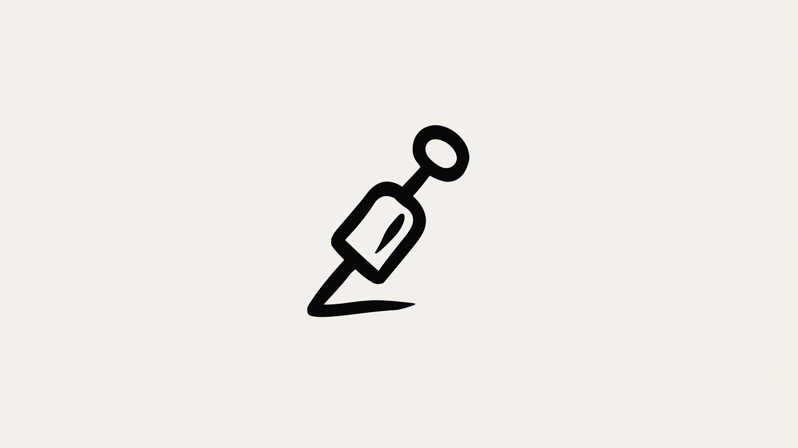

# L'art de diriger l'IA

Il existe un mode de travail avec l'IA qui se situe entre la passivité de l'autocomplétion et la délégation de l'autonomie totale. Vous sélectionnez du code, décrivez un état désiré, et l'IA exécute la transformation. Il ne s'agit pas de prédire votre prochaine frappe, mais de réécrire la logique selon votre intention.

J'appelle cela la **Direction**. Vous spécifiez la transformation, l'IA l'exécute, et vous vérifiez le résultat.

En surface, cela semble trivial. Sélectionner, décrire, accepter. Un "rechercher-remplacer" glorifié.

Mais j'ai commencé à analyser mes échecs.

"Améliore ça" produisait le chaos. "Ajoute la gestion d'erreurs" introduisait les mauvaises abstractions. "Refactorise ceci" brisait les dépendances en aval. L'IA faisait exactement ce que je demandais—je ne le demandais simplement pas avec assez de précision.

La Direction est une compétence. Comme toute discipline technique, elle possède ses techniques spécifiques, ses modes d'échec prévisibles et une courbe d'apprentissage abrupte. Les développeurs qui la maîtrisent compressent des heures de travail en minutes. Ceux qui ne le font pas génèrent simplement des bugs plus vite qu'ils ne peuvent les corriger.

Cet article traite de cette différence.

---

## Ce que la Direction Compresse Réellement


Chaque modification de code consiste en deux actes distincts : la **décision** et la **transcription**.

La **décision** est l'étincelle intellectuelle. *"Cette fonction a besoin de vérifications de nullité."* *"Ces callbacks devraient être async/await."* *"Cette logique de validation appartient à un module séparé."*

La **transcription** est le labeur mécanique. Localiser les références, taper la syntaxe, équilibrer les accolades, mettre à jour les tests.

La décision prend des secondes. La transcription prend des minutes—parfois des heures.

**La Direction compresse la transcription. La décision reste la vôtre.**

Cette distinction définit la frontière de la confiance. Vous n'externalisez pas votre jugement ; vous externalisez votre clavier. L'architecture, les cas limites, la question de *"devrions-nous même faire cela ?"*—tout cela reste votre responsabilité.

Quand j'ai commencé à diriger, je m'attendais à ce que l'IA prenne de bonnes décisions. C'était une erreur fondamentale. L'IA prend des décisions *rapides*. Qu'elles soient bonnes dépend entièrement de la précision de votre spécification.

---

## La Hiérarchie de la Précision


Une entrée vague produit des déchets. Une entrée précise produit du code prêt pour la production. Mais la précision n'est pas juste une question de verbosité—c'est une question de choix du bon *mécanisme* de spécification.

J'ai identifié trois niveaux de précision, chacun adapté à des contextes d'ingénierie différents.

### Niveau 1 : Les Contraintes
Parfois, l'instruction la plus critique n'est pas ce que vous voulez—c'est ce que vous *ne voulez pas*.

*   "N'ajoute pas de dépendances externes."
*   "Garde l'interface publique inchangée."
*   "Pas plus de 50 lignes."
*   "Ne modifie pas le schéma de base de données."

Les contraintes sont essentielles lorsque vous faites confiance aux détails d'implémentation de l'IA mais que vous devez imposer des limites. Elles agissent comme des garde-fous, pas comme des plans d'architecte.

**Quand l'utiliser :** Refactoring, optimisation, ou toute tâche où plusieurs approches valides existent, mais où vous devez filtrer les inacceptables.

### Niveau 2 : Les Modèles (Patterns)
Ne décrivez pas le style. Montrez-le.

```typescript
// Gestion d'erreur actuelle :
if (error) {
    console.log(error);
    return null;
}

// Transforme vers ce modèle :
if (error) {
    logger.error('Operation failed', { error, context: operationName });
    throw new AppError('OPERATION_FAILED', { cause: error });
}

// Instruction : Applique ce modèle à tous les gestionnaires d'erreur de ce fichier.
```

L'IA n'a pas à deviner vos conventions de code. Elle les voit. Les invites (prompts) basées sur des modèles surpassent systématiquement les descriptions abstraites.

**Quand l'utiliser :** Changements de style, standardisation, ou toute tâche où vous avez un exemple canonique de l'état désiré.

### Niveau 3 : Les Contrats
La forme ultime de précision est une spécification vérifiable par une machine : un test.

```typescript
test('retries failed requests with exponential backoff', async () => {
    const mockFetch = jest.fn()
        .mockRejectedValueOnce(new Error('timeout'))
        .mockRejectedValueOnce(new Error('timeout'))
        .mockResolvedValueOnce({ ok: true, data: 'success' });
    
    const result = await fetchWithRetry('/api/data', { 
        fetch: mockFetch,
        maxRetries: 3,
        baseDelay: 100 
    });
    
    expect(mockFetch).toHaveBeenCalledTimes(3);
    expect(result.data).toBe('success');
});
```

L'instruction : *"Fais passer ce test."*

Il n'y a ici aucune ambiguïté. L'IA ne peut pas mal interpréter le succès car le succès est défini par l'exécuteur de tests.

**Quand l'utiliser :** Changements de comportement complexes, nouvelles fonctionnalités, ou tout scénario où la correction peut être rigoureusement définie.

---

## La Discipline de Vérification

La précision vous amène à 80% du chemin. Les 20% restants sont la vérification.

L'IA est confiante, pas prudente. Elle produit du code qui *semble* correct avec la même fluidité qu'elle produit du code qui *est* correct. Votre travail est de faire la différence.

### Modes d'Échec Courants

**Les API Hallucinées**
L'IA invente des méthodes qui n'existent pas ou utilise les mauvaises signatures. C'est endémique avec les librairies moins communes.

```typescript
// Ce que l'IA a écrit :
await redis.setWithExpiry(key, value, 3600);

// Ce qui existe réellement :
await redis.set(key, value, { EX: 3600 });
```

**La Dérive Sémantique**
Le refactoring change le comportement, pas seulement la structure. Le code semble équivalent mais gère les cas limites différemment.

```typescript
// Original :
const result = items.find(x => x.id === id) || defaultItem;

// "Refactorisé" :
const result = items.find(x => x.id === id) ?? defaultItem;

// Problème : Ils se comportent différemment quand find() retourne un item "falsy".
```

**Les Violations de Modèles**
L'IA résout le problème correctement mais viole les conventions locales (ex: utiliser une `Error` brute au lieu de votre `AppError` personnalisée).

**Les Cas Limites Manqués**
Le chemin heureux fonctionne parfaitement. Les entrées nulles font planter le système. Les tableaux vides lèvent des exceptions. L'IA optimise pour le cas commun.

### La Checklist de Vérification
Avant d'accepter tout changement dirigé :

1.  **Lisez le Diff :** Chaque ligne. Si le changement est trop grand pour être lu, il est trop grand pour la direction—utilisez la collaboration à la place.
2.  **Vérifiez les Limites :** Que se passe-t-il avec null ? Les ensembles vides ? Les valeurs maximales ?
3.  **Vérifiez l'Usage des API :** Si le changement implique des appels de librairie, confirmez que les méthodes existent.
4.  **Lancez les Tests :** Évident, et pourtant facilement sauté quand le diff "semble correct".
5.  **Expliquez-le vous à vous-même :** Si vous ne pouvez pas articuler ce qui a changé et pourquoi, vous ne le comprenez pas assez bien pour le livrer.

---

## Le Piège de la Vitesse

La Direction est rapide. Dangereusement rapide.

Un diff apparaît en deux secondes. Votre cerveau fait une reconnaissance de motif par rapport à des structures familières. *"Ça ressemble à une gestion d'erreur standard. Ça ressemble au bon modèle. On livre."*

Je l'ai fait. J'ai approuvé des changements qui passaient les tests mais introduisaient des bugs subtils. J'ai livré du code qui fonctionnait en dev mais échouait en prod parce que j'avais manqué un cas limite que l'IA avait aussi manqué.

La vitesse du développement dirigé par l'IA crée un nouveau mode d'échec : **la Fatigue d'Approbation**. Quand chaque changement prend des secondes, votre discipline de revue s'érode. Vous commencez à générer des bugs plus vite que des fonctionnalités.

Ma règle : **Plus le changement est rapide, plus la revue doit être lente.**

Une génération de deux secondes mérite une revue de deux minutes. Non pas parce que chaque changement est risqué, mais parce que le coût de trouver des bugs en production excède de loin le coût d'une vérification soigneuse maintenant.

---

## Développer l'Instinct

Après un an de pratique quotidienne, j'ai développé des instincts que je n'avais pas au début.

### Le Cadrage (Scoping)
Toutes les tâches ne relèvent pas d'un changement dirigé. La compétence est de reconnaître ce qui correspond.

**Bon pour la Direction :**
*   Changements sur une fonction unique.
*   Transformations claires avec résultats connus.
*   Refactoring au sein d'un seul fichier.
*   Changements où le diff est <100 lignes.

**Mauvais pour la Direction :**
*   Fonctionnalités multi-fichiers.
*   Exigences ambiguës.
*   Tâches nécessitant de l'exploration.
*   Décisions architecturales.

Si je me surprends à écrire une invite longue et multi-étapes, c'est un signal. La Direction est pour les frappes chirurgicales, pas pour les campagnes militaires.

### L'Itération des Invites (Prompts)
La première invite produit rarement le résultat parfait. Savoir *comment* itérer compte plus que de réussir du premier coup.

*   **Resserrer, ne pas recommencer :** *"C'est proche, mais utilise notre classe `AppError`"* vaut mieux que de réécrire l'invite initiale.
*   **Ajouter des contraintes incrémentalement :** Si la sortie dérive, ajoutez une contrainte pour la fixer. *"Même chose, mais garde la fonction sous les 30 lignes."*
*   **Montrer ce qui ne va pas :** *"La logique de réessai semble correcte, mais le calcul du délai est linéaire, pas exponentiel."*

Chaque itération enseigne vos exigences à l'IA et vous enseigne ce que vous avez omis de spécifier.

### La Reconnaissance de Motifs
Après avoir revu des centaines de diffs générés par l'IA, je scanne pour des drapeaux rouges spécifiques :
*   **Imports Inhabituels :** Dépendances potentiellement hallucinées.
*   **One-Liners Complexes :** Haut risque de dérive sémantique.
*   **Gestion d'Erreur Manquante :** Cas limites probablement ignorés.
*   **Nombres Magiques :** Constantes qui devraient être configurables.

La vitesse en revue vient de savoir *où* regarder, pas de regarder plus vite.

---

## Quand Diriger ne Suffit Pas

La Direction a ses limites. Elle fonctionne pour des changements contenus—une fonction unique, une transformation claire, un diff que vous pouvez revoir ligne par ligne.

Mais certaines tâches sont structurelles. *"Ajoute l'export CSV au tableau de bord analytique"* n'est pas un changement dirigé—c'est une fonctionnalité. Elle couvre plusieurs fichiers. Elle nécessite de l'exploration. C'est un mode entièrement différent : non pas commander des transformations, mais **Collaborer** vers un objectif.

**Signes que vous avez dépassé la Direction :**
*   Le changement couvre plusieurs fichiers.
*   Vous n'êtes pas sûr de ce que vous voulez exactement.
*   L'invite dépasse quelques phrases.
*   Vous avez besoin que l'IA lise du code avant d'en écrire.

La Direction est un scalpel—précise, contenue, chirurgicale. La Collaboration est une conversation—itérative, exploratoire, large. L'ingénieur maître sait quel outil saisir.

---

## L'Effet Composé

Bien diriger rapporte des intérêts composés avec le temps.

Chaque changement spécifié avec précision aiguise votre capacité à articuler votre intention. Chaque erreur attrapée affine votre "linter mental". Chaque refactor réussi construit votre intuition de ce qui fonctionne.

Après un an de pratique, je dirige des changements en quelques secondes qui m'auraient pris des minutes à taper—et j'attrape les problèmes avant qu'ils ne partent en prod. La combinaison de vitesse et de vérification n'est pas contradictoire ; c'est la compétence elle-même.

Le but n'est pas juste d'accepter les changements plus vite. C'est de développer le jugement qui rend la vérification rapide fiable. Ce jugement est la différence entre une IA qui vous accélère et une IA qui génère de la dette technique. Les outils sont les mêmes. La compétence est la vôtre à construire.
