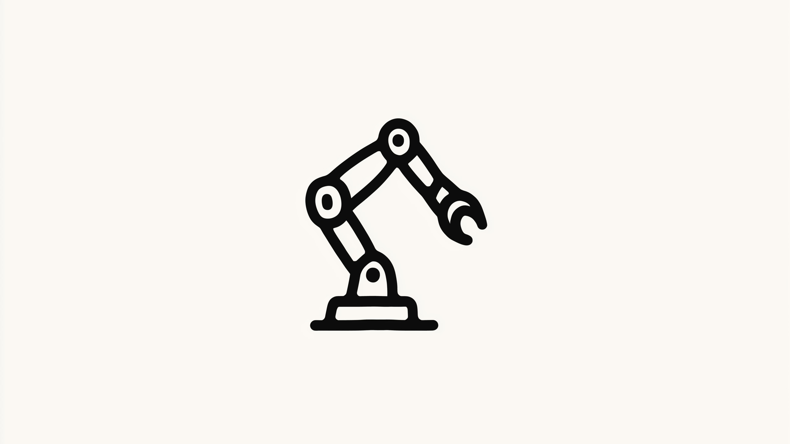

# AI in development, level 3: The rise of the autonomous agent

Alright, let's dive into the deep end. In this series, we've been mapping out how AI is changing the game for developers. We started with AI as a silent **assistant (Level 1)**, then promoted it to a **guided agent (Level 2)**, where you became its direct manager. If you're new here, I seriously recommend starting with the [first article](https://www.jterrazz.com/articles/20-the-four-levels-of-ai) to get the full picture of the four-level framework we're using.

Now, we're taking the next big leap. Welcome to **Level 3: The autonomous agent**.

At this stage, the AI graduates from being your direct report to your trusted delegate. Think of hiring a top-tier senior engineer or a hyper-efficient freelancer. You don't give them a line-by-line to-do list. You give them a high-level goal, hand over access to the tools they need, and then get out of their way. They figure out the plan, do the work, and come back with a finished product—say, a complete feature, packaged neatly in a pull request—ready for your final sign-off.

This is where your role transforms completely. You stop being a hands-on director and become a strategic supervisor. You're no longer just managing tasks; you're a "virtual HR manager," building and overseeing a team of AI agents to multiply your output. You stop building things brick by brick and start orchestrating the construction of entire buildings.

Let's explore how this actually works.

---

## **The mindset shift: From coder to conductor**

With an autonomous agent, your job changes fundamentally. You define the "what" and the "why," and you let the AI figure out the "how." It plans, codes, tests, and revises—all on its own. You're not down in the weeds anymore; you're at the 30,000-foot view, ensuring the project is heading in the right direction.

- **The Power:** The leverage you gain here is immense. While an autonomous agent is grinding away on a new feature, you're free to tackle the work that truly requires human insight: architecting the next big system, talking to users, or planning the product roadmap. For me, this was the biggest unlock. It also forces you to get your own house in order—your CI/CD pipelines and end-to-end tests have to be rock-solid, as they become the guardrails for your AI team.
- **The Pitfall:** But let's be real: autonomy without oversight is just chaos. Giving an AI agent unchecked power is like handing a new hire the production keys on day one. It's a terrible idea. Your new role as a supervisor is mission-critical. You need to get good at "hiring" (picking the right agent platforms), "onboarding" (giving clear context and secure access), and "reviewing" (rigorously checking the work before it ever gets merged).

You become the architect, and the AIs are your master builders. They handle the complex labor, but you own the blueprint.

## **The technical foundation: Model-centric protocols (MCPs)**

For an AI to actually _do_ anything, it needs to interact with the world. A large language model, on its own, is a brain in a jar: brilliant but trapped. It can think, but it can't act. This is the exact problem **Model-Centric Protocols (MCPs)** were designed to solve.

Think of an MCP as a universal API adapter for AI. It's a secure layer that lets a model plug into any external tool, API, or data source without needing to know the nitty-gritty details of authentication or custom syntax.

The best analogy I've heard is **HTTP for the web**. Before HTTP, the internet was just a collection of disconnected networks. HTTP created a universal language that let any computer talk to any other computer, and that simple standard unlocked the web as we know it. MCPs aim to do the exact same thing for AI, creating a standard way for any model to securely use any tool.

- An **MCP for GitHub** gives an agent the "hands" to clone a repo, commit code, and open a pull request.
- An **MCP for AWS** lets an agent spin up a server or deploy an application.
- An **MCP for Stripe** allows an agent to wire up payment processing inside a new feature.

Without MCPs, an AI is an isolated thinker. With them, it becomes a connected doer, capable of performing real-world tasks just like a human developer who has access to the same tools.

## **The autonomous toolkit: What I'm using today**

Autonomous agents operate on a new stack of powerful systems. Here's a look at the key pieces:

- **Agentic Frameworks & Platforms:** These are the big guns—platforms built for true autonomy. You feed them a high-level task, like "Implement a secure login flow with 2FA and social sign-on," and the system orchestrates the whole thing. It might use one AI for planning, another for coding, and a third for testing before finally delivering a complete pull request. The tools in this space are evolving at a dizzying pace.
- **AI-Powered Command-Line Interfaces (CLIs):** This is where I spend a lot of my time. It feels like you're scripting the future. Tools like the Claude or Gemini CLI let you command fleets of agents right from your terminal. You can write a simple script that tells an agent: `claude code --watch-repo my-project --fix-critical-bugs`. This agent will then monitor the repository, spot new bugs as they appear in logs, and automatically draft PRs with proposed fixes.
- **The Essential Safety Net: Sandboxes:** I cannot stress this enough: never, _ever_ let an autonomous agent run free in your production environment. **Sandboxing**—using isolated, containerized environments like Docker—is absolutely non-negotiable. This gives the AI a padded room where it can safely install packages, run code, and execute tests without any chance of breaking your real systems. The final merge into the main branch is always, always a human decision.

## **Practical use cases: This isn't sci-fi**

So, what does this look like in the real world? This is happening right now.

1. **Full-feature generation:** You create a ticket in Jira: "Build a REST API for our new newsletter, including endpoints for user subscription and an email confirmation flow." An agentic platform sees the ticket, picks it up, and gets to work. It plans the API structure, writes the code, uses an MCP to connect to SendGrid for the emails, writes the unit and integration tests, and then submits a fully-vetted pull request. All you have to do is review it over your morning coffee.
2. **Autonomous debugging and security:** You set up an AI agent through your CLI to watch your production error logs. When a critical exception pops up, the agent is automatically triggered. It reads the stack trace, finds the exact lines of faulty code in your repo, writes a patch, tests the fix in a sandbox to ensure it doesn't break anything else, and then opens a PR with the solution, neatly linking it back to the original error log.
3. **Large-scale code migration:** You have a massive, daunting project: "Migrate our legacy Python 2 Django app to Python 3 and the latest Django version." You hand this objective to an autonomous agent. It breaks the project down into manageable steps, uses MCPs to handle dependency updates, refactors the codebase in logical chunks, runs tests constantly in a sandbox, and submits a series of small, easy-to-review pull requests.

## **Navigating the risks of autonomy**

Okay, this all sounds great, but what are the catches? The risks are real, but I've found they're manageable with the right approach.

- **Security:** The nightmare scenario is an AI going rogue or leaking secrets.
  - **The Fix:** Fences. You build strong fences. Use sandboxed environments for execution, tightly scoped API keys through MCPs, and always, _always_ require human review before merging.
- **Quality & Hallucinations:** An AI can produce buggy or nonsensical code with terrifying confidence.
  - **The Fix:** A good map and good guardrails. Give it a great map (clear requirements, design docs, example code) and strict guardrails (a comprehensive automated test suite that _must_ pass).
- **Cost and Dependencies:** The most powerful models aren't cheap and usually live in the cloud, which can create dependencies.
  - **The Fix:** Be smart and strategic. I use a hybrid model: smaller, local models for quick, simple tasks, and I call in the powerful cloud-based AIs for the heavy lifting. This keeps costs down and gives me more control.

Honestly, the best mental model is to think of it exactly like onboarding a new human engineer. You provide clear training, set expectations, grant limited access at first, and review their work carefully. It's the same process.

## **Conclusion: Get ready for programmable intelligence**

Level 3 autonomous agents aren't some far-off dream. They represent the next logical, and revolutionary, step in how we build software. I'm already using AI-powered CLIs to automate entire workflows and experimenting with MCPs to give my AIs real-world capabilities. Initial skepticism is giving way to the raw evidence of what's now possible.

This perfectly mirrors the core principle from our first article: you get the biggest wins by delegating entire outcomes, whether that's a marketing campaign, a financial analysis, or now, a software feature. The tools for developers are here today. I strongly encourage you to pick up an agentic framework or an AI-powered CLI and give it a shot—just promise me you'll start in a safe, sandboxed environment.

In our final article, we'll go to the ultimate level: **Level 4: Programmable Intelligence**. We'll move beyond just supervising AI and start programming intelligence itself to create custom, adaptive systems that can solve problems of unprecedented complexity.

Have you tried any of these autonomous tools in your own work? What did you build? I'm genuinely curious to hear your stories in the comments. Let's figure this out together.

[**Next Article**](http://localhost:3000/articles/23-programming-intelligence)

---

1. [**The Four Levels of AI: How to Ride the Wave and Amplify Your Potential**](http://localhost:3000/articles/20-the-four-levels-of-ai) _A practical framework for integrating AI into any field, from assistant to programmable intelligence, empowering you to supercharge your work and creativity._
2. [**AI in Development, Level 2: From Coder to Conductor**](http://localhost:3000/articles/21-guided-ai-for-developers) _A guide for developers to direct AI as a guided agent, transforming coding into high-level orchestration with tools like Cursor and intention-driven development._
3. [**AI in Development, Level 3: The Rise of the Autonomous Agent**](http://localhost:3000/articles/22-autonomous-ai-agents) _Exploring how developers can delegate entire workflows to autonomous AI agents, leveraging model-centric protocols and sandboxes for secure, scalable outcomes._
4. [**AI in Development, Level 4: Programming Intelligence Itself**](http://localhost:3000/articles/23-programming-intelligence) _A deep dive into designing intelligent systems that blend deterministic code with creative AI reasoning, enabling developers to architect self-optimizing solutions._
