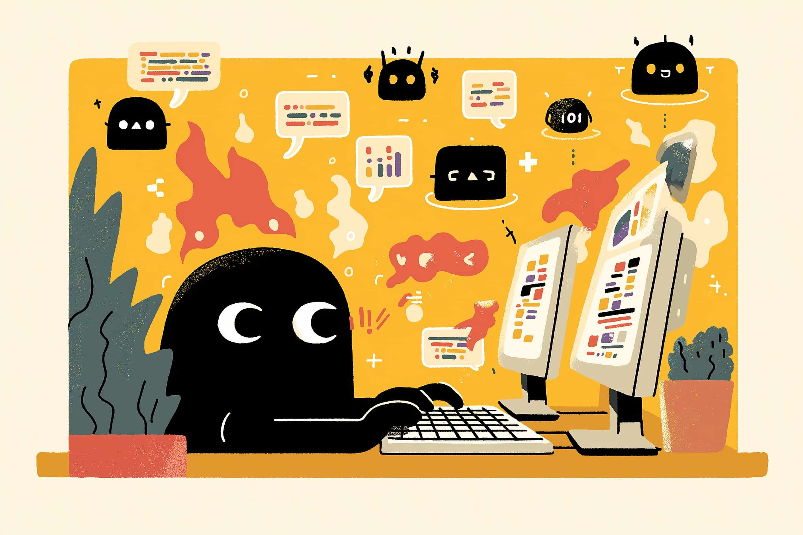

# Collaborer avec l'IA

Un seul prompt : « Ajoute l'export CSV au dashboard analytics. Inspire-toi de notre export PDF. »

Puis j'ai regardé. L'agent a parcouru ma codebase, trouvé l'export PDF, analysé le pattern, commencé à implémenter. Endpoint backend, transformation de données, composant frontend — le tout à partir d'une phrase.

Face à une ambiguïté, il a tranché. Je l'ai vu, corrigé. Il s'est adapté. Il a généré les tests, les a lancés, corrigé un échec, présenté le résultat.

C'est déroutant au début. On ne code plus — on supervise. Une conversation qui converge vers une solution ; on intervient quand ça dérive, on valide quand ça atterrit.

Voilà ce qu'est la collaboration — travailler *avec* l'IA sur des problèmes trop vastes pour des frappes chirurgicales. Des heures d'implémentation comprimées en minutes d'itération guidée.

***

## La boucle collaborative

La direction, c'est ordre-exécution. Vous dites quoi faire ; il le fait ; vous vérifiez.

La collaboration, c'est une conversation. Vous fixez un objectif, l'agent explore et implémente, vous observez et intervenez, il s'adapte, vous affinez, on recommence.

La boucle, concrètement :

1. **Donner le cap.** « Ajoute l'authentification email/mot de passe et OAuth. Respecte nos conventions. »
2. **Observer.** L'agent explore, prend des décisions. Vous voyez où il se dirige.
3. **Intervenir.** « Mauvaise lib d'auth — on utilise `next-auth`, pas `passport`. »
4. **Il s'ajuste.** Continue avec la correction intégrée.
5. **Affiner.** « Bien, mais extrais la config dans un fichier séparé. »
6. **Répéter.** Jusqu'à ce que la feature soit complète.

Vous ne vérifiez pas ligne par ligne. Vous vérifiez la *trajectoire* — est-ce que ça va où je veux ? La réflexion reste la vôtre. Mais au lieu de taper chaque décision, vous pilotez quelque chose qui exécute pendant que vous sculptez.

***

## Apprendre à connaître son agent

Plus on travaille avec un agent, plus on repère ses patterns.

**Là où il excelle :**
- Reproduire les patterns existants de votre codebase
- Les modifications multi-fichiers fastidieuses mais pas nouvelles
- Les features lourdes en boilerplate (CRUD, formulaires, suites de tests)
- Le refactoring à grande échelle (« passe tous les callbacks en async/await »)

**Là où il peine :**
- L'architecture vraiment nouvelle (structures de données custom, patterns atypiques)
- Les specs floues (il devinera, souvent mal)
- Ce qu'il ne voit pas (impact perf, failles de sécurité)
- Vos conventions tacites (ce que vous « savez » sans l'écrire)

Connaître ces patterns permet de mieux travailler avec lui :

**Découpez le nouveau en morceaux familiers.** « Conçois un cache custom » échoue. « Crée un wrapper de Map, puis ajoute le TTL, puis l'éviction LRU » fonctionne.

**Rendez l'implicite explicite.** Verbalisez les conventions absentes du code. « On utilise systématiquement des early returns. »

**Montrez un exemple pour les patterns inhabituels.** Écrivez un cas à la main, puis demandez-lui de suivre le pattern.

**Interrompez tôt.** S'il s'égare, n'attendez pas. Stop, correction, on repart.

***

## La confiance architecturale

La direction exige une relecture ligne par ligne. La collaboration demande un autre registre de confiance.

Vous n'allez pas éplucher chaque ligne d'un diff de 500 lignes. Vous vérifiez :

- **L'approche est-elle la bonne ?** L'architecture globale tient-elle debout ?
- **Respecte-t-il nos patterns ?** Ou a-t-il inventé quelque chose d'incompatible ?
- **Les décisions clés sont-elles correctes ?** Les endroits où il a dû trancher.
- **Qu'a-t-il manqué ?** Cas limites, gestion d'erreurs, ce qu'il ne pouvait pas deviner.

Ça demande plus de jugement que la direction. Il faut lire un gros diff et en saisir la forme, pas seulement la syntaxe.

Le compromis : vous gagnez en vitesse sur les grosses features, mais acceptez un risque accru que quelque chose passe entre les mailles. La parade, ce sont les tests — une bonne couverture permet de faire confiance à l'implémentation et de concentrer la revue sur les choix d'architecture.

Mon approche :
1. **Structure d'ensemble d'abord.** Quels fichiers ? Quelle forme générale ?
2. **Points de décision.** Où a-t-il dû trancher ?
3. **Signaux d'alerte.** Dépendances inattendues, mauvais patterns, complexité suspecte.
4. **Tests.** S'ils passent, je fais davantage confiance aux détails.
5. **Vérification ponctuelle des chemins critiques.**

***

## Choisir le bon mode

Toutes les tâches ne réclament pas la collaboration. Le talent, c'est d'adapter l'approche à la situation.

**Direction quand :**
- Le changement est contenu dans un fichier ou une fonction
- Vous savez exactement ce que vous voulez
- Le diff sera assez petit pour une relecture ligne par ligne

**Collaboration quand :**
- La feature s'étend sur plusieurs fichiers
- Le chemin est connu mais fastidieux (CRUD, boilerplate, patterns déjà vus)
- Vous pouvez décrire l'objectif mais pas chaque étape

**Aux commandes quand :**
- Le problème est vraiment nouveau
- Vous avez besoin de réfléchir en tapant
- La sécurité ou l'exactitude est critique

L'essentiel de mon travail reste de la direction — précision chirurgicale. Mais c'est dans la collaboration que se jouent les plus gros gains de temps. Une feature qui prend une journée à implémenter à la main peut se boucler en une heure d'itération guidée.

***

## Le rythme

Après des mois à fonctionner ainsi, j'ai trouvé mon rythme.

Le matin : s'attaquer à la grosse feature par la collaboration. Donner le cap, itérer jusqu'au bout. Revoir les choix, lancer les tests, livrer.

Le reste de la journée : la direction pour tout le reste. Refactos rapides, corrections de bugs, petites améliorations. Cmd+K, relecture, validation.

La combinaison est redoutable. La collaboration gère les gros morceaux ; la direction gère les finitions. Ensemble, elles compriment des jours en heures.

La réflexion et les décisions restent miennes. Le travail mécanique de les transformer en code ? Il est partagé.

***

*Prochain article : que se passe-t-il quand l'IA cesse d'être un outil de développement pour devenir une brique du produit lui-même ?*
