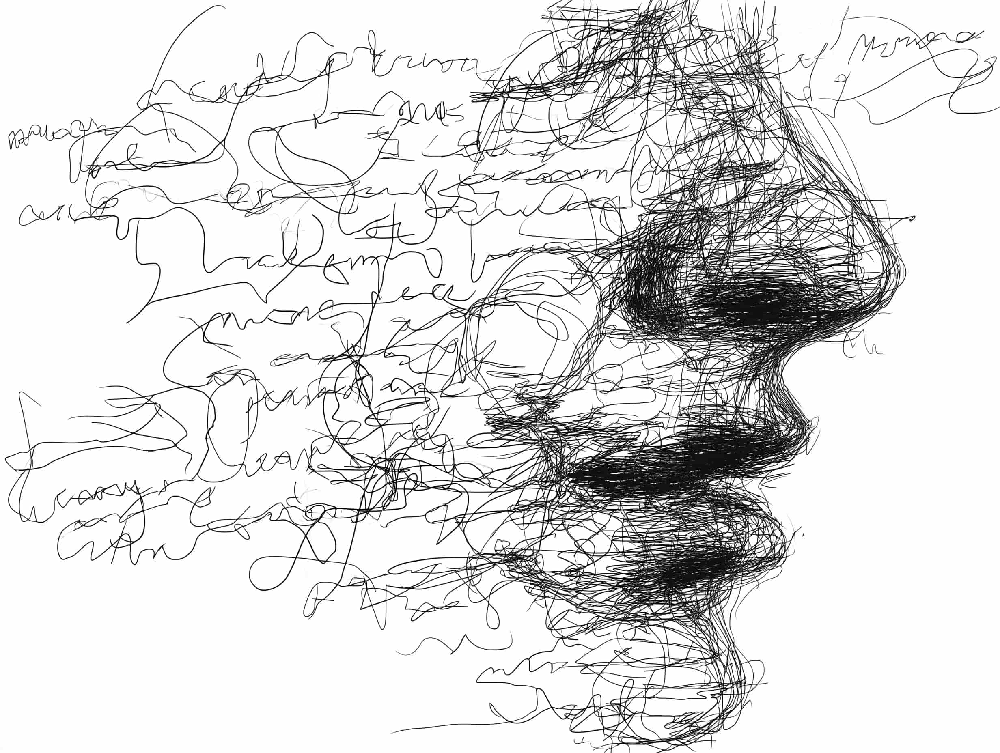

# Mapping the Noise

A single event happens. Within minutes, it shatters.

It refracts through a thousand different lenses—each with its own focus, its own omissions, and its own agenda. A protest becomes a "righteous movement" or a "violent riot." A policy is "historic reform" or "dangerous overreach."

We usually pick one fragment, hold it close, and call ourselves informed. In reality, we are just confirmed.

But what if you could see the whole glass?

I’ve been obsessed with this idea: a dashboard that doesn't just list the news, but maps it. A tool that visualizes the actual topography of a narrative. You would see the **common ground** (where everyone agrees), the **fault lines** (where interpretations split), and the **edges** (where reporting dissolves into speculation).

We don't need another feed. We need a map.

## Why now?

This simply wasn't possible yesterday. To manually compare hundreds of global sources in real-time would require an editorial army the size of a nation.

But AI changes the physics of information.

It can scan, correlate, and synthesize at a scale no human team can match. Crucially, it does this without taking sides. The machine doesn't care who wins the argument; it simply processes the data. It allows us to map *what* is being said and *by whom*, stripping away the emotion to reveal the structure of the conflict.

## A clearer signal

I keep imagining an interface defined by radical clarity. A situation room for the rest of us.

You tap into a topic, and the landscape unfolds. You can zoom out for the synthesized executive summary or dive deep into the specific contradictions. It rewards curiosity, not outrage. It turns the act of reading the news into an exploration of perspective.

I’m not interested in building a "Truth Machine." The goal isn't to tell people *what* to think. It’s to show them the full range of thought and let them decide for themselves.

We are entering an era where AI becomes a new kind of interface—a buffer that processes the noise of the world and presents something human. Instead of twenty open tabs and the mental fatigue of cross-referencing, you get a dashboard that respects your time.

This is the application I want to build.
