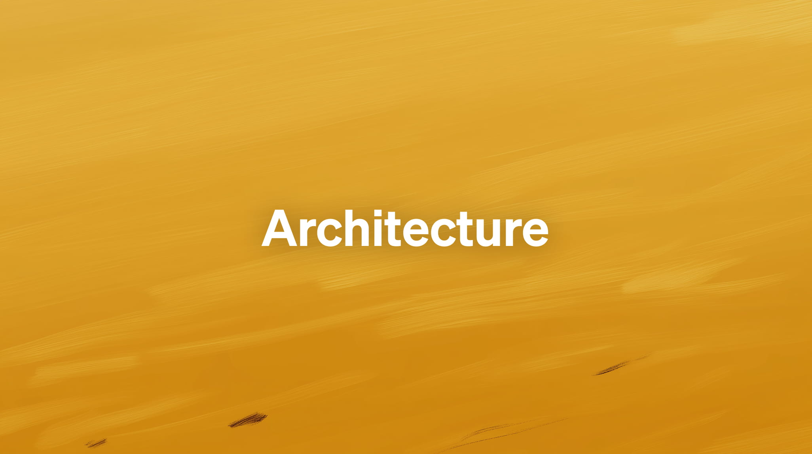
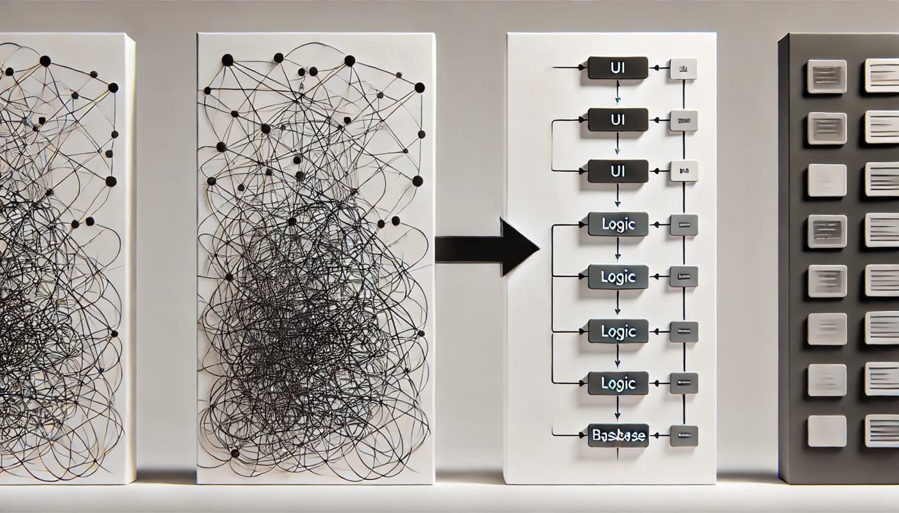
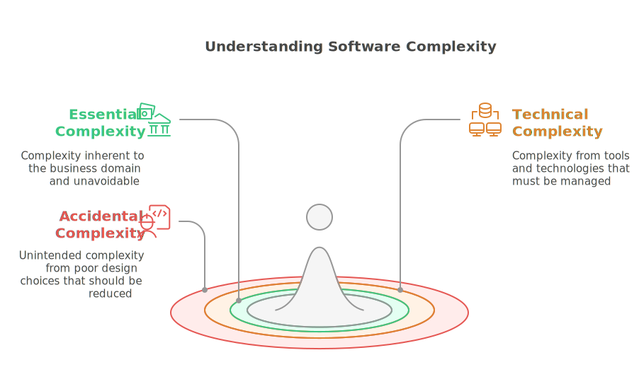

# Application Design: Building Sustainable and Scalable Software

## Understand Software Architecture and Code Better

Software architecture is far more than just a technical matter: it lies at the heart of a software project's success or failure. For developers, architects, and project managers, knowing where and how to structure code is essential. But the question isn't simply: "Where should I put this piece of code?" It goes far deeper.

It's about making strategic decisions—often invisible to the end user—that ensure the software can evolve, adapt, and remain robust over time. These decisions influence not only how teams work today but also how they will maintain and improve the software tomorrow. This is where **application design** comes into play—a key discipline that blends technical expertise, strategy, and pragmatism.

In this article, we'll explore what application design truly is, why it is critical, and how it has evolved over the decades. We'll also lay the groundwork to understand the principles, practices, and methodologies that enable developers to build software that is both **maintainable** and **scalable**.

**Navigation 📚**

1. [**Introduction: Application Design, The Art of Building Sustainable and Scalable Software**](https://www.jterrazz.com/articles/9)
	 *The basics to understand the stakes and objectives of good architecture.*

2. [**Chapter 1: The Concept of Dependencies**](https://www.jterrazz.com/articles/10)
	 *Exploring relationships between components, the importance of dependencies, and principles like SOLID.*

3. [**Chapter 2: Understanding Business and Technical Architectures**](https://www.jterrazz.com/articles/11)
	 *How to isolate business logic from technical concerns using ports and adapters.*

4. [**Chapter 3: Clean Architecture**](https://www.jterrazz.com/articles/12)
	 *Discovering an approach focused on business with a clear layered structure.*

---

# Application Design: What Is It About?

# A Solution to a Universal Problem

Imagine a development team at work. Developers ask themselves: "Where should I put this piece of code?" "How should I structure this new feature?" or even "Will this approach hold up in six months when we need to add new features or fix a bug?"

These questions, though common, are far from trivial. They reflect the fundamental challenges developers face when designing software that works today but remains relevant tomorrow. **Application design** is a response to these challenges. It is a discipline that transforms technical choices into a genuine strategy, ensuring long-term project success.

In other words, application design is the art of making **conscious decisions** about:

- **Code structure**.
- **Component organization**.
- **Relationships and interactions between components**.

Its primary goal is to create **maintainable** applications—easy to understand, fix, and improve—and **scalable** applications—capable of adapting to new requirements and technologies.

---

# Complexity: An Enemy to Tame

Designing software is never simple. One of the first steps in successful application design is understanding the different forms of **complexity** that make up software architecture. This complexity generally falls into three main categories:

1. **Essential Complexity**
	 This is the inherent complexity of the business or functional domain the software addresses. For example, in a banking application, interest calculation rules or transaction validation processes are part of this complexity. It is unavoidable because it is tied to the problem the software solves.

2. **Technical Complexity**
	 This complexity arises from the tools and technologies used, such as databases, frameworks, or servers. While necessary, it must be managed to prevent it from becoming a burden.

3. **Accidental Complexity**
	 Finally, there is complexity unintentionally introduced by poor design decisions or inappropriate technical choices. Examples include spaghetti code that is hard to read, overuse of frameworks, or nonexistent documentation. Unlike essential complexity, accidental complexity can—and should—be reduced.

Good application design focuses on minimizing accidental complexity, managing technical complexity, and addressing essential complexity head-on.

---

# A Timeline of Application Design Evolution

To better understand how we came to discuss application design today, it's helpful to look back and follow its evolution. Here's an overview of the key milestones:

- **Before 2000:**
	Software was often designed empirically, without clear methodologies. Spaghetti architectures were common, and testing was manual.
- **2000s:**
	The introduction of frameworks, layered models, and agile methodologies transformed how software was built. The automated testing pyramid emerged, focusing on unit tests targeting small portions of code. Teams began to understand the importance of a more structured approach.
- **Post-2015:**
	With practices like **Test-Driven Development (TDD)**, **Domain-Driven Design (DDD)**, and advanced architectures such as **hexagonal architecture** and **clean architecture**, collaboration among teams (product, operations, business) was redefined. **Continuous deployment** became the norm, codifying practices that foster quality and adaptability.

---

# The Foundation of Application Design

Application design is also shaped by fundamental principles from two key manifestos:

1. **The Agile Manifesto**
	 Published in 2001, it emphasizes:
	 - **Working software** over comprehensive documentation.
	 - **Adapting to change** over following a rigid plan.
	 - **Individuals and interactions** over processes and tools.
	 - **Customer collaboration** over contract negotiation.

2. **The Software Craftsmanship Manifesto**
	 Considered a complementary point-by-point response, it values:
	 - **Well-crafted software**.
	 - **Continuous delivery of value**.
	 - A **community of skilled, committed professionals**.
	 - **Productive partnerships** with stakeholders.

---

**Application design** is not a discipline that can be invented or improvised. It is a blend of proven principles, thoughtful analysis, and strategic choices. By understanding complexity, learning from past developments, and adopting strong values, developers can build applications that meet today's needs while remaining relevant and effective in the long term.

In the first chapter, we'll explore how to identify and manage dependencies to limit coupling, facilitate testing, and make your software more resilient. Let's move on!
