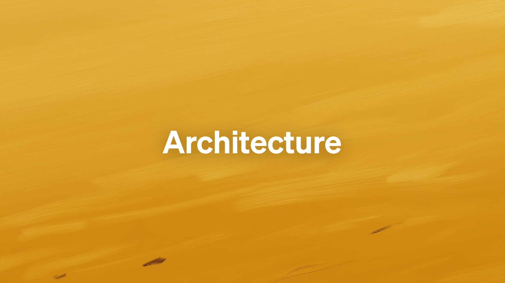
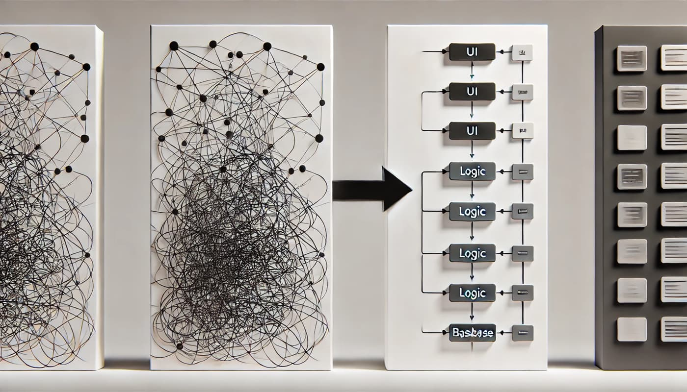
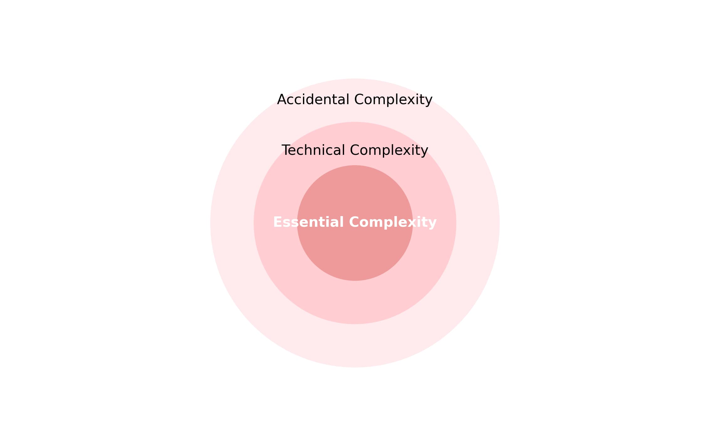

# Le Design Applicatif: L'Art De Construire Des Logiciels Durables Et Évolutifs - Introduction

## Comprendre l'Architecture Logicielle

L'architecture logicielle est bien plus qu'une simple question technique: elle est au cœur de la réussite ou de l'échec de tout projet logiciel. Pour tout développeur, architecte ou chef de projet, savoir où et comment structurer son code est essentiel. Mais la question n'est pas simplement: " Où dois-je mettre ce bout de code? ". Elle va bien au-delà.

Il s'agit de prendre des décisions stratégiques, souvent invisibles pour l'utilisateur final, mais essentielles pour garantir que le logiciel puisse évoluer, s'adapter et rester robuste au fil du temps. Ces décisions influencent non seulement la manière dont les équipes travaillent aujourd'hui, mais aussi la manière dont elles maintiendront et amélioreront le logiciel demain. C'est là qu'intervient le **design applicatif**, une discipline clé qui allie savoir-faire technique, stratégie et pragmatisme.

Dans cet article, nous allons explorer ce qu'est réellement le design applicatif, pourquoi il est crucial, et comment il a évolué au fil des décennies. Nous poserons aussi les bases nécessaires pour comprendre les principes, les pratiques et les méthodologies qui permettent de construire des applications **maintenables** et **évolutives**.

**Navigation 📚**

1. **Introduction: Le Design Applicatif, L'Art De Construire Des Logiciels Durables Et Évolutifs**
*Les bases pour comprendre les enjeux et les objectifs d'une bonne architecture.*

2. **Chapitre 1: Le concept de dépendances**
	 *Explorer les relations entre composants, l'importance des dépendances, et les principes comme SOLID.*

3. **Chapitre 2: Comprendre Les Architectures Métier Et Technique**
	 *Comprendre comment isoler le métier des préoccupations techniques grâce aux ports et adaptateurs.*

4. **Chapitre 3: La Clean Architecture**
	 *Découvrir une approche centrée sur le métier avec une structuration claire en couches.*

---

## Le Design Applicatif: De Quoi Parle-t-on?

### Une Solution à Un Problème Universel

Imaginez une équipe de développement au travail. Les développeurs se demandent: " Où dois-je mettre ce bout de code? ", " Comment structurer cette nouvelle fonctionnalité? ", ou encore " Est-ce que cette approche tiendra dans six mois, quand nous aurons besoin d'ajouter une nouvelle fonctionnalité ou de corriger un bug? ".

Ces questions, bien que fréquentes, ne sont pas anodines. Elles reflètent les défis fondamentaux auxquels tous les développeurs sont confrontés lorsqu'il s'agit de concevoir un logiciel qui fonctionne aujourd'hui, mais qui reste aussi pertinent demain. Le **design applicatif** est alors une réponse à ces défis. C'est une discipline qui permet de transformer des choix techniques en une véritable stratégie, afin que le projet reste une réussite sur le long terme.

En d'autres termes, le design applicatif, c'est l'art de prendre des **décisions conscientes** concernant:

- **La structure du code**.
- **L'organisation des composants**.
- **Les relations et les interactions entre ces composants**.

Son objectif principal est de créer des applications **maintenables**, c'est-à-dire faciles à comprendre, à corriger et à améliorer, et **évolutives**, capables de s'adapter à de nouvelles exigences et technologies.

---

### La Complexité: Un Ennemi à Apprivoiser

Un logiciel n'est jamais simple à concevoir. L'une des premières étapes pour réussir un design applicatif est de comprendre les différentes formes de **complexité** qui composent une architecture logicielle. Cette complexité se divise généralement en trois grandes catégories:

1. **Complexité Essentielle**
	 C'est la complexité inhérente au métier ou au domaine fonctionnel que le logiciel doit traiter. Par exemple, dans une application bancaire, les règles de calcul des intérêts ou les processus de validation des transactions font partie de cette complexité. Elle est inévitable, car liée au problème que le logiciel résout.

2. **Complexité Technique**
	 Cette complexité découle des outils et technologies utilisés, comme les bases de données, les frameworks, ou encore les serveurs. Bien qu'elle soit nécessaire, elle doit être maîtrisée pour éviter qu'elle ne devienne un fardeau.

3. **Complexité Accidentelle**
	 Enfin, il y a la complexité créée involontairement par de mauvaises décisions de conception ou des choix techniques inappropriés. Par exemple, un code spaghetti difficile à lire, une surutilisation de frameworks, ou une documentation inexistante. Contrairement à la complexité essentielle, celle-ci peut et doit être réduite.

Un bon design applicatif consiste donc à minimiser la complexité accidentelle, à gérer la complexité technique, tout en s'attaquant de front à la complexité essentielle.

---

### Une Timeline Pour Comprendre L'évolution Du Design Applicatif

Pour mieux comprendre comment nous en sommes arrivés à parler de design applicatif aujourd'hui, il est utile de regarder en arrière et de suivre son évolution. Voici une vue d'ensemble des grandes étapes:

- **Avant 2000:**
	À cette époque, les logiciels étaient souvent conçus de manière empirique, sans méthodologies claires. Les architectures spaghettis étaient monnaie courante et les tests étaient réalisés manuellement.
- **Années 2000:**
	L'introduction des frameworks, des modèles en couches et des méthodologies agiles a transformé la façon de concevoir le logiciel. La pyramide des tests automatisés est née, avec des tests unitaires ciblant des portions réduites de code. Les équipes commencent à comprendre l'importance d'une organisation plus rigoureuse.
- **Après 2015:**
	Avec l'avènement de pratiques comme le **Test-Driven Development (TDD)**, le **Domain-Driven Design (DDD)**, et des architectures avancées comme l'**architecture hexagonale** et la **clean architecture**, la collaboration entre équipes (produit, ops, métier) est redéfinie. Le **déploiement continu** est aujourd'hui la norme, codifiant des pratiques qui favorisent la qualité et l'adaptabilité.

---

### La Fondation Du Design Applicatif

Le design applicatif est également influencé par des principes fondamentaux issus de deux manifestes fondateurs:

1. **Le manifeste du développement agile**
	 Publié en 2001, il met en avant:
	 - Les **logiciels opérationnels** plutôt que la documentation exhaustive.
	 - L'**adaptation au changement** plutôt que le suivi rigide d'un plan.
	 - Les **individus et leurs interactions** plutôt que les processus et outils.
	 - La **collaboration avec le client** plutôt que la négociation contractuelle.

2. **Le manifeste du Software Craftsmanship**
	 Considéré comme une réponse complémentaire point par point, il valorise:
	 - Les **logiciels bien conçus**.
	 - L'**ajout constant de valeur**.
	 - Une **communauté de professionnels compétents** et engagés.
	 - Des **partenariats productifs** avec les parties prenantes.

---

Le **design applicatif** n'est pas une discipline qui s'invente ou s'improvise. C'est un mélange de principes éprouvés, d'analyses réfléchies et de choix stratégiques. En comprenant la complexité, en apprenant des évolutions passées et en adoptant des valeurs solides, les développeurs peuvent construire des applications qui répondent non seulement aux besoins d'aujourd'hui, mais qui restent pertinentes et efficaces à long terme.

Dans le premier chapitre, nous verrons comment identifier et maîtriser les dépendances pour limiter le couplage, faciliter les tests et rendre votre logiciel plus résilient. Passons à la suite!
