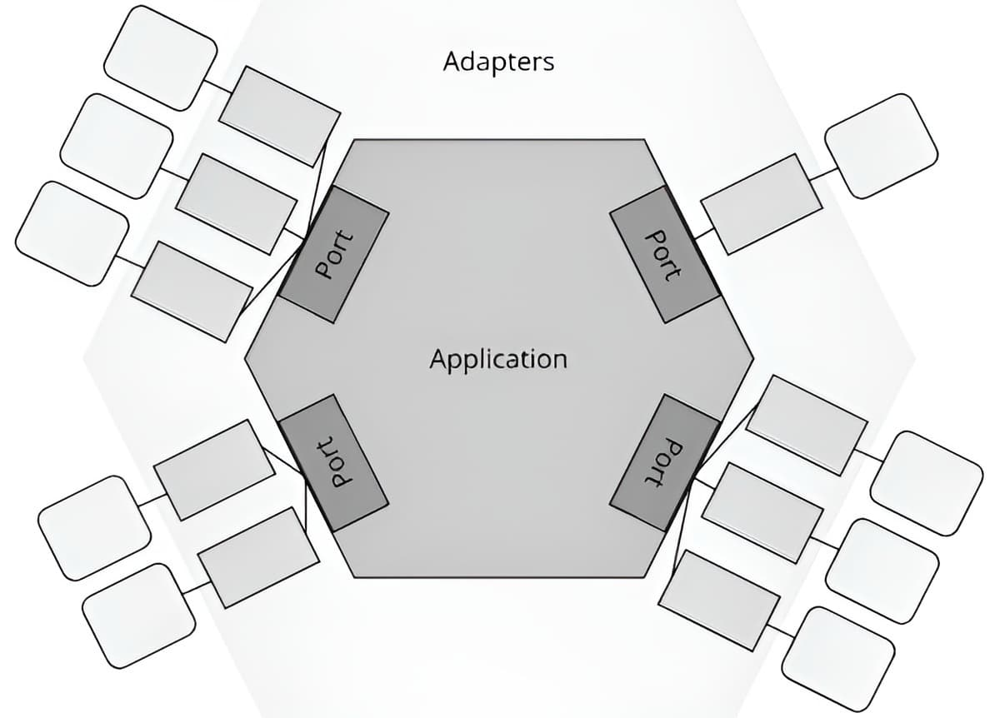

# Comprendre Les Architectures Métier Et Technique - Chapitre 2

Lorsqu'on conçoit une application logicielle, une des questions fondamentales est de savoir comment organiser le code pour qu'il reste maintenable, évolutif, et surtout fidèle aux objectifs métier de l'entreprise. Dans ce chapitre, nous allons explorer les bases des architectures classiques, en mettant l'accent sur leurs forces, leurs limites et la manière dont des approches modernes, comme l'**architecture hexagonale**, permettent de résoudre certains problèmes critiques.

**Navigation 📚**

1. **Introduction: Le Design Applicatif, L'Art De Construire Des Logiciels Durables Et Évolutifs**
	 *Les bases pour comprendre les enjeux et les objectifs d'une bonne architecture.*

2. **Chapitre 1: Le concept de dépendances**
	 *Explorer les relations entre composants, l'importance des dépendances, et les principes comme SOLID.*

3. **Chapitre 2: Comprendre Les Architectures Métier Et Technique**
	 *Comprendre comment isoler le métier des préoccupations techniques grâce aux ports et adaptateurs.*

4. **Chapitre 3: La Clean Architecture**
	 *Découvrir une approche centrée sur le métier avec une structuration claire en couches.*

---

## Les Bases: Une Introduction Aux Architectures Classiques

### L'architecture Spaghetti

L'architecture spaghetti est souvent citée comme un exemple d'échec organisationnel. Il s'agit d'un code désorganisé, où tout est entremêlé: la logique métier, les appels techniques, les interfaces utilisateurs, etc.  

**Conséquences:**

- Difficulté de compréhension.
- Très difficile à tester.
- Presque impossible à faire évoluer sans tout casser.

C'est souvent le point de départ lorsque l'on n'a pas de règles claires ou d'organisation méthodique.

---

### L'architecture En Couches: Une Organisation Classique

L'**architecture en couches** est une réponse courante pour structurer le code de manière modulaire. Elle est simple à comprendre et repose sur le principe de diviser l'application en plusieurs couches, où chaque couche a une responsabilité précise.

#### Les Couches Habituelles

1. **Présentation**: Interagit avec l'utilisateur (UI, API).
2. **Application**: Contient la logique orchestrale, c'est-à-dire les flux de travail.
3. **Domaine (ou métier)**: Contient la logique métier essentielle de l'entreprise.
4. **Persistance**: Gère l'accès aux bases de données ou autres systèmes de stockage.

#### Principe Clé: Chaque Couche Ne Connaît Que Celle Du Dessous

- La couche application peut appeler la couche domaine.
- La couche domaine peut appeler la couche persistance.
- Mais pas l'inverse.

Cela respecte le **S** de **SOLID** (Single Responsibility Principle), car chaque couche a une responsabilité unique.

---

### Les Limites De L'architecture En Couches

Malgré ses avantages, l'architecture en couches présente plusieurs **inconvénients majeurs**:
- **Pas d'inversion des dépendances**: Les couches dépendent les unes des autres de manière descendante.
- **Couplage métier-technique**: La logique métier dépend souvent directement de la couche de persistance, ce qui rend les tests et l'évolution plus compliqués.
- **Découpage purement technique**: Le regroupement du code est basé sur des aspects techniques (UI, base de données) plutôt que sur des aspects métiers.

---

## L'objectif: Séparer Le Métier De la Technique

Une architecture réussie doit isoler la logique métier (cœur du logiciel) des préoccupations techniques (interfaces utilisateur, bases de données, frameworks).

**Pourquoi?**

1. **Durabilité**: La logique métier évolue souvent avec les besoins de l'entreprise, tandis que les aspects techniques changent en fonction des outils ou des technologies.
2. **Testabilité**: Une logique métier découplée est plus facile à tester.
3. **Évolutivité**: En isolant le métier, vous pouvez remplacer les couches techniques sans impacter le cœur de votre application.

L'objectif est donc de **garder la logique métier indépendante**, et de **déporter les aspects techniques en périphérie**.

---

## Une Solution: L'architecture Hexagonale

L'**architecture hexagonale** (ou architecture Ports & Adapters), introduite par **Alistair Cockburn en 2005**, répond précisément à ce besoin. Elle propose de structurer le code en mettant le **métier** au centre et en le protégeant des dépendances techniques.

---

### Les Objectifs De L'architecture Hexagonale

1. **Isoler la logique métier**: Le domaine est indépendant des frameworks, de la persistance ou de l'interface utilisateur.
2. **Faciliter les tests**: En isolant les dépendances techniques, il devient simple de tester le domaine.
3. **Favoriser l'évolutivité**: Les aspects techniques (bases de données, API, etc.) peuvent être modifiés ou remplacés sans affecter le cœur métier.
4. **Créer des points d'entrée et de sortie clairs**: Les interactions avec l'extérieur passent par des ports et des adaptateurs.

>ℹ️ Le terme **"architecture hexagonale"** vient de la représentation visuelle en forme d'hexagone que **Alistair Cockburn** a choisie pour illustrer son concept. Cette forme n'a pas de signification technique stricte.



L'hexagone met en avant l'idée que:

• **Chaque face peut représenter un port** qui sert à interagir avec le monde extérieur (API, base de données, interfaces utilisateurs, etc.).

• Tous les points d'entrée et de sortie sont équivalents: ils sont traités comme des adaptateurs interchangeables.

En d'autres termes, l'hexagone incarne la **modularité** et la **neutralité technologique**. Cette forme montre aussi visuellement que la logique métier est au centre, protégée des interactions techniques par des ports et des adaptateurs.

>**ℹ️ Naming**<br/>
>Dans l'architecture hexagonale, les ports et adaptateurs peuvent être nommés de différentes manières, selon la perspective adoptée. Voici les terminologies les plus courantes:
>1. Left/Right (Gauche/Droite)
>2. Driving/Driven
>3. Primary/Secondary (Principal/Secondaire)
>4. User Side/Server Side (Côté utilisateur/serveur)
>
>Chaque nommage dépend de la perspective ou de la culture technique de l'équipe, mais ils convergent tous vers une idée centrale: séparer ce qui initie une action de ce qui est utilisé pour l'accomplir.

---

### L'application Centrale Comme "Règle De Gestion"

L'architecture hexagonale repose sur un principe fondamental: **placer la logique métier au centre de l'application**. Ce cœur, ou "domaine", représente les **règles de gestion** propres à votre métier, c'est-à-dire les processus, contraintes et décisions qui définissent la valeur ajoutée de votre logiciel.

**Sans ces règles de gestion métier, l'architecture hexagonale perd sa raison d'être.** Si votre application ne fait que servir de passerelle entre différentes sources techniques (par exemple, lire des données d'une base et les afficher telles quelles), il n'y a pas de réelle valeur à isoler une logique métier qui n'existe pas. Dans ce cas, une architecture en couches, voire un simple modèle transactionnel, pourrait suffire.

---

### Exemple Complet: Driving Side Et Driven Side

Pour mieux comprendre, voici un exemple concret qui illustre les deux côtés de l'architecture hexagonale: 

- **Driving Side (Côté gauche)**: Ce qui initie les actions dans le système (ex.: requêtes utilisateurs, événements externes).
- **Driven Side (Côté droit)**: Ce dont le système dépend pour exécuter les actions (ex.: bases de données, API externes).

---

#### **1. Le Domaine (logique métier)**

Le domaine contient le cœur du système. Il définit les règles métier et reste indépendant des couches techniques.

```ts
export interface OrderInputPort {
   processOrder(order: Order): void; // Port côté gauche
}

export interface OrderOutputPort {
   saveOrder(order: Order): void; // Port côté droit
}

export class OrderService implements OrderInputPort {
   constructor(private outputPort: OrderOutputPort) {}

   processOrder(order: Order): void {
	  if (!order.isValid()) {
		 throw new Error("Order is invalid");
	  }

	  console.log("Processing order:", order);
	  this.outputPort.saveOrder(order); // Appel au port de sortie
   }
}
```

**Explication:**  

- `OrderInputPort` (port côté gauche) définit comment les actions sont initiées.
- `OrderOutputPort` (port côté droit) abstrait les dépendances nécessaires pour sauvegarder les commandes.
- `OrderService` contient les règles métier. Il utilise les deux ports pour fonctionner.

---

#### **2. Adaptateur Driving Side: Gérer Les Requêtes utilisateur**

Un adaptateur côté gauche transforme une action utilisateur en appel au domaine via le port `OrderInputPort`.

```ts
import express from "express";

export class OrderController {
   constructor(private orderInputPort: OrderInputPort) {}

   handleRequest(req: express.Request, res: express.Response): void {
	  const order = req.body;

	  try {
		 this.orderInputPort.processOrder(order); // Appel au domaine
		 res.status(200).send("Order processed successfully!");
	  } catch (err) {
		 res.status(400).send(err.message);
	  }
   }
}
```

**Explication:**  

Ce contrôleur traduit une requête HTTP en un appel à `processOrder` du domaine.

---

#### **3. Adaptateur Driven Side: Gérer la persistance**

Un adaptateur côté droit implémente le port `OrderOutputPort` pour sauvegarder les données.

```ts
export class DatabaseAdapter implements OrderOutputPort {
   saveOrder(order: Order): void {
	  console.log("Saving order to database:", order);
   }
}
```

**Explication:**  

Cet adaptateur sauvegarde les commandes dans une base de données en implémentant `saveOrder`.

---

### **4. Orchestration via Injection Des dépendances**

Voici comment connecter tous les éléments:

```ts
import express from "express";

const databaseAdapter = new DatabaseAdapter();
const orderService = new OrderService(databaseAdapter);
const orderController = new OrderController(orderService); // Driving Side
const app = express();

app.use(express.json());

app.post("/orders", (req, res) => orderController.handleRequest(req, res));

app.listen(3000, () => console.log("Server running on http://localhost:3000"));
```

**Explication:**  

- L'utilisateur envoie une requête HTTP `POST /orders`.
- Le contrôleur (`OrderController`) initie une action via `OrderInputPort`.
- La logique métier (`OrderService`) traite la commande et utilise `OrderOutputPort` pour la persistance.

---

### Impact Sur Les Tests

Avec cette architecture, chaque élément est testable de manière isolée:

- **Driving Side (Controller)**: Mockez `OrderInputPort` pour vérifier que les requêtes sont correctement transmises.
- **Logique métier**: Mockez `OrderOutputPort` pour tester les règles métier indépendamment.
- **Driven Side (Database)**: Testez l'adaptateur en isolant les interactions avec la base.

---

> **Conseil d'Alistair Cockburn en 2023: Utiliser For + Verbe en "-ing" + Objectif**<br/>
> Dans ses conseils récents, Alistair Cockburn insiste sur l'importance de donner des noms explicites et orientés objectif aux ports et adaptateurs. Une bonne pratique consiste à formuler les noms sous la forme: **"For + Verbe-ing + Objectif"**.
>
> **Exemple**
> Imaginons une application de gestion de commandes. Voici comment nommer les ports:
> - **Port Driving (Gauche)**: `ForProcessingOrders`. Ce port sert à initier le traitement d'une commande.
> - **Port Driven (Droite)**: `ForSavingOrders`. Ce port est utilisé pour sauvegarder les commandes dans une base de données.

---

L'architecture hexagonale nous enseigne l'importance de placer le métier au centre, tout en déportant les préoccupations techniques vers la périphérie. Grâce à ses **ports** et **adaptateurs**, elle favorise la modularité, la testabilité et l'évolutivité. Cependant, elle n'est qu'une étape dans la quête d'une architecture encore plus universelle.

**La clean architecture**, popularisée par Robert C. Martin (Uncle Bob), pousse ces concepts encore plus loin. Elle propose une structuration stricte des dépendances et des règles pour garantir que le cœur métier reste totalement indépendant de tout détail d'implémentation. La clean architecture est souvent perçue comme une généralisation des principes hexagonaux, tout en ajoutant des couches supplémentaires pour répondre à des besoins complexes.

Dans le prochain chapitre, nous explorerons la clean architecture en détail. Nous verrons comment elle s'appuie sur des concepts solides pour offrir une approche claire, cohérente et puissante pour structurer vos applications. Préparez-vous à découvrir une méthodologie qui va encore simplifier vos choix architecturaux tout en rendant vos projets plus robustes!
