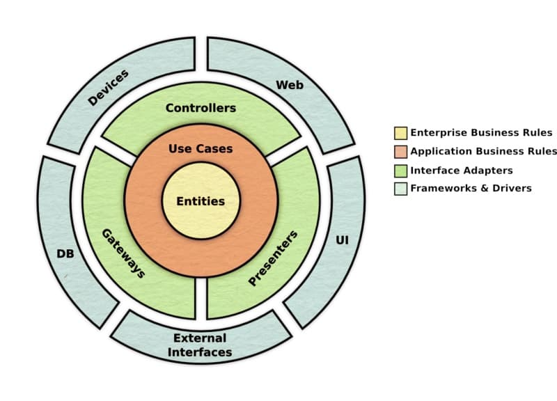

# Application Design: Clean Architecture

## Understand Software Architecture and Code Better

Software architecture should not depend on technical details such as databases or frameworks. **Use cases must be at the center of your application.** This is the foundation of **Clean Architecture**, a methodology based on well-defined, decoupled layers with dependencies strictly oriented toward business logic.

**Navigation 📚**

1. [**Introduction: Application Design, The Art of Building Sustainable and Scalable Software**](https://www.jterrazz.com/articles/9)
	 *The basics to understand the stakes and objectives of good architecture.*

2. [**Chapter 1: The Concept of Dependencies**](https://www.jterrazz.com/articles/10)
	 *Exploring relationships between components, the importance of dependencies, and principles like SOLID.*

3. [**Chapter 2: Understanding Business and Technical Architectures**](https://www.jterrazz.com/articles/11)
	 *How to isolate business logic from technical concerns using ports and adapters.*

4. [**Chapter 3: Clean Architecture**](https://www.jterrazz.com/articles/12)
	 *Discovering an approach focused on business with a clear layered structure.*

---

# What Clean Architecture Implies in Theory

Implementing Clean Architecture requires methodically structuring your application into independent layers, each with a specific role:

1. **Entities**: Contain fundamental business rules, independent of specific use cases.
2. **Use Cases**: Orchestrate interactions between entities and define rules specific to each application need.
3. **Interface Adapters**: Translate data between business logic and the outside world (e.g., APIs, UI, databases).
4. **Frameworks and Drivers**: Contain technical details (databases, web servers, frameworks).

Each layer is independent, and dependencies are strictly oriented toward business logic.



---

# Comparison with Hexagonal Architecture

**Clean Architecture** and **Hexagonal Architecture** share a common philosophy: **isolating business logic** from the rest of the application and decoupling technical layers. However, Clean Architecture structures these concepts more explicitly by introducing clear distinctions between layers:

1. **Entities**: Fundamental business rules at the core of Clean Architecture correspond to the **domain** in Hexagonal Architecture.
2. **Use Cases**: Clean Architecture dedicates a specific layer to use cases, whereas in Hexagonal Architecture, these rules are often implied through ports.
3. **Interface Adapters**: The ports and adapters of Hexagonal Architecture find their equivalent here, translating data between business logic and external layers.
4. **Frameworks & Drivers**: This peripheral layer groups technical dependencies (e.g., databases, APIs, UI), equivalent to the technical adapters in Hexagonal Architecture.

**Key Differences**

- **Explicit Structure**: Clean Architecture formalizes layers (Entities, Use Cases, Interface Adapters), whereas Hexagonal Architecture is more abstract.
- **Business Focus**: Clean Architecture emphasizes use cases as central elements, while Hexagonal Architecture focuses on modularity through ports/adapters.

---

# Complete Example: Order Management Application

In this example, we'll model an e-commerce application that calculates the total amount of an order while applying a specific discount. This use case demonstrates the separation between business logic and technical layers.

---

# File Structure

```sh
src/
├── business/
│ ├── entity/
│ │ └── floor.ts
│ │ └── room.ts
│ ├── gateway/
│ │ └── room.gateway.ts
│ ├── use-cases/
│ │ └── update-room-price.ts
├── container/
│ └── container.ts
├── controller/
│ ├── gateway/
│ │ └── room.repository.ts
│ ├── presenter/
│ │ └── room-presenter.json.ts
│ └── room.controller.ts
└── tests/
		└── update-price.test.ts
```

**Explanation of the Structure**

- `business/`: Contains business logic (entities, use cases, and gateway abstractions).
- `container/`: Configures dependencies (injection) and assembles the layers.
- `controller/`: Implements gateways and presenters, translating data between business logic and the outside world.
- `tests/`: Isolated tests for use cases with mocks for gateways and presenters.

---

# 1. Entities: `Floor` & `Room`

```ts
// business/entity/floor.ts
export class Floor {
		constructor(public floor: number) {}

    getFactor() {
        if (this.floor === 1) {
            return 1.07;
        }
        if (this.floor === 2) {
            return 1.22;
        }
        if (this.floor === 3) {
            return 1.33;
        }
        return 1;
    }
}
```

```ts
// business/entity/room.ts
import { Floor } from "./floor";

export class Room {
		public floor: Floor;
		constructor(
				floorNumber: number,
				public number: number,
				public price: number,
) {
				this.floor = new Floor(floorNumber);
		}

    setPrice(basePrice: number) {
        this.price = Math.min(Number((basePrice * this.floor.getFactor()).toFixed(2)), 200)
    }
}
```

**Why Do These Entities Include Business Logic?**

In **Clean Architecture**, entities like `Floor` and `Room` represent the **Enterprise Business Rules**: the fundamental business rules of the application. These encapsulate behaviors directly related to the company's business domain.

1. **Encapsulation of Business Rules**:

- The `getFactor` method in `Floor` encodes a business rule: each floor has a specific price factor. This logic belongs to the business core and is independent of technical layers.
- The `setPrice` method in `Room` applies another business rule: calculating the room price based on the floor factor and limiting it to a maximum of 200.

2. **Isolation of Responsibilities**:

By placing these behaviors in entities, business rules are not scattered across use cases or technical layers, aligning with **SRP** (Single Responsibility Principle).

3. **Reusability**:

These entities can be reused in multiple use cases without duplicating logic.

---

# 2. Gateway: `RoomGateway`

```ts
// business/gateway/room.gateway.ts
export interface RoomDTO {
		floor: number;
		number: number;
		price: number;
}

export interface RoomGateway {
		updateRoomPrice(roomNumber: number, newPrice: number): Promise<void>
		getRooms(): Promise<Array<RoomDTO>>
}
```

The **RoomGateway** abstracts interactions between business logic and technical details (e.g., the database), exposing necessary methods for business operations.

---

# 3. Use Case: `UpdateRoomPrice`

```ts
// business/use-cases/update-room-price.ts
import { Room } from "../entity/room";
import { RoomGateway } from "../gateway/room.gateway";

export interface Presenter {
    set: (rooms: Array<Room>) => void;
}

export type UpdateRoomPrice = (basePrice: number, presenter: Presenter) => Promise<void>;

export const updateRoomPriceFactory = (repository: RoomGateway) => {
    return async (basePrice: number, presenter: Presenter) => {
        if (basePrice < 0) {
            throw new Error("Amount cannot be negative");
        }
        const roomsDto = await repository.getRooms();
        const rooms = roomsDto.map((r) => new Room(r.floor, r.number, r.price));
        for (const room of rooms) {
            room.setPrice(basePrice);
            await repository.updateRoomPrice(room.number, room.price);
        }
        const updatedRooms = (await repository.getRooms()).map(
            (r) => new Room(r.floor, r.number, r.price)
        );
        presenter.set(updatedRooms);
    };
};
```

The **`UpdateRoomPrice`** use case orchestrates interactions between business logic and external layers (gateway and presenter) to apply specific rules: updating room prices.

1. **Business Responsibility**:
	 This use case encapsulates the main business rule: calculating and updating room prices based on a base price while validating constraints (e.g., no negative amounts).

2. **Dependency Orchestration**:
	 - The **Gateway** (`RoomGateway`) is used to access room data and persist changes.
	 - The **Presenter** is called at the end to transmit results to the controller, ensuring business logic doesn't handle presentation.

3. **Testability and Modularity**:
	 This design makes the use case testable in isolation by injecting abstractions (`RoomGateway` and `Presenter`). It can also be modified or extended without impacting entities or controllers.

---

# 4. Implementing the Gateway in the Controller: `RoomRepository`

```ts
// controller/gateway/room.repository.ts
import { RoomDTO, RoomGateway } from "../../business/gateway/room.gateway";

export class RoomRepository implements RoomGateway {
    constructor(private rooms: Array<RoomDTO>) {}

    async updateRoomPrice(roomNumber: number, newPrice: number): Promise<void> {
        const room = this.rooms.find((room) => room.number === roomNumber);
        if (!room) {
            throw new Error(`Failed to find room ${roomNumber}`);
        }
        room.price = newPrice;
        return Promise.resolve();
    }

    async getRooms(): Promise<Array<RoomDTO>> {
        return Promise.resolve(this.rooms);
    }
}
```

The `RoomRepository` implements the `RoomGateway` interface and handles technical details such as fetching and updating room data.

---

# 5. Presenter Implementation: `RoomPresenterJson`

```ts
// controller/presenter/room.presenter-json.ts
import { Room } from "../../business/entity/room";

export class RoomPresenterJson {
    private r: Array<Room> = [];

    set(rooms: Array<Room>) {
        this.r = rooms;
    }

    format() {
        return this.r.map((r) => {
            return {
                floor: r.floor.floor,
                price: r.price,
                number: r.number,
            };
        });
    }
}
```

The **Presenter** formats data for the controller, ensuring business logic remains presentation-agnostic.

---

# 6. Controller: `RoomController`

```ts
// controller/room.controller.ts
import { Request, Response } from "express";
import { createContainer } from "../container/container";
import { RoomPresenterJson } from "./presenter/room-presenter.json";

const express = require("express");
const app = express();

const container = createContainer();

app.put("/rooms", async (req: Request, res: Response) => {
    const roomPresenterJson = new RoomPresenterJson();
    await container.UpdateRoomPrice(200, roomPresenterJson);
    res.send(roomPresenterJson.format());
});

app.listen(3000, () => console.log("Server running on http://localhost:3000"));
```

Isolating the **Presenter** in the controller ensures **separation of concerns** and a clear decoupling between layers. In this example, the **Use Case** focuses exclusively on business logic without worrying about how results will be formatted or presented to the user. This brings several advantages:

1. **Separation of Concerns**:

The **Use Case** (UpdateRoomPrice) handles only business rules and transmits data through a defined interface (e.g., set).

The **Presenter** is responsible for formatting the data for the user (e.g., transforming data into JSON or other formats).

2. **Flexibility and Reusability**:

By isolating the **Presenter**, you can easily change or add presentation formats (HTML, XML, JSON, etc.) without impacting business logic.

3. **Explicit Control in the Controller**:

The controller manages presentation details and can, for example, decide which **Presenter** format to use based on the request (e.g., JSON for an API, HTML for a web page).

4. **Increased Testability**:

By decoupling the **Presenter** and explicitly injecting it, the **Use Case** can be easily tested independently of presentation logic. Similarly, the **Presenter** can be tested separately to ensure it formats data correctly.

5. **Adherence to the Dependency Inversion Principle (D in SOLID)**:

The **Use Case** depends on an abstraction (e.g., RoomPresenter) rather than a specific implementation. This ensures that changes in presentation formatting don't affect business logic.

---

# 7. Dependency Container: Container

```ts
// business/container/container.ts
import { UpdateRoomPrice, updateRoomPriceFactory } from "../business/use-cases/update-room-price";
import { RoomRepository } from "../controller/gateway/room.repository";

interface Container {
    UpdateRoomPrice: UpdateRoomPrice;
}

export const createContainer = (): Container => {
    return {
        UpdateRoomPrice: updateRoomPriceFactory(
            new RoomRepository([
                {
                    floor: 0,
                    number: 1,
                    price: 0,
                },
                {
                    floor: 1,
                    number: 2,
                    price: 0,
                },
                {
                    floor: 2,
                    number: 3,
                    price: 0,
                },
                {
                    floor: 3,
                    number: 4,
                    price: 0,
                },
            ])
        ),
    };
};
```

The **container** centralizes configuration and dependency instantiation for the application. Using createContainer, all relationships between use cases (UpdateRoomPrice) and their dependencies (e.g., RoomRepository) are defined in a single place.

---

# 8. Test: UpdateRoomPrice Test

```ts
// tests/update-price.test.ts
import assert from "assert";
import { describe, test } from "mocha";
import { createContainer } from "../container/container";
import { RoomPresenterJson } from "../controller/presenter/room-presenter.json";

describe("Update Room Price", () => {
    test("Update room number 1 price to 100", async () => {
        // Given
        const container = createContainer();
        const presenter = new RoomPresenterJson();

        // When
        await container.UpdateRoomPrice(100, presenter);

        // Then
        const value = presenter.format();
        assert.deepStrictEqual(value, [
            { number: 1, price: 100, floor: 0 },
            { number: 2, price: 107, floor: 1 },
            { number: 3, price: 122, floor: 2 },
            { number: 4, price: 133, floor: 3 },
        ]);
    });
});
```

This test is essential because it verifies that the business logic for updating room prices works correctly by applying specific rules, such as floor-based factors or the maximum price constraint. Thanks to **Clean Architecture**, the test is easy to write and maintain, as dependencies are well-separated. Using a container to inject use cases (UpdateRoomPrice) and a presenter like RoomPresenterJson allows simulating complete behavior without requiring heavy technical details like a real database. This makes the test fast, clear, and focused on business logic.

---

# Why Screaming Architecture Is Useful Here

In this example, Screaming Architecture is used to reflect the business domain:

- File names (e.g., Order, CalculateOrderTotal) clearly describe their business role.
- Responsibilities are isolated and aligned with business needs.
- Reasonable duplication (e.g., interfaces and classes specific to each layer) keeps the code clear and understandable.

---

# Conclusion: A Business-Centric Architecture

Throughout this series, we explored the fundamental principles of software architecture, progressing from basics to the advanced concepts of **Clean Architecture**. The primary goal has always been to **place business logic at the center**, isolating technical concerns to ensure a modular, testable, and scalable application.

**Clean Architecture** embodies this vision by structuring code into independent layers, where each layer has a unique responsibility and dependencies are strictly oriented toward the business domain. It teaches us that frameworks, databases, and user interfaces should never dictate code organization. Instead, these technical details should adapt to an architecture where the business, represented by entities and use cases, remains immutable and autonomous.

By adopting these principles, you can build robust applications that:

• **Evolve easily** to meet new business needs.

• **Remain maintainable** despite growing complexity.

• **Encourage collaboration** among developers with a clear and well-defined structure.

This approach requires rigor and sometimes more complex upfront decisions, but it offers invaluable resilience against technological and organizational changes. Ultimately, a well-thought-out architecture prioritizes what matters most: **business logic and the value it delivers to the user**.

Thank you for following this series. I hope it has helped you better understand how to design elegant and robust software architectures while keeping business as your guiding compass. Now it's your turn to build the future! 🚀
