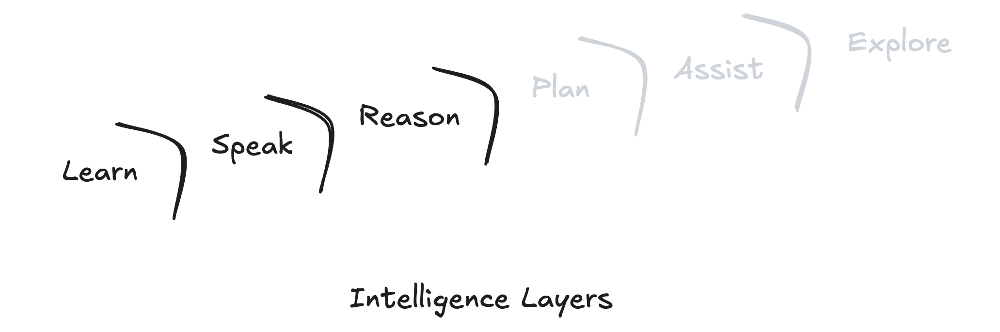

# **Navigating The AI Revolution**

---

**📚 Table of Contents–AI Series**

1. **Navigating the AI Revolution:** (This Article) _Understanding how AI is transforming work, creativity, and the future of every profession._
2. [**Applied Intelligence:**](https://www.jterrazz.com/articles/15) _A practical guide to using AI tools, adapting your mindset, and thriving in the age of automation._
3. [**Architects of Inversion – The Collapse of Execution:**](https://www.jterrazz.com/articles/16) _Exploring how AI is reshaping value, collapsing execution costs, and shifting human worth to ideas and direction._
4. [**Architects of Inversion – The World That Follows:**](https://www.jterrazz.com/articles/17) _A deep dive into how abundant intelligence transforms work, society, space, and the shape of civilization._

---

Artificial Intelligence is not just a _popular term_; it's a **powerful tool** changing many parts of our lives—from our _jobs_ to our _daily routines_. As someone who works closely with technology and uses AI every day, I've seen how fast it's growing and how much it's changing things. This article is a **clear message**, a simple look at what's happening, and a **hopeful guide** to help you understand and prepare. Let's dive in.

## A Radical Truth

I strongly believe in being direct and honest because I genuinely care. So here's a straightforward truth: AI will impact your job. Whether you're a programmer, designer, product manager, lawyer, or salesperson, no job is completely safe. **In fact, any job you can do on a desk is set for deep and rapid change in the short term.**

Tasks that used to be simple might gradually fade away, while today's challenging tasks will become more manageable, and previously impossible tasks will start to feel within reach. Staying relevant will mean continually improving and aiming for excellence in your field. Developing strong skills and adaptability will become increasingly important for navigating this changing landscape.

This isn't meant to alarm you—it's a reminder that **your professional future will depend on how well you adapt** and grow in a world where intelligence is rapidly becoming commoditized.

## Exponential Growth

Humans intuitively think linearly, but technology advances exponentially. Consider this:

- Early human innovation progressed gradually, with advances like the wheel, agriculture, and writing taking centuries to refine.
- The pace quickened significantly during the industrial revolution, bringing innovations such as the steam engine and electricity, and later accelerated dramatically with technologies like the internet and smartphones.
- Now, we're witnessing AI evolving at unprecedented speeds—decades of incremental improvements have condensed into months. For example, AI capabilities seen in tools like ChatGPT, stable and powerful, evolve significantly almost monthly.

Soon, we will see big changes all around us—new scientific discoveries coming much faster, useful apps and tools being released every day, and businesses starting and launching in just a few weeks. The speed of change will affect every part of life, bringing constant new ideas and exciting chances for everyone. This is exactly what exponential growth means: **progress that keeps speeding up and bringing more and more new things faster than before**.

In such a world, **adaptability is your new super-skill**. Treat every tutorial as an excuse to explore. Your deep skills still give you leverage, but now _everyone_ has a 136-IQ assistant on call (as scored by the latest o3 model from OpenAI). The edge goes to the person who talks to that assistant often, asks sharper questions, and turns the answers into action.

AI models from OpenAI, Google, and others have already achieved remarkable expertise in several critical areas. I like to picture these advances as a stack of _layers_. Strengthening any lower layer instantly boosts everything above it, so each breakthrough cascades upward.

To understand where we stand today, it's helpful to break down **what AI can already do well** and **what still needs work**:

- **Learning**: Modern AIs already have access to an enormous amount of information, including history, science, culture, and technology. They quickly analyze and learn from this vast knowledge, continually improving their understanding and accuracy.
- **Speaking**: AI-generated content now matches the quality of content produced by even the best human writers, capable of creating engaging and insightful articles, emails, and reports. While top human writers set a high standard, AI consistently meets or closely approaches this benchmark.
- **Reasoning**: Advanced models can reason logically, make informed decisions, solve complex problems, and reflect critically on their responses.

_And this is just the start. AI can already do some amazing things, and it's only going to get better from here. The problems we see today—losing track of context, forgetting things, or missing emotional or cultural cues—are as bad as it gets. Like the ocean before a big wave, these bumps are signs that something powerful is coming. The smart move isn't to wait until everything is perfect, but to get involved now—feel the change, find your spot, and ride the wave as it grows. That's how real progress happens. Early iPhone developers did the same: they built simple, sometimes rough apps, but they grew with the platform and succeeded as it took off._

**Start experimenting now so you can ride the wave of progress, not scramble to catch up later.**

Significant challenges still exist with the next intelligence layers:

- **Planning**: While AI can solve well-defined problems, it often struggles with long-term, multi-step strategies that require flexibility and foresight. True planning involves adapting to changing circumstances, prioritizing competing goals, and anticipating obstacles—capabilities that remain rudimentary in current systems.
- **Assisting Humans**: Currently limited mostly to text-based interactions, AI interfaces lacks the subtleties of human interaction, such as body language, emotional intelligence, and contextual understanding.
- **Exploring and Improving**: AI remains mostly confined within small, closed virtual environments, without real-world experience or physical interaction capabilities.

That urgency is why billions of dollars and entire research teams are rushing to build richer interfaces—voice companions that feel natural, wearables that see what you see, robots that carry digital intent into the physical world. Each funding round nudges the technology closer to everyday utility. The rollout will arrive in waves, so use this window to tinker, gather feedback, and help set the standards that will frame the post-screen era.

**Your value now comes from learning how to effectively communicate and collaborate with AI.** Guiding AI tools clearly and practically, and combining human intuition with AI's strengths, will be key to your ongoing success.

## New Opportunities

The rise of AI brings with it immense opportunities for growth, innovation, and exciting new roles.

Historically, technological revolutions always replaced mundane tasks with more sophisticated roles:

- Farmers used to work the fields by hand, but today just a few people can operate big machines to manage huge farms.
- Similarly, AI allows fewer people to achieve much bigger results, moving people up the value chain—from doing simple, repetitive tasks to focusing on creative thinking, problem-solving, and high-level decision-making.

We'll increasingly transition into roles that **oversee**, **strategize**, and **innovate** rather than simply execute repetitive tasks. The successful individuals and teams will be **those who quickly adapt**, embrace AI tools, **and elevate their contributions toward strategic and creative problem-solving**.

For example, in a law firm, instead of a big team spending hours reading through old cases, writing basic contracts, and checking documents, a small team could manage AI tools that quickly find legal information, draft contracts, and spot important issues. This frees up the lawyers to focus on bigger tasks like planning legal strategies, giving advice to clients, and handling important cases—work that still needs human skill and judgment.

## Investing in Yourself

**Successfully navigating this AI-driven landscape requires investment**—primarily in yourself. It demands breaking old habits, shifting mindsets, and redefining your value proposition. Gone are the days when writing impeccable code or memorizing documentation set you apart. Now, your worth lies in your strategic insight, visionary thinking, and ability to orchestrate solutions effectively.

Initially, adopting new tools and methodologies might feel unproductive or disruptive. However, short-term discomfort is essential for long-term career growth and professional agility.

This transition is a powerful opportunity. Embracing it will boost your skills, open new doors, and give you a real advantage in the AI-driven world.

## Redefining Work

We are quickly moving into a time when just being good with technical skills is not enough on its own. Increasingly, the critical question isn't, "How well can you operate a computer?" but rather, **"What can you create, fix, or strategically envision?"** This shift fundamentally redefines the way we perceive our skills and derive meaning from our work.

As AI handles more cognitive tasks traditionally considered rewarding, human fulfillment might increasingly come from **tangible, hands-on, and deeply creative tasks**. This profound change is not just a professional realignment—it's an opportunity to rediscover the very essence of meaningful work.

## Next

In the next article, we'll look at real examples of how AI is changing work in simple, clear ways. I'll show how I use AI to save time, work smarter, and bring new ideas to life—and explain it in a way that's easy for everyone to understand, no matter your job.
