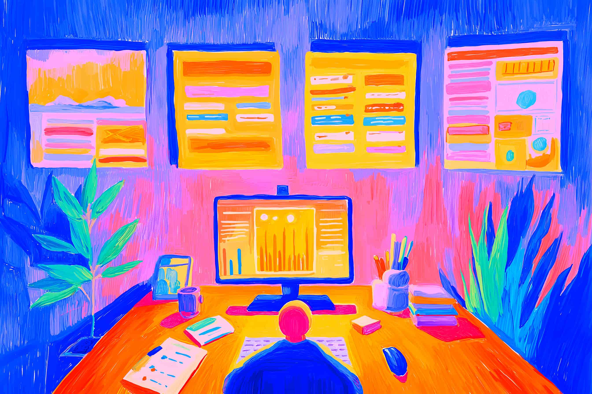

# Applied Intelligence in Your Life

---

**📚 Table of Contents–AI Series**

1. [**Navigating the AI Revolution:**](https://www.jterrazz.com/articles/14) _Understanding how AI is transforming work, creativity, and the future of every profession._
2. **Applied Intelligence:** (This Article) _A practical guide to using AI tools, adapting your mindset, and thriving in the age of automation._
3. [**Architects of Inversion – The Collapse of Execution:**](https://www.jterrazz.com/articles/16) _Exploring how AI is reshaping value, collapsing execution costs, and shifting human worth to ideas and direction._
4. [**Architects of Inversion – The World That Follows:**](https://www.jterrazz.com/articles/17) _A deep dive into how abundant intelligence transforms work, society, space, and the shape of civilization._

---

AI isn't science fiction anymore—it's now part of how we live, work, and think every day. In my day-to-day role as a software developer, adapting quickly to technological advances is built into my profession. Tools and techniques considered state-of-the-art five years ago may already be outdated today. **But here's the new reality: this rapid change is no longer limited to the world of tech professionals—it's impacting all of us.**

More and more AI-powered tools are emerging every day, revolutionizing work, creativity, and productivity. With the right mindset and strategies, **anyone can learn to leverage this powerful wave of innovation**.

This article will guide you through **the practical implications of AI**: what it can accomplish, what it can't yet do, how to take advantage of it, and—even more importantly—**how to adopt a new mindset that empowers you to thrive in the AI age**.

Let's dive in.

## Delegating Intellectual Work

AI at its core is designed for one crucial purpose: automating intellectual work. Historically, humans automated physical labor—tasks like farming or factory manufacturing—to save time and effort. Today, **we're entering the stage of** **intellectual automation: delegating mental tasks to intelligent software**.

No matter your job—writing, research, design, or planning—AI can now do in minutes what used to take hours.

The key question is very simple: **"What tasks can I delegate?"**

From analyzing multitudes of documents, images, and data; crafting detailed business reports; summarizing meetings; even creating digital art—the emerging tools already available today transform intellectual work. You'll still oversee important decisions; you'll still bring human insight—but simple, repetitive, analytical, or creative tasks now can be efficiently off-loaded onto powerful AI assistants.

**It's a win-win: AI does the boring stuff, so you can focus your energy on being creative and thinking ahead.**

## Intelligence as a Commodity

A fundamental shift behind this transformation is that **intelligence itself has become a commodity you can literally buy** (good news for some of us, right? 😂).

AI services like OpenAI, Google's DeepMind, Eleven Labs, and a growing number of open-source providers offer advanced capabilities through online platforms. Whether you're looking for help writing a blog post, analyzing business data, generating audio or images, or even brainstorming ideas, there's likely an AI tool that fits the job. **These platforms vary in cost, speed, and specialization, which makes choosing the right one feel a bit like picking the right tool in a toolbox.**

This new landscape is like having a digital talent marketplace at your fingertips—except instead of hiring a person, you're subscribing to cognitive services. **And just like people, each AI has its strengths.** Some are better at conversation and summarizing, others excel at image creation or strategic analysis.

Learning which models to use, and when, is part of mastering your new digital team. But don't worry—getting started is as easy as trying a few tools, comparing their results, and seeing which ones match your needs best.

## A Toolbox

To make the most of AI, it helps to think of its abilities like a toolbox—different tools for different jobs. Whether you're writing, analyzing, creating, or exploring, there's likely a model designed just for that.

- **Text** —AI is excellent at handling words. It can write emails, blogs, and stories; summarize long reports; translate text; and even edit your writing with style and clarity.
- **Reasoning** —Need quick insights or strategy suggestions? AI can help sort through complex info and suggest smart next steps. It's like having a fast-thinking analyst always ready.
- **Infinite Knowledge** —AI has read more than any human ever could—books, code, articles, and cultural content from around the world. In seconds, it connects ideas across science, art, and history, giving you answers and inspiration that feel almost superhuman. It's not just about speed—it's about access to a crazy depth of knowledge.
- **Creativity** —From music and art to design and brainstorming, AI is a fresh idea machine. It connects concepts from across culture and disciplines to inspire original work.

Today's strengths: **Text is near perfect**, **images and audio are very good**, **video is evolving**.

Remember: each tool is different. Some are great generalists, others are niche specialists. The best way to learn is to try them—experiment, compare results, and discover what works best for you.

But know this: If AI can technically do something today, chances are tools to make it practical and easy are already being built—or will be soon. **We're in a phase where the capabilities exist, but the right user-friendly products are still catching up.** What feels rough or frustrating now could become tomorrow's breakthrough feature.

## Misconceptions

Many people assume AI is **cold and robotic**—but the truth is, it's often surprisingly warm and articulate. In fact, studies show that patients rate AI-generated responses as more empathetic than those from real doctors. Why? Because AI never gets tired, annoyed, or impatient. It always answers with calm, focused attention.

Others think AI can't be **creative**—but anyone who has used a modern AI tool knows it can generate hundreds of ideas, headlines, or visual concepts in seconds. Ask it to write a poem or redesign your living room, and it'll offer you a dozen fresh takes instantly. That's not just helpful—it's like having a fast, idea-generating tool whenever you need it.

Many assume human creativity is mysterious and uniquely ours—but is it? We're shaped by genetics, culture, training, and context. In a way, we're models too—absorbing, remixing, and iterating on what we've seen. As James Cameron put it: _"You're a model already."_ So the question isn't whether AI can be creative—it already is. The deeper question is: **what exactly makes our creativity so different?** And are we ready to collaborate with something that mirrors it?

But that doesn't mean it has deep understanding or awareness of its actions. The real limitations lie elsewhere: in how AI interfaces with us, in its shallow logical reasoning, and in its lack of long-term planning. It often guesses well, but doesn't think deeply. It responds fast, but doesn't plan ahead. It's impressive—but still a tool with limits we must keep in mind.

## Limitations

Even with all their strengths, AI models still struggle in key areas like:

- **Limited Interfaces**—Most AI tools still rely on plain text input and output. That's a big bottleneck. Imagine trying to explain a design idea, a tone of voice, or a real-world process using only words—it's not natural. More intuitive interfaces like voice, gesture, image, or multi-modal input are just beginning to emerge. Until they become standard, our ability to collaborate fluidly with AI remains restricted. And that's exactly where your edge is—your ability to bring real-world understanding, human nuance, and creative flexibility into the collaboration. While AI waits for clearer instructions or better input methods, you bring the adaptability, empathy, and context that make the results truly meaningful.
- **Logical Deduction:** Models use statistical reasoning based on language patterns—yet they can falter on precise mathematics, logical analysis, or chains of complex reasoning. Asking for mathematical calculations or percentages can lead to incorrect answers.
- **Planning and Long-Term Vision:** AI typically lacks long-term strategic thinking, adaptability to unexpected changes, and foresight about future uncertainties.
- **Real-world Understanding:** Without physical real-life experiences, AI lacks critical practical context. It's like an intelligent assistant confined inside a computer—limited by its absence of physical interaction.

Indeed, knowing these deficiencies allows you to use AI effectively within its strengths and adjust your expectations accordingly.

## Shift From Replication to Creation

Today, schools still mostly reward memorization and the ability to repeat structured content. The problem? **You're often focused on making the teacher happy—not on truly understanding the world or solving real problems.** And this mindset doesn't end with school—you'll see it echoed in many workplaces, where success is defined by following rules, checking boxes, or pleasing the system instead of making real impact. This "recitation culture" is outdated. In an AI-driven world, it makes even less sense. Your real strength isn't in repeating what's already known—it's in asking sharp, thoughtful questions, thinking differently, and using your creativity to challenge the status quo and build what comes next.

**The future isn't about crafting clever-sounding theories to impress institutions or fit old academic molds—it's about making real things that work, solve real problems, and improve real lives.**

This shift means rethinking how we prepare for the future—whether you're a student, a professional, or simply navigating daily life. It's now about building the kinds of skills AI struggles with, like:

- Coming up with new ideas and exploring big questions
- Seeing the bigger picture and thinking a few steps ahead
- Understanding people and working well with others
- Being flexible and ready to learn as things change

These "deep human skills" become uniquely valuable when AI handles rote knowledge work—allowing us deeper fulfillment and personal meaning.

## "Vibe" Working

You might've seen the term "vibe coding" or "vibe designing"—think of it like being that laid-back music producer, nodding along to the beat while adjusting a few knobs. You're not writing every note; you're setting the tone, shaping the direction, and letting the AI riff and improvise around your lead. You're not in the weeds—you're in the booth, curating the flow.

Remember: your AI assistant is in a box. Every time you chat, you're just waking it up for a few seconds. It doesn't have memory of what came before, it doesn't know everything you know, and it can't see the big picture unless you show it. You bring the context, the strategy, and the continuity. **That's why being complementary—mixing your judgment with its speed—is the real superpower.**

## Outsource Intellectual Work

Now is the time to proactively incorporate AI into your workflow. Identify the mental tasks you're regularly performing—like conducting research, writing drafts, summarizing complex information, or brainstorming ideas—and explore how AI tools can efficiently handle them. Initially, it might feel unusual, and your output may even seem slower while adapting, but that's just the temporary dip of learning something new. Persist through this adjustment period, and you'll soon become proficient at delegating routine cognitive workload to your AI assistant.

Ultimately, this approach transforms not only how you work—but also empowers you to focus on meaningful decisions, deeper thinking, and genuine creativity. Instead of getting trapped in cycles of busywork and superficial productivity, leverage AI to streamline your daily tasks and let your human strengths shine. **The goal isn't to simply look busy or productive—it's to concentrate clearly on work that truly matters.**

## Towards a Better Balance

Beyond productivity, AI brings a compelling promise of better balance. The automation of repetitive mental tasks can alter our understanding of **what it means to be productive**. While individual hours might shrink, the actual quality, creativity, and strategic depth of your work can grow substantially when supported by artificial intelligence.

This shift can spark a bigger cultural transformation—away from glorifying hard work for its own sake, and toward accomplishing more meaningful goals with focus, creativity, and clarity. With AI managing standardized tasks, you can more freely engage in strategic thinking, cultivate deeper insights, and achieve results that matter far beyond mere output measures or endless checklists. **In the long run, AI won't simply make us work less, it'll empower us to achieve more—creating richer, more balanced, and more fulfilling human lives**.

## Conclusion: Catch the Wave

Today's AI tools might feel clunky or incomplete, just as early smartphones did initially. But much like that early smartphone period, the rapid progress each day—small incremental improvements—quickly adds up and reshapes an entire industry. Early adopters struggled initially, but became leaders once the tech matured.

Start building your AI-powered workflow now. Create new habits, experiment generously, adopt quickly. You're preparing, right now, for a coming technological wave that will fundamentally alter how we work and live.

With mindset shifts, experimentation, and careful delegation, **Artificial Intelligence will not threaten your success—it will become your greatest ally.**

[**Read next article**](https://www.jterrazz.com/articles/16)
