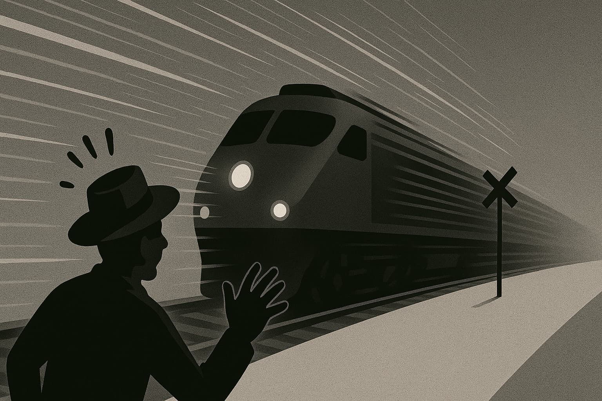
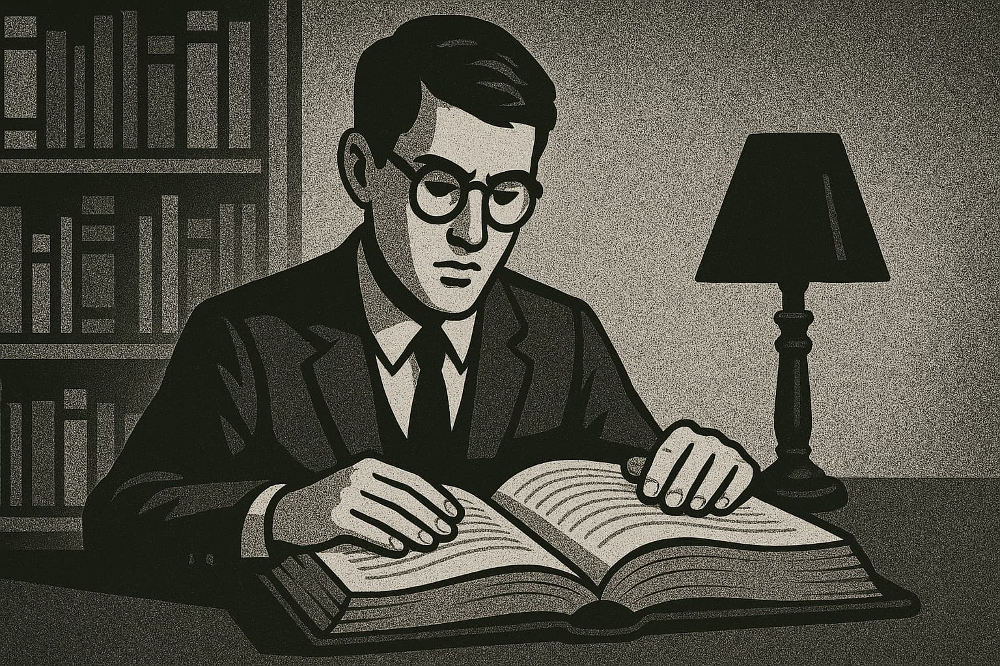

# **AI: Architects of Inversion - The Collapse of Execution**

---

**📚 Table of Contents–AI Series**

1. [**Navigating the AI Revolution:**](https://www.jterrazz.com/articles/14) _Understanding how AI is transforming work, creativity, and the future of every profession._
2. [**Applied Intelligence:**](https://www.jterrazz.com/articles/15) _A practical guide to using AI tools, adapting your mindset, and thriving in the age of automation._
3. [**Architects of Inversion – The Collapse of Execution:**](https://www.jterrazz.com/articles/16) _Exploring how AI is reshaping value, collapsing execution costs, and shifting human worth to ideas and direction._
4. [**Architects of Inversion – The World That Follows:**](https://www.jterrazz.com/articles/17) _A deep dive into how abundant intelligence transforms work, society, space, and the shape of civilization._

---

_Imagining a Future Built on Abundant Intelligence_

> _Most people imagine the future as a linear extension of the present. But we've just left that timeline. The curve has bent. We are riding the exponential._

---

## **1. Introduction: Welcome to the Inverted World**

What you're about to read isn't a prediction, nor a technical breakdown. It's a thought experiment. A speculative map drawn from years of working with AI, observing technological shifts in finance, business—and most of all, from the gut feeling that something enormous is underway. This isn't a manifesto. It's an exploration. A lens to look at the near and distant future through a single guiding idea:

**Intelligence is becoming abundant. And that changes everything.**

We're entering a world where the bottleneck is no longer access to tools, skills, or even talent—but **imagination, will, and the ability to steer**. The era of knowledge scarcity is ending. In its place, we're building a world where intelligence is cheap, fast, and everywhere.

This article ventures into what happens when that shift completes. Not just in tech, but in culture, work, cities, relationships, value systems, education, governance. It's about inversion: when everything we thought was rare becomes common, and what we overlooked becomes essential.

### Why "Architects of Inversion"?

Because AI isn't just automating tasks—it's inverting the hierarchy of value. What used to be prestigious (elite knowledge, digital execution) is becoming cheap. What was undervalued (manual labor, care work, emotional intelligence) is rising. Execution is now a commodity. Ideas, values, and context are becoming the premium.

We used to optimize for performance. Now, we optimize for **meaning**. The most successful creators and companies today don't just ship faster; they resonate deeper. They invest less in production and more in **conceptual exploration**. They multiply directions and test everything, because iteration is nearly free. The new economy isn't about outputs, it's about directionality.

### An Essay, Not a Roadmap

**From this point forward, expect a blend of speculation and synthesis.** You'll see examples from the world as it is, mixed with thought experiments about the world to come. Some parts may sound like sci-fi. Others will already feel real. That's the nature of exponential change: we don't move from impossible to mainstream in decades anymore—it happens in years.

We'll begin with the clearest shifts already underway: the inversion of value in digital work, the collapse of execution barriers, the democratization of intelligence. Then we'll move further out—into what happens to community, creativity, property, cities, even spirituality in a world where intelligence is infinitely copyable.

In the face of this, we can retreat into nostalgia or lean into possibility. This series chooses possibility. Not utopia, not naivety—but **techno-optimism rooted in reality**.

Welcome to the inverted world.

---

## **2. From Scarcity to Abundance: The Inflection Point**

For most of human history, intelligence was a scarce resource. It lived inside individual minds, slowly passed through education, and painfully scaled via institutions. Whether it was coding, designing, writing, or reasoning—expertise was rare, execution was expensive, and knowledge was a gatekeeping force.

Not anymore.

We are now entering the age of **intellectual abundance**—where intelligent action is available on-demand, at near-zero cost. What electricity did for physical labor, AI is beginning to do for mental labor.

This is the inflection point.

You can already feel it: designers generate dozens of brand directions before lunchtime. Writers draft a week of content in minutes. It's not that creativity has vanished—it's that the cost of executing ideas has collapsed.

### The Creative Flip

In the old world, the challenge was execution. Everyone had ideas, but only a few could bring them to life. Today, the opposite is true. With tools like GPT-4o and image-generation AIs, **execution is increasingly trivial**.

The new challenge is discernment. Not "how do I do this?" but "what is actually worth doing?"

This shift creates a strange bifurcation:

- **At the low end**, "good enough" work is everywhere. Generic logos, boilerplate code, basic UX copy—AI does it all well enough for most use cases.
- **At the high end**, there's a growing premium on taste, originality, and the human touch. Not perfection—but weirdness, risk-taking, emotional resonance. Things AI still struggles to fake.

### The Strategic Layer Becomes Human

Companies are no longer optimizing for technical mastery—they're hiring for conceptual thinking. The value isn't in how well you move pixels. It's in knowing **which pixels to move**, and more importantly, **why**. Human contribution is moving up the stack: from execution to direction.

### Everyone Becomes an Architect

We're all idea people now.

And that's both exciting and destabilizing. Because while the power to build is democratized, the **responsibility to decide** grows heavier. What do you care about? What problems are worth solving? What future do you want to shape?

This is the new work.

Execution is cheap. Ideas are everything. But **not just any idea**—ideas grounded in values, in vision, in awareness of where we're going.

Welcome to the era of architectural thinking.

---

## **3. Redefining Human Worth in the Age of Smart Machines**

As AI increasingly handles the mental heavy lifting, one foundational question rises to the surface: **What makes human work meaningful now?**

For centuries, society rewarded intellectual labor over physical labor. The more time you spent thinking rather than doing, the higher your status. Engineers, lawyers, and software developers sat at the top of the hierarchy, while hands-on jobs were often undervalued. But this pecking order is being reshuffled.

**AI, ironically, is most effective at mimicking precisely those "prestigious" roles**: pattern-based, data-heavy, language-centric work. It can generate reports, write essays, craft code, analyze trends—all from the comfort of a prompt. Meanwhile, fields once considered less prestigious—plumbing, caregiving, construction, logistics—are harder for AI to replace.

### The Prestige Flip

Sam Altman recently noted this paradox: jobs that require you to physically show up are harder to automate than jobs done at a screen. That's not intuitive, but it reflects the very nature of AI. Software is native to digital spaces. The real world—with its nuance, risk, unpredictability, and messy human interactions—is much harder to replicate or simulate.

So here we are. The jobs we were told were the most "future-proof" are now the most disrupted.

### The Value of Will

We are entering a phase where **will and intent** may matter more than credentials. When AI can match (or exceed) your technical performance, the differentiator becomes: do you care? Do you show up? Do you see something others don't?

That's a massive shift in how we define value.

Degrees that once conferred status may lose significance. Some already have. Institutions that trained you to pass exams are not as important in a world where models can teach and test better than professors.

> When anyone can wield intelligence like an app, what separates you isn't what you know—it's what you want to build with it.

### A Return to the Ground

Oddly enough, this inversion leads us back to earth. To community, family, embodied experiences. When AI handles your emails and market strategies, maybe you finally have time to fix your roof, help a neighbor, host a meal. Or start that local project you've dreamed of.

Far from a dystopia, this shift could be deeply humanizing. A rediscovery of what makes life rich: presence, purpose, contribution, affection.

This doesn't mean jobs disappear overnight. It means **our metrics for fulfillment and worth are evolving.**

The new question isn't just "What do you do?"

It's: **What do you make better?**

---

## **4. The Death of Repetition: The Rise of Conceptual Labor**

Repetition is dying.

Not in life—routine will always exist. But in work, repetition is becoming a liability. Anything repetitive, predictable, or template-based is now AI food. Tasks that once required humans to push pixels, crunch numbers, or reformat content are vanishing into the background.

And what's replacing them isn't more taskwork. It's **thinking**.

Conceptual labor is on the rise—the kind of work where your role isn't to replicate but to reimagine. **You're not painting the wall; you're designing the building. You're not filling out the spreadsheet; you're deciding what needs to be measured in the first place.**

### Goodbye to the Middle

For decades, much of white-collar work lived in the middle zone: not quite creative, not quite manual, but essential. Slide decks, reports, ad copy, polished presentations—tasks that made the corporate world spin.

But AI excels at this middle.

Which means the middle is collapsing. What remains is the top and bottom:
- **Top-level thinking:** setting direction, asking better questions, imagining futures.
- **Ground-level doing:** physical presence, emotional intelligence, local action.
The tasks in between are dissolving into software.

### The Rise of the Synthesizer

In this new world, the most valuable professionals aren't those who know everything—they're those who can **connect** things.

**It's not the encyclopedic mind that wins—it's the architectural one.** The ability to hold ambiguity, map complex systems, and simplify without dumbing down. AI can follow a path. But it still struggles to invent new roads.

### From Task Executors to Framework Architects

As repetition dies, a new class of worker is emerging: the **framework architect**.

- Someone who creates mental models.
- Who **asks first principles questions**.
- Who defines the problem as much as they solve it.

This isn't for a creative elite. It's becoming the baseline.

Everyone is being nudged up the stack. AI is not replacing work—it's **replacing the need to stay shallow**.

And for those who embrace that? The payoff is massive.

Because in a world where AI can do everything average, the only thing left to strive for is what lies above average:

**Conceptual courage.**

---

## **5. Personal AI as the New Baseline**

Imagine waking up each morning with a super-intelligent partner beside you—one who knows your calendar, your preferences, your projects, your long-term goals. Not a metaphorical assistant. A literal one: your AI.

We are rapidly moving toward a world where **personal AI becomes the standard interface for interacting with knowledge, systems, and decisions**. Not just search engines, but collaborative minds. These AI companions will anticipate your needs, summarize your life, and amplify your capabilities.

It sounds futuristic. But it's happening now.

From GPT-based agents that handle your email, to copilots embedded in your workflow, the trajectory is clear: intelligence is becoming ambient, contextual, and constant.

### From Elite Access to Universal Presence

Until recently, only the wealthy or powerful could afford real assistants—personal chefs, executive aides, full-time tutors. That kind of leverage was exclusive.

AI flips that. It democratizes leverage. Everyone gets a coach. Everyone gets a strategist. Everyone gets a partner who never sleeps.

The _knowledge class_ is now open access. And with that comes an **inversion of inequality**: what once defined privilege is becoming a utility.

This doesn't erase disparity—but it does flatten some barriers to participation. A kid with a good prompt can now compete with an Ivy League graduate. A solo freelancer can run a micro-conglomerate with smart agents.

### Trust, Taste, and the Human Layer

So if everyone has access to top-tier execution, what stays valuable?

- **Trust**: Do people believe you?
- **Taste**: Can you choose wisely?
- **Vision**: Can you guide others?

These are qualities no assistant can simulate. Your AI might write a beautiful proposal, but only you can decide **what you stand for**.

In this new world, _brand becomes more than marketing_. It becomes the sum of your choices, your consistency, and your clarity.

### The End of the Knowledge Arms Race

We're exiting the age where knowledge was power. If everyone can Google everything, memorize everything, and summarize everything instantly, then **knowledge becomes a baseline—not a differentiator**.

The new edge? The ability to **apply** knowledge wisely. To **combine** ideas across domains. To **act** with judgment, not just data.

### The Quiet Revolution

The integration of AI into our personal lives won't arrive with a bang. It will seep in, like smartphones did. One app here. One assistant there. Then suddenly, we're not making decisions alone anymore.

But here's the twist: the more intelligence surrounds us, the more **important it becomes to stay grounded in who we are**. Because when everyone has a smart assistant, the real question becomes:

**What do you really want?**

---

## **6. Knowledge Is No Longer Power—Access Is**

For centuries, knowledge was power.

Entire civilizations were shaped by who could read, who could write, who had access to books, and later, to the internet. The information gatekeepers—academies, publishers, broadcasters—held the keys to progress. But that power dynamic is crumbling.

Today, knowledge is no longer scarce. It's searchable, compressible, and available on demand. And more importantly: **it's executable by machines.**

In a world where anyone can summon legal advice, debug code, generate strategies, or remix any style of writing or design with a few words, the true edge shifts away from "knowing things" to something else entirely.

### The Age of Infinite Execution

Imagine copying and pasting not just text, but entire competencies: _the writing style of a novelist, the branding instincts of a global agency, the operational flows of a top-tier startup_.

This is no longer science fiction. Models are increasingly capable of **replicating styles, strategies, and knowledge systems** once considered elite. You can now duplicate the tone, logic, even the business model of someone else in minutes.

What happens when talent becomes a replicable asset?

It means **the raw content of expertise becomes less defensible**. It's not that your knowledge has no value—it's that value now depends on **how uniquely you express and apply it.**

### From Intellectual Property to Intellectual Presence

In this landscape, owning a unique formula, process, or idea is only defensible if people **trust you** to deliver it.

- Beethoven's music became public domain. Now, entire discographies, voices, and compositional styles are replicable.
- Today, it's happening to brands, influencers, authors, filmmakers, coders.

So what remains?

- **Brand**: Not logos, but reputation and reliability.
- **Loyalty**: A community that chooses you, even when copies exist.

### Everyone Sees the World Differently

AI enables mass personalization of content, education, entertainment—even reality. The same raw data can be presented in infinite formats: One person gets a podcast. Another reads a visual essay. A third receives a chatbot simulation.

**It's the same content, but wrapped around different cognitive experiences.**

This means two things:

1. There is **no longer a single version of the truth experience**.
2. Your ability to tailor and contextualize information becomes more important than the information itself.

### The Great Equalizer

Countries, companies, and creators built moats around knowledge for centuries. That moat is drying up. _The U.S. exported software and media. France exported culinary and cultural expertise. Universities exported accreditation._

All of this is being atomized. Not invalidated—but **commoditized**.

If AI can deliver the same quality of teaching, writing, design, or coding at scale, then we face a profound question: **What is left when everyone has access to everything?**

Knowledge isn't dead. But it's no longer the bottleneck.

---

## **7. The Exponential Curve People Still Don't See**

If you're reading this, chances are you already feel it: something is accelerating. And not just in your timeline or inbox. But in science, business, health, creativity, and the texture of daily life.

What most people miss is the **curve**—not just the pace, but the shape. Humans are built to think in straight lines: tomorrow will look a bit like today, next year will be a gradual evolution of this one. That assumption kept us alive for thousands of years.

But that mental model is now completely broken. We're not on a straight path anymore. **We're on a curve. And the curve is bending up.**

### Biological, Physical, and Digital All At Once

In the past, humanity could only make exponential progress in one domain at a time. During the Industrial Revolution, it was physical: energy, machinery, and production. During the internet boom, it was digital: communication, information, and software.

But today? We're accelerating in **all three at once**:

- Intelligence: AI.
- Physical: factory automation, humanoid robotics, energy systems.
- Digital: language models, image generators, self-improving algorithms.

This has never happened before.

We're building a civilization that can **code biology, design materials, optimize energy, and reason about all of it in real time.**

### AI Is the General-Purpose Amplifier

We've had breakthroughs before. But what makes AI different is that it amplifies every other domain. AI isn't just a new tool—**it's a tool that helps make better tools**.

This creates **compounding progress**. Every improvement feeds the next. Which is why the future feels like it's arriving faster than expected.

### Don't Die, Just Hold On

There's a common saying among technologists: _Don't die._ It's half-joke, half-advice.

Because what's coming isn't just an upgrade to our phones or cars—it's an upgrade to the human condition. Consider this:

- Curing all major diseases may soon be realistic.
- Most manufacturing may soon be automated.
- Knowledge access is already near-infinite.

The next ten years won't resemble the last ten. They'll resemble **a century** compressed into a single decade.

### This Is the Big One

Every generation thinks it's living through a turning point. Most are wrong. But if you zoom out far enough—through industrial revolutions, enlightenment shifts, digital transformations—there are a few moments that truly **bend the arc** of human history.

This is one of them.

The only question left is: **How aware do you want to be while it's happening?**

---

## **Conclusion: From the Curve to the Canvas**

We've crossed the threshold.

What began as a subtle shift in tools has become a wholesale inversion of how we create, work, and think. Intelligence is no longer a competitive edge—it's becoming the canvas. Execution is no longer the bottleneck—it's becoming the baseline.

In this world, **meaning becomes the new scarcity**.

The old questions—"How do I do this? Who will help me?"—are being replaced by something more personal, more essential:

- What's worth doing?
- What kind of world do I want to build?
- What does it mean to contribute when creation is cheap and creativity is infinite?

We are all architects now. Not of buildings, but of frameworks. Of values. Of futures.

**The second half of this journey begins where most narratives stop**: with the physical world, the social fabric, the shape of civilization itself. What happens when AI moves beyond screens and code—into cities, governance, rituals, and relationships?

That's what we'll explore next.

The intelligence is here.

Now comes the architecture.
