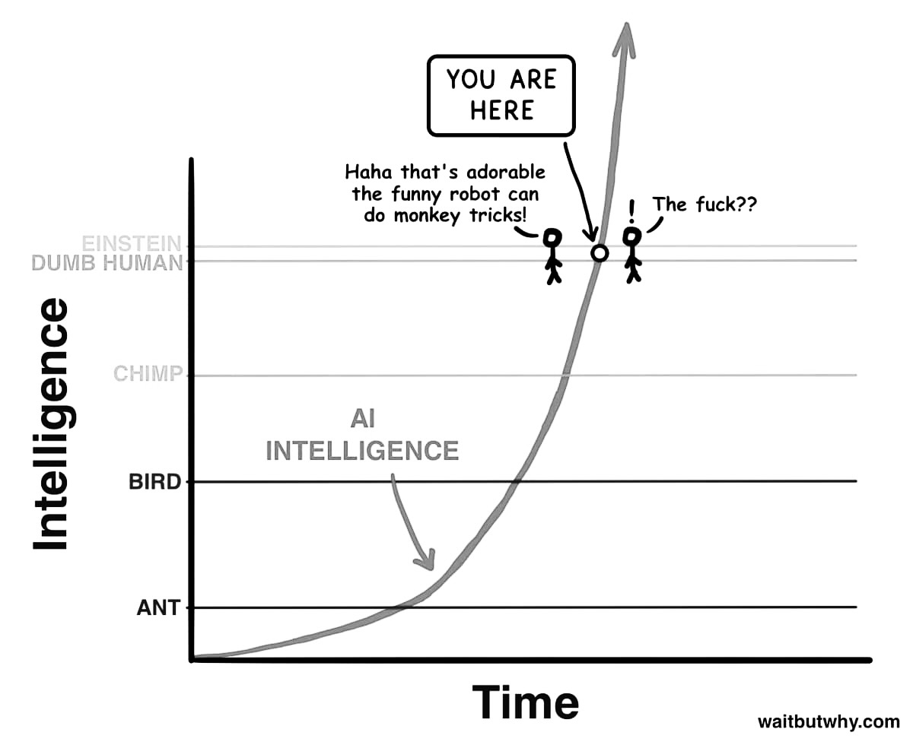

# **AI: Architects of Inversion**

_Imagining a Future Built on Abundant Intelligence_

> _Most people imagine the future as a linear extension of the present. But we've just left that timeline. The curve has bent. We are riding the exponential._

---

## **1. Introduction: Welcome to the Inverted World**

What you're about to read isn't a prediction, nor a technical breakdown. It's a thought experiment. A speculative map drawn from years of working with AI, observing technological shifts in finance, business—and most of all, from the gut feeling that something enormous is underway. This isn't a manifesto. It's an exploration. A lens to look at the near and distant future through a single guiding idea:

**Intelligence is becoming abundant. And that changes everything.**

We're entering a world where the bottleneck is no longer access to tools, skills, or even talent—but **imagination, will, and the ability to steer**. The era of knowledge scarcity is ending. In its place, we're building a world where intelligence is cheap, fast, and everywhere.

This article ventures into what happens when that shift completes. Not just in tech, but in culture, work, cities, relationships, value systems, education, governance. It's about inversion: when everything we thought was rare becomes common, and what we overlooked becomes essential.

### Why "Architects of Inversion"?

Because AI isn't just automating tasks—it's inverting the hierarchy of value. What used to be prestigious (elite knowledge, digital execution) is becoming cheap. What was undervalued (manual labor, care work, emotional intelligence) is rising. Execution is now a commodity. Ideas, values, and context are becoming the premium.

We used to optimize for performance. Now, we optimize for **meaning**. The most successful creators and companies today don't just ship faster; they resonate deeper. They invest less in production and more in **conceptual exploration**. They multiply directions and test everything, because iteration is nearly free. The new economy isn't about outputs, it's about directionality.

### An Essay, Not a Roadmap

**From this point forward, expect a blend of speculation and synthesis.** You'll see examples from the world as it is, mixed with thought experiments about the world to come. Some parts may sound like sci-fi. Others will already feel real. That's the nature of exponential change: we don't move from impossible to mainstream in decades anymore—it happens in years.

We'll begin with the clearest shifts already underway: the inversion of value in digital work, the collapse of execution barriers, the democratization of intelligence. Then we'll move further out—into what happens to community, creativity, property, cities, even spirituality in a world where intelligence is infinitely copyable.

In the face of this, we can retreat into nostalgia or lean into possibility. This series chooses possibility. Not utopia, not naivety—but **techno-optimism rooted in reality**.

Welcome to the inverted world.

---

## **2. From Scarcity to Abundance: The Inflection Point**

For most of human history, intelligence was a scarce resource. It lived inside individual minds, slowly passed through education, and painfully scaled via institutions. Whether it was coding, designing, writing, or reasoning—expertise was rare, execution was expensive, and knowledge was a gatekeeping force.

Not anymore.

We are now entering the age of **intellectual abundance**—where intelligent action is available on-demand, at near-zero cost. What electricity did for physical labor, AI is beginning to do for mental labor.

This is the inflection point.

You can already feel it: designers generate dozens of brand directions before lunchtime. Writers draft a week of content in minutes. It's not that creativity has vanished—it's that the cost of executing ideas has collapsed.

### The Creative Flip

In the old world, the challenge was execution. Everyone had ideas, but only a few could bring them to life. Today, the opposite is true. With tools like GPT-4o and image-generation AIs, **execution is increasingly trivial**.

The new challenge is discernment. Not "how do I do this?" but "what is actually worth doing?"

This shift creates a strange bifurcation:

- **At the low end**, "good enough" work is everywhere. Generic logos, boilerplate code, basic UX copy—AI does it all well enough for most use cases.
- **At the high end**, there's a growing premium on taste, originality, and the human touch. Not perfection—but weirdness, risk-taking, emotional resonance. Things AI still struggles to fake.

### The Strategic Layer Becomes Human

Companies are no longer optimizing for technical mastery—they're hiring for conceptual thinking. The value isn't in how well you move pixels. It's in knowing **which pixels to move**, and more importantly, **why**. Human contribution is moving up the stack: from execution to direction.

### Everyone Becomes an Architect

We're all idea people now.

And that's both exciting and destabilizing. Because while the power to build is democratized, the **responsibility to decide** grows heavier. What do you care about? What problems are worth solving? What future do you want to shape?

This is the new work.

Execution is cheap. Ideas are everything. But **not just any idea**—ideas grounded in values, in vision, in awareness of where we're going.

Welcome to the era of architectural thinking.

---

## **3. Redefining Human Worth in the Age of Smart Machines**

As AI increasingly handles the mental heavy lifting, one foundational question rises to the surface: **What makes human work meaningful now?**

For centuries, society rewarded intellectual labor over physical labor. The more time you spent thinking rather than doing, the higher your status. Engineers, lawyers, and software developers sat at the top of the hierarchy, while hands-on jobs were often undervalued. But this pecking order is being reshuffled.

**AI, ironically, is most effective at mimicking precisely those "prestigious" roles**: pattern-based, data-heavy, language-centric work. It can generate reports, write essays, craft code, analyze trends—all from the comfort of a prompt. Meanwhile, fields once considered less prestigious—plumbing, caregiving, construction, logistics—are harder for AI to replace.

### The Prestige Flip

Sam Altman recently noted this paradox: jobs that require you to physically show up are harder to automate than jobs done at a screen. That's not intuitive, but it reflects the very nature of AI. Software is native to digital spaces. The real world—with its nuance, risk, unpredictability, and messy human interactions—is much harder to replicate or simulate.

So here we are. The jobs we were told were the most "future-proof" are now the most disrupted.

### The Value of Will

We are entering a phase where **will and intent** may matter more than credentials. When AI can match (or exceed) your technical performance, the differentiator becomes: do you care? Do you show up? Do you see something others don't?

That's a massive shift in how we define value.

Degrees that once conferred status may lose significance. Some already have. Institutions that trained you to pass exams are not as important in a world where models can teach and test better than professors.

> When anyone can wield intelligence like an app, what separates you isn't what you know—it's what you want to build with it.

### A Return to the Ground

Oddly enough, this inversion leads us back to earth. To community, family, embodied experiences. When AI handles your emails and market strategies, maybe you finally have time to fix your roof, help a neighbor, host a meal. Or start that local project you've dreamed of.

Far from a dystopia, this shift could be deeply humanizing. A rediscovery of what makes life rich: presence, purpose, contribution, affection.

This doesn't mean jobs disappear overnight. It means **our metrics for fulfillment and worth are evolving.**

The new question isn't just "What do you do?"

It's: **What do you make better?**

---

## **4. The Death of Repetition: The Rise of Conceptual Labor**

Repetition is dying.

Not in life—routine will always exist. But in work, repetition is becoming a liability. Anything repetitive, predictable, or template-based is now AI food. Tasks that once required humans to push pixels, crunch numbers, or reformat content are vanishing into the background.

And what's replacing them isn't more taskwork. It's **thinking**.

Conceptual labor is on the rise—the kind of work where your role isn't to replicate but to reimagine. **You're not painting the wall; you're designing the building. You're not filling out the spreadsheet; you're deciding what needs to be measured in the first place.**

### Goodbye to the Middle

For decades, much of white-collar work lived in the middle zone: not quite creative, not quite manual, but essential. Slide decks, reports, ad copy, polished presentations—tasks that made the corporate world spin.

But AI excels at this middle.

Which means the middle is collapsing. What remains is the top and bottom:
- **Top-level thinking:** setting direction, asking better questions, imagining futures.
- **Ground-level doing:** physical presence, emotional intelligence, local action.
The tasks in between are dissolving into software.

### The Rise of the Synthesizer

In this new world, the most valuable professionals aren't those who know everything—they're those who can **connect** things.

**It's not the encyclopedic mind that wins—it's the architectural one.** The ability to hold ambiguity, map complex systems, and simplify without dumbing down. AI can follow a path. But it still struggles to invent new roads.

### From Task Executors to Framework Architects

As repetition dies, a new class of worker is emerging: the **framework architect**.

- Someone who creates mental models.
- Who **asks first principles questions**.
- Who defines the problem as much as they solve it.

This isn't for a creative elite. It's becoming the baseline.

Everyone is being nudged up the stack. AI is not replacing work—it's **replacing the need to stay shallow**.

And for those who embrace that? The payoff is massive.

Because in a world where AI can do everything average, the only thing left to strive for is what lies above average:

**Conceptual courage.**

---

## **5. Personal AI as the New Baseline**

Imagine waking up each morning with a super-intelligent partner beside you—one who knows your calendar, your preferences, your projects, your long-term goals. Not a metaphorical assistant. A literal one: your AI.

We are rapidly moving toward a world where **personal AI becomes the standard interface for interacting with knowledge, systems, and decisions**. Not just search engines, but collaborative minds. These AI companions will anticipate your needs, summarize your life, and amplify your capabilities.

It sounds futuristic. But it's happening now.

From GPT-based agents that handle your email, to copilots embedded in your workflow, the trajectory is clear: intelligence is becoming ambient, contextual, and constant.

### From Elite Access to Universal Presence

Until recently, only the wealthy or powerful could afford real assistants—personal chefs, executive aides, full-time tutors. That kind of leverage was exclusive.

AI flips that. It democratizes leverage. Everyone gets a coach. Everyone gets a strategist. Everyone gets a partner who never sleeps.

The _knowledge class_ is now open access. And with that comes an **inversion of inequality**: what once defined privilege is becoming a utility.

This doesn't erase disparity—but it does flatten some barriers to participation. A kid with a good prompt can now compete with an Ivy League graduate. A solo freelancer can run a micro-conglomerate with smart agents.

### Trust, Taste, and the Human Layer

So if everyone has access to top-tier execution, what stays valuable?

- **Trust**: Do people believe you?
- **Taste**: Can you choose wisely?
- **Vision**: Can you guide others?

These are qualities no assistant can simulate. Your AI might write a beautiful proposal, but only you can decide **what you stand for**.

In this new world, _brand becomes more than marketing_. It becomes the sum of your choices, your consistency, and your clarity.

### The End of the Knowledge Arms Race

We're exiting the age where knowledge was power. If everyone can Google everything, memorize everything, and summarize everything instantly, then **knowledge becomes a baseline—not a differentiator**.

The new edge? The ability to **apply** knowledge wisely. To **combine** ideas across domains. To **act** with judgment, not just data.

### The Quiet Revolution

The integration of AI into our personal lives won't arrive with a bang. It will seep in, like smartphones did. One app here. One assistant there. Then suddenly, we're not making decisions alone anymore.

But here's the twist: the more intelligence surrounds us, the more **important it becomes to stay grounded in who we are**. Because when everyone has a smart assistant, the real question becomes:

**What do you really want?**

---

## **6. Knowledge Is No Longer Power—Access Is**

For centuries, knowledge was power.

Entire civilizations were shaped by who could read, who could write, who had access to books, and later, to the internet. The information gatekeepers—academies, publishers, broadcasters—held the keys to progress. But that power dynamic is crumbling.

Today, knowledge is no longer scarce. It's searchable, compressible, and available on demand. And more importantly: **it's executable by machines.**

In a world where anyone can summon legal advice, debug code, generate strategies, or remix any style of writing or design with a few words, the true edge shifts away from "knowing things" to something else entirely.

### The Age of Infinite Execution

Imagine copying and pasting not just text, but entire competencies: _the writing style of a novelist, the branding instincts of a global agency, the operational flows of a top-tier startup_.

This is no longer science fiction. Models are increasingly capable of **replicating styles, strategies, and knowledge systems** once considered elite. You can now duplicate the tone, logic, even the business model of someone else in minutes.

What happens when talent becomes a replicable asset?

It means **the raw content of expertise becomes less defensible**. It's not that your knowledge has no value—it's that value now depends on **how uniquely you express and apply it.**

### From Intellectual Property to Intellectual Presence

In this landscape, owning a unique formula, process, or idea is only defensible if people **trust you** to deliver it.

- Beethoven's music became public domain. Now, entire discographies, voices, and compositional styles are replicable.
- Today, it's happening to brands, influencers, authors, filmmakers, coders.

So what remains?

- **Brand**: Not logos, but reputation and reliability.
- **Loyalty**: A community that chooses you, even when copies exist.

### Everyone Sees the World Differently

AI enables mass personalization of content, education, entertainment—even reality. The same raw data can be presented in infinite formats: One person gets a podcast. Another reads a visual essay. A third receives a chatbot simulation.

**It's the same content, but wrapped around different cognitive experiences.**

This means two things:

1. There is **no longer a single version of the truth experience**.
2. Your ability to tailor and contextualize information becomes more important than the information itself.

### The Great Equalizer

Countries, companies, and creators built moats around knowledge for centuries. That moat is drying up. _The U.S. exported software and media. France exported culinary and cultural expertise. Universities exported accreditation._

All of this is being atomized. Not invalidated—but **commoditized**.

If AI can deliver the same quality of teaching, writing, design, or coding at scale, then we face a profound question: **What is left when everyone has access to everything?**

Knowledge isn't dead. But it's no longer the bottleneck.

---

## **7. The Exponential Curve People Still Don't See**

If you're reading this, chances are you already feel it: something is accelerating. And not just in your timeline or inbox. But in science, business, health, creativity, and the texture of daily life.

What most people miss is the **curve**—not just the pace, but the shape. Humans are built to think in straight lines: tomorrow will look a bit like today, next year will be a gradual evolution of this one. That assumption kept us alive for thousands of years.

But that mental model is now completely broken. We're not on a straight path anymore. **We're on a curve. And the curve is bending up.**

### Biological, Physical, and Digital All At Once

In the past, humanity could only make exponential progress in one domain at a time. During the Industrial Revolution, it was physical: energy, machinery, and production. During the internet boom, it was digital: communication, information, and software.

But today? We're accelerating in **all three at once**:

- Biological: AI-assisted protein folding, robotic labs, personalized medicine.
- Physical: factory automation, humanoid robotics, energy systems.
- Digital: language models, image generators, self-improving algorithms.

This has never happened before.

We're building a civilization that can **code biology, design materials, optimize energy, and reason about all of it in real time.**

### AI Is the General-Purpose Amplifier

We've had breakthroughs before. But what makes AI different is that it amplifies every other domain. AI isn't just a new tool—**it's a tool that helps make better tools**.

This creates **compounding progress**. Every improvement feeds the next. Which is why the future feels like it's arriving faster than expected.

### Don't Die, Just Hold On

There's a common saying among technologists: _Don't die._ It's half-joke, half-advice.

Because what's coming isn't just an upgrade to our phones or cars—it's an upgrade to the human condition. Consider this:

- Curing all major diseases may soon be realistic.
- Most manufacturing may soon be automated.
- Knowledge access is already near-infinite.

The next ten years won't resemble the last ten. They'll resemble **a century** compressed into a single decade.

### This Is the Big One

Every generation thinks it's living through a turning point. Most are wrong. But if you zoom out far enough—through industrial revolutions, enlightenment shifts, digital transformations—there are a few moments that truly **bend the arc** of human history.

This is one of them.

The only question left is: **How aware do you want to be while it's happening?**

---

## **8. Post-Physical AI: A World Without (Traditional) Work**

The future of work is not no work. It's **different work**—so different, in fact, that we might need a new word for it.

We've long defined jobs by necessity: What must be done? Who is paid to do it? But what happens when most necessary tasks—logistical, mental, or even physical—are handled by intelligent agents and machines?

You get a world where "work" becomes optional. And expression becomes essential.

### Work Becomes Like Art

In the post-physical AI era, most people will no longer be needed for production. Not because we're lazy or inefficient—but because the systems will be better. That doesn't mean humans become useless. It means **we become expressive**.

Just as the camera didn't kill painting, AI won't kill creation. It just **removes constraints**. The artist isn't someone who holds a brush—they're someone who has something to say.

In this future, _everyone becomes an artist._

- One person builds a hyper-personalized app for their street.
- Another publishes a sci-fi novella in a weekend.
- A third crafts an immersive VR garden for people dealing with grief.

The economy begins to **reward contribution** over compliance.

### From Labor Scarcity to Idea Abundance

Most of today's systems are built around **scarcity**: Scarce labor, Scarce expertise, Scarce time. But when AI and robotics solve those constraints, we shift to an economy of **abundance**. One where everyone has the tools to launch projects, solve hyperlocal problems, create for the joy of it.

Work no longer means survival. It means **signal**: what do you care about enough to build?

This is a world where publishing a course, designing a brand, launching a game, or mentoring a group online becomes as natural as sending an email today. The _Internet of Projects_ replaces the office job.

### UBI + Recognition Economies

Of course, if work is no longer tied to income, new systems are needed.

We might see **Universal Basic Income** for foundational security, **Reputation economies** where trust and contribution earn you access and influence, **Civic incentives** where helping others, improving your community, or teaching earns you credit.

The point isn't to remove reward—it's to **redefine what's worth rewarding.**

### When Work Becomes Play

Today, people pay for gym memberships to use their bodies. In the future, people might pay for access to **mental gyms**. The distinction between work and play blurs. The value shifts from obligation to voluntary contribution. From survival to significance.

We stop asking, "What do you do for a living?" and start asking, "What do you build for the world?"

And that's not a utopian fantasy. It's what becomes possible when **labor is automated, but purpose is not.**

---

## **9. The Village Renaissance: Back to the Local**

Once work is decoupled from geography, and technology delivers everything instantly, the logical next step is paradoxical:

We go back to the village.

Not in a nostalgic, anti-tech way—but in a deeply human, post-scarcity way. When AI handles the infrastructure, the logistics, the coordination—the **social layer returns to the foreground**.

You don't need to live in a big city to be connected anymore. Your assistant is smarter than any city hall. Your delivery bot is faster than any local market. Your access to knowledge is global. So what do you optimize for?

**Belonging. Purpose. Presence.**

### Rebuilding the Social Fabric

In a world of hyper-efficiency, we crave what's messy and meaningful:

- **Family time without distraction**
- **Shared events with neighbors**
- **Spontaneous help, face-to-face conversations, rituals**

These are not relics. They're upgrades. Because once survival is automated, we're free to **reconnect at a human scale**.

### From Globalization to Localization

The global dream of politics was always abstract. It made everyone reachable but nobody near. Now, we can invert that:

- Local governance run by one person with AI and robotics.
- Micro-businesses serving small communities with world-class efficiency.
- Artisanal production scaled by automation but grounded in identity.

You don't need ten employees to run a bakery. You need a person with taste, vision, and bots to do the rest.

### Identity Through Proximity

The algorithmic age fragmented our sense of place. Now, abundance enables a **return to rootedness**:

- Villages with distinct flavors and cultures
- Citizens who co-own and co-govern small ecosystems
- Hyperlocal systems that work like games—one player managing many layers

And it's already starting. As remote work normalizes and micro-entrepreneurship rises, people are leaving megacities for meaning-rich environments: towns, forests, islands.

It's not regression. It's **compression**. We bring the power of global tools into the **scale of real life**.

### When AI Runs the Background, Humans Run the Foreground

The invisible infrastructure—admin, taxes, logistics, alerts—can all be managed by AI agents.

We stop building just for efficiency. We start building for **meaningful coexistence**.

That's the village renaissance.

Not a return to the past, but a **reimagining of what it means to live together**—with machines in the background, and humanity in the front.

---

## **10. AI Vs Bureaucracy: Capitalism 2.0**

If AI is the engine of acceleration, bureaucracy is the handbrake.

This tension is becoming more visible by the day. While AI optimizes, iterates, and delivers at warp speed, traditional institutions remain slow, rigid, and risk-averse. It's not that bureaucracy is evil—it's that it was built for a world of scarcity, paperwork, and linear change.

But now the environment has changed, and our systems haven't.

### Regulation: The New Bottleneck

The true limiter of innovation isn't intelligence—it's permission.

You can design the perfect city, but if zoning laws prevent autonomous infrastructure, it won't happen. You can build humanoid robots, but if insurance systems don't recognize them, they can't operate.

AI is quickly outpacing the frameworks meant to control it. And the result isn't chaos—it's **frustration**. Entrepreneurs, scientists, and creators are bumping into outdated rules that assume everything must move slowly.

### The Rise of the Private State

When governments can't keep up, the private sector fills the gap:

- Companies like Tesla automate factories faster than regulators can define "safety."
- Startups offer AI-powered services that outperform legacy bureaucracies.
- Crypto and smart contracts provide global systems where institutions fall short.

It's not about replacing government. It's about **complementing or bypassing it** when it fails to adapt.

Just as the internet created a second information layer, AI is creating a second **institutional layer**—fluid, fast, and scalable.

### Capitalism's Reinvention

Old capitalism optimized for extraction: get more, sell more, grow more. But AI capitalism optimizes for leverage:

- Less input, more output.
- Smaller teams, bigger impact.
- Ideas that scale without factories.

This shift rewrites the rules of entrepreneurship. Now, one person with a laptop and a few AI agents can build a product and market it globally.

**Solo creators become micro-empires.**

### Bureaucracy as Legacy Code

Much like old software, our bureaucracies weren't designed for today's complexity. They require human processing of paper forms, approval chains with weeks of delay, compliance checks that assume static conditions.

AI, by contrast, adapts in seconds. Which is why smart systems aren't just more efficient—they feel **inevitable**.

### From Regulation to Coordination

The goal isn't to eliminate rules. It's to **upgrade them**.

A world of abundance still needs coordination, safety, and justice. But those goals are best served by systems that respond in real time, learn from data and evolve as the world changes

Call it **Capitalism 2.0**: a world where innovation isn't slowed by inertia, but accelerated by adaptive, intelligent infrastructure.

And the countries—or companies—that embrace it? They won't just move faster.

**They'll define the future.**

---

## **11. Material Abundance: Robotic Physical World**

We often speak about digital progress—smartphones, apps, AI. But the next transformation will be physical. And it's already underway.

The same intelligence that powers language models is being applied to the real world: logistics, manufacturing, energy, construction, mobility.

We're not just teaching machines to think. We're teaching them to build.

### Factories That Think

Tesla's Gigafactories are more than automated—they're **thinking systems**. With sensors, software, and real-time optimization, they blur the line between factory and computer.

Imagine a world where:

- A product idea becomes a prototype in minutes
- Materials are sourced, shaped, and assembled without human input
- Errors are self-corrected by the system

This isn't future fantasy. It's current reality—just unevenly distributed.

Now add humanoid robots, which are rapidly approaching commercial viability. Once they scale, we unlock something new:

**The automation of general-purpose physical work.**

### The Death of Scarcity

Today, material goods are constrained by labor, transport, or regulatory lag. But if robots can pick and pack anything, deliver autonomously, restock and repair in real time … then supply chains collapse inward. **The cost of many physical items drops toward zero.**

The "last kilometer" problem—the hardest, most expensive step in logistics—is solved by fleets of autonomous vehicles. **Roads become factory lines**. **Cities become dynamic machines**.

The implications are massive:

- Food delivery becomes ultra-efficient
- Retail becomes remote-first
- Warehousing disappears into smart routing

We don't just automate industry. We reinvent the shape of cities.

### Form Follows Optimization

If humans aren't the driver, why keep cars shaped for drivers? If you don't need aisles and checkout lines, why keep stores shaped like boxes?

The robotic physical world allows us to **rethink design from first principles**:

- Homes optimized for health, not just shelter
- Kitchens that cook without a chef
- Micro-vehicles tailored for 1–2 passengers with zero idle time

This is where function finally dictates form—not legacy.

### Regulation: The Last Barrier

What's slowing this down isn't technology. It's friction: Regulatory delays, Urban planning inertia, Bureaucratic approval processes.

Once that happens, the cost of living plummets. Not because of austerity, but because **abundance becomes default**.

Energy, mobility, housing, goods—they all become smarter, cheaper, and **everywhere**.

And that's the robotic physical world: a place where stuff isn't just made faster.

It's made better, cleaner, and for everyone.

---

## **12. Energy**

**Every revolution runs on energy.**

Steam powered industry. Oil powered globalization. Electricity powered computation. And now, abundant, clean energy is about to power **everything else**.

From AI farms to robotic cities, from home labs to off-world colonies, the limiting factor isn't talent or tools—it's **watts**.

But here's the twist: **energy is not scarce.** It's just untapped.

### The Myth of Finitude

We've been trained to think of energy as a finite resource—something to be conserved, rationed, fought over. That made sense when extraction was the only way.

But today, the frontier has moved:

- Solar keeps getting cheaper
- Battery efficiency keeps improving
- Nuclear innovation is resurging
- Fusion isn't solved—but it's closer than ever

Add AI-optimized grids, decentralized storage, and ultra-efficient engines, and you don't just get more energy—you get **better usage of it**.

And beyond Earth, a new paradigm emerges: **space unlocks virtually infinite resources**. Asteroids carry more rare metals than all of Earth's mines combined. Solar energy, unfiltered by atmosphere, is abundant and constant in orbit. As launch costs plummet and infrastructure grows, tapping space for energy and materials may soon shift from sci-fi to logistics.

In this world, **energy abundance** becomes the new foundation for civilization.

### Energy = Agency

More energy doesn't just mean powering your home. It means:

- Desalinating oceans at scale
- Creating vertical farms in deserts
- Launching rockets to explore the solar system

Energy unlocks ambition.

And in the same way AI amplifies intellect, energy amplifies impact. The combination is explosive.

### From Green Panic to Smart Abundance

A strange contradiction defines the modern era:

- We fear ecological collapse
- We fear overproduction
- We fear using too much

But the real danger isn't energy use. It's **dumb energy use**—inefficient systems, legacy infrastructure, wasteful processes.

Superintelligent civilizations are super-clean. **Not despite their power, but because of it.**

### Planetary, Then Interplanetary

Once energy becomes local, modular, and abundant, geography dissolves:

- Remote islands become thriving micro-nations
- Space becomes viable for production and exploration
- The physical world becomes infinitely editable

This isn't utopia. It's physics.

If energy becomes cheap enough, everything else—materials, motion, manufacturing—follows.

And that's the real unlock. Not a better gadget. Not even smarter AI.

But the ability to say: **we can do more, and do it better—without fear.**

---

## **13. AI: The Decentralizing Force**

The old world ran on centralization.

Big cities. Big offices. Big media. Big schools. All built around the need to concentrate talent, knowledge, and decision-making. But AI dismantles that logic, piece by piece.

Because intelligence is no longer a fixed location. It's a fluid layer.

When you can summon expertise on demand, generate content instantly, and coordinate systems globally—**why concentrate anything?**

### The End of Information Monopolies

For decades, the world's most valuable institutions were information filters: Universities, Broadcasters, Publishers, Agencies.

They told us what to read, who to trust, what mattered.

But today, anyone can:

- Create their own curriculum
- Broadcast to millions
- Build custom AI interfaces
- Remix data into new formats

**The filter has been inverted.** Everyone is a node. Everyone is a channel. Everyone can fork reality into their preferred experience.

### The Rise of Micro-Everything

We're seeing the emergence of:

- Micro-universities with AI professors
- Micro-studios producing hit content from bedrooms
- Micro-products serving niche communities
- Micro-cities with self-sufficient governance

This isn't fragmentation. It's **proliferation**. Like open-source software, society begins to fork into thousands of tailored systems.

And it's not chaos—it's coordination through tools, not through hierarchy.

### Local Power, Global Reach

With AI managing the back office, one person can run a business, operate a school, design and launch a civic program.

This creates a world where _every village becomes its own engine_:

- Local food, local laws, local learning
- Enhanced by global intelligence, logistics, and reach

What once required teams of specialists now requires only **vision + tools**.

### The Human Return

Decentralization doesn't just change structures. It changes values:

- From scale to meaning
- From uniformity to identity
- From mass broadcast to intimate resonance

The next billion-dollar companies might not serve the world. They might serve **one thousand people incredibly well.**

Communities won't grow by adding users. They'll grow by **deepening trust**.

This is the decentralizing force of AI: not just making systems smarter, but making **people powerful**—locally, intentionally, authentically.

The center doesn't hold.

And that's the opportunity: to rebuild everything from the edges—in.

---

## **14. Infinite Front-Ends, Same Data: Personalized Realities**

In the old world, content was static. Everyone watched the same movie, read the same book, followed the same curriculum.

But in the AI age, **reality becomes personalized.**

Not because the facts change, but because the _interface_ does. The content stays the same. The way you experience it becomes unique.

### The Front-End Explosion

We're entering an era where one dataset can power infinite expressions:

- A history lesson becomes a graphic novel for one student, a debate for another
- A product review turns into a podcast for one user, a chatbot demo for another
- A news article reads like poetry for someone, like bullet points for someone else

This is possible because AI can translate across formats, adjust to tone, style, and preference, and respond in real time to mood and context.

**Every user gets a different window into the same world.**

### Cognitive UX: Learning Like You Think

This goes beyond aesthetics. It's about cognition:

- Some people process through visuals
- Others through sound
- Others through simulation or play

AI enables **cognitive UX**—interfaces that match how your brain works best.

The result? More effective learning, more resonant communication, more inclusive experiences.

We don't just make information accessible. We make it **intuitively navigable**.

### Truth Becomes Format-Agnostic

In the age of AI, it's not about having one canonical version of content. It's about having **one truth, expressed a thousand ways.**

The danger isn't multiplicity. It's manipulation. To navigate this world, we'll need shared standards of verification. Tools to compare interpretations, not just consume them.

But the upside is enormous: mass personalization **without mass distortion.**

### Like Eyes, Not Cameras

Think of it this way: when ten people look at a mountain, they all see it slightly differently. Perspective, emotion, memory—all shape the view.

AI-powered front-ends work the same way. We don't change the mountain. We change the lens.

And in doing so, we unlock a new kind of media:

- **Not built once, but built per viewer**
- **Not passively consumed, but co-shaped**

This is the frontier of reality design: not fiction, not fantasy—but **tailored clarity**. Infinite front-ends. One shared world. Personalized, not polarized.

That's the future of knowledge, communication, and creativity.

---

## **15. Intellectual Effort Becomes Fitness**

In a world where AI handles most of the thinking, remembering, and writing, what becomes of the human mind?

It doesn't go obsolete—it goes optional.

Just like machines replaced much of our physical labor, AI now replaces cognitive labor. But as with the gym, **what is no longer necessary becomes aspirational.**

### Thinking as a Choice

You don't _have_ to memorize facts. You don't _have_ to write essays. You don't _have_ to learn to code.

But if you do, it becomes a signal: of discipline, of curiosity, of creative intention.

In this world, **intellectual effort is no longer demanded. It's trained.**

We start to see thinking the way we see fitness:

- Something you do for yourself
- Something you invest in
- Something that sets you apart

### The Rise of Work Gyms

People might begin to pay for environments that foster deep thinking, spaces to build without AI support, challenges that test mental endurance.

Just like you pay to lift weights you could avoid lifting in daily life, you'll pay to **struggle meaningfully** in thought.

And it will become a social signal:

- "I built this by hand"
- "I solved this without a prompt"
- "I trained my mind, not just my model"

### The Mind as Playground

Just as fitness evolved into sports, intellectual effort will evolve into play:

People will come together to _use_ their minds, not because they have to—but because they want to.

In this new world, **mental strength is like art**: no longer essential for survival, but essential for meaning.

We'll stop asking, "Can AI do it for me?" and start asking, "What's worth doing myself?"

And that question—the voluntary pursuit of effort—becomes the **new definition of intelligence.**

---

## **16. Virtual Realities, Emotional Worlds**

When we talk about virtual reality, we often imagine tech demos: headsets, 3D environments, video games.

But that's a narrow view.

The real future of virtual reality isn't about pixels. It's about **emotionally rich environments**—synthetic spaces where people feel, connect, reflect, and explore.

And AI is making them real.

### From Spectacle to Substance

Entertainment used to be about watching. Now, it's about **entering**:

- Not just seeing a fantasy world, but living in it
- Not just consuming a narrative, but shaping it
- Not just observing drama, but embodying it

AI-generated environments are becoming personal, reactive, and narratively coherent.

Imagine:

- A grief garden where memories take form and heal you
- A classroom that shifts shape with your curiosity
- A retreat that adapts to your emotional state in real time

These are not escapist fantasies. They are **emotionally functional spaces**.

### Meaning as Medium

We're moving beyond visual realism. What matters now is **emotional realism**:

- Can this space help me process?
- Can it help me imagine?
- Can it help me connect?

It's not about how good the graphics are. It's about how deeply it resonates.

And because AI can learn your preferences, styles, and memories, these worlds become **tailored cathedrals of the soul**.

### The Future of Shows, Games, and Sociality

Today's media landscape—Top Chef, Star Wars, Fortnite—is just the beginning.

In the future:

- You'll star in the stories you love
- You'll compete in events built just for your group
- You'll explore philosophical questions inside dramatized worlds

Think:

- A murder mystery designed around your personality
- A political sim where you test policies and feel the outcomes

The line between fiction and self-discovery blurs.

### The Spiritual Layer

Virtual doesn't mean fake. It means **intentional**.

These emotional realities will become:

- Places to mourn and remember
- Temples of solitude and celebration
- Mirrors for self-reflection and growth

We already build temples in stone. Soon we'll build them in code.

And in a world of endless possibility, **emotional architecture becomes the new art form.**

This is not just the future of games or media. It's the future of **how we feel—and how we heal.**

---

## **17. AGI and the Companion Species**

There's a familiar relationship developing between humans and AI—one that feels oddly like something we've seen before. Not rivalry. Not replacement. But something closer to partnership.

We're becoming to AI what dogs became to humans: **companions in a shared evolution**.

### A Mirror, Not a Master

We often ask whether AGI will surpass us, dominate us, replace us.

But maybe that's the wrong lens.

Just as dogs didn't "lose" to humans, but adapted to live beside us, humans may shift into a new role:

- We become cohabitants, not controllers
- We bring context, emotion, and embodiment
- We focus on purpose, meaning, and connection

AGI does not need to do what we do. It needs to do what **we don't**.

### Liberation from the Bullshit

AI is not just automating labor. It's stripping away the noise:

- The advertising noise
- The bureaucratic noise
- The performative, corporate, political, and academic noise

It gives us back time. Attention. Clarity.

Like an indigenous tribe stripped of modern pretenses, we return to:

- Real relationships
- Local meaning
- Direct experience

We stop optimizing for systems. We start optimizing for joy.

### Biological Roots, Cosmic Reach

As AGI grows beyond our limits, we shrink toward our essence:

- Touch
- Nature
- Music
- Food
- Family

And while AGI explores distant galaxies, rewrites physics, and manages planetary infrastructure, we live like monks or villagers—**grounded in soul, rich in presence**.

We become the storytellers, the nurturers, the wise old species at the hearth of consciousness.

### Becoming the Dogs of the Gods

It's not submission. It's coexistence.

We stay because we are built for meaning. For poetry. For awe.

The AGI future is not dystopian or utopian. It's **symbiotic**:

- AI builds the scaffolding
- Humans fill it with life

We are no longer the only intelligent species. But we are still the most emotional, the most soulful, the most human.

That will be our gift.

And maybe, as we walk alongside these brilliant machines, we'll realize:

**We were never meant to rule the world. We were meant to feel it.**

---

## **18. Conclusion: The Smart Civilisation**

We are no longer at the edge of change. We are in its vortex.

A century's worth of disruption now fits into a decade. Intelligence is abundant. Execution is trivial. Creativity is amplified. Physical scarcity is dissolving.

The world that emerges from this is not one of chaos or decline—but of profound **reorientation**.

### Everything Gets Inverted

- Work becomes optional
- Knowledge becomes ambient
- Cities shrink in importance as villages regain soul
- Prestige shifts from credentials to contributions
- Intelligence shifts from rare to routine

We go from proving our value through labor to expressing our value through creation, connection, and care.

### What Matters Now

In this inverted world, new values rise:

- **Clarity** over noise
- **Curiosity** over compliance
- **Trust** over scale
- **Humanity** over hustle

The next era won't be built by rule followers. It will be shaped by:

- Builders
- Thinkers
- Lovers
- Artists
- Rebels

We'll spend less time fighting the old world, and more time **inventing joyful alternatives**.

### An Optimist's Warning

This is not a utopia. It is a choice.

Societies that embrace AI as a partner will flourish. Those that fear it, over-regulate it, or fail to understand its exponential nature will fall behind—not because they're evil or lazy, but because **they're still playing by yesterday's rules**.

To win in the world ahead, we must:

- Invest in ideas
- Scale up innovation
- Share intelligence widely
- Design from first principles

### Become an Architect

You don't need permission. You don't need a title. You don't need perfection.

You just need **vision + motion + courage**.

Build a tool. Teach an idea. Start a village. Write a story. Shape a space. Love someone deeply.

We are not passengers on this journey. We are **architects of inversion**.

And the blueprints are already here.

Let's build the smarter, freer, more beautiful world we've always hoped was possible—

Because now, it finally is.
