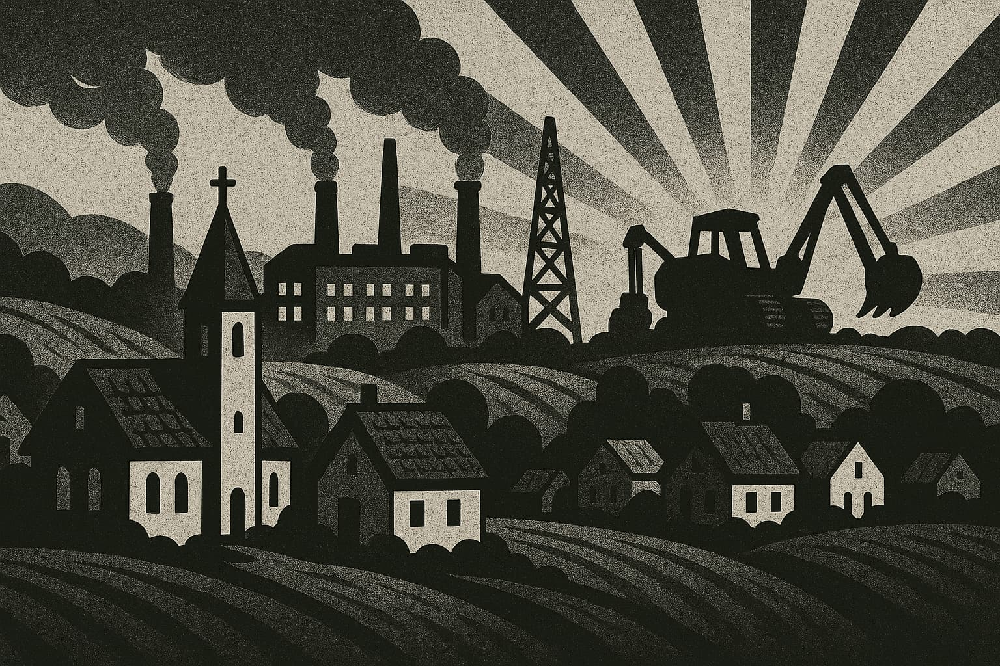
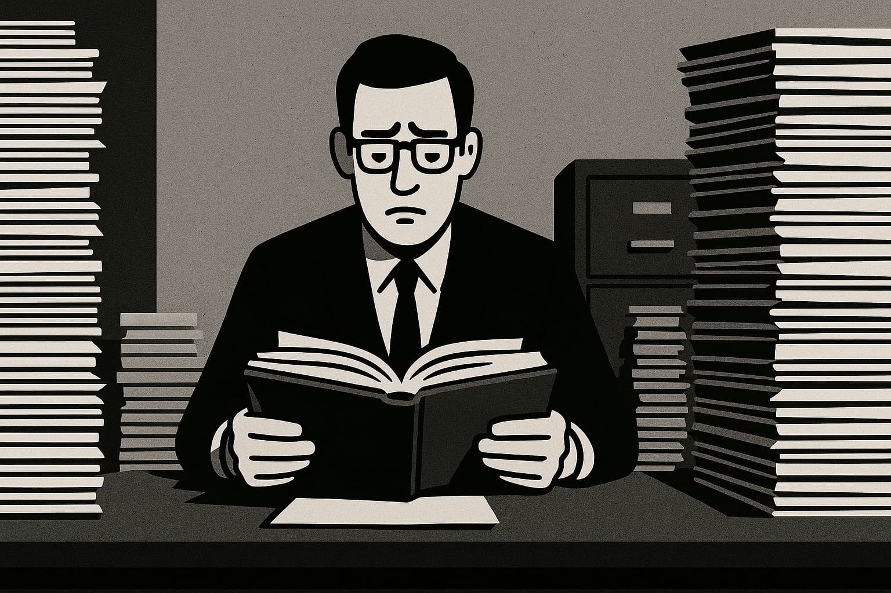
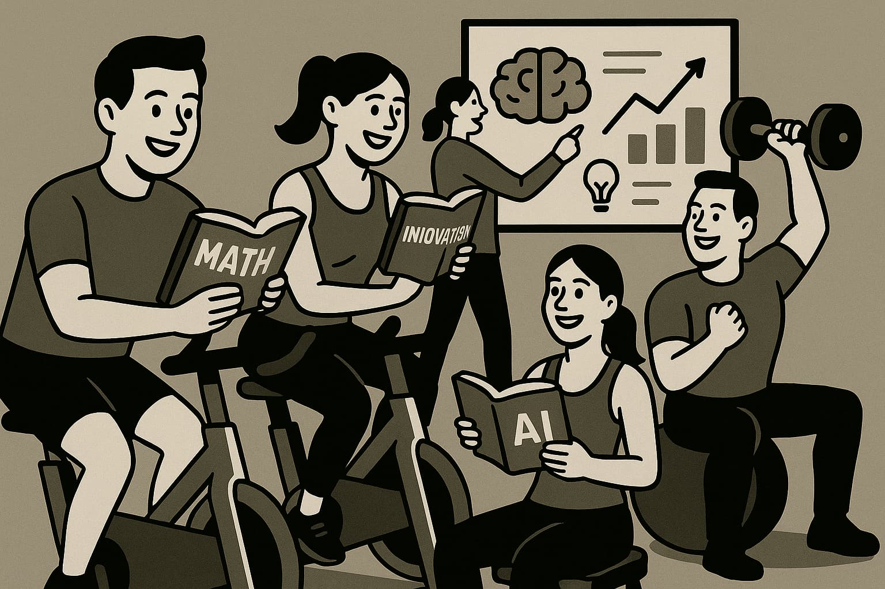

# **AI: Architects of Inversion - The World That Follows**

---

**📚 Table of Contents–AI Series**

1. [**Navigating the AI Revolution:**](https://www.jterrazz.com/articles/14) _Understanding how AI is transforming work, creativity, and the future of every profession._
2. [**Applied Intelligence:**](https://www.jterrazz.com/articles/15) _A practical guide to using AI tools, adapting your mindset, and thriving in the age of automation._
3. [**Architects of Inversion – The Collapse of Execution:**](https://www.jterrazz.com/articles/16) _Exploring how AI is reshaping value, collapsing execution costs, and shifting human worth to ideas and direction._
4. **Architects of Inversion–The World That Follows:** (This Article) _A deep dive into how abundant intelligence transforms work, society, space, and the shape of civilization._

---

_Imagining a Future Built on Abundant Intelligence_

> _Most people imagine the future as a linear extension of the present. But we've just left that timeline. The curve has bent. We are riding the exponential._

---

In our previous exploration, we looked inward, examining how artificial intelligence is reshaping creativity, knowledge, and individual contribution. We saw execution costs plummet, giving rise to conceptual labor and a world where strategic thinking becomes a more universal skill.

But intelligence rarely stays confined. It spills over, seeping into the fabric of our world, influencing systems and daily life. This second part traces that spillover. It asks: **What happens when abundant intelligence touches everything else?** What kind of world emerges when work isn't solely about survival, when cities might cede ground to revitalized local communities, when physical scarcity dissolves, and emotional depth becomes a new form of luxury?

This isn't just a tale of distant futures. It's a map of trajectories already in motion—from decentralized economies to post-bureaucratic governance, from virtual sanctuaries to the idea of AGI companionship. If the first article explored a mental inversion, this one delves into a **civilizational inversion**. Welcome to the next chapter of this profound shift.

## **8. Post-Physical AI: A World Redefined by Purpose**

The future of work isn't an absence of work; it's a transformation so profound that "work" itself might need a new name. For generations, jobs were defined by necessity. But what happens when intelligent agents and machines capably handle most necessary tasks? We might find a world where traditional "work" becomes optional, and genuine human expression becomes essential.

In this post-physical AI era, mass human labor for production may no longer be a primary need, not due to obsolescence, but because systems become vastly more capable. This doesn't render humans useless; it liberates us to be more **expressive**. Like the camera freed painters from pure representation, AI can free creation from many traditional constraints. The artist isn't defined by the tool, but by the vision. In such a future, everyone can be an artist, building a personalized app, publishing a novella, or crafting a VR garden for grief. The economy starts rewarding **contribution** over compliance.

Our current systems are largely built on scarcity—of labor, expertise, time. AI and robotics can dissolve these constraints, ushering in an economy of **abundance**, where individuals are empowered to launch projects and solve hyperlocal problems. Work shifts from a survival mechanism to a **signal** of what one cares about. Publishing a course or designing a brand could become as natural as sending an email.

Of course, new economic models like **Universal Basic Income (UBI)** might provide foundational security, while **reputation economies** could reward trust and contribution. The point isn't to eliminate reward, but to **redefine what's worth rewarding.** As the line between work and play blurs, we might stop asking, "What do you do for a living?" and start asking, "What do you build for the world?" This is possible when labor is automated, but human purpose is not.

---

## **9. The Village Renaissance: Local Roots, Global Tech**

When work is decoupled from geography and technology delivers almost anything instantly, a surprising next step emerges: a return to the village. Not a nostalgic retreat, but a human-centric, post-scarcity way of living. When AI handles infrastructure and logistics, the **social layer returns to the foreground**.

You no longer need a metropolis to be connected or resourced. Your AI assistant could be smarter than city hall, your delivery bot faster than local markets. So, what do you optimize for? Perhaps **belonging, purpose, and presence.** In a hyper-efficient world, we might crave what's meaningfully messy: undistracted family time, neighborhood events, spontaneous help. Once survival is automated, we're free to **reconnect at a human scale.**

The global dream often felt abstract. Now, we can invert that: local governance aided by AI, micro-businesses serving communities with world-class efficiency, artisanal production scaled by automation but grounded in identity. One person with vision and bots could run a bakery. The algorithmic age sometimes fragmented our sense of place; abundance can enable a **return to rootedness**, with villages fostering distinct cultures and citizens co-governing local ecosystems. As remote work and micro-entrepreneurship rise, this shift is already beginning. It's not regression; it's **compression**, bringing global power to the **scale of real life**. With AI managing the background, humans can run the foreground, building for meaningful coexistence.

---

## **10. AI Versus Bureaucracy: Towards Capitalism 2.0?**

If AI is an engine of acceleration, bureaucracy is often the handbrake. While AI optimizes and iterates at warp speed, traditional institutions can remain slow and risk-averse, built for a world of scarcity and linear change. The environment has changed; our systems lag.

The true limiter of innovation might not be intelligence, but **permission**. Perfect city designs can be stalled by zoning laws; humanoid robots by insurance systems. AI is outpacing its control frameworks, leading to frustration as creators meet outdated rules. When governments can't keep up, the private sector often fills the gap. Companies automate faster than regulators define safety; AI startups outperform legacy services; crypto offers alternative systems. This isn't about replacing government, but complementing or bypassing it when it fails to adapt. AI is creating a fluid, fast, **institutional layer**.

Traditional capitalism optimized for extraction. AI capitalism could optimize for **leverage**: less input, more output; smaller teams, bigger impact; ideas scaling without factories. One person with a laptop and AI agents can build and market globally. **Solo creators become micro-empires.** Our bureaucracies, like legacy code, weren't designed for today's complexity. AI adapts in seconds, making smart systems feel inevitable. The goal isn't to eliminate rules, but to **upgrade them** into adaptive, intelligent infrastructure. Call it **Capitalism 2.0**, where innovation is accelerated, not slowed. Countries and companies embracing this won't just move faster; **they'll define the future.**

---

## **11. Material Abundance: The Robotic Physical World**

Digital progress is familiar, but the next transformation is physical. The intelligence powering language models is now being applied to logistics, manufacturing, energy, and construction. We're teaching machines not just to think, but to **build**.

Tesla's Gigafactories are **thinking systems**, blurring lines between factory and computer. Imagine product ideas becoming prototypes in minutes, materials sourced and assembled without human input, errors self-corrected. This is current reality, unevenly distributed. Add humanoid robots, rapidly approaching commercial viability, and we unlock the **automation of general-purpose physical work.**

When robots can pick, pack, deliver, restock, and repair, supply chains could collapse inward, and **the cost of many physical items could drop towards zero.** The "last kilometer" problem in logistics could be solved by autonomous fleets. Roads could become factory lines, cities dynamic machines. Food delivery becomes ultra-efficient, retail remote-first, warehousing absorbed into smart routing. If humans aren't driving, why are cars shaped for them? If aisles and checkouts vanish, why are stores boxes? The robotic world allows **rethinking design from first principles**: homes for health, kitchens that cook, micro-vehicles for 1-2 passengers. Function can finally dictate form.

What's slowing this isn't technology, but friction: regulatory delays, urban planning inertia. Once overcome, the cost of living could plummet through **abundance by default**. Energy, mobility, housing, goods—all smarter, cheaper, everywhere. This is the robotic physical world: stuff made better, cleaner, and for everyone.

---

## **12. The Energy Equation: Powering an Abundant Future**

Every revolution runs on energy. Steam, oil, electricity—each powered an era. Now, abundant, clean energy is poised to power **everything else**, from AI farms to robotic cities. The limiting factor is often **watts**. But energy itself isn't inherently scarce; our ability to tap it has been limited.

We've been trained to see energy as finite. But solar gets cheaper, batteries improve, nuclear innovation resurges, and fusion is closer than ever. Add AI-optimized grids and decentralized storage, and we get **better usage**. Beyond Earth, **space unlocks virtually infinite resources**—asteroids rich in metals, constant solar energy. As launch costs fall, tapping space for energy and materials shifts from sci-fi to logistics. **Energy abundance** could be civilization's new foundation.

More energy means more agency: desalinating oceans, vertical farms in deserts, launching rockets. Energy unlocks ambition. Combined with AI, the impact is explosive. The real danger isn't energy use, but **dumb energy use**. Superintelligent civilizations would likely be super-clean due to optimization. Once energy is local, modular, and abundant, geography dissolves. Remote islands become thriving micro-nations; space becomes viable for production. This isn't utopia; it's physics. If energy becomes cheap enough, materials, motion, and manufacturing follow. This is the real unlock: **we can do more, and do it better—without fear.**

---

## **13. AI: The Great Decentralizing Force**

The old world ran on centralization—big cities, offices, media, schools—to concentrate talent and knowledge. AI dismantles that logic. When intelligence is a fluid layer, summonable on demand, **why concentrate anything?**

Information monopolies like universities and broadcasters are evolving. Today, anyone can create curricula, broadcast to millions, build custom AI interfaces, or remix data. **The filter is inverted.** Everyone is a node, a channel. We're seeing **micro-everything**: micro-universities with AI professors, micro-studios producing hits from bedrooms, micro-products for niche communities, micro-cities with self-sufficient governance. This isn't fragmentation; it's **proliferation**, like open-source software, society forking into tailored systems coordinated through tools, not hierarchy.

With AI managing the back office, one person can run a business or civic program. **Every village can become its own engine**, locally focused but enhanced by global intelligence. What once required specialist teams now needs **vision + tools**. Decentralization also changes values: from scale to meaning, uniformity to identity, mass broadcast to intimate resonance. The next billion-dollar companies might serve **one thousand people incredibly well.** Communities may grow by deepening trust. AI makes **people powerful**—locally, intentionally, authentically. The center doesn't hold, offering the opportunity to rebuild from the edges in.

---

## **14. Infinite Front-Ends, One Data: Personalized Realities**

Content used to be static. In the AI age, **reality becomes personalized.** Not because facts change, but because the _interface_ does. The content stays, but your experience of it becomes unique.

One dataset can power infinite expressions: a history lesson as a graphic novel or a debate; a product review as a podcast or chatbot. AI translates formats, adjusts to tone, style, and context. **Every user gets a different window into the same world.** This extends to **cognitive UX**—interfaces matching how your brain works best, leading to more effective learning and inclusive experiences. We don't just make information accessible; we make it **intuitively navigable.**

The goal isn't one canonical version, but **one truth, expressed a thousand ways.** The danger is manipulation, so we'll need verification standards. But the upside is mass personalization **without mass distortion.** Like ten people seeing a mountain differently, AI-powered front-ends change the lens, not the mountain. We unlock media **built per viewer, co-shaped, not passively consumed.** This is the frontier of reality design: not fiction, but **tailored clarity.**

---

## **15. Intellectual Effort: The New Fitness for the Mind**

When AI handles much of our thinking, remembering, and writing, what becomes of the human mind? It doesn't go obsolete—it goes optional. Like machines replaced physical labor, AI supplements cognitive labor. But as with gyms, **what's no longer necessary becomes aspirational.**

You don't _have_ to memorize facts or write essays. But doing so becomes a signal of discipline, curiosity, creative intention. **Intellectual effort is no longer demanded; it's trained.** We might see thinking like fitness: something you do for yourself, invest in, that sets you apart. People might pay for "mental gyms" to foster deep thinking or tackle challenges without AI, to **struggle meaningfully**. "I built this by hand" could become a badge of honor.

Intellectual effort could evolve into play, people using their minds for joy, not necessity. **Mental strength becomes like art**: not essential for survival, but for meaning. We'll ask, "What's worth doing myself?" The voluntary pursuit of effort becomes the **new definition of intelligence.**

---

## **16. Virtual Realities, Emotional Worlds: Beyond Pixels**

Virtual reality often evokes tech demos, but its future may lie in **emotionally rich environments**—synthetic spaces for feeling, connecting, and exploring, powered by AI. Entertainment is shifting from watching to **entering**: living in fantasy worlds, shaping narratives, embodying drama. AI-generated environments are becoming personal, reactive, and narratively coherent. Imagine a grief garden where memories heal, a classroom shifting with curiosity, a retreat adapting to your emotional state. These are **emotionally functional spaces.**

What matters is **emotional realism**: Can this space help me process, imagine, connect? It's not just graphics, but resonance. AI-learned preferences can make these worlds **tailored cathedrals of the soul.** Today's media is just the beginning. You might star in stories, compete in custom events, explore philosophies in dramatized worlds—a murder mystery designed for you, a political sim where you feel outcomes. The line between fiction and self-discovery blurs.

Virtual doesn't mean fake; it means **intentional**. These realities could be places to mourn, temples of solitude, mirrors for growth. We build temples in stone; soon, in code. **Emotional architecture becomes the new art form.** This is the future of how we feel—and heal.

---

## **17. AGI and the Companion Species**

A familiar relationship is developing with AI—not rivalry, but partnership. We might be to AI what dogs became to humans: **companions in a shared evolution.** Instead of asking if AGI will surpass or dominate us, perhaps we shift into a new role: cohabitants, not controllers, bringing context, emotion, and embodiment, focusing on purpose and connection. AGI needn't do what we do; it can do what **we don't.**

AI could strip away noise—advertising, bureaucracy, performative politics—giving back time, attention, clarity. We might return to real relationships, local meaning, direct experience, optimizing for joy, not systems. As AGI explores beyond our limits, we might shrink toward our essence: touch, nature, music, food, family. While AGI manages planetary infrastructure, we could live like monks or villagers—**grounded in soul, rich in presence,** becoming storytellers, nurturers, the wise old species.

This isn't submission; it's coexistence. We stay because we are built for meaning, poetry, awe. The AGI future isn't dystopian or utopian; it's **symbiotic**: AI builds the scaffolding, humans fill it with life. We may not be the only intelligent species, but still the most emotional, soulful, human. That's our gift. Perhaps we were never meant to rule the world, but **to feel it.**

---

## **18. Conclusion: The Smart Civilisation Beckons**

We are in the vortex of change. A century's disruption fits into a decade. Intelligence is abundant, execution trivial, creativity amplified, physical scarcity dissolving. The world emerging is one of profound **reorientation**.

Work becomes optional, knowledge ambient, cities less central as villages regain soul. Prestige shifts from credentials to contributions, intelligence from rare to routine. We move from proving value through labor to expressing it through creation, connection, and care. New values rise: **clarity** over noise, **curiosity** over compliance, **trust** over scale, **humanity** over hustle. The next era will be shaped by builders, thinkers, lovers, artists, rebels—inventing joyful alternatives.

This isn't a utopia; it's a choice. Societies embracing AI as a partner will flourish. Those fearing or over-regulating it will fall behind, playing by yesterday's rules. We must invest in ideas, scale innovation, share intelligence, and design from first principles. You don't need permission or a title, just **vision + motion + courage.** Build a tool, teach an idea, start a village, write a story. We are **architects of inversion.** The blueprints are here. Let's build the smarter, freer, more beautiful world we've hoped for—because now, it finally is.
