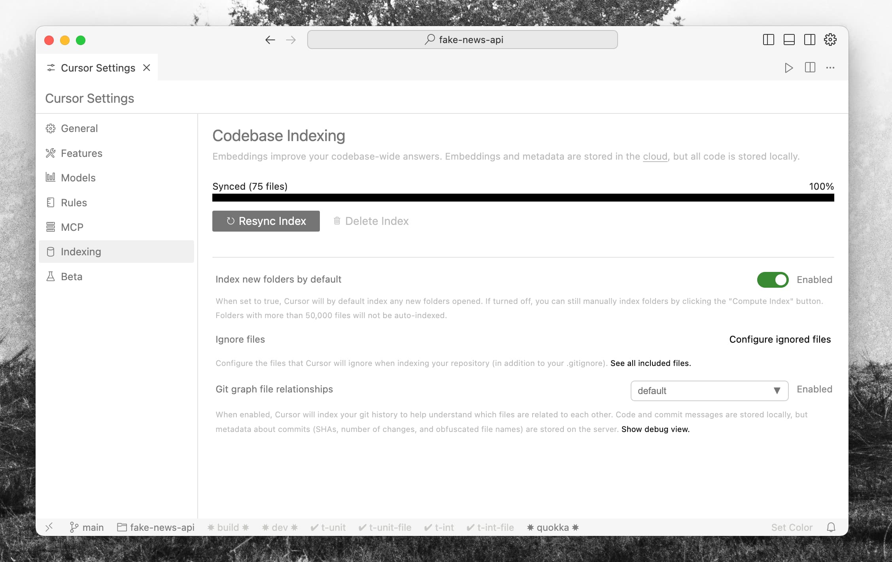
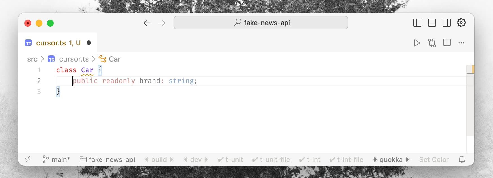
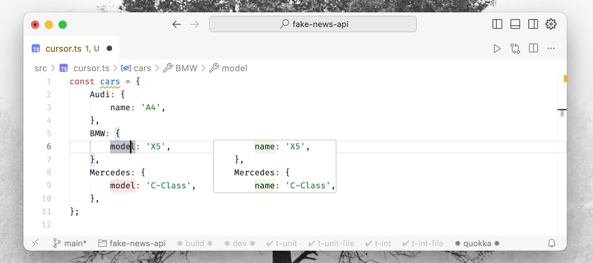
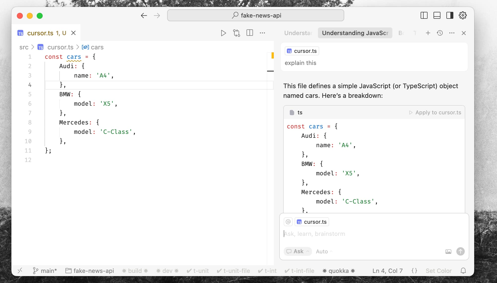
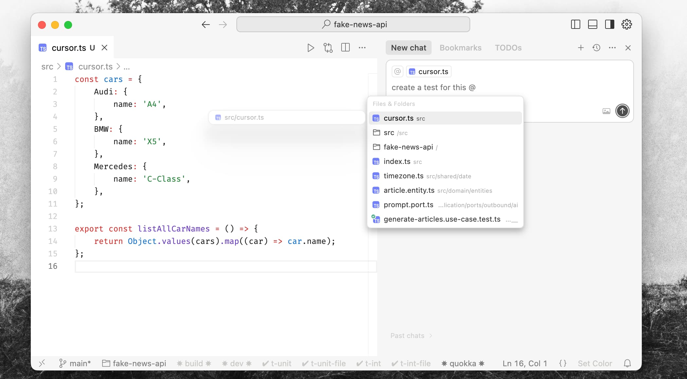
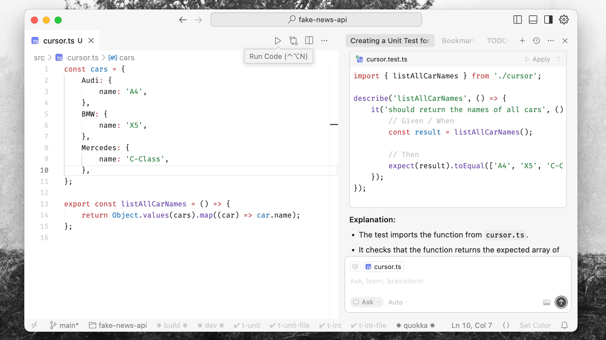
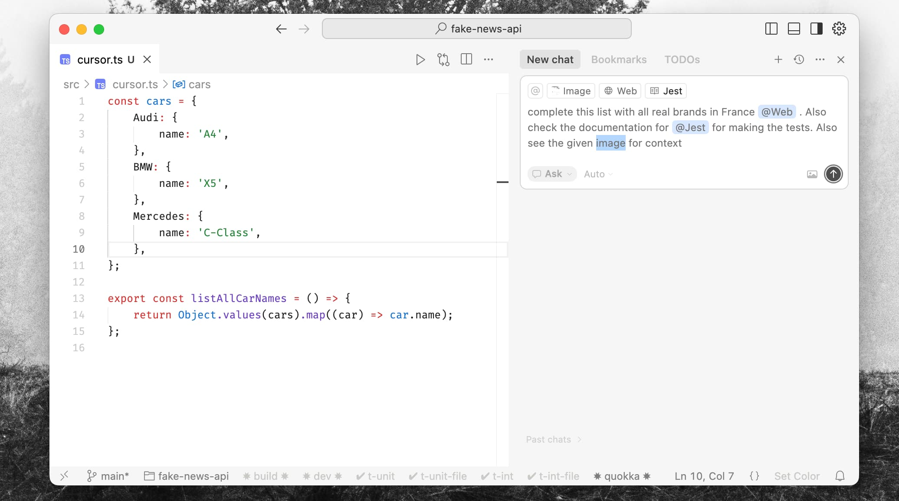
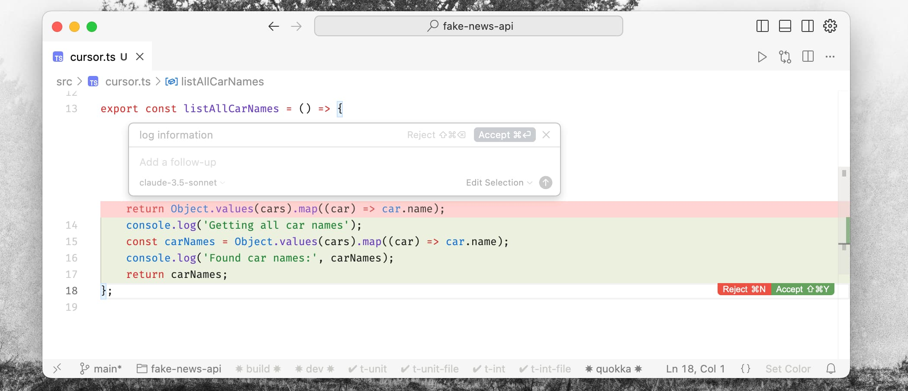
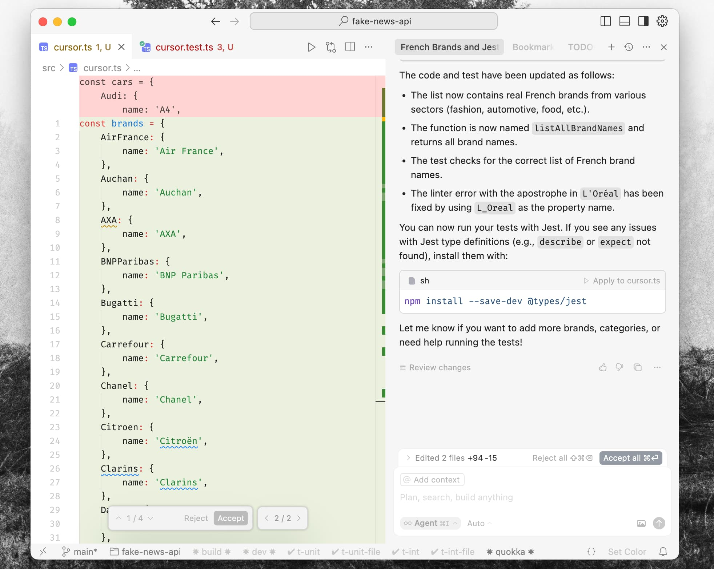
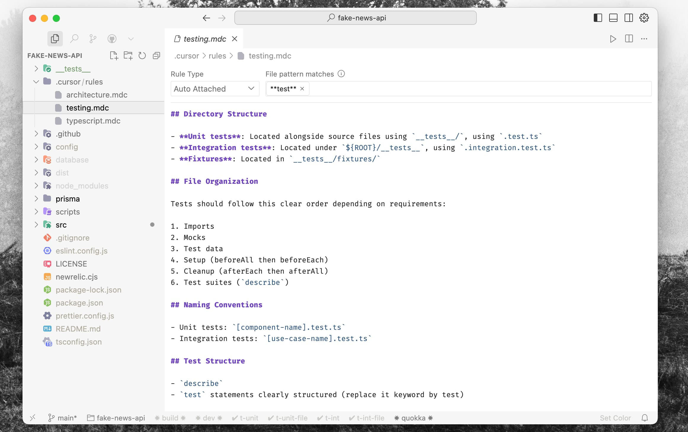

# Cursor: A Developer's Practical Guide to AI-Powered Development

**The way we build software is changing. AI isn't just a buzzword anymore; it's becoming an indispensable co-pilot. I've been deep in the world of AI-assisted development for a while now, and one tool, in particular, has fundamentally altered my workflow: Cursor. It's more than just an AI-powered editor; it's a glimpse into Dev 2.0.**

For years, we've debated the merits of IDEs like WebStorm versus highly customizable editors like VS Code. The core idea was always about optimizing our individual coding environments. Cursor takes this a step further. Imagine a team of 100 expert developers, backed by significant funding, meticulously pre-configuring an environment specifically designed for AI to understand your project and your intent perfectly. That's the kind of leverage Cursor offers out of the box.

The common pitfalls with many AI coding assistants often revolve around:
* **Contextual Understanding:** Feeding the AI the right information about your project.
* **Timing:** Providing that information at the opportune moment.
* **User Interface:** Having an intuitive way to interact with AI **suggestions** and **actions**.
* **Up-to-date Tooling:** Access to the latest models and features.
* **Resource Management:** Efficiently managing AI model **usage** and **costs**.

Cursor addresses these challenges head-on, offering an integrated, intelligent, and surprisingly intuitive development experience. It's not just about writing code faster; it's about **fundamentally changing your role from a "code typist" to a "code architect"** or "director." **You focus on the vision, the architecture, and the quality, while the AI handles much of the heavy lifting**. The result? Increased productivity, cleaner code, better naming conventions, and more comprehensive testing–often with less perceived effort.

It's like having a senior development team embedded within your editor, albeit one that **still needs clear direction**, especially on very large or novel contexts. You'll find yourself writing less code manually and spending more time on **"instruction -> review"** cycles.

## Use Cases: A Transformed Development Journey

Cursor's power lies in its seamless integration and deep understanding of your project. The UX is designed to make the interaction between you, the AI, and your code incredibly fluid. Visual cues for AI propositions are clear and non-intrusive.

### 1. Knows Your Codebase

This is where Cursor immediately differentiates itself from external AI chat tools.
* **Effortless Setup:** Simply clone your repository, and Cursor gets to work.
* **Intelligent Indexing:** It indexes your project files, building an understanding of your codebase's structure and content.
* **Contextual Awareness:** It can find relevant context across files, read any file it needs to, and even execute commands (like running linters or tests) to gather more information autonomously. For example, you can instruct it: "Make `@montest.test.ts` pass," and it will attempt to run the test, identify failures, find necessary imports, and propose fixes.

### 2. "Tab Tab Tab" Evolved

Think of GitHub Copilot, but supercharged.
* **Predictive Coding:** It intelligently guesses what you're about to write, often completing entire lines or blocks of code.

*Single line completion*

*Multi line completions*

* **Cursor Prediction:** It can even anticipate where you might want to move your cursor next. Just click tab and move in the page.
* **One-Click Edits:** Simple actions, like clicking on a poorly formatted JSON and having it instantly beautified, become second nature. It can also propose rewrites for awkward phrasing or minor mistakes.

*Edits based on a single click (it's a simple example here, but it can predict complex updates very well)*

### 3. The Integrated Chat: Your AI Partner in Code

*Ask questions*

The built-in chat is far more than a simple Q&A bot.
* **Codebase-Aware Conversations:** Because it understands your project, its suggestions are highly relevant.
* **Easy Referencing with `@`:** Use `@filename` or `@symbol` to effortlessly direct the AI's attention to specific files or code elements.

*Reference files manually with @*

* **Targeted Modifications:** The "Apply" button intelligently inserts or modifies code in the correct places, even across multiple files or distant parts of the same file.

*Apply code automatically*

* **Multi-Modal Support:** You can even include images (e.g., UI mockups) to guide code generation.
* **Web-Awareness:** Cursor can parse online repositories, GitHub issues, and other web content to inform its suggestions.
* **Documentation Integration:** Leverage built-in knowledge of popular frameworks and libraries. For instance, typing `@NextJs` can bring Next.js documentation context into your chat.

*Many diverse @context can power your prompts*

### 4. Edit in Natural Language (Cmd+K / Ctrl+K)

This feature is a game-changer for refactoring and quick modifications.
* **Intuitive Commands:** Press `Cmd+K` (or `Ctrl+K`), type your desired change in plain English (e.g., "refactor this function to be async," "add error handling," "explain this code").
* **Visual Diffing:** Cursor presents the proposed changes with a clear, beautiful visual diff, allowing you to review and accept or reject them easily.
* **Terminal Power:** `Cmd+K` in the integrated terminal lets you write shell commands using natural language.

*Inline prompts, inline code diffs*

### 5. Agent Mode: An Unchained AI Developer

For more substantial tasks, Agent Mode allows the AI more freedom to operate.
* **Autonomous Operation:** The agent can break down larger requests into smaller steps, explore the codebase, and even self-correct. Run commands. Create files. Etc etc.
* **Lint Error Integration:** It can automatically connect to lint errors and attempt to fix them based on your project's linting rules.
* **It applies automatically the changes to the code and present you a "PR style code diff" ready in your IDE 😍**

*I use this mode for 99% of my use cases.

*Searched the web, added the new brands, created the new test file*

## From My Experience: Tips, Tricks, and a New Mindset

After a year of using Cursor daily, here are some insights that have significantly boosted my productivity and changed how I approach development.

### Personalizing AI Co-Pilot

* **Cursor Rules:** This is where you can truly tailor Cursor to your project's specific needs and coding style. For example, I enforce a "Given-When-Then" pattern for all my test descriptions using a custom rule in the `.cursor/rules` directory.
		* *Example:* [You can see an example of my project-specific rules here](https://github.com/jterrazz/fake-news-api/blob/main/.cursor/rules)

* **Model Selection & Understanding:** It's crucial to understand the "personality" and strengths of different AI models. Cursor often allows you to choose or intelligently routes requests to appropriate models. A simplified conceptual flow might be:
		* **Planning/High-Level:** A powerful model like `GPT-4` or `Claude 3 Opus` for creating execution plans or PRDs.
		* **Code Generation:** Models optimized for code, perhaps a fine-tuned version of `Gemini Pro` or a specialized `Claude 3.5/3.7` model.
		* **Testing & Debugging:** Potentially a mix, using robust models for generating test cases and faster, more agile models for iterative debugging.
		* *(Note: Cursor often abstracts this, but being aware of the underlying concept helps in crafting better prompts).*
* **Leverage MCPs (Model-Capable Plugins/Providers):** These are like specialized APIs or documentation sets that the agent can use for external services (e.g., AWS, Stripe). This allows the AI to generate code based on real, up-to-date service specifications.

### Superhuman Refactors & Fixes

* **Reapply Commit Changes:** A surprisingly powerful use case: "Reapply the changes from commit `[commit_hash]` to this specific file, adapting them as necessary."
* **"Make the Tests Green":** Literally instruct Cursor to run your test suite and iteratively fix failing tests until they all pass. This is incredibly powerful for TDD workflows or when integrating new features.

## The Mental Shift: From Coder to Code Architect

The most profound change isn't just the speed; it's the mindset.
* **Embrace Your Role as a Director:** Your primary task becomes guiding the AI, providing clear instructions, and ensuring the output aligns with your vision. The AI is an extension of your intent, like a colleague you've worked with for years, whose patterns you understand and can predict.
* **Delegate Aggressively (But Wisely):** The more cognitive load you can delegate to the AI, the more you can focus on higher-level concerns like architecture, user experience, and strategic problem-solving.
* **The Pitfall of "Vibe Coding":** The biggest danger is trusting the machine too blindly, lacking a clear vision for what you want to achieve, or engaging in "YOLO" development. This often leads to wasted time and needing to redo work. **You must remain focused on the specific changes you intend to make, as if you were coding incredibly fast yourself.**
* **High-Quality by Default:** Paradoxically, AI assistance pushes you towards higher-quality code. Because you're reviewing more than writing, you naturally scrutinize naming, structure, and test coverage more rigorously. **You start trusting the tests more than the raw code output.**

### Intent-Driven Development (IDD)

This leads to a concept I call **Intent-Driven Development (IDD)**. Similar to how Test-Driven Development (TDD) uses tests to drive design, IDD uses clear, high-level intent to drive development.
* **Focus on Value:** Drawing from "first principles" thinking, IDD constantly asks: "What value does this development bring to the product?" Your primary role is to translate this value into actionable intent for the AI.
* **High-Level "Intent Tests":** You might define custom, high-level integration or behavior tests that encapsulate a core user need or business requirement (e.g., `user_can_complete_purchase.intent.test.ts`). Then, you task the AI with making these "intent tests" pass.

This approach ensures that every line of code generated serves a clear, valuable purpose.

## Getting Started with Cursor

Ready to dive in?
1. **Consider the Pro Plan:** While Cursor offers a free tier, the paid plans (around $20/month) typically provide access to more powerful models (like GPT-4, Claude 3 Opus) and higher usage limits, which are essential for a truly transformative experience.
2. **Personalize Your Agent:** Don't just use the defaults. Dive into the settings. Configure your global preferences, keybindings, and AI model choices. (You can see my global Cursor settings as an example: [https://github.com/jterrazz/jterrazz-configuration/tree/main/configurations/cursor](https://github.com/jterrazz/jterrazz-configuration/tree/main/configurations/cursor)).
3. **Explore All Features:** Don't limit yourself to the chat. Experiment with `Cmd+K` edits, Agent Mode, and codebase-aware referencing (`@`). Understand how to feed it useful context files.

## The Guiding Hand: Your Indispensable Role

While AI can handle much of the "how," the "what" and "why" remain firmly in your domain. "Vibe coding"–letting the AI wander without clear direction–won't cut it for critical aspects like security, scalability, or long-term project maintainability (for a few years? 😅). An AI still lacks the overarching global context of your business, your users, and your long-term vision.

You become the crucial **mediator** between the real-world need and the AI's execution capabilities. Your judgment, your ability to discern good solutions from bad, and your vision for the project are more critical than ever. Think of the AI as an incredibly skilled consultant, an expert in their craft with vast experience. Now, it's your job to apply that expertise effectively to *your* specific project.

The default Cursor experience is already excellent. However, the true power comes when you adapt it to your specific needs and focus on what matters most to you. For me, this has meant streamlining interfaces and focusing on core development tasks: exploring, searching, committing, reviewing, and, most importantly, robust testing.

Cursor isn't just another tool; it's a partner that, when guided effectively, can elevate your development practice to a new level of strategic impact and efficiency.

---

## 📚 AI Series

1. [**Navigating the AI Revolution:**](https://www.jterrazz.com/articles/14/en) *Understanding how AI is transforming work, creativity, and the future of every profession.*
2. [**Applied Intelligence:**](https://www.jterrazz.com/articles/15) *A practical guide to using AI tools, adapting your mindset, and thriving in the age of automation.*
3. [**Architects of Inversion – The Collapse of Execution:**](https://www.jterrazz.com/articles/16) *Exploring how AI is reshaping value, collapsing execution costs, and shifting human worth to ideas and direction.*
4. [**Architects of Inversion – The World That Follows:**](https://www.jterrazz.com/articles/17) *A deep dive into how abundant intelligence transforms work, society, space, and the shape of civilization.*
